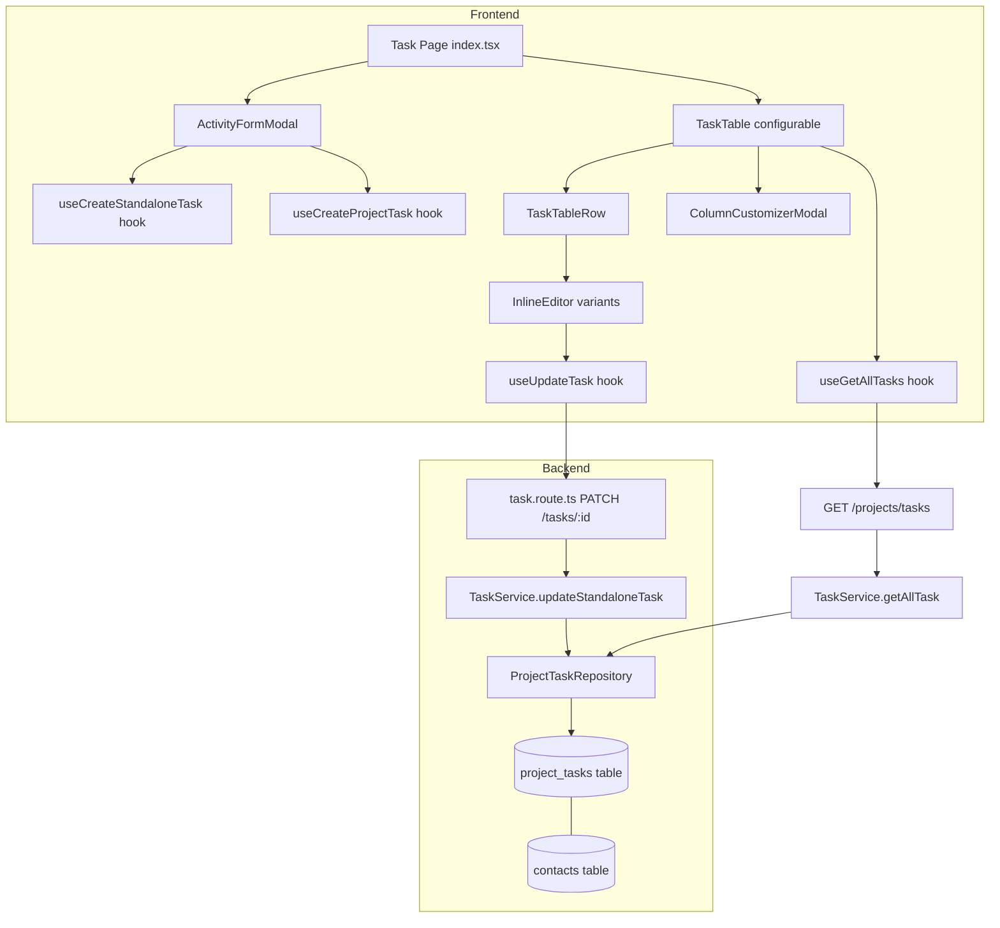

# Design Document: Activity Table (Pipedrive-Style)

## Overview

This design transforms the standalone task system into a Pipedrive-style Activities feature. Four areas are addressed:

1. A modal-based activity form (replacing the full-page `internal-task-form.tsx`)
2. A configurable-columns table (replacing the hardcoded `task-table.tsx`)
3. Inline editing for all editable columns
4. Backend additions (new columns, relations, API updates)

The existing task page infrastructure remains the foundation: context filter tabs, status/type filters, the `useUpdateTask` PATCH hook, and the `useGetAllTasks` GET hook. The existing `Modal` component (framer-motion portal) is reused for both the activity form and column customizer.

## Architecture



### Key Design Decisions

1. **Reuse existing Modal component** — The project already has a well-tested `Modal` component using framer-motion + React portal. The ActivityFormModal and ColumnCustomizerModal will both use it.

2. **Column config stored in localStorage** — Column visibility preferences are per-browser, not per-user on the server. This avoids a new API endpoint and keeps the feature simple. Key: `pylott_task_column_prefs`.

3. **Single InlineEditor component with variant prop** — Rather than separate components per edit type, a single `InlineEditor` component accepts a `variant` prop (`text`, `date`, `select`, `search`, `toggle`) and renders the appropriate UI. This reduces duplication.

4. **Backend: add `contact_id` and `priority` to `project_tasks`** — Two new nullable VARCHAR columns. The contact relation is eagerly loaded via `withGraphFetched` in the existing `getAllTasks` query, so no extra API calls are needed.

5. **Extend existing `updateStandaloneTask` payload** — The current method accepts `{ name, due_date, status, task_category_type }`. We extend it to also accept `contact_id`, `priority`, and `description`. No new endpoints needed.

## Components and Interfaces

### ActivityFormModal

Replaces `internal-task-form.tsx` navigation. Opens as a centered overlay from the task page.

```typescript
interface ActivityFormModalProps {
  isOpen: boolean;
  onClose: () => void;
}

// Internal form state
interface ActivityFormData {
  name: string;
  task_category_type: string;
  due_date: Date | null;
  description: string;        // "Notes" field
  assignees: string[];
  project_id: string | null;  // optional link
  contact_id: string | null;  // optional link
  markAsDone: boolean;        // maps to status: "completed" | "draft"
}
```

Layout (top to bottom):
1. Subject line — large text input
2. Category icon row — 7 selectable icons (Review, Approval, Meeting, Follow-up, Signing, Info Request, Doc Upload)
3. Due date picker
4. Notes textarea
5. Assigned to — search popover filtering internal employees
6. Link to Project — search popover filtering projects by name
7. Link to Contact — search popover filtering contacts by name; selecting auto-populates subject
8. Footer: "Mark as done" checkbox + Cancel + Save buttons

Save logic:
- No project selected → `POST /projects/tasks` (standalone)
- Project selected → `POST /projects/{project_id}/tasks` (project-bound)
- `markAsDone` checked → `status: "completed"`, unchecked → `status: "draft"`
- On success: close modal, invalidate `GET_ALL_TASKS` query
- On failure: show error toast, keep modal open

### TaskTable (Configurable)

Replaces the current hardcoded 8-column table.

```typescript
interface ColumnConfig {
  id: string;
  label: string;
  defaultVisible: boolean;
  editable: boolean;
  width?: string;
}

const ALL_COLUMNS: ColumnConfig[] = [
  { id: "done",           label: "Done",           defaultVisible: true,  editable: true  },
  { id: "subject",        label: "Subject",        defaultVisible: true,  editable: true  },
  { id: "project",        label: "Project",        defaultVisible: true,  editable: true  },
  { id: "contact_person", label: "Contact Person",  defaultVisible: true,  editable: true  },
  { id: "due_date",       label: "Due Date",       defaultVisible: true,  editable: true  },
  { id: "category",       label: "Category",       defaultVisible: true,  editable: true  },
  { id: "status",         label: "Status",         defaultVisible: true,  editable: true  },
  { id: "priority",       label: "Priority",       defaultVisible: false, editable: true  },
  { id: "email",          label: "Email",          defaultVisible: false, editable: false },
  { id: "phone",          label: "Phone",          defaultVisible: false, editable: false },
  { id: "organization",   label: "Organization",   defaultVisible: false, editable: false },
  { id: "assignee",       label: "Assignee",       defaultVisible: false, editable: true  },
  { id: "note",           label: "Note",           defaultVisible: false, editable: true  },
  { id: "created",        label: "Created",        defaultVisible: false, editable: false },
];
```

The table reads visible columns from localStorage (`pylott_task_column_prefs`). If no prefs exist, defaults are used. A ⚙️ icon in the header area opens the ColumnCustomizerModal.

### ColumnCustomizerModal

```typescript
interface ColumnCustomizerModalProps {
  isOpen: boolean;
  onClose: () => void;
  visibleColumns: string[];
  onColumnsChange: (columns: string[]) => void;
}
```

Displays all columns with toggle switches. A "Default" button resets to predefined defaults. On close, the parent persists to localStorage.

### InlineEditor

A polymorphic cell editor component.

```typescript
type InlineEditorVariant = "text" | "date" | "select" | "search" | "toggle";

interface InlineEditorProps {
  variant: InlineEditorVariant;
  value: any;
  taskId: string;
  projectId: string | null;
  fieldName: string;           // API field name for PATCH
  options?: { label: string; value: string }[];  // for select variant
  searchEndpoint?: string;     // for search variant
  onUpdate?: () => void;
}
```

Behavior per variant:
- **text**: Click → input, Enter/blur → PATCH, Escape → discard
- **date**: Click → Calendar popover, select → PATCH
- **select**: Click → dropdown (status, category, priority), select → PATCH
- **search**: Click → search popover (project, contact, assignee), select → PATCH
- **toggle**: Click → immediate PATCH (done toggle)

All variants: on PATCH failure, revert to previous value.

### TaskTableRow

Renders one row using visible columns. Each editable cell wraps its content in `InlineEditor`. Read-only cells (email, phone, organization, created) render plain text.

Contact-derived fields (email, phone, organization) are read from `task.contact?.email`, `task.contact?.phone`, `task.contact?.organization`. When no contact is linked, display "—".

### Search Popovers (for form and inline editing)

Reusable search popover component:

```typescript
interface SearchPopoverProps {
  trigger: React.ReactNode;
  items: { id: string; label: string; sublabel?: string }[];
  onSelect: (id: string) => void;
  placeholder?: string;
  isLoading?: boolean;
}
```

Used in:
- ActivityFormModal: project search, contact search, assignee search
- InlineEditor (search variant): project cell, contact cell, assignee cell

For contacts, the search uses the existing `GET /contacts/company` endpoint. For projects, it uses `GET /projects`. For assignees, it uses the existing company users endpoint (filtered to non-client roles).

## Data Models

### Backend: project_tasks table changes

New nullable columns added via migration:

```sql
ALTER TABLE project_tasks
  ADD COLUMN contact_id VARCHAR(255) NULL,
  ADD COLUMN priority VARCHAR(50) NULL;
```

Migration uses safe column-existence checks (idempotent).

### Backend: ProjectTask model additions

```typescript
// New properties on ProjectTask model
contact_id?: string;
priority?: string;

// New relation in relationMappings
contact: {
  relation: BaseModel.BelongsToOneRelation,
  modelClass: require('./contact.model').Contact,
  filter: (query) => query.select('id', 'name', 'email', 'phone', 'organization'),
  join: {
    from: 'project_tasks.contact_id',
    to: 'contacts.id',
  },
}
```

### Backend: getAllTasks withGraphFetched update

The existing `withGraphFetched` in `ProjectTaskRepository.getAllTasks` is extended:

```typescript
// Before
withGraphFetched({
  document: { attachments: true },
  task_type: true,
  pipeline: true,
  assignees: { user: true },
  company: true,
})

// After
withGraphFetched({
  document: { attachments: true },
  task_type: true,
  pipeline: true,
  assignees: { user: true },
  company: true,
  contact: true,  // new — uses filter to select id, name, email, phone, organization
})
```

### Backend: updateStandaloneTask payload extension

```typescript
// Current payload type
{ name?: string; due_date?: string; status?: string; task_category_type?: string }

// Extended payload type
{
  name?: string;
  due_date?: string;
  status?: string;
  task_category_type?: string;
  contact_id?: string | null;
  priority?: string;
  description?: string;
}
```

The service validates `contact_id` exists in the same company before updating. A `null` value clears the link.

### Frontend: Type extensions

```typescript
// task.types.ts additions
interface Contact {
  id: string;
  name: string;
  email: string;
  phone: string;
  organization: string;
}

// Extended Task interface
interface Task {
  // ... existing fields ...
  contact_id?: string | null;
  contact?: Contact | null;
  priority?: string;
  due_date?: string;  // already exists via end_date mapping
}

// Extended UpdateTaskPayload
interface UpdateTaskPayload {
  name?: string;
  due_date?: string;
  status?: string;
  task_category_type?: string;
  contact_id?: string | null;
  priority?: string;
  description?: string;
}
```

### localStorage schema

```typescript
// Key: "pylott_task_column_prefs"
// Value: JSON array of visible column IDs
type ColumnPrefs = string[];
// Example: ["done", "subject", "project", "contact_person", "due_date", "category", "status"]
```


## Correctness Properties

*A property is a characteristic or behavior that should hold true across all valid executions of a system — essentially, a formal statement about what the system should do. Properties serve as the bridge between human-readable specifications and machine-verifiable correctness guarantees.*

### Property 1: Assignee search filters out clients

*For any* list of company users with mixed roles (admin, consultant, client), the assignee search results should contain only users whose role is not "client".

**Validates: Requirements 1.7**

### Property 2: Save endpoint routing by project linkage

*For any* activity form submission, if `project_id` is null the standalone task endpoint should be called, and if `project_id` is set the project-bound task endpoint should be called.

**Validates: Requirements 2.1, 2.2**

### Property 3: Mark-as-done maps to correct status

*For any* boolean `markAsDone` value, the resulting payload status should be "completed" when `markAsDone` is true and "draft" when `markAsDone` is false.

**Validates: Requirements 2.3, 2.4**

### Property 4: Table renders exactly the visible columns

*For any* subset of column IDs from the full column config, the rendered table should have exactly that many column headers, and each header should correspond to a column in the visible set.

**Validates: Requirements 3.4**

### Property 5: Column toggle updates visible set correctly

*For any* column ID and toggle action (on or off), after toggling, the column should be present in the visible set if toggled on and absent if toggled off.

**Validates: Requirements 4.2, 4.3**

### Property 6: Column preferences localStorage round trip

*For any* valid column visibility configuration, persisting it to localStorage and then reading it back should produce the same configuration.

**Validates: Requirements 4.5, 4.6**

### Property 7: Text inline editor pre-fills and saves correctly

*For any* task with a text field (subject or note), clicking the cell should show an input pre-filled with the current value, and submitting (Enter or blur) should call PATCH with the new value for the correct field name.

**Validates: Requirements 5.1, 5.2, 5.4, 5.5**

### Property 8: Escape discards inline edit changes

*For any* inline text editor in edit mode with a modified value, pressing Escape should restore the displayed value to the original task field value without calling PATCH.

**Validates: Requirements 5.3**

### Property 9: PATCH failure reverts cell to previous value

*For any* inline editor variant (text, date, select, search, toggle), if the PATCH request fails, the cell should display the value it had before the edit attempt.

**Validates: Requirements 5.6, 6.3, 7.7, 8.7, 9.4**

### Property 10: Inline select/search PATCH sends correct field

*For any* editable cell using a select or search variant (status, category, priority, project, contact, assignee), selecting a value should call PATCH with the correct API field name and the selected value.

**Validates: Requirements 6.2, 7.2, 7.4, 7.6, 8.2, 8.4, 8.6**

### Property 11: Done toggle visual state matches task status

*For any* task, the done toggle should display as filled/checked if and only if `task.status === "completed"`.

**Validates: Requirements 9.1**

### Property 12: Done toggle flips between completed and draft

*For any* task, clicking the done toggle should call PATCH with status "completed" if the current status is not "completed", and status "draft" if the current status is "completed".

**Validates: Requirements 9.2, 9.3**

### Property 13: Contact-derived fields display correctly

*For any* task, if a contact is linked, the email, phone, and organization columns should display the corresponding contact field values. If no contact is linked (contact is null), all three columns should display "—".

**Validates: Requirements 10.1, 10.2, 10.3, 10.5**

### Property 14: Created column displays formatted timestamp

*For any* task with a `created_at` value, the created column should display a formatted date string derived from that timestamp.

**Validates: Requirements 10.4**

### Property 15: Migration is idempotent

*For any* database state (columns already exist or not), running the migration should succeed without error and result in the `contact_id` and `priority` columns existing on the `project_tasks` table.

**Validates: Requirements 11.3**

### Property 16: API includes contact data based on contact_id

*For any* task returned by the GET all tasks endpoint, if `contact_id` is set the response should include a `contact` object with id, name, email, phone, and organization fields. If `contact_id` is null, the `contact` field should be null.

**Validates: Requirements 12.3**

### Property 17: Contact validation on PATCH

*For any* PATCH request with a `contact_id`, if the contact exists in the same company the update should succeed, and if the contact does not exist or belongs to a different company the API should return 400.

**Validates: Requirements 13.1, 13.5**

### Property 18: PATCH updates priority and description fields

*For any* valid priority value (Low, Medium, High, Urgent) or description string in a PATCH request, the task should be updated with that value and the updated value should be returned in subsequent GET requests.

**Validates: Requirements 13.2, 13.3**

## Error Handling

| Scenario | Handling |
|---|---|
| Form save fails (network/server error) | Show error toast via existing mutation hook, keep modal open with form data intact |
| Inline edit PATCH fails | Revert cell to previous value using local state rollback, no toast (silent revert) |
| Contact search returns empty | Show "No contacts found" in search popover |
| Project search returns empty | Show "No projects found" in search popover |
| Invalid contact_id on PATCH (wrong company) | Backend returns 400, frontend reverts cell |
| localStorage corrupted/invalid JSON | Fall back to default column configuration |
| Task has no contact linked | Display "—" in email, phone, organization columns |
| Migration run on DB that already has columns | Safe no-op via column existence check |

## Testing Strategy

### Property-Based Testing

Use **fast-check** as the property-based testing library (already compatible with the Vite + Vitest setup).

Each property test must:
- Run a minimum of 100 iterations
- Reference its design property with a tag comment: `// Feature: activity-table-pipedrive, Property {N}: {title}`
- Use a single property-based test per correctness property

Key property tests to implement:

1. **Column visibility round trip** (Property 6): Generate random subsets of column IDs, persist to localStorage mock, read back, assert equality.
2. **Mark-as-done mapping** (Property 3): Generate random booleans, assert status mapping.
3. **Done toggle behavior** (Property 12): Generate random task statuses, assert correct PATCH payload.
4. **Contact-derived fields** (Property 13): Generate random tasks with/without contacts, assert correct display values.
5. **Contact validation** (Property 17): Generate random contact_id + company_id combinations, assert 400 for mismatches.
6. **PATCH field routing** (Property 10): Generate random field/value pairs, assert correct PATCH payload structure.
7. **Assignee filtering** (Property 1): Generate random user lists with mixed roles, assert no clients in results.
8. **Table column rendering** (Property 4): Generate random visible column subsets, assert rendered header count matches.

### Unit Testing

Unit tests complement property tests for specific examples and edge cases:

- **ActivityFormModal**: renders all required fields, category icon selection updates state, contact selection auto-populates subject, cancel closes without save
- **ColumnCustomizerModal**: renders all 14 columns with toggles, default button resets to predefined defaults
- **InlineEditor**: each variant renders correctly, Escape key discards changes, blur triggers save
- **Backend migration**: columns exist after migration, migration is safe to run twice
- **Backend updateStandaloneTask**: accepts new fields (contact_id, priority, description), rejects invalid contact_id with 400
- **Backend getAllTasks**: response includes contact object when linked, null when not

### Test Configuration

```typescript
// vitest.config.ts — property test settings
// fast-check numRuns: 100 (minimum per property)
import fc from "fast-check";

// Example property test structure:
// Feature: activity-table-pipedrive, Property 3: Mark-as-done maps to correct status
it("markAsDone maps to correct status", () => {
  fc.assert(
    fc.property(fc.boolean(), (markAsDone) => {
      const status = markAsDone ? "completed" : "draft";
      expect(mapMarkAsDoneToStatus(markAsDone)).toBe(status);
    }),
    { numRuns: 100 }
  );
});
```
