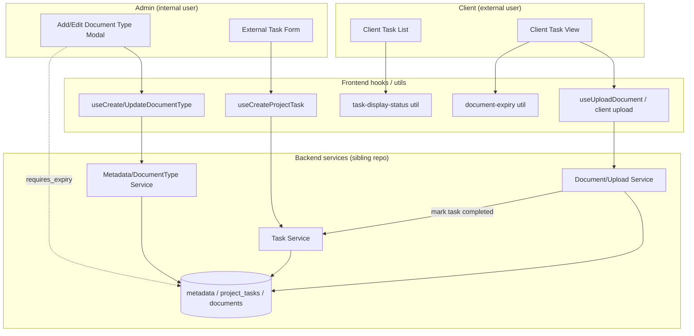
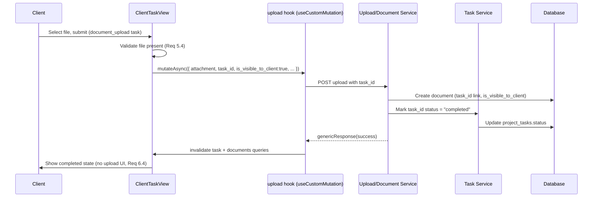

# Design Document: Client Documents & Tasks (Parts 2–8)

## Overview

This feature completes the Client Documents & Tasks workflow by wiring together already-existing pieces of the PYLOTT platform: the task category system (`TaskCategoryType`), the external task creation form (`external-task-form.tsx`), the client task view (`client-task-view.tsx`), the client task list (`client/tasks/index.tsx`), the document/metadata model, and the document expiry utilities.

The work spans four cohesive areas:

1. **Admin Document Configuration (Part 2)** — Add a "Requires expiry date?" toggle to the add/edit document type modal (`add-document-type-model.tsx`) that persists a `requires_expiry` flag on the document type (`metadata`) record. The client upload form consumes this flag to decide whether an expiry date is mandatory.
2. **Task Types (Parts 3 & 7)** — Extend the admin external task form's selectable client task types to include General Task (`task`), Provide Information (`information_request`), and Complete Form (`complete_form`, a new reserved enum value). `complete_form` is introduced only as an extensible placeholder; connecting it to NativeForms is explicitly out of scope.
3. **Document Request Workflow (Parts 4, 5 & 6)** — A `document_upload` task lets a client upload a file from within the task view. The upload creates a document linked to the task via `task_id` with `is_visible_to_client = true`, surfaces it in the client Documents section, and auto-completes the task so the team can confirm the request was fulfilled. The task description carries the request context.
4. **Task Status Display (Part 8)** — A frontend utility computes a display status (`Pending`, `In Progress`, `Completed`, `Overdue`) for client task cards and the task list. `Overdue` is a computed, display-only state — no database column.

The design deliberately reuses existing patterns: frontend hooks use `useCustomMutation` / `useQueryActionHook`; the backend uses `@injectable()` services returning `ServiceType` objects, with controllers responding via `genericResponse`. No new architectural layers are introduced.

### Design Decisions and Rationale

- **`complete_form` as a distinct enum value (not reused `information_request`)** — Per the resolved open question, forms stay conceptually separate from information requests and the value future-proofs the NativeForms connection. It is added to both the frontend enum (`src/types/task.types.ts` `TaskCategoryType`) and the backend enum (`src/shared/enums/index.ts` `TaskCategoryType`) so both layers accept and persist the value.
- **`Overdue` as a computed display state** — A task is overdue when `due_date < today` AND `status !== "completed"`. This is purely derived on the frontend from data already present, so no migration and no backend change is required. This mirrors the existing `getVisualStatus` approach already used in `task-status-badge.tsx`.
- **Auto-completion driven by the upload** — When a document is uploaded referencing a `task_id`, the backend marks that task `completed` in the same operation. This keeps task state consistent with the document without requiring a second client action, satisfying Requirements 6.1 and 7.1 in one atomic path.
- **`requires_expiry` on the `metadata` record** — Expiry configuration lives with the document type so any upload UI (admin or client) can read a single source of truth (Requirement 2.4).

## Architecture

### System Context



### Request Flow: Client Uploads a Document From a Task



### Component Boundaries

- **Frontend presentation** — React components in `src/pages/**` render forms, cards, and action UIs.
- **Frontend data access** — Hooks in `src/hooks/**` wrap `useCustomMutation` / `useQueryActionHook`.
- **Frontend pure logic** — Utilities in `src/utils/**` compute display status and expiry requirements. These are the primary property-tested units.
- **Backend services** — Live in the sibling backend repository and are described here for interface completeness; their properties are noted as backend-tested where the code is not present in this workspace.

## Components and Interfaces

### 1. Admin Document Config — `add-document-type-model.tsx` (Part 2)

Add a "Requires expiry date?" toggle using the existing `Switch` component (already used in `upload-document-modal.tsx`).

- Extend the form default values to include `requires_expiry`, seeded from `documentType?.requires_expiry ?? false` (Requirement 1.2).
- Add a `FormField` for `requires_expiry` rendering a `Switch`.
- Extend `addDocumentTypeSchema` in `src/utils/validation-schema/admin.ts` with `requires_expiry: yup.boolean().default(false)`.
- The submit payload passes `requires_expiry` through both create and update mutations (Requirements 1.3, 1.4, 1.5).

Hook changes (`use-create-document-type.tsx`, `use-update-document-type.tsx`): add `requires_expiry?: boolean` to the mutation payload type. Endpoints are unchanged (`metadata/type/documents`).

Type change (`src/types/api.types.ts`): add `requires_expiry: boolean` to `DocumentTypeDetails`.

**Backend interface (Metadata/DocumentType service):** `create` and `update` accept and persist `requires_expiry` on the `metadata` record. Returns a `ServiceType`. Requires a migration adding a `requires_expiry` boolean column (default `false`) to the `metadata` table.

### 2. Client Upload Expiry Enforcement (Part 2 → Requirement 2)

The client-facing document upload (reached from a `document_upload` task, and consistent with `upload-document-modal.tsx`) reads the selected document type's `requires_expiry` and conditionally enforces the expiry date.

- A pure helper `isExpiryRequired(documentType, doesNotExpire)` returns whether an expiry date must be provided: `true` when `documentType.requires_expiry === true` AND `doesNotExpire !== true`.
- Validation: if `isExpiryRequired` is true and no `expiry_date` is present, reject submission with a validation message (Requirement 2.3).
- When `requires_expiry` is false, submission is allowed with no expiry date (Requirement 2.2).

### 3. External Task Form — Client Task Types (Parts 3 & 7)

Extend `EXTERNAL_CATEGORY_TYPES` in `external-task-form.tsx`:

```ts
const EXTERNAL_CATEGORY_TYPES = [
  { value: "signing", label: "Signing" },
  { value: "information_request", label: "Provide Information" },
  { value: "document_upload", label: "Document Upload" },
  { value: "task", label: "General Task" },
  { value: "complete_form", label: "Complete Form" },
] as const;
```

- The selected value persists directly as `task_category_type` (Requirement 3.3).
- `complete_form` persists without requiring any linked form configuration (`form_config` remains optional) (Requirement 3.4).
- Existing schema already requires `task_category_type` (`yup.string().required("Task type is required")`), satisfying Requirement 3.5.
- Existing validation already enforces due date (`end_date` required) and at least one client (`client_ids` min 1), satisfying Requirements 9.1–9.3.
- A `description` field is added to the form and schema so a document-request task can carry request context (Requirements 8.1, 8.2). It maps to the task `description`.

### 4. Client Action UI — `client-task-view.tsx` (Parts 4, 5, 6)

Extend `CATEGORY_TYPE_LABELS` and the action area to handle the new types:

- `document_upload` → file upload control (already present) (Requirement 4.1, 5.1).
- `signing` → signing action UI (already present) (Requirement 4.2).
- `information_request` → information-entry UI (already present) (Requirement 4.3).
- `task` → general completion UI (Requirement 4.4).
- `complete_form` → form placeholder UI that requires no external connection (Requirement 4.5).
- No recognized type → general completion UI (existing fallback) (Requirement 4.6).

Document-upload submission path:

- Validate at least one file is selected before submitting; otherwise show a validation message (Requirement 5.4).
- Submit through the upload path with `task_id`, `is_visible_to_client: true`, and (when applicable) expiry fields.
- On success, the task is auto-completed by the backend; the view invalidates queries and renders the completed state, hiding the upload UI (Requirement 6.4).

Task description display: when `task.description` is non-empty, render it in the instructions card (already present); ensure it renders for `document_upload` (Requirement 8.3).

### 5. Client Upload Service (backend) (Parts 5, 6, 7)

`Client_Upload_Service` (Document/Upload service) handles a client submission referencing a `task_id`:

- Creates a `documents` record with `task_id`, `project_id`, `document_type_id` (optional), `is_visible_to_client` set for client visibility (Requirements 5.2, 5.3).
- When the created document references a `task_id`, sets that task's `status` to `completed` (Requirements 6.1, 7.1).
- The document remains associated with the task via `task_id` (Requirements 6.3, 7.2).
- Returns a `ServiceType`; the controller responds via `genericResponse`.

The document then appears in the client Documents section automatically through the existing `task_id` / `project_id` relation and `is_visible_to_client` filter (Requirement 6.2).

### 6. Task Display Status Utility (Part 8)

New pure utility `src/utils/task-display-status.ts`:

```ts
export type DisplayedStatus = "Pending" | "In Progress" | "Completed" | "Overdue";

export function isOverdue(status: string, dueDate?: string | null, now?: Date): boolean;
export function getDisplayedStatus(status: string, dueDate?: string | null, now?: Date): DisplayedStatus;
export function getDisplayedStatusBadgeVariant(status: DisplayedStatus): string;
```

Rules (Requirements 10 & 11):

- `isOverdue` is `true` only when `dueDate` exists, `now` is strictly past `dueDate`, and `status !== "completed"`.
- `getDisplayedStatus`: `completed` → `"Completed"`; else if overdue → `"Overdue"`; else if `in_progress` → `"In Progress"`; else → `"Pending"`.
- Badge variants reuse existing `Badge` variants: `completed` → `completed`, `in_progress` → `in_progress`, `pending` → `pending`, `overdue` → `destructive`/`late` (red).

Consumers: `client-test-card.tsx` and `client/tasks/index.tsx` replace the raw `task.status` badge with `getDisplayedStatus(...)` output.

## Data Models

### Document Type (`metadata` table / `DocumentTypeDetails`)

```ts
interface DocumentTypeDetails {
  id: string;
  created_at: string;
  updated_at: string;
  deleted_at?: string;
  company_id: string;
  project_id: string;
  name: string;
  is_system: number;
  type: string;
  description: string;
  requires_expiry: boolean; // NEW — default false
}
```

Migration: add `requires_expiry BOOLEAN NOT NULL DEFAULT false` to `metadata`.

### Task Category Type (frontend `src/types/task.types.ts` + backend `src/shared/enums/index.ts`)

```ts
export enum TaskCategoryType {
  SIGNING = "signing",
  INFORMATION_REQUEST = "information_request",
  DOCUMENT_UPLOAD = "document_upload",
  ACTIVITY = "activity",
  MEETING = "meeting",
  TASK = "task",
  FOLLOW_UP = "follow_up",
  MESSAGE = "message",
  REVIEW = "review",
  COMPLETE_FORM = "complete_form", // NEW — reserved, extensible for NativeForms
}
```

No new columns for `complete_form`; it is an additional allowed value of the existing `task_category_type` column. No migration required beyond enum acceptance (the column is a string).

### Document (`documents` table / `Document`)

No schema change. The upload-from-task path populates existing fields: `task_id` (link), `project_id`, `document_type_id` (optional), `is_visible_to_client`, and expiry fields (`expiry_date`, `does_not_expire`) when applicable.

### Displayed Status (computed, frontend only)

```ts
type DisplayedStatus = "Pending" | "In Progress" | "Completed" | "Overdue";
```

No persistence. Derived from `status` and `due_date`.

## Correctness Properties

*A property is a characteristic or behavior that should hold true across all valid executions of a system — essentially, a formal statement about what the system should do. Properties serve as the bridge between human-readable specifications and machine-verifiable correctness guarantees.*

The prework analysis consolidated the testable acceptance criteria into the distinct, non-redundant properties below. UI-presence criteria (rendering a control or option list) and deterministic integration criteria are covered by example/integration tests in the Testing Strategy rather than by universal properties. Properties 7 and 8 exercise backend service logic that lives in the sibling backend repository; they are documented here for traceability and are expected to be property-tested in that repository.

### Property 1: Overdue computation

*For any* task status and any optional due date, `isOverdue` returns `true` if and only if a due date exists, the current date is strictly past that due date, and the status is not `"completed"`; in all other cases (no due date, date on or before the due date, or status `"completed"`) it returns `false`.

**Validates: Requirements 11.1, 11.2, 11.3, 11.4**

### Property 2: Displayed status mapping

*For any* task status and any optional due date, `getDisplayedStatus` returns `"Completed"` when the status is `"completed"`; otherwise `"Overdue"` when the task is overdue (per Property 1); otherwise `"In Progress"` when the status is `"in_progress"`; otherwise `"Pending"`.

**Validates: Requirements 10.1, 10.2, 10.3, 10.4**

### Property 3: Expiry-required decision

*For any* document type and any `doesNotExpire` flag, `isExpiryRequired` returns `true` if and only if the document type's `requires_expiry` is `true` AND `doesNotExpire` is not `true`; consequently an expiry date is mandatory exactly in that case and optional otherwise.

**Validates: Requirements 2.1, 2.2, 2.3, 2.4**

### Property 4: Action-UI resolution totality

*For any* string value of `task_category_type` and any task status, the client action-UI resolver returns a defined action-UI kind: each recognized type maps to its designated UI, any unrecognized type maps to the general-completion UI, and a `"completed"` status resolves to the completed state with no upload affordance presented.

**Validates: Requirements 4.1, 4.2, 4.3, 4.4, 4.5, 4.6, 5.1, 6.4**

### Property 5: Task-creation payload mapping

*For any* valid external task form input (a name, a selected client task type from the allowed set, a due date, at least one assigned client, and an optional description), the submitted create-task payload carries the selected `task_category_type` unchanged, the due date, the assigned clients, and the description — and requires no linked form configuration when the selected type is `complete_form`.

**Validates: Requirements 3.3, 3.4, 8.2, 9.1, 9.4**

### Property 6: Document-type expiry-config propagation

*For any* boolean value shown in the "Requires expiry date?" toggle, submitting the add/edit document type form produces a mutation payload whose `requires_expiry` equals that boolean value.

**Validates: Requirements 1.3, 1.4, 1.5**

### Property 7: Auto-completion on upload (backend)

*For any* `document_upload` task, creating a document that references that task's `task_id` results in the task's status becoming `"completed"`.

**Validates: Requirements 6.1, 7.1**

### Property 8: Document creation and linkage on upload (backend)

*For any* client document submission that references a `task_id`, the created document record retains that `task_id`, is associated with the task's project, and carries an `is_visible_to_client` value reflecting client visibility.

**Validates: Requirements 5.2, 5.3, 6.3, 7.2**

## Error Handling

All backend services follow the existing PYLOTT pattern of returning `ServiceType` objects with `{ status, message, statusCode }` rather than throwing to the controller; controllers respond via `genericResponse`. Frontend mutations use `useCustomMutation`, which surfaces server errors through `Toast.error` via the shared `errorFormatter`.

| Scenario | Layer | Behavior |
| --- | --- | --- |
| Submit task with no type selected | Frontend | Yup rejects (`task_category_type` required); validation message shown, no mutation (Req 3.5). |
| Submit task with no due date | Frontend | Yup rejects (`end_date` required); validation message shown (Req 9.2). |
| Submit task with no assigned client | Frontend | Yup rejects (`client_ids` min 1); validation message shown (Req 9.3). |
| Client upload with no file selected | Frontend | Local guard blocks submit; validation message shown, no mutation (Req 5.4). |
| Expiry required but missing and not marked non-expiring | Frontend | Validation rejects submission with expiry message (Req 2.3). |
| File-to-base64 conversion failure | Frontend | Catch, `Toast.error("Invalid file format")`, abort (matches existing `upload-document-modal.tsx`). |
| Document type create/update fails | Backend | `ServiceType` error; `genericResponse` returns appropriate status; frontend toasts message. |
| Upload references non-existent task | Backend | `ServiceType` error (not found); document not created, task unchanged. |
| Auto-completion update fails after document create | Backend | Operation treated atomically; on failure the create is not reported as successful, avoiding a linked document with an un-completed task. |

## Testing Strategy

### Dual Testing Approach

- **Unit / example tests** — component rendering, option-list presence, per-type action UI, and field-level validation messages.
- **Property-based tests** — the pure decision functions (`isOverdue`, `getDisplayedStatus`, `isExpiryRequired`, the action-UI resolver) and the form → payload mappings.
- **Integration tests** — deterministic cross-boundary behaviors (document appears in the client documents list; team detail indicates a provided document).

### Property-Based Testing

PBT is appropriate here because the core logic includes pure functions with clear input/output behavior and universal properties (overdue computation, status mapping, expiry decision, action-UI totality) plus form-to-payload mappings that hold across the full option/value space.

- **Library:** `fast-check` with `vitest` (the project's existing test runner). `fast-check` is added as a dev dependency.
- **Iterations:** each property-based test runs a minimum of 100 iterations.
- **Tagging:** each property test is tagged with a comment in the format
  `// Feature: client-documents-tasks, Property {number}: {property_text}`
  and references the design property it validates.
- **Single test per property:** each correctness property is implemented by exactly one property-based test.

Frontend-testable properties in this repository: Property 1 (overdue), Property 2 (displayed status), Property 3 (expiry-required), Property 4 (action-UI resolution), Property 5 (task-creation payload), Property 6 (requires_expiry propagation).

Backend properties (sibling repository): Property 7 (auto-completion on upload) and Property 8 (document creation/linkage). These are documented here for traceability and are expected to be implemented as property-based tests in the backend repo, since the service code is not present in this workspace.

### Generators

- **Task status** — arbitrary from the lifecycle set plus a few unknown strings (to exercise Property 4 totality and Property 2 fallthrough).
- **Due date** — arbitrary dates spanning past, today, and future, plus `undefined`/`null` (Property 1 edge cases, incl. 11.3).
- **`requires_expiry` / `doesNotExpire`** — arbitrary booleans (Property 3, including the 2.3 escape hatch).
- **`task_category_type`** — arbitrary from the allowed client set plus unknown strings (Properties 4 and 5).
- **Form input** — arbitrary non-empty names, valid client id arrays (length ≥ 1), valid due dates, and optional descriptions (Property 5).

### Example and Integration Tests

- Render the add/edit document type modal and assert the expiry toggle is present and reflects the seeded value (Req 1.1, 1.2).
- Render the external task form and assert all five client task type options are present (Req 3.1) and that selecting each shows the corresponding fields (Req 3.2).
- Render the client task view per type and assert the correct action UI, including the `complete_form` placeholder with no external form fetch (Req 4.x, 5.1) and the completed-state hiding the upload UI (Req 6.4).
- Assert description field presence and display, empty description hidden (Req 8.1, 8.3).
- Integration: after an upload-through-task, the document appears in the client documents list (Req 6.2) and the team task detail shows the linked document (Req 7.1).

### Notes

- The `complete_form` type is exercised only as an extensible placeholder; no NativeForms connection is designed or tested in this spec.
- `Overdue` is validated purely through the frontend utility; there is no database column and no backend assertion for it.
