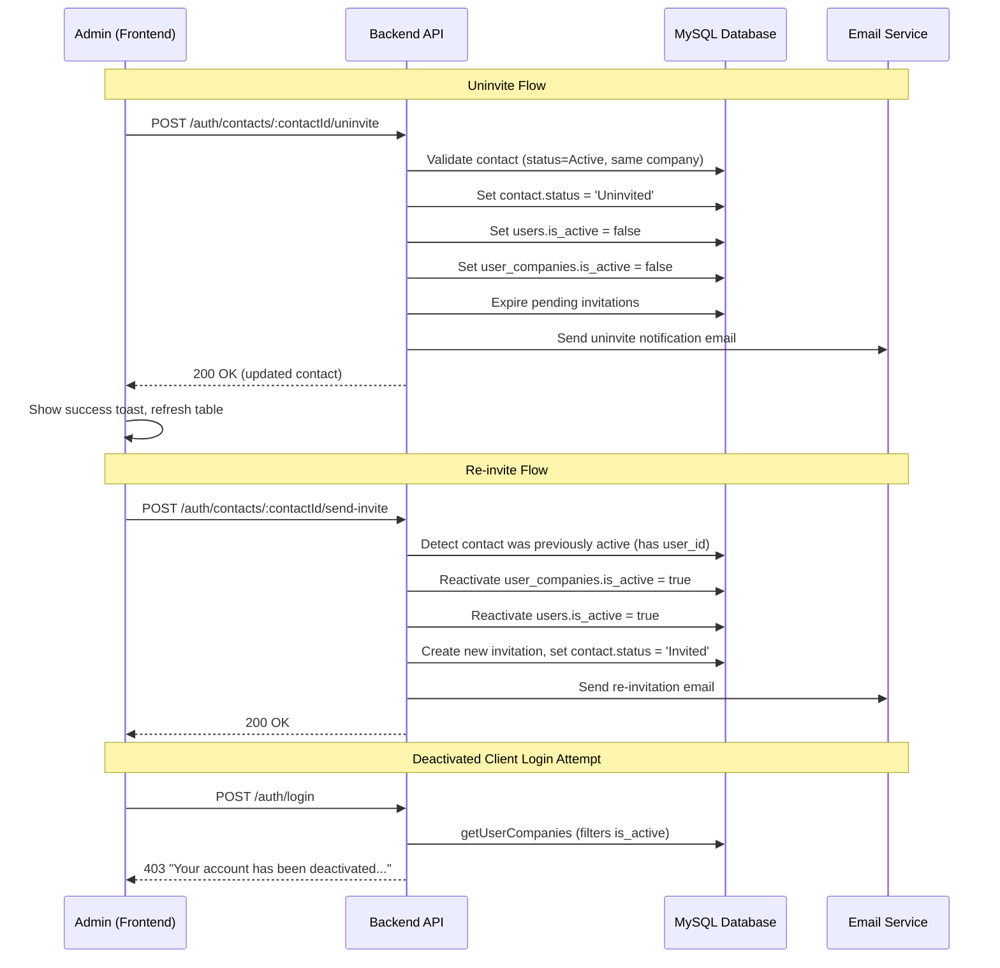
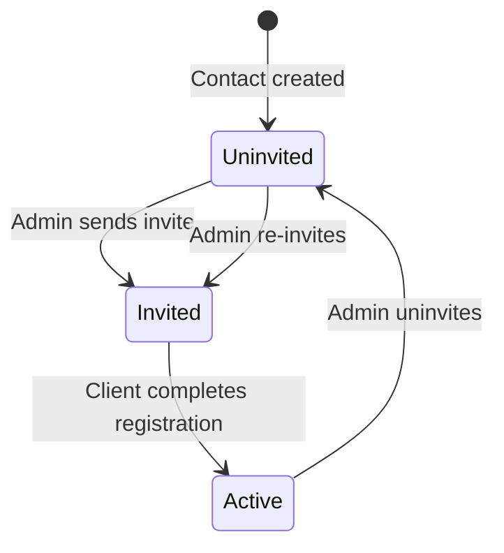

# Design Document: Contact Uninvite

## Overview

This feature adds the ability for admins and super admins to uninvite (deactivate) active clients from the Pylott platform via the contact table. The implementation spans both the backend (new API endpoint, email notification, re-invite logic) and frontend (uninvite button, confirmation dialog, styling fix). The existing `signIn` method already blocks users with no active company memberships, so setting `user_companies.is_active = false` naturally prevents login without additional login-side changes.

### Key Design Decisions

1. **Uninvite endpoint lives on the auth route** (`/api/v1/auth/contacts/:contactId/uninvite`) — mirrors the existing `send-invite` route pattern and keeps all contact-auth operations co-located in `AuthService`.
2. **Re-invite reuses the existing `sendContactInvite` flow** with modifications — when a contact is `Uninvited` and has an existing user record, the re-invite path reactivates `user_companies.is_active` and `users.is_active` before sending a new invitation, rather than creating a duplicate user.
3. **No database migration needed** — all required columns (`contacts.status`, `users.is_active`, `user_companies.is_active`, `invitations.status`) already exist.
4. **Contact status values use title-case** (`Uninvited`, `Invited`, `Active`) to match the existing `Contact` model's `jsonSchema` enum and the values already stored in the database.

## Architecture



## Components and Interfaces

### Backend Components

#### 1. New Method: `AuthService.uninviteContact(adminUserId, contactId)`

Handles the uninvite logic:
- Validates the requesting user is admin/super_admin
- Validates the contact belongs to the admin's company and is `Active`
- Looks up the associated user via `contact.email`
- Sets `contact.status = 'Uninvited'`
- Sets `users.is_active = false`
- Sets `user_companies.is_active = false`
- Expires all `PENDING` invitations for the contact's email in the company
- Sends uninvite notification email
- Logs audit trail event

#### 2. Modified Method: `AuthService.sendContactInvite(inviterUserId, contactId)`

Currently rejects contacts with status `Active` but does not handle re-inviting `Uninvited` contacts that were previously active. Modification:
- Remove the early return when `contact.status === 'Uninvited'` (it already falls through to invite)
- Add a check: if the contact has a `user_id` or a user exists with the contact's email, reactivate `user_companies.is_active = true` and `users.is_active = true` before sending the invite
- The existing `createAndSendInvite` call needs to handle the case where a PENDING invitation already exists for a previously-uninvited contact (the old one was expired during uninvite, so a new one can be created)

#### 3. New Route: `POST /api/v1/auth/contacts/:contactId/uninvite`

- Uses `authenticateUser` middleware
- Calls `AuthController.uninviteContact`

#### 4. New Email Template Function: `uninviteNotificationEmail(clientName, companyName)`

Returns HTML email content using the existing `authEmailTemplate` helper, with:
- Title: "Account Access Revoked"
- Message explaining the client's access has been revoked by the company
- Support email contact
- No action button (informational only — can use a link to the Pylott website)

#### 5. New Audit Trail Action: `AUDIT_TRAIL_ACTION.CLIENT_UNINVITED`

Added to the enums for tracking uninvite events.

### Frontend Components

#### 1. Modified: `ContactTableRow` (`contact-table-row.tsx`)

- Add "Uninvite" button visible only when `contact.status === 'active'`
- Add confirmation dialog (using existing shadcn `AlertDialog`)
- On confirm, call the uninvite API via a new `useUninviteContact` hook
- Show success/error toast
- Fix invite button styling: change variant or add explicit text color class

#### 2. New Hook: `useUninviteContact(contactId)`

- Uses `useCustomMutation` pattern (same as `useSendInvite`)
- `POST` to `ENDPOINTS.UNINVITE_CONTACT(contactId)`
- On success, invalidates `QUERYKEYS.GET_COMPANY_CONTACTS`

#### 3. Modified: `constants.ts`

- Add `UNINVITE_CONTACT: (contactId: string) => \`auth/contacts/\${contactId}/uninvite\``

### Interface Contracts

```typescript
// POST /api/v1/auth/contacts/:contactId/uninvite
// Request: No body required (contactId from URL params, admin from JWT)
// Response (200):
{
  status: "success",
  message: "Contact uninvited successfully",
  data: {
    contactId: string,
    email: string,
    status: "Uninvited"
  }
}

// Error Responses:
// 403 - Not admin/super_admin, or contact not in admin's company
// 400 - Contact is not currently active
// 404 - Contact not found
```

## Data Models

### Existing Tables (No Migration Required)

#### `contacts` table
| Column | Type | Relevant Values |
|--------|------|----------------|
| id | VARCHAR(36) | UUID |
| name | VARCHAR | |
| email | VARCHAR | |
| status | ENUM | `'Uninvited'`, `'Invited'`, `'Active'` |
| company_id | VARCHAR(36) | FK to companies |

#### `users` table
| Column | Type | Relevant Values |
|--------|------|----------------|
| id | VARCHAR(36) | UUID |
| email | VARCHAR | |
| is_active | BOOLEAN | `true` / `false` |
| role | ENUM | `'client'`, `'admin'`, `'super_admin'`, etc. |

#### `user_companies` table
| Column | Type | Relevant Values |
|--------|------|----------------|
| user_id | VARCHAR(36) | FK to users |
| company_id | VARCHAR(36) | FK to companies |
| is_active | BOOLEAN | `true` / `false` |

#### `invitations` table
| Column | Type | Relevant Values |
|--------|------|----------------|
| id | VARCHAR(36) | UUID |
| email | VARCHAR | |
| company_id | VARCHAR(36) | FK to companies |
| status | ENUM | `'PENDING'`, `'ACCEPTED'`, `'EXPIRED'` |

### State Transitions




## Correctness Properties

*A property is a characteristic or behavior that should hold true across all valid executions of a system — essentially, a formal statement about what the system should do. Properties serve as the bridge between human-readable specifications and machine-verifiable correctness guarantees.*

### Property 1: Uninvite button visibility matches contact status

*For any* contact record, the "Uninvite" button should be visible if and only if the contact's status is `active`. For contacts with status `uninvited` or `invited`, the button must not be rendered.

**Validates: Requirements 2.1, 2.2**

### Property 2: Uninvite deactivates all associated records

*For any* active contact with an associated user and company membership, calling the uninvite endpoint should result in: contact status set to `Uninvited`, user `is_active` set to `false`, user_companies `is_active` set to `false`, and all `PENDING` invitations for that email/company expired to `EXPIRED`. The response should contain the updated contact data.

**Validates: Requirements 3.1, 3.2, 3.3, 3.4, 3.9**

### Property 3: Uninvite authorization rejects non-admin roles

*For any* user with a role other than `admin` or `super_admin`, calling the uninvite endpoint should return a 403 Forbidden error regardless of the contact's status or company.

**Validates: Requirements 3.5, 3.6**

### Property 4: Uninvite rejects cross-company requests

*For any* admin user and any contact that belongs to a different company than the admin's company, calling the uninvite endpoint should return a 403 Forbidden error.

**Validates: Requirements 3.7**

### Property 5: Uninvite rejects non-active contacts

*For any* contact with status other than `active` (i.e., `uninvited` or `invited`), calling the uninvite endpoint should return a 400 Bad Request error with the message "Contact is not currently active".

**Validates: Requirements 3.8**

### Property 6: Uninvite notification email contains required information

*For any* successful uninvite operation, the notification email sent to the client should contain the client's name, the company name, and a support contact email address.

**Validates: Requirements 4.1, 4.2, 4.3**

### Property 7: Deactivated users are blocked at login

*For any* user whose all `user_companies` records have `is_active = false`, attempting to log in with valid credentials should return a 403 error with the deactivation message.

**Validates: Requirements 5.1, 5.3**

### Property 8: Re-invite reactivates user and company membership

*For any* previously uninvited contact that has an existing user record, sending a re-invite should set `users.is_active` to `true` and `user_companies.is_active` to `true`.

**Validates: Requirements 6.2, 6.3**

### Property 9: Re-invite updates contact status and sends email

*For any* re-invite of an uninvited contact, the contact status should be updated to `Invited` and an invitation email should be sent to the client's email address.

**Validates: Requirements 6.4, 6.5**

### Property 10: Uninvite then re-invite round trip

*For any* active contact, uninviting and then re-inviting should result in the contact status being `Invited`, the user record being active (`is_active = true`), and the user_company record being active (`is_active = true`). After the client completes registration, the contact status should transition to `Active`.

**Validates: Requirements 6.6**

## Error Handling

### Backend Errors

| Scenario | HTTP Status | Error Message |
|----------|-------------|---------------|
| Requesting user not found | 404 | "User not found" |
| Requesting user not admin/super_admin | 403 | "Only Admin or Super Admin can uninvite contacts" |
| Requesting user has no company | 400 | "You are not associated with a company" |
| Contact not found | 404 | "Contact not found" |
| Contact in different company | 403 | "Contact does not belong to your workspace" |
| Contact not active | 400 | "Contact is not currently active" |
| Associated user not found | 400 | "No user account found for this contact" |
| Email send failure | 500 | Logged but does not block the uninvite operation (uninvite succeeds, email failure is non-blocking) |

### Frontend Error Handling

- API errors are displayed as toast notifications via `sonner`
- Network errors show a generic "Failed to uninvite contact" message
- The confirmation dialog closes on both success and error
- The contact table refreshes via query invalidation on success

## Testing Strategy

### Property-Based Testing

Use `fast-check` as the property-based testing library for TypeScript.

Each property test must:
- Run a minimum of 100 iterations
- Reference its design document property with a tag comment: `Feature: contact-uninvite, Property {number}: {property_text}`
- Generate random valid inputs using `fast-check` arbitraries

Property tests focus on:
- **Property 2**: Generate random active contacts with associated users/companies, call uninvite, verify all records are deactivated
- **Property 3**: Generate random user roles, verify only admin/super_admin are accepted
- **Property 5**: Generate random non-active contact statuses, verify 400 rejection
- **Property 6**: Generate random client names and company names, verify email content contains them
- **Property 7**: Generate random users with inactive company memberships, verify login returns 403
- **Property 8**: Generate random previously-uninvited contacts with user records, verify reactivation
- **Property 10**: Generate random active contacts, perform uninvite then re-invite, verify round-trip state

### Unit Testing

Unit tests complement property tests for specific examples and edge cases:
- Uninvite button renders for active contact (example for Property 1)
- Uninvite button does not render for uninvited/invited contacts (example for Property 1)
- Confirmation dialog appears on uninvite button click
- Confirmation dialog cancel closes without API call
- Uninvite API call on confirm shows success toast
- Uninvite API error shows error toast
- Email template includes support email address
- Re-invite for contact with no prior user record follows normal invite flow
- Invite button styling uses `outline` variant with visible text

### Integration Testing

- Full uninvite flow: admin uninvites active client → client cannot log in → admin re-invites → client can complete registration and log in
- Verify the existing `signIn` deactivation check works with uninvited users (no code change needed)
