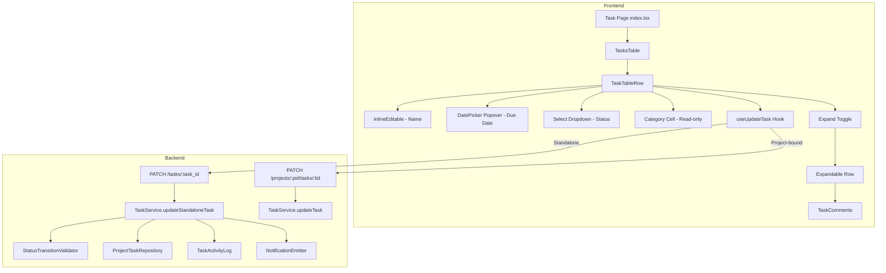

# Design Document: Inline Task Editing

## Overview

This design replaces the modal-based `TaskDetailPanel` with inline editing directly in the task table. Users will edit task name, due date, and status in-place within table cells, view a permanently visible Category column, and expand rows to access comments. A new backend `PATCH /tasks/:task_id` endpoint enables general-purpose partial updates for standalone tasks, while project-bound tasks continue using the existing `PATCH /projects/:project_id/tasks/:task_id` endpoint.

The approach prioritizes minimal disruption: the existing `InlineEditable` component is reused for task name editing, the existing `useUpdateTaskStatus` hook pattern is extended into a general `useUpdateTask` hook, and the `TaskComments` component is embedded in an expandable row instead of a modal.

## Architecture



### Key Design Decisions

1. **Reuse `InlineEditable` for task name**: The existing component at `@/components/EditableInput` already handles click-to-edit, Enter/Escape, and blur semantics. We wrap it with loading/error state management.

2. **Single `useUpdateTask` hook**: Rather than separate hooks per field, one hook accepts a partial payload (`{ name?, due_date?, status?, task_category_type? }`) and routes to the correct endpoint based on `project_id`. This mirrors the existing `useUpdateTaskStatus` pattern but generalizes it.

3. **Row click no longer opens modal**: The `onTaskClick` callback is removed entirely. Individual cells handle their own click events with `e.stopPropagation()` to prevent row-level interference.

4. **Expandable row via local state**: Each `TaskTableRow` manages its own `isExpanded` boolean. When expanded, a second `<TableRow>` is rendered below with a `colSpan` cell containing `TaskComments`.

5. **Backend general PATCH**: A new `updateStandaloneTask` service method extends the existing `updateStandaloneTaskStatus` to accept `name`, `due_date`, and `task_category_type` in addition to `status`. This avoids duplicating validation logic.

## Components and Interfaces

### Modified Components

#### `TaskTableRow` (task-table-row.tsx)

Current: Renders a read-only row with an `onTaskClick` handler.
After: Renders inline-editable cells for name, due date, and status; a read-only category column; and an expand toggle for comments.

```typescript
interface TaskTableRowProps {
  task: Task;
  showCategory?: boolean;
  // onTaskClick removed
}
```

Internal state:
- `isExpanded: boolean` — controls comment row visibility
- `editingField: "name" | "due_date" | "status" | null` — tracks which cell is in edit mode (only one at a time)

The row no longer has `cursor-pointer` on the entire `<TableRow>`. Instead, individual editable cells get `cursor-pointer`.

#### `TasksTable` (task-table.tsx)

Changes:
- Remove `onTaskClick` prop
- Add "Category" column header unconditionally (always visible per Req 6)
- Remove conditional `showCategory` logic — category is always shown
- Add expand/collapse column header (empty header, narrow width)

#### Task Page `index.tsx`

Changes:
- Remove `TaskDetailPanel` import and rendering
- Remove `selectedTask`, `detailPanelOpen` state
- Remove `handleTaskClick`, `handleDetailPanelClose` functions
- Remove `onTaskClick` prop from `TasksTable`

#### `TaskComments` (task-comments.tsx)

No structural changes needed. The component already supports endpoint switching via `projectId` (empty string = standalone). It will be rendered inside the expandable row instead of the modal.

### New Components / Hooks

#### `useUpdateTask` Hook

```typescript
// hooks/project-modules/tasks/use-update-task.tsx
interface UpdateTaskPayload {
  name?: string;
  due_date?: string;
  status?: string;
  task_category_type?: string;
}

const useUpdateTask = (projectId: string | null, taskId: string) => {
  const queryClient = useQueryClient();
  const endpoint = projectId
    ? `projects/${projectId}/tasks/${taskId}`
    : `tasks/${taskId}`;
  
  return useCustomMutation<Record<string, string>, UpdateTaskPayload>({
    method: "patch",
    endpoint,
    showSuccessToast: false, // silent on success, toast on error only
    onSuccess: () => {
      queryClient.invalidateQueries({ queryKey: [QUERYKEYS.GET_ALL_TASKS] });
      queryClient.invalidateQueries({ queryKey: [QUERYKEYS.GET_ALL_PROJECT_TASKS] });
    },
  });
};
```

### Removed Components

#### `TaskDetailPanel` (task-detail-panel.tsx)

Deleted entirely. All functionality moves inline:
- Status editing → status dropdown cell
- Category display → always-visible category column
- Comments → expandable row

## Data Models

### Frontend Types (no changes)

The existing `Task` interface already contains all required fields:
- `name: string`
- `due_date` (via `end_date` or `due_date` field)
- `status: "draft" | "sent" | "in_progress" | "completed" | "archived" | "pending"`
- `task_category_type?: TaskCategoryType`
- `project_id: string | null` (determines standalone vs project-bound routing)

### Backend — New Endpoint

**`PATCH /tasks/:task_id`** (General Update for Standalone Tasks)

Request body (all fields optional, at least one required):
```json
{
  "name": "Updated task name",
  "due_date": "2025-03-15T00:00:00Z",
  "status": "in_progress",
  "task_category_type": "review"
}
```

Success response (200):
```json
{
  "status": true,
  "message": "Task updated successfully"
}
```

Error responses:
- 404: `{ "status": false, "message": "Task not found" }`
- 400: `{ "status": false, "message": "Cannot transition from 'draft' to 'archived'. Valid transitions from 'draft': sent, in_progress, completed" }`
- 400: `{ "status": false, "message": "Task name cannot be empty" }`
- 403: `{ "status": false, "message": "Only ADMIN or SUPER_ADMIN users can unarchive tasks" }`

### Backend — Service Method

New method `TaskService.updateStandaloneTask(user, task_id, payload)`:
- Looks up task via `projectTaskRepository.getTaskByIdOnly(company_id, task_id)`
- Validates `name` is non-empty string if provided
- Validates status transition via `statusTransitionValidator` if `status` provided
- Enforces admin-only unarchive if transitioning from archived → completed
- Updates only provided fields via `projectTaskRepository.update()`
- Logs status change to `TaskActivityLog` and emits notification if status changed
- Returns standard `ServiceType` response

### Category Label Formatting

The `task_category_type` values are formatted for display using a static map:

```typescript
const CATEGORY_TYPE_LABELS: Record<string, string> = {
  signing: "Signing",
  information_request: "Information Request",
  document_upload: "Document Upload",
  review: "Review",
  approval: "Approval",
  meeting: "Meeting",
  follow_up: "Follow-up",
};
```

When `task_category_type` is null/undefined, display "—".

## Correctness Properties

*A property is a characteristic or behavior that should hold true across all valid executions of a system — essentially, a formal statement about what the system should do. Properties serve as the bridge between human-readable specifications and machine-verifiable correctness guarantees.*

### Property 1: Escape reverts inline edit

*For any* task name cell in edit mode with any draft value, pressing Escape should revert the displayed value to the original task name and exit edit mode without calling the API.

**Validates: Requirements 2.3**

### Property 2: Name submit on Enter/blur

*For any* task with any valid (non-empty) name string, pressing Enter or blurring the name input should call the update API with the new name in the payload.

**Validates: Requirements 2.2**

### Property 3: Date selection submits update

*For any* task and any selected date value, selecting a date from the date picker should close the picker and call the update API with the selected `due_date` in the payload.

**Validates: Requirements 3.2**

### Property 4: Status selection submits update

*For any* task and any selected status value from the dropdown, selecting a status should call the update API with the selected `status` in the payload.

**Validates: Requirements 4.2**

### Property 5: Category column always visible with formatted label

*For any* context filter value ("all", "organization", or "project"), the Category column header and cells should be rendered. *For any* task with a non-null `task_category_type`, the displayed label should equal the formatted version from the label map (e.g., "follow_up" → "Follow-up"). For null/undefined values, "—" should be displayed.

**Validates: Requirements 6.2, 6.4, 6.3**

### Property 6: Update endpoint routing by project_id

*For any* task, if `project_id` is null the update hook should construct the endpoint as `tasks/{task_id}`, and if `project_id` is set the endpoint should be `projects/{project_id}/tasks/{task_id}`.

**Validates: Requirements 9.1, 9.2**

### Property 7: Comments endpoint routing by projectId

*For any* task, if `projectId` is empty the comments hooks should use standalone endpoints (`/tasks/:task_id/comments`), and if `projectId` is non-empty they should use project endpoints (`/projects/:project_id/tasks/:task_id/comments`). This applies to both fetching and creating comments.

**Validates: Requirements 7.4, 7.5, 10.1, 10.2, 10.3, 10.4**

### Property 8: Backend partial update applies only provided fields

*For any* standalone task and any subset of `{ name, due_date, status, task_category_type }`, the `PATCH /tasks/:task_id` endpoint should update only the fields present in the payload, leaving all other fields unchanged.

**Validates: Requirements 8.2**

### Property 9: Backend status transition validation

*For any* current task status and any target status, the `PATCH /tasks/:task_id` endpoint should accept the transition if and only if the target status appears in `TASK_TRANSITION_MAP[currentStatus]`. Invalid transitions should return a 400 error with the valid transitions listed.

**Validates: Requirements 8.3, 8.6**

### Property 10: Backend name validation rejects empty strings

*For any* string that is empty or composed entirely of whitespace, the `PATCH /tasks/:task_id` endpoint should reject the update with a validation error and leave the task name unchanged.

**Validates: Requirements 8.4**

## Error Handling

### Frontend Error Handling

| Scenario | Behavior |
|---|---|
| Inline edit API returns error | Revert cell to previous value; `useCustomMutation` auto-displays error toast via `Toast.error()` |
| Invalid status transition (400) | Revert status badge to previous status; toast shows transition error message from backend |
| Network failure during edit | Revert cell; toast shows generic error |
| Comments fail to load | `TaskComments` renders "Failed to load comments" message (existing behavior) |
| Comment creation fails | `useCustomMutation` shows error toast; input retains content for retry |

### Backend Error Handling

| Scenario | Status Code | Response |
|---|---|---|
| Task not found / wrong company | 404 | `{ status: false, message: "Task not found" }` |
| Empty/whitespace name | 400 | `{ status: false, message: "Task name cannot be empty" }` |
| Invalid status transition | 400 | `{ status: false, message: "Cannot transition from 'X' to 'Y'. Valid transitions: ..." }` |
| Admin-only unarchive by non-admin | 403 | `{ status: false, message: "Only ADMIN or SUPER_ADMIN users can unarchive tasks" }` |
| Activity log insert fails | N/A | Non-blocking — logged to console, does not fail the update |
| Notification emit fails | N/A | Non-blocking — does not fail the update |

### Optimistic vs Pessimistic Updates

This design uses **pessimistic updates** (wait for API response before confirming). Rationale:
- Status transitions can fail due to validation rules — showing an invalid status then reverting is confusing
- The `useCustomMutation` hook already handles error toasts automatically
- Loading indicators on cells provide feedback during the brief wait

## Testing Strategy

### Unit Tests

Focus on specific examples and edge cases:
- Clicking a name cell activates the input with the correct pre-filled value
- Clicking Pipeline/Project cells does not activate any editor
- Expand toggle renders `TaskComments` with correct props
- Collapse toggle hides the expandable row
- Category cell shows "—" for null `task_category_type`
- Backend returns 404 for non-existent task
- Backend returns 404 for task belonging to different company
- Backend logs activity and emits notification on status change

### Property-Based Tests

Use `fast-check` as the property-based testing library for TypeScript.

Each property test should run a minimum of 100 iterations and be tagged with a comment referencing the design property.

**Frontend properties:**
- **Property 1**: Generate random strings as draft values, simulate Escape, verify revert
- **Property 2**: Generate random non-empty strings, simulate Enter, verify API called with correct payload
- **Property 3**: Generate random Date objects, simulate selection, verify API called with correct due_date
- **Property 4**: Generate random valid statuses, simulate selection, verify API called with correct status
- **Property 5**: Generate random context filter values and task_category_type values, verify column visibility and label formatting
- **Property 6**: Generate random task objects with null/non-null project_id, verify endpoint string construction
- **Property 7**: Generate random projectId (empty/non-empty) and taskId, verify endpoint construction for both GET and POST

**Backend properties:**
- **Property 8**: Generate random partial payloads, apply update, verify only provided fields changed
- **Property 9**: Generate random (currentStatus, targetStatus) pairs, verify acceptance matches TASK_TRANSITION_MAP
- **Property 10**: Generate random whitespace-only strings, verify rejection

**Tag format:** `// Feature: inline-task-editing, Property {N}: {title}`

Example:
```typescript
// Feature: inline-task-editing, Property 6: Update endpoint routing by project_id
fc.assert(
  fc.property(
    fc.record({
      projectId: fc.option(fc.uuid(), { nil: null }),
      taskId: fc.uuid(),
    }),
    ({ projectId, taskId }) => {
      const expected = projectId
        ? `projects/${projectId}/tasks/${taskId}`
        : `tasks/${taskId}`;
      expect(buildUpdateEndpoint(projectId, taskId)).toBe(expected);
    }
  ),
  { numRuns: 100 }
);
```
