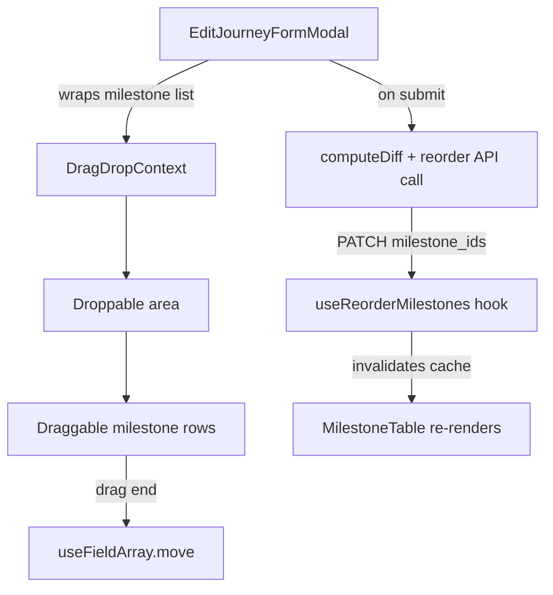

# Design Document: Milestone Reorder

## Overview

This design adds drag-to-reorder functionality for milestones within the Edit Journey Modal (`edit-jorney-modal.tsx`). Admins can reorder milestones by dragging rows (or using keyboard controls), and the new order is persisted via the existing `PATCH /projects/types/:project_type_id/milestones/reorder` endpoint on form submission.

The implementation leverages `@hello-pangea/dnd` (already installed, not yet used in the codebase) for drag-and-drop interactions, and integrates with the existing `useFieldArray` from `react-hook-form` that already manages the milestone list in the edit modal. The existing `useReorderMilestones` hook handles the API call and cache invalidation.

No backend changes are required. The backend reorder endpoint already validates that all milestone IDs are present and updates the `order` column accordingly.

## Architecture

The feature is scoped entirely to the frontend. The architecture follows the existing patterns in the codebase:



### Key Design Decisions

1. **`@hello-pangea/dnd` over custom implementation**: Already installed as a dependency. It provides built-in keyboard accessibility (Space/Enter to pick up, Arrow keys to move, Escape to cancel) which satisfies Requirement 5 without custom keyboard handling code.

2. **Reorder on form submit, not on drop**: The reorder API call is batched with other form changes (name updates, milestone creates/updates/deletes) when the admin clicks "Update journey". This avoids unnecessary API calls when the admin is still editing and aligns with the existing save-on-submit pattern.

3. **`useFieldArray.move()` for local reorder**: On drag end, we call `move(sourceIndex, destinationIndex)` to reorder the form field array. This keeps the form state as the single source of truth and avoids syncing separate state.

4. **Order tracking via snapshot comparison**: On submit, we compare the current field array order against the original snapshot to determine if a reorder API call is needed. Only persisted milestone IDs (those with an `id` and not `_isNew`) are included in the `milestone_ids` array.

## Components and Interfaces

### Modified Components

#### `edit-jorney-modal.tsx` (EditJourneyFormModal)

Changes:
- Wrap the milestone `fields.map(...)` block with `<DragDropContext>` and `<Droppable>`
- Wrap each milestone row `<div>` with `<Draggable>`
- Add a `<GripVertical>` drag handle icon (from `lucide-react`, already installed) to the left of each non-system milestone row
- On `onDragEnd`, call `fields.move(source.index, destination.index)` to reorder the form array
- Disable dragging for system milestones (`is_system === 1`) by setting `isDragDisabled={true}`
- Disable dragging entirely when there is only one milestone
- On submit, compute the reorder payload and call `useReorderMilestones` if the order changed

#### `computeDiff` function

Changes:
- Add a return field `shouldReorder: boolean` and `reorderIds: string[]`
- Compare the current form milestone order (persisted IDs only) against the snapshot order
- If the order differs, set `shouldReorder = true` and populate `reorderIds` with the persisted milestone IDs in their new order

### Existing Hooks Used (No Changes)

#### `useReorderMilestones(projectTypeId: string)`
- Already exists at `src/hooks/project-modules/milestones/use-reorder-milestones.tsx`
- Sends `PATCH` to `ENDPOINTS.REORDER_MILESTONES(projectTypeId)` with `{ milestone_ids: string[] }`
- On success, invalidates `GET_ALL_PROJECT_TYPES` and `GET_ALL_PROJECT_TYPE_MILESTONES` query caches

### No New Components

The drag-and-drop is integrated directly into the existing `EditJourneyFormModal`. No new standalone components are needed.

## Data Models

### Existing Types (No Changes)

```typescript
// From use-all-get-project-type-milestones.tsx
interface ProjectTypeMilestone {
  id: string;
  created_at: string;
  updated_at: string;
  project_type_id: string;
  company_id: string;
  duration: number;
  name: string;
  is_system: number;
  projects: string[];
  status: string;
  description?: string;
}

// From edit-jorney-modal.tsx
interface MilestoneFormItem {
  id?: string;
  name: string;
  duration: number;
  is_system?: number;
  _isNew?: boolean;
}

// From use-reorder-milestones.tsx
interface ReorderMilestonesRequest {
  milestone_ids: string[];
}
```

### Backend API Contract (Existing, No Changes)

**Endpoint**: `PATCH /projects/types/:project_type_id/milestones/reorder`

**Request Body**:
```json
{
  "milestone_ids": ["uuid-1", "uuid-2", "uuid-3"]
}
```

**Validation Rules**:
- `milestone_ids` must be a non-empty array of non-empty strings
- All existing milestones for the project type must be included (length must match)
- Each ID must correspond to an existing milestone for the project type

**Backend Behavior**:
- Sets `order = index + 1` for each milestone based on array position
- Returns `{ status: true, message: "Milestones reordered successfully", data: { reordered_milestones: [...] } }`

### `computeDiff` Return Type (Extended)

```typescript
interface DiffResult {
  shouldUpdateName: boolean;
  milestonesToCreate: { name: string; duration: number; project_type_id: string }[];
  milestonesToUpdate: { id: string; name: string; duration: number }[];
  milestonesToDelete: string[];
  // New fields:
  shouldReorder: boolean;
  reorderIds: string[];
}
```


## Correctness Properties

*A property is a characteristic or behavior that should hold true across all valid executions of a system — essentially, a formal statement about what the system should do. Properties serve as the bridge between human-readable specifications and machine-verifiable correctness guarantees.*

### Property 1: System milestones are non-draggable

*For any* list of milestones rendered in the Edit Journey Modal, a milestone should have drag disabled (no drag handle, `isDragDisabled=true`) if and only if `is_system === 1` OR the list contains only one milestone. Conversely, any milestone with `is_system !== 1` in a list of length > 1 should have drag enabled and a visible drag handle.

**Validates: Requirements 1.1, 1.2, 2.4, 6.1**

### Property 2: Move operation preserves list integrity

*For any* list of milestones and any valid move operation `move(fromIndex, toIndex)` where `fromIndex !== toIndex`, the resulting list should contain exactly the same elements as the original list, the element originally at `fromIndex` should now be at `toIndex`, and the list length should remain unchanged.

**Validates: Requirements 2.1, 2.2**

### Property 3: computeDiff produces correct reorder payload

*For any* original milestone snapshot and any reordered form state where the persisted milestone order differs from the snapshot order, `computeDiff` should return `shouldReorder = true` and `reorderIds` should contain exactly the persisted milestone IDs (those with a non-empty `id` and `_isNew !== true`) in their new form-array order. New unsaved milestones should never appear in `reorderIds`.

**Validates: Requirements 3.1, 3.2, 6.3**

### Property 4: Unchanged order produces no reorder request

*For any* milestone snapshot, if the form state milestones are in the same order as the snapshot (considering only persisted milestones), `computeDiff` should return `shouldReorder = false` and `reorderIds` should be an empty array.

**Validates: Requirements 6.2**

### Property 5: Milestone table displays in ascending order

*For any* list of milestones returned by the backend with `order` values, the Milestone Table should render them in ascending `order` sequence. That is, for every adjacent pair of rendered milestones, the first should have an `order` value less than or equal to the second.

**Validates: Requirements 4.1**

## Error Handling

| Scenario | Handling |
|---|---|
| Reorder API returns error | `useCustomMutation` (via `useReorderMilestones`) automatically displays an error toast via `Toast.error()`. The form remains open so the admin can retry. |
| Drag to same position | `onDragEnd` checks `destination === null` or `source.index === destination.index` and returns early without calling `move()`. No API call on submit since order is unchanged. |
| System milestone drag attempted | `isDragDisabled={true}` on the `<Draggable>` prevents the drag from starting. No handler code needed. |
| Single milestone in list | All `<Draggable>` items get `isDragDisabled={true}` when `fields.length <= 1`. |
| Network failure during submit | The existing `Promise.allSettled` pattern in `onSubmit` catches the reorder failure. `Toast.error("Some changes failed to save. Please try again.")` is shown. |
| Partial submit failure (reorder succeeds but other ops fail) | The existing `Promise.allSettled` pattern handles this — failed count is checked and appropriate toast is shown. Cache is still invalidated so the reorder is reflected. |

## Testing Strategy

### Property-Based Testing

**Library**: `fast-check` (to be added as a dev dependency)

**Configuration**: Minimum 100 iterations per property test.

Each property test must be tagged with a comment referencing the design property:
- Format: `// Feature: milestone-reorder, Property {number}: {property_text}`

Properties to implement as property-based tests:

1. **Property 1**: Generate random arrays of `MilestoneFormItem` with varying `is_system` values and list lengths. Assert that the `isDragDisabled` logic returns the correct value for each item.
2. **Property 2**: Generate random milestone arrays and random valid `(fromIndex, toIndex)` pairs. Apply the move operation and verify the resulting array contains the same elements with the moved item at the correct position.
3. **Property 3**: Generate random milestone snapshots and random permutations of those snapshots (with optional new milestones mixed in). Run `computeDiff` and verify `shouldReorder` and `reorderIds` are correct.
4. **Property 4**: Generate random milestone snapshots. Create form state with the same persisted order (optionally with new milestones interspersed). Verify `computeDiff` returns `shouldReorder = false`.
5. **Property 5**: Generate random milestone arrays with `order` values. Verify the sort-by-order logic produces an ascending sequence.

### Unit Tests

Unit tests complement property tests for specific examples and edge cases:

- **Example**: Reorder 3 milestones from [A, B, C] to [C, A, B] — verify `computeDiff` output
- **Example**: Submit with no changes — verify no reorder API call
- **Example**: Mix of new and persisted milestones — verify only persisted IDs in reorder payload
- **Edge case**: Empty milestone list — verify no drag handles rendered
- **Edge case**: All milestones are system milestones — verify all drag handles hidden
- **Integration**: `useReorderMilestones` hook invalidates correct query keys on success
- **Integration**: Error toast shown when reorder API fails
