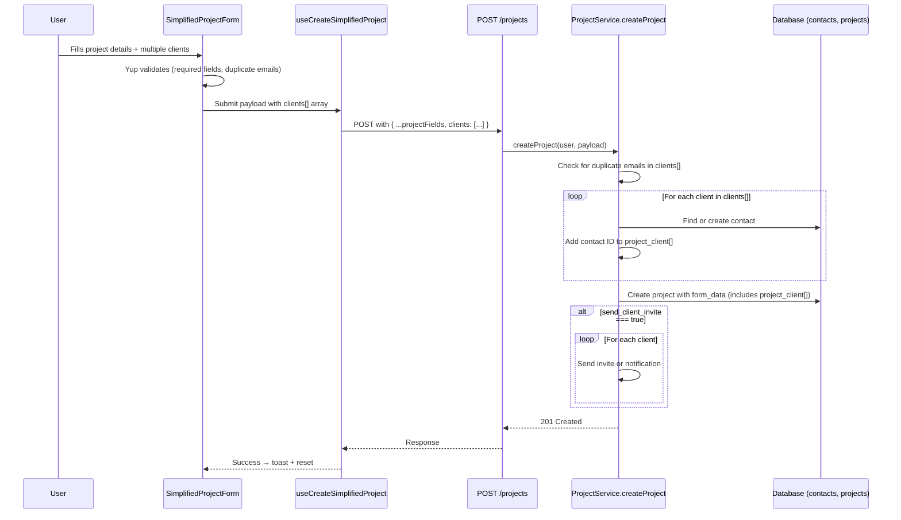

# Design Document: Multi-Client Project

## Overview

This feature transforms the project creation form from a single-client model to a dynamic multi-client model. Currently, the `simplified-project-form.tsx` has flat `client_email`, `client_phone`, and `client_name` fields, and the backend `createProject` method in `projects.service.ts` processes a single `client_email` to create or link one contact. The change introduces a `useFieldArray`-based dynamic client list on the frontend and a loop-based multi-contact processing flow on the backend, while maintaining backward compatibility with the existing single `client_email` field.

The scope covers:
- Frontend: Replace single client fields with a dynamic `clients` array using react-hook-form's `useFieldArray`, add duplicate email validation, and send a `clients` JSON array in the payload.
- Backend: Accept the new `clients` array, iterate to create/link contacts, validate for duplicate emails within the request, and extend the invite flow to all clients.

## Architecture

The architecture remains a standard React frontend → Express/Node backend flow. No new services or infrastructure are introduced.



## Components and Interfaces

### Frontend Changes

**File: `simplified-project-form.tsx`**

1. **Schema change**: Replace flat `client_email`, `client_phone`, `client_name` with a `clients` array schema:
   ```typescript
   clients: yup.array().of(
     yup.object({
       email: yup.string().email("Valid email required").required("Email is required"),
       phone: yup.string().required("Phone is required"),
       name: yup.string().optional(),
     })
   ).min(1).required()
   ```
   Add a `.test()` on the `clients` array for case-insensitive duplicate email detection.

2. **useFieldArray**: Use `useFieldArray({ control, name: "clients" })` to manage dynamic client rows. Default to one entry: `[{ email: "", phone: "", name: "" }]`.

3. **UI**: Render each client entry with email, phone, name fields. Show a remove button on all entries except the first. Show an "Add another client" button below the list.

4. **Payload mapping**: In `onSubmit`, map `data.clients` to the `clients` JSON array in the payload. Also set `client_email` to the first client's email for backward compatibility.

**File: `use-create-simplified-project.tsx`**

Update `CreateSimplifiedProjectSchema` to include `clients` array type alongside the existing fields.

### Backend Changes

**File: `projects.service.ts` → `createProject` method**

1. **Duplicate email check**: Before processing, extract emails from `payload.clients`, lowercase them, and check for duplicates. Return 400 if found.

2. **Multi-client loop**: If `payload.clients` exists and is an array, iterate over each entry to find-or-create a contact (same logic as current single-client flow but in a loop). Fall back to existing `client_email` logic if `clients` is absent.

3. **Invite loop**: The existing invite logic already iterates over `nonExistentClients` and `existentClients` arrays, so it naturally handles multiple clients once the contact creation loop populates those arrays.

**File: `projects.type.ts`**

Add `clients` field to `CreateProjectType`:
```typescript
clients?: Array<{ email: string; phone: string; name?: string }>;
```

### No New Files Required

All changes are modifications to existing files. No new components, services, or routes are needed.

## Data Models

### Existing Models (No Schema Changes)

**`projects` table**: The `form_data` JSONB column already stores `project_client` as an array of contact IDs. Multiple contact IDs are already supported.

**`contacts` table**: Each client becomes an independent row. No structural changes needed.

### Payload Shape

**Frontend → Backend (new format)**:
```json
{
  "project_name": "My Project",
  "journey": "uuid-of-project-type",
  "start_date": "2025-01-15",
  "client_organization": "N/A",
  "clients": [
    { "email": "alice@example.com", "phone": "+1234567890", "name": "Alice" },
    { "email": "bob@example.com", "phone": "+0987654321", "name": "" }
  ],
  "client_email": "alice@example.com",
  "send_client_invite": true
}
```

The `client_email` field is kept for backward compatibility with existing integrations. The backend prioritizes `clients[]` when present.

**Stored `form_data` in project row**:
```json
{
  "project_client": ["contact-uuid-1", "contact-uuid-2"],
  "client_email": "alice@example.com",
  "clients": [...]
}
```


## Correctness Properties

*A property is a characteristic or behavior that should hold true across all valid executions of a system — essentially, a formal statement about what the system should do. Properties serve as the bridge between human-readable specifications and machine-verifiable correctness guarantees.*

### Property 1: Add/remove operations change client list size

*For any* client list of size N, appending a client entry should produce a list of size N+1, and removing a client entry from a list of size N (where N > 1) should produce a list of size N-1.

**Validates: Requirements 1.2, 1.4**

### Property 2: Client list minimum size invariant

*For any* sequence of add and remove operations applied to the client list, the resulting list size shall always be >= 1.

**Validates: Requirements 1.5**

### Property 3: Remove button visibility

*For any* client list of size N, the first entry (index 0) shall not have a remove button, and all entries at index > 0 shall have a remove button.

**Validates: Requirements 1.3**

### Property 4: Client entry validation rules

*For any* array of client entries, the validation schema passes if and only if every entry has a valid email address and a non-empty phone number. The name field may be empty or absent without causing validation failure.

**Validates: Requirements 2.1, 2.2, 2.3**

### Property 5: Validation errors target specific fields

*For any* array of client entries where entry at index `i` has an invalid field, the validation error path shall include `clients[i].fieldName` identifying the exact entry and field.

**Validates: Requirements 2.4**

### Property 6: Case-insensitive duplicate email detection

*For any* array of client entries where two or more entries share the same email address (compared case-insensitively), the validation schema shall reject the array with a duplicate email error.

**Validates: Requirements 3.1, 3.2, 3.3**

### Property 7: Backend processes N clients into N contact IDs

*For any* project creation payload containing N client entries (each with a unique email), the resulting project's `project_client` array in `form_data` shall contain exactly N contact IDs.

**Validates: Requirements 4.1, 4.4, 7.2**

### Property 8: Backend find-or-create contact idempotence

*For any* client email, if a contact with that email already exists in the company, the backend shall reuse the existing contact ID. If no contact exists, the backend shall create a new contact with the provided email, phone, and name. In both cases, the contact ID appears in `project_client`.

**Validates: Requirements 4.2, 4.3**

### Property 9: Backend duplicate email rejection

*For any* project creation payload containing two or more client entries with the same email address (case-insensitive), the backend shall return HTTP 400 with an error message that includes the duplicated email address.

**Validates: Requirements 5.1, 5.2**

### Property 10: Invite action depends on user account existence

*For any* client in the clients array when `send_client_invite` is true: if the client has no existing user account, the system shall send a platform invitation; if the client has an existing user account, the system shall add them as a project member and send a notification email.

**Validates: Requirements 6.1, 6.2**

### Property 11: No invites when checkbox unchecked

*For any* set of clients, when `send_client_invite` is false, the system shall create and link contacts without sending any invitations or notification emails to non-member clients.

**Validates: Requirements 6.3**

### Property 12: Frontend payload structure

*For any* set of client entries in the form, the submitted payload shall contain a `clients` array where each element has `email`, `phone`, and `name` fields matching the form values.

**Validates: Requirements 7.1**

## Error Handling

| Scenario | Layer | Behavior |
|---|---|---|
| Invalid email in any client entry | Frontend (Yup) | Validation error on `clients[i].email` field, form submission blocked |
| Missing phone in any client entry | Frontend (Yup) | Validation error on `clients[i].phone` field, form submission blocked |
| Duplicate emails in client list | Frontend (Yup `.test()`) | Validation error "Duplicate email" on the second occurrence |
| Duplicate emails in payload | Backend | HTTP 400 with message identifying the duplicate email |
| Contact creation fails (DB error) | Backend | HTTP 500, project creation aborted (within transaction) |
| Single invite fails | Backend | Logged via `console.error`, remaining invites continue (existing try/catch per client) |
| `clients` array missing, `client_email` present | Backend | Falls back to existing single-client logic (backward compatibility) |
| Both `clients` and `client_email` absent | Backend | Project created with no client contacts (existing behavior) |

## Testing Strategy

### Unit Tests

- Form renders with one default client entry on load
- "Add another client" button appends a new entry
- Remove button removes the correct entry
- Form validation rejects empty email, empty phone
- Form validation accepts empty name
- Duplicate email detection (case-insensitive)
- Payload transformation maps form data to `clients[]` array correctly
- Backend backward compatibility: single `client_email` still works when `clients` is absent
- Backend invite failure for one client doesn't block others (mock one failure)

### Property-Based Tests

Use `fast-check` for frontend property tests and a property-based testing library (e.g., `fast-check` via a test helper) for backend tests.

Each property test must:
- Run a minimum of 100 iterations
- Reference its design property via a comment tag

**Frontend Properties (Vitest + fast-check)**:

- **Feature: multi-client-project, Property 1: Add/remove operations change client list size** — Generate random list sizes, apply add/remove, verify size change.
- **Feature: multi-client-project, Property 4: Client entry validation rules** — Generate random client arrays with valid/invalid emails and phones, verify schema passes/fails correctly.
- **Feature: multi-client-project, Property 6: Case-insensitive duplicate email detection** — Generate random email pairs differing only in case, verify schema rejects.
- **Feature: multi-client-project, Property 12: Frontend payload structure** — Generate random form data, verify payload transformation produces correct `clients[]` structure.

**Backend Properties (Jest/Vitest + fast-check)**:

- **Feature: multi-client-project, Property 7: Backend processes N clients into N contact IDs** — Generate random N (1-10) unique client entries, mock DB, verify project_client has N IDs.
- **Feature: multi-client-project, Property 8: Backend find-or-create contact idempotence** — Generate random client emails, pre-populate some as existing contacts, verify reuse vs creation.
- **Feature: multi-client-project, Property 9: Backend duplicate email rejection** — Generate random payloads with intentional duplicates, verify 400 response with email in message.
- **Feature: multi-client-project, Property 10: Invite action depends on user account existence** — Generate random client sets with mixed account status, verify correct invite/notify behavior.
- **Feature: multi-client-project, Property 11: No invites when checkbox unchecked** — Generate random client sets with invite=false, verify zero invite calls.
