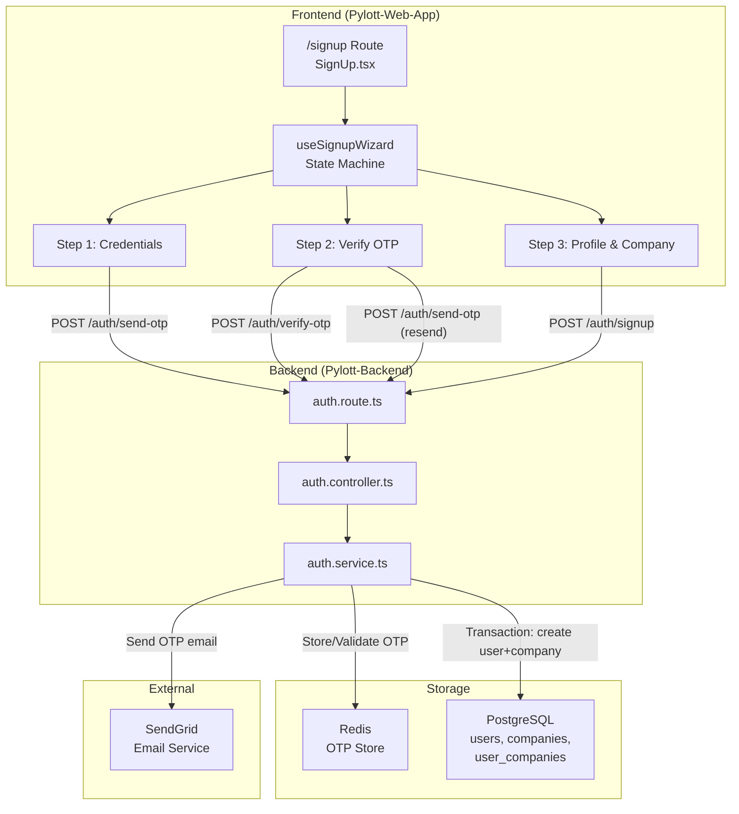
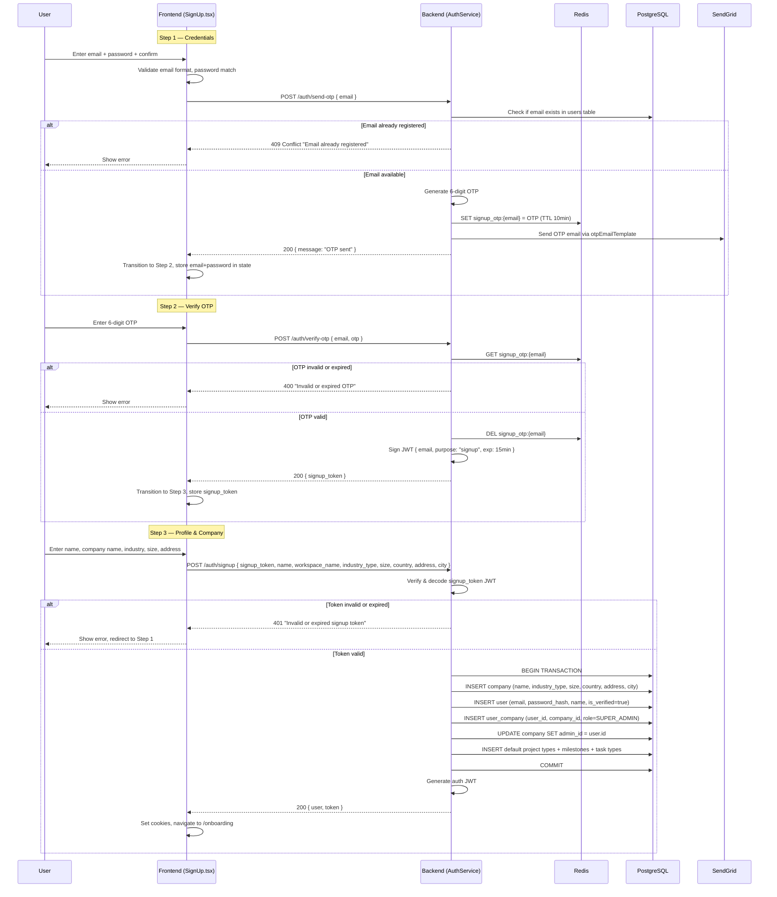
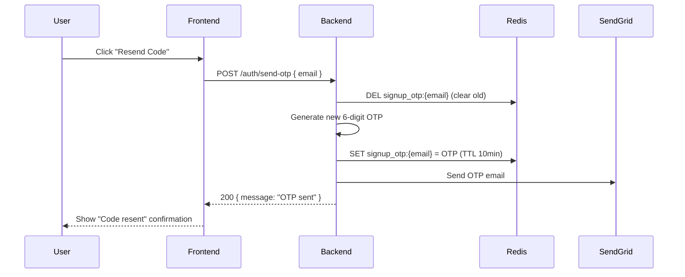

# Design Document: Multi-Step Signup

## Overview

Refactor the workspace signup flow from a single-page form into a 3-step wizard on the existing `/signup` route with internal React state management (no new routes). The flow is: Step 1 (Credentials + send OTP) → Step 2 (Verify OTP) → Step 3 (Profile & Company details). The backend only creates the user + company in a single atomic transaction at the final step, eliminating the "half-created user" problem.

OTP storage moves from the `users` table to Redis (since the user doesn't exist yet during verification). A short-lived `signup_token` JWT bridges Step 2 → Step 3, proving email ownership. The existing `POST /auth/signup` endpoint is modified to accept the `signup_token` plus company details, while two new endpoints (`POST /auth/send-otp` and `POST /auth/verify-otp`) handle the pre-signup OTP flow.

## Architecture



## Sequence Diagrams

### Main Signup Flow



### Resend OTP Flow



## Components and Interfaces

### Component 1: SignupWizard (Frontend State Machine)

**Purpose**: Manages the 3-step signup flow on a single `/signup` route using React state.

**Interface**:
```typescript
interface SignupWizardState {
  step: 1 | 2 | 3;
  email: string;
  password: string;
  signupToken: string | null;
}

interface UseSignupWizardReturn {
  state: SignupWizardState;
  goToStep2: (email: string, password: string) => void;
  goToStep3: (signupToken: string) => void;
  reset: () => void;
}
```

**Responsibilities**:
- Hold transient credentials (email, password) in memory between steps
- Store the signup_token after OTP verification
- Provide step transition functions
- Reset state on error or navigation away

### Component 2: SendOTP Endpoint (Backend)

**Purpose**: Validates email availability and sends a 6-digit OTP to Redis + email.

**Interface**:
```typescript
// Route: POST /auth/send-otp
interface SendOtpRequest {
  email: string;
}

interface SendOtpResponse {
  message: string;
}
```

**Responsibilities**:
- Check email not already registered in users table
- Generate cryptographically random 6-digit OTP
- Store in Redis with key `signup_otp:{email}`, TTL 600s (10 min)
- Send OTP via SendGrid using existing `otpEmailTemplate`
- Rate limit: max 5 requests per email per 15 minutes

### Component 3: VerifyOTP Endpoint (Backend)

**Purpose**: Validates OTP from Redis and issues a short-lived signup_token JWT.

**Interface**:
```typescript
// Route: POST /auth/verify-otp
interface VerifyOtpRequest {
  email: string;
  otp: string;
}

interface VerifyOtpResponse {
  signup_token: string; // JWT with { email, purpose: "signup" }, 15min expiry
}
```

**Responsibilities**:
- Retrieve OTP from Redis key `signup_otp:{email}`
- Compare submitted OTP (constant-time comparison)
- Delete OTP from Redis on success (single-use)
- Sign and return a `signup_token` JWT embedding the verified email
- Return 400 on invalid/expired OTP

### Component 4: Modified WorkspaceSignup Endpoint (Backend)

**Purpose**: Creates user + company in a single transaction, requiring a valid signup_token.

**Interface**:
```typescript
// Route: POST /auth/signup (modified)
interface WorkspaceSignupRequest {
  signup_token: string;
  name: string;
  workspace_name: string;
  industry_type: string;
  size: string;
  country: string;
  address: string;
  city: string;
}

interface WorkspaceSignupResponse {
  user: {
    id: string;
    email: string;
    name: string;
    role: string;
    is_primary_admin: boolean;
    workspace_id: string;
  };
  workspace: {
    id: string;
    name: string;
    status: string;
  };
  token: string;
}
```

**Responsibilities**:
- Verify and decode `signup_token` JWT (extract email, check expiry)
- Accept password from the token flow (password stored in frontend state, sent at final step)
- Create company with full details (NOT placeholder values)
- Create user with `is_verified: true` (email proven via OTP)
- Create user_company association
- Seed default project types, milestones, task types
- Return auth JWT + user data

## Data Models

### Redis OTP Store

```typescript
// Key pattern: signup_otp:{email}
// Value: 6-digit OTP string
// TTL: 600 seconds (10 minutes)

// Rate limit key pattern: signup_otp_rate:{email}
// Value: request count
// TTL: 900 seconds (15 minutes)
```

### Signup Token JWT Payload

```typescript
interface SignupTokenPayload {
  email: string;
  purpose: "signup";
  iat: number;
  exp: number; // 15 minutes from iat
}
```

### Modified WorkspaceSignupData Interface

```typescript
interface WorkspaceSignupData {
  email: string;       // from signup_token (not request body)
  password: string;    // from request body
  name: string;        // from request body
  workspace_name: string;
  industry_type: string;
  size: string;
  country: string;
  address: string;
  city: string;
}
```

### Frontend Validation Schemas

```typescript
// Step 1: Credentials
const credentialsSchema = yup.object().shape({
  email: yup.string().email("Invalid email").required("Email is required").trim(),
  password: yup.string()
    .required("Password is required")
    .min(8, "Password must be at least 8 characters")
    .matches(/[A-Z]/, "Must contain uppercase letter")
    .matches(/\d/, "Must contain a number")
    .matches(/[!@#$%^&*]/, "Must contain special character")
    .trim(),
  confirmPassword: yup.string()
    .required("Confirm password is required")
    .oneOf([yup.ref("password")], "Passwords must match")
    .trim(),
});

// Step 2: OTP
const otpSchema = yup.object().shape({
  otp: yup.string()
    .required("OTP is required")
    .matches(/^\d{6}$/, "OTP must be 6 digits")
    .trim(),
});

// Step 3: Profile & Company
const profileCompanySchema = yup.object().shape({
  name: yup.string().required("Full name is required").trim(),
  workspace_name: yup.string().required("Company name is required").trim(),
  industry_type: yup.string().required("Industry type is required").trim(),
  size: yup.string().required("Company size is required")
    .oneOf(["startup", "small", "medium", "large", "enterprise"]).trim(),
  country: yup.object().typeError("Country is required"),
  address: yup.string().required("Company address is required").trim(),
  city: yup.string().required("City is required").trim(),
});
```

**Validation Rules**:
- Email: valid format, required
- Password: min 8 chars, uppercase, number, special char (matches existing `signupSchema` rules)
- OTP: exactly 6 digits
- Company fields: all required (matches DB NOT NULL constraints)

## Key Functions with Formal Specifications

### Function 1: sendSignupOtp()

```typescript
async sendSignupOtp(email: string): Promise<{ message: string }>
```

**Preconditions:**
- `email` is a valid email format string
- `email` is not empty

**Postconditions:**
- If email exists in users table → throws HttpError(409, "Email already registered")
- If rate limit exceeded → throws HttpError(429, "Too many requests")
- Otherwise: OTP stored in Redis at key `signup_otp:{email}` with 600s TTL
- OTP email sent via SendGrid
- Returns `{ message: "OTP sent successfully" }`
- No user record created in database

**Loop Invariants:** N/A

### Function 2: verifySignupOtp()

```typescript
async verifySignupOtp(email: string, otp: string): Promise<{ signup_token: string }>
```

**Preconditions:**
- `email` is a valid email format string
- `otp` is a 6-digit numeric string
- Redis key `signup_otp:{email}` exists (OTP was previously sent)

**Postconditions:**
- If OTP doesn't match or key expired → throws HttpError(400, "Invalid or expired OTP")
- If OTP matches: Redis key `signup_otp:{email}` is deleted
- Returns `{ signup_token }` where signup_token is a JWT with `{ email, purpose: "signup" }` and 15min expiry
- No user record created in database

**Loop Invariants:** N/A

### Function 3: workspaceSignup() (modified)

```typescript
async workspaceSignup(data: WorkspaceSignupRequest): Promise<{ user: UserResponse; token: string }>
```

**Preconditions:**
- `data.signup_token` is a valid, non-expired JWT with `purpose: "signup"`
- `data.password` meets strength requirements (8+ chars, uppercase, number, special char)
- `data.name` contains only letters, spaces, hyphens, apostrophes
- `data.workspace_name`, `data.industry_type`, `data.size`, `data.country`, `data.address`, `data.city` are non-empty strings
- Email extracted from signup_token is not already registered

**Postconditions:**
- If signup_token invalid/expired → throws HttpError(401)
- If email already registered → throws HttpError(409)
- Otherwise: exactly one company, one user, one user_company record created in a single transaction
- User has `is_verified: true` and `role: SUPER_ADMIN`
- Company has real details (not placeholder values)
- Default project types, milestones, and task types seeded
- Returns auth JWT + user data
- On any failure: transaction rolled back, no partial records

**Loop Invariants:**
- During default journey seeding loop: all previously created project types have their milestones fully seeded

## Algorithmic Pseudocode

### Send OTP Algorithm

```typescript
async sendSignupOtp(email: string) {
  // 1. Normalize email
  const normalizedEmail = email.toLowerCase().trim();

  // 2. Rate limit check
  const rateKey = `signup_otp_rate:${normalizedEmail}`;
  const attempts = await this.redis.incr(rateKey);
  if (attempts === 1) await this.redis.expire(rateKey, 900); // 15min window
  if (attempts > 5) throw new HttpError("Too many OTP requests. Try again later.", 429);

  // 3. Check email not already registered
  const existingUser = await this.userRepository.findOne({ email: normalizedEmail });
  if (existingUser) throw new HttpError("Email is already registered", 409);

  // 4. Generate 6-digit OTP
  const otp = Math.floor(100000 + Math.random() * 900000).toString();

  // 5. Store in Redis with 10min TTL
  const otpKey = `signup_otp:${normalizedEmail}`;
  await this.redis.set(otpKey, otp, { EX: 600 });

  // 6. Send email
  await this.sendVerificationEmail(normalizedEmail, otp, "New User");

  return { message: "OTP sent successfully" };
}
```

### Verify OTP Algorithm

```typescript
async verifySignupOtp(email: string, otp: string) {
  const normalizedEmail = email.toLowerCase().trim();
  const otpKey = `signup_otp:${normalizedEmail}`;

  // 1. Retrieve stored OTP
  const storedOtp = await this.redis.get(otpKey);
  if (!storedOtp) throw new HttpError("OTP expired or not found", 400);

  // 2. Constant-time comparison
  const isValid = crypto.timingSafeEqual(
    Buffer.from(otp.padEnd(6)),
    Buffer.from(storedOtp.padEnd(6))
  );
  if (!isValid) throw new HttpError("Invalid OTP", 400);

  // 3. Delete OTP (single-use)
  await this.redis.del(otpKey);

  // 4. Issue signup_token
  const signupToken = jwt.sign(
    { email: normalizedEmail, purpose: "signup" },
    JWT_SECRET_KEY,
    { expiresIn: "15m" }
  );

  return { signup_token: signupToken };
}
```

### Modified Workspace Signup Algorithm

```typescript
async workspaceSignup(data: WorkspaceSignupRequest) {
  // 1. Verify signup_token
  let decoded: SignupTokenPayload;
  try {
    decoded = jwt.verify(data.signup_token, JWT_SECRET_KEY) as SignupTokenPayload;
  } catch {
    throw new HttpError("Invalid or expired signup token", 401);
  }
  if (decoded.purpose !== "signup") throw new HttpError("Invalid token purpose", 401);

  const email = decoded.email;

  // 2. Double-check email not taken (race condition guard)
  const existing = await this.userRepository.findOne({ email });
  if (existing) throw new HttpError("Email is already registered", 409);

  // 3. Validate & hash password
  this.validateName(data.name);
  await this.validatePasswordStrength(data.password);
  const hashedPassword = await this.hashPassword(data.password);

  // 4. Single transaction: create everything
  const result = await Objection.Model.transaction(async (trx) => {
    const company = await this.companyRepository.create({
      name: data.workspace_name.trim(),
      industry_type: data.industry_type,
      size: data.size,
      country: data.country,
      address: data.address,
      city: data.city,
      is_active: true,
    }, trx);

    const newUser = await this.userRepository.create({
      email,
      name: data.name.trim(),
      password: hashedPassword,
      role: UserRoles.SUPER_ADMIN,
      company_id: company.id,
      is_verified: true,  // Email proven via OTP
      is_active: true,
    }, trx);

    await this.userCompanyRepository.create({
      user_id: newUser.id,
      company_id: company.id,
      role: UserRoles.SUPER_ADMIN,
      is_active: true,
      joined_at: new Date(),
    }, trx);

    await this.companyRepository.update({ id: company.id }, { admin_id: newUser.id }, trx);

    // Seed default journeys + task types (same as current)
    await this.seedDefaultJourneys(company.id, trx);
    await this.seedDefaultTaskTypes(company.id, trx);

    return { user: newUser, company };
  });

  const { password: _, ...userResponse } = result.user;
  const token = generateToken(userResponse.email, userResponse.id);
  return { user: userResponse, token };
}
```

## Example Usage

### Frontend: SignUp.tsx with Wizard

```typescript
// Hook usage in SignUp.tsx
const SignUp: React.FC = () => {
  const [step, setStep] = useState<1 | 2 | 3>(1);
  const [wizardData, setWizardData] = useState({
    email: "",
    password: "",
    signupToken: null as string | null,
  });

  const handleStep1Submit = async (email: string, password: string) => {
    await sendOtpMutation.mutateAsync({ email });
    setWizardData(prev => ({ ...prev, email, password }));
    setStep(2);
  };

  const handleStep2Submit = async (otp: string) => {
    const { signup_token } = await verifyOtpMutation.mutateAsync({
      email: wizardData.email, otp
    });
    setWizardData(prev => ({ ...prev, signupToken: signup_token }));
    setStep(3);
  };

  const handleStep3Submit = async (profileData: ProfileCompanyData) => {
    const response = await workspaceSignupMutation.mutateAsync({
      signup_token: wizardData.signupToken!,
      password: wizardData.password,
      ...profileData,
    });
    setCookie("user_session_token", response.data.data.token);
    setCookie("user_session", JSON.stringify(response.data.data.user));
    navigate(PAGES.ONBOARDING_PAGE);
  };

  return (
    <div>
      {step === 1 && <CredentialsStep onSubmit={handleStep1Submit} />}
      {step === 2 && <VerifyOtpStep email={wizardData.email} onSubmit={handleStep2Submit} />}
      {step === 3 && <ProfileCompanyStep onSubmit={handleStep3Submit} />}
    </div>
  );
};
```

### Backend: New API Hooks

```typescript
// use-send-signup-otp.tsx
const useSendSignupOtp = () => {
  return useCustomMutation<{ message: string }, { email: string }>({
    method: "post",
    endpoint: ENDPOINTS.SEND_SIGNUP_OTP,
  });
};

// use-verify-signup-otp.tsx
const useVerifySignupOtp = () => {
  return useCustomMutation<{ signup_token: string }, { email: string; otp: string }>({
    method: "post",
    endpoint: ENDPOINTS.VERIFY_SIGNUP_OTP,
  });
};
```

## Correctness Properties

*A property is a characteristic or behavior that should hold true across all valid executions of a system — essentially, a formal statement about what the system should do. Properties serve as the bridge between human-readable specifications and machine-verifiable correctness guarantees.*

### Property 1: Email normalization is idempotent

*For any* email string, normalizing it (lowercase + trim) and then normalizing again should produce the same result as normalizing once. Additionally, the normalized email should contain no leading/trailing whitespace and no uppercase characters.

**Validates: Requirement 1.2**

### Property 2: Duplicate email rejection across endpoints

*For any* email that already exists in the users table, both the SendOTP_Endpoint and the Signup_Endpoint should reject the request with a 409 status, regardless of the other request fields.

**Validates: Requirements 1.3, 5.2**

### Property 3: OTP generation and storage

*For any* available email, after calling sendSignupOtp, the Redis_OTP_Store should contain a value at key `signup_otp:{email}` that is exactly 6 numeric digits.

**Validates: Requirement 1.4**

### Property 4: Rate limiting enforcement

*For any* email address, after 5 OTP send requests within a 15-minute window, all subsequent requests should return a 429 status. The rate limit check should occur before any email availability check or OTP generation.

**Validates: Requirements 2.1, 2.2, 2.3**

### Property 5: Invalid OTP rejection

*For any* email with a stored OTP and *for any* submitted OTP string that differs from the stored value, verifySignupOtp should return a 400 status. For any email with no stored OTP (expired or never sent), verifySignupOtp should also return 400.

**Validates: Requirements 3.3, 3.5**

### Property 6: OTP single-use enforcement

*For any* valid OTP verification, the Redis key is deleted immediately after success. A second call to verifySignupOtp with the same email and OTP should return 400.

**Validates: Requirement 3.6**

### Property 7: Signup token contains verified email

*For any* successful OTP verification, the returned Signup_Token JWT should decode to contain the exact email that was verified and a `purpose` claim of `"signup"`, with an expiry no more than 15 minutes from issuance.

**Validates: Requirements 3.7, 4.4**

### Property 8: Invalid token rejection

*For any* expired JWT, tampered JWT, or JWT with a `purpose` claim other than `"signup"`, the Signup_Endpoint should return a 401 status without creating any database records.

**Validates: Requirements 4.2, 4.3**

### Property 9: Atomic transaction — all or nothing

*For any* signup attempt, either ALL database records (user, company, user_company, default project types, default task types) are created, or NONE are. If any insert within the transaction fails, no partial records should remain in the database.

**Validates: Requirements 6.1, 6.2**

### Property 10: Signup creates correctly linked records

*For any* successful signup with valid profile and company data, the created user should have `is_verified=true` and `role=SUPER_ADMIN`, the workspace should contain the exact company details provided, a user_company association should link the user to the workspace, and the workspace `admin_id` should reference the new user.

**Validates: Requirements 5.4, 5.5, 5.6, 5.7**

### Property 11: Default data seeding on signup

*For any* successful signup, the new workspace should have default project types (journeys) with associated milestones and default task types seeded in the database.

**Validates: Requirements 7.1, 7.2**

### Property 12: Password is never stored in plaintext

*For any* successful signup, the password stored in the database should be a valid bcrypt hash that is not equal to the original plaintext password. The signup response should not contain the password hash in any field.

**Validates: Requirements 5.3, 11.3, 11.4, 13.4**

### Property 13: Validation schemas accept valid and reject invalid input

*For any* input to the Credentials_Schema, only emails with valid format, passwords meeting strength requirements (8+ chars, uppercase, number, special char), and matching confirm passwords should be accepted. *For any* input to the OTP_Schema, only exactly 6-digit numeric strings should be accepted. *For any* input to the Profile_Company_Schema, only non-empty values with size constrained to allowed values should be accepted.

**Validates: Requirements 9.1, 9.2, 9.3**

### Property 14: Signup response contains all required fields

*For any* successful signup, the response should contain a `user` object with `id`, `email`, `name`, `role`, `is_primary_admin`, and `workspace_id` fields, a `workspace` object with `id`, `name`, and `status` fields, and a `token` field that is a valid decodable JWT string.

**Validates: Requirements 13.1, 13.2, 13.3**

### Property 15: OTP send-then-verify round trip

*For any* available email, calling sendSignupOtp followed by verifySignupOtp with the correct OTP should always produce a valid Signup_Token. This round-trip property validates the complete OTP flow end-to-end.

**Validates: Requirements 1.4, 3.6, 3.7**

## Error Handling

### Error Scenario 1: Email Already Registered

**Condition**: User enters an email that exists in the users table during Step 1
**Response**: Backend returns 409 Conflict; frontend shows inline error on email field
**Recovery**: User can change email and retry

### Error Scenario 2: OTP Expired

**Condition**: User takes >10 minutes to enter OTP in Step 2
**Response**: Backend returns 400; frontend shows "Code expired" message
**Recovery**: User clicks "Resend Code" to get a new OTP

### Error Scenario 3: Invalid OTP

**Condition**: User enters wrong OTP digits
**Response**: Backend returns 400; frontend shows "Invalid code" error
**Recovery**: User can retry entering OTP or resend

### Error Scenario 4: Signup Token Expired

**Condition**: User takes >15 minutes between Step 2 and Step 3 submission
**Response**: Backend returns 401; frontend shows expiry message
**Recovery**: Frontend resets wizard to Step 1; user must restart the flow

### Error Scenario 5: Race Condition — Email Taken Between Steps

**Condition**: Another user registers the same email between Step 2 and Step 3
**Response**: Backend returns 409 inside the transaction; transaction rolls back
**Recovery**: Frontend shows error; user must use a different email

### Error Scenario 6: Rate Limit Exceeded

**Condition**: More than 5 OTP requests for the same email in 15 minutes
**Response**: Backend returns 429 Too Many Requests
**Recovery**: User must wait for the rate limit window to expire

## Testing Strategy

### Unit Testing Approach

- Test `sendSignupOtp`: mock Redis + UserRepository, verify OTP stored with correct TTL, email sent, rate limit enforced
- Test `verifySignupOtp`: mock Redis, verify correct OTP returns token, wrong OTP returns 400, expired OTP returns 400, OTP deleted after use
- Test `workspaceSignup` (modified): mock JWT verify, verify transaction creates all records, verify rollback on failure
- Test frontend validation schemas: verify each step's schema accepts valid input and rejects invalid input
- Test wizard state transitions: verify step progression and data persistence

### Property-Based Testing Approach

**Property Test Library**: fast-check

- Property: For any valid email, `sendSignupOtp` followed by `verifySignupOtp` with the correct OTP always produces a valid signup_token
- Property: For any OTP string ≠ stored OTP, `verifySignupOtp` always returns 400
- Property: For any valid signup_token + valid profile data, `workspaceSignup` always creates exactly 1 user + 1 company + 1 user_company record
- Property: For any expired signup_token, `workspaceSignup` always returns 401

### Integration Testing Approach

- End-to-end flow: Step 1 → Step 2 → Step 3 with real Redis and test DB
- Verify no orphaned records after failed Step 3 transactions
- Verify rate limiting works across multiple requests
- Verify existing login flow still works after signup modifications

## Security Considerations

- **OTP brute-force protection**: 6-digit OTP (1M combinations) + rate limiting + 10min expiry makes brute force impractical
- **Constant-time OTP comparison**: Uses `crypto.timingSafeEqual` to prevent timing attacks
- **signup_token is short-lived**: 15-minute expiry limits the window for token theft/replay
- **Password in memory only**: Frontend holds password in React state (not localStorage/sessionStorage), cleared on unmount
- **HTTPS required**: All OTP and password transmission must be over TLS
- **No OTP in URL**: OTP is submitted via POST body, never in query params or URLs
- **Redis key isolation**: OTP keys use `signup_otp:` prefix to avoid collision with other Redis data

## Performance Considerations

- Redis OTP operations are O(1) — no performance concern
- Rate limit check adds one Redis INCR per request — negligible overhead
- The final signup transaction is heavier (multiple inserts) but identical to the current `workspaceSignup` — no regression
- SendGrid email sending is async from the user's perspective (fire-and-forget with error logging)

## Dependencies

- **Redis**: Already available in the backend (used for `RedisPrefixKeyEnum`). New key patterns: `signup_otp:{email}`, `signup_otp_rate:{email}`
- **jsonwebtoken**: Already used for auth tokens. Reused for `signup_token` signing/verification
- **SendGrid**: Already configured via `SENDGRID_API_KEY`. Uses existing `otpEmailTemplate`
- **crypto**: Node.js built-in. Used for `timingSafeEqual` OTP comparison
- **yup**: Already used in frontend for validation schemas. New schemas for each step
- **react-hook-form**: Already used in SignUp.tsx. Reused for each step's form

### DB Migration Required

- Alter `users.otp` column from `varchar(4)` to `varchar(6)` (for backward compatibility with existing admin/company-admin signup flows that still use DB-stored OTP)
- No new tables needed — OTP for signup flow uses Redis exclusively
