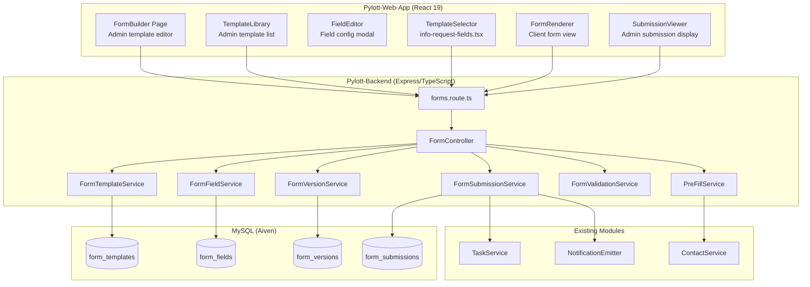
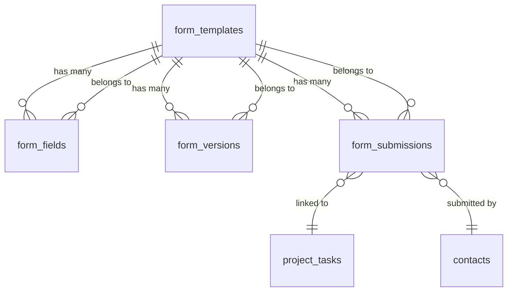

# Design Document: Native Form Engine

## Overview

The Native Form Engine introduces a self-contained `forms` module to the Pylott platform that enables admins to build reusable form templates, attach them to Information Request tasks, and collect structured submissions from clients. The engine replaces the current "Form builder coming soon" placeholder in `info-request-fields.tsx` with a full template selector, and extends `client-task-view.tsx` to render dynamic forms with conditional logic, validation, and pre-fill capabilities.

The system is designed around four core database tables (`form_templates`, `form_versions`, `form_fields`, `form_submissions`) and follows the existing Pylott patterns: Objection.js models extending `BaseModel`, `@injectable()` services resolved via tsyringe, Express route files registered in `entrypoint.ts`, and React hooks using `useCustomMutation`/TanStack Query on the frontend.

Key design decisions:
- **New module isolation**: The forms module lives at `Pylott-Backend/src/modules/forms/` with its own routes, controller, and services — completely separate from the existing `project_form_fields` system used for project creation forms.
- **Immutable versioning**: Published template edits create new `form_versions` with a JSON `fields_snapshot`, so historical submissions always render against the exact form version they were filled against.
- **Dual validation**: Client-side validation via react-hook-form resolvers provides instant feedback; server-side validation in `FormValidationService` is the authoritative gate before persistence.
- **Conditional logic engine**: A lightweight evaluator runs on both client (real-time show/hide) and server (field exclusion from submission) using the same rule definitions.

## Architecture



### Backend Module Structure

```
Pylott-Backend/src/modules/forms/
├── forms.route.ts              # Route definitions, registered in entrypoint.ts
├── forms.controller.ts         # Request handling, delegates to services
├── forms.dto.ts                # DTOs and validation schemas
├── services/
│   ├── form-template.service.ts
│   ├── form-field.service.ts
│   ├── form-version.service.ts
│   ├── form-submission.service.ts
│   ├── form-validation.service.ts
│   └── pre-fill.service.ts
└── models/
    ├── form-template.model.ts
    ├── form-version.model.ts
    ├── form-field.model.ts
    └── form-submission.model.ts
```

### Frontend Structure

```
Pylott-Web-App/src/
├── hooks/forms/
│   ├── use-form-templates.ts       # List/search templates
│   ├── use-form-template.ts        # Single template CRUD
│   ├── use-form-fields.ts          # Field CRUD within template
│   ├── use-form-versions.ts        # Version listing
│   ├── use-form-submission.ts      # Submit/save draft
│   └── use-form-prefill.ts         # Pre-fill data fetch
├── pages/Home/Admin/forms/
│   ├── template-library.tsx        # Template list page
│   ├── form-builder.tsx            # Template editor page
│   └── submission-viewer.tsx       # Submission detail view
├── components/forms/
│   ├── field-editor.tsx            # Field configuration modal
│   ├── field-renderer.tsx          # Single field render component
│   ├── form-renderer.tsx           # Full form render for clients
│   ├── template-selector.tsx       # Dropdown for info-request-fields
│   └── conditional-evaluator.ts    # Client-side conditional logic
```

## Components and Interfaces

### Backend Services

#### FormTemplateService
```typescript
@injectable()
class FormTemplateService {
  constructor(
    @inject(FormTemplateRepository) private templateRepo: FormTemplateRepository,
    @inject(FormVersionService) private versionService: FormVersionService,
  ) {}

  async create(company_id: string, created_by: string, data: CreateTemplateDto): Promise<ServiceType>
  async getAll(company_id: string, search?: string): Promise<ServiceType>
  async getById(company_id: string, template_id: string): Promise<ServiceType>
  async update(company_id: string, template_id: string, data: UpdateTemplateDto): Promise<ServiceType>
  async delete(company_id: string, template_id: string): Promise<ServiceType>
  async clone(company_id: string, template_id: string, created_by: string): Promise<ServiceType>
  async publish(company_id: string, template_id: string, created_by: string): Promise<ServiceType>
}
```

#### FormFieldService
```typescript
@injectable()
class FormFieldService {
  constructor(
    @inject(FormFieldRepository) private fieldRepo: FormFieldRepository,
  ) {}

  async getByTemplate(template_id: string): Promise<ServiceType>
  async create(template_id: string, data: CreateFieldDto): Promise<ServiceType>
  async update(field_id: string, template_id: string, data: UpdateFieldDto): Promise<ServiceType>
  async delete(field_id: string, template_id: string): Promise<ServiceType>
  async reorder(template_id: string, field_orders: { id: string; sort_order: number }[]): Promise<ServiceType>
}
```

#### FormVersionService
```typescript
@injectable()
class FormVersionService {
  constructor(
    @inject(FormVersionRepository) private versionRepo: FormVersionRepository,
    @inject(FormFieldRepository) private fieldRepo: FormFieldRepository,
  ) {}

  async createVersion(template_id: string, created_by: string): Promise<ServiceType>
  async getVersions(template_id: string): Promise<ServiceType>
  async getVersion(template_id: string, version_number: number): Promise<ServiceType>
  async getLatestVersion(template_id: string): Promise<ServiceType>
}
```

#### FormSubmissionService
```typescript
@injectable()
class FormSubmissionService {
  constructor(
    @inject(FormSubmissionRepository) private submissionRepo: FormSubmissionRepository,
    @inject(FormVersionService) private versionService: FormVersionService,
    @inject(FormValidationService) private validationService: FormValidationService,
    @inject(ProjectTaskRepository) private taskRepo: ProjectTaskRepository,
  ) {}

  async create(data: CreateSubmissionDto): Promise<ServiceType>
  async update(submission_id: string, data: UpdateSubmissionDto): Promise<ServiceType>
  async getByTask(task_id: string, company_id: string): Promise<ServiceType>
  async getByTemplate(template_id: string, company_id: string): Promise<ServiceType>
  async finalize(submission_id: string, company_id: string): Promise<ServiceType>
}
```

#### FormValidationService
```typescript
@injectable()
class FormValidationService {
  validateSubmission(
    fields_snapshot: FormFieldSnapshot[],
    submission_data: Record<string, any>,
    conditional_context: Record<string, any>
  ): { valid: boolean; errors: FieldError[] }

  evaluateConditionalRule(
    rule: ConditionalRule,
    field_values: Record<string, any>
  ): boolean
}
```

#### PreFillService
```typescript
@injectable()
class PreFillService {
  constructor(
    @inject(ContactService) private contactService: ContactService,
    @inject(FormSubmissionRepository) private submissionRepo: FormSubmissionRepository,
  ) {}

  async getPreFillData(
    client_id: string,
    template_id: string,
    version_number: number
  ): Promise<Record<string, any>>
}
```

### API Endpoints

All endpoints are prefixed with `/api/v1/forms` and require `authGuard`.

| Method | Path | Description |
|--------|------|-------------|
| POST | `/templates` | Create a new form template |
| GET | `/templates` | List templates for company (supports `?search=`) |
| GET | `/templates/:template_id` | Get template with fields |
| PATCH | `/templates/:template_id` | Update template metadata |
| DELETE | `/templates/:template_id` | Soft-delete template |
| POST | `/templates/:template_id/clone` | Clone a template |
| POST | `/templates/:template_id/publish` | Publish template (creates version) |
| POST | `/templates/:template_id/fields` | Add a field to template |
| PATCH | `/templates/:template_id/fields/:field_id` | Update a field |
| DELETE | `/templates/:template_id/fields/:field_id` | Delete a field |
| PATCH | `/templates/:template_id/fields/reorder` | Reorder fields |
| GET | `/templates/:template_id/versions` | List versions for template |
| GET | `/templates/:template_id/versions/:version_number` | Get specific version |
| POST | `/submissions` | Create or update a submission (draft or final) |
| GET | `/submissions/task/:task_id` | Get submission for a task |
| PATCH | `/submissions/:submission_id/finalize` | Finalize a draft submission |
| GET | `/prefill/:template_id/:client_id` | Get pre-fill data for a client |

### TypeScript Interfaces

```typescript
// Field types enum
type FormFieldType = 'text' | 'textarea' | 'dropdown' | 'checkboxes' | 'radio' | 'file_upload' | 'date' | 'number';

// Template status enum
type FormTemplateStatus = 'draft' | 'published' | 'archived';

// Submission status enum
type FormSubmissionStatus = 'draft' | 'submitted';

// Conditional rule operators
type ConditionalOperator = 'equals' | 'not_equals' | 'contains' | 'is_empty' | 'is_not_empty';

interface ConditionalRule {
  source_field_id: string;
  operator: ConditionalOperator;
  value?: string | number | boolean;
}

interface ValidationRule {
  type: 'required' | 'email' | 'phone' | 'url' | 'min_length' | 'max_length' | 'min_value' | 'max_value' | 'regex';
  params?: Record<string, any>;  // e.g. { min: 5 } for min_length
  message?: string;              // custom error message
}

interface FileConfig {
  accepted_types: string[];      // e.g. [".pdf", ".docx", "image/*"]
  max_size_mb: number;
}

interface FormFieldDefinition {
  id: string;
  type: FormFieldType;
  label: string;
  placeholder?: string;
  help_text?: string;
  sort_order: number;
  validation_rules: ValidationRule[];
  conditional_rule?: ConditionalRule;
  pre_fill_source?: 'name' | 'email' | 'phone' | null;
  options?: string[];            // for dropdown, checkboxes, radio
  file_config?: FileConfig;      // for file_upload type
}

// DTOs
interface CreateTemplateDto {
  name: string;
  description?: string;
}

interface CreateFieldDto {
  type: FormFieldType;
  label: string;
  placeholder?: string;
  help_text?: string;
  sort_order: number;
  validation_rules?: ValidationRule[];
  conditional_rule?: ConditionalRule;
  pre_fill_source?: string;
  options?: string[];
  file_config?: FileConfig;
}

interface CreateSubmissionDto {
  template_id: string;
  task_id: string;
  client_id: string;
  project_id: string;
  company_id: string;
  submission_data: Record<string, any>;
  status: FormSubmissionStatus;
}

interface FieldError {
  field_id: string;
  field_label: string;
  rule_type: string;
  message: string;
}
```

### Conditional Logic Evaluation Engine

The conditional evaluator is a pure function shared between client and server:

```typescript
function evaluateCondition(
  rule: ConditionalRule,
  fieldValues: Record<string, any>
): boolean {
  const sourceValue = fieldValues[rule.source_field_id];

  switch (rule.operator) {
    case 'equals':
      return sourceValue === rule.value;
    case 'not_equals':
      return sourceValue !== rule.value;
    case 'contains':
      return typeof sourceValue === 'string' && sourceValue.includes(String(rule.value));
    case 'is_empty':
      return sourceValue === null || sourceValue === undefined || sourceValue === '';
    case 'is_not_empty':
      return sourceValue !== null && sourceValue !== undefined && sourceValue !== '';
    default:
      return true; // unknown operator = show field
  }
}
```

On the client, this runs in `conditional-evaluator.ts` and is called by `FormRenderer` on every field value change. On the server, `FormValidationService.validateSubmission()` uses it to determine which fields are visible before validating.

### Frontend Components

#### TemplateSelector (in info-request-fields.tsx)
Replaces the "Form builder coming soon" placeholder. Renders a `Select` dropdown of published templates for the admin's company. On selection, stores `form_config.form_id` in the task form state.

#### FormBuilder
Admin page at `/admin/forms/:template_id`. Displays the template's fields as an ordered list with drag-and-drop reordering. Each field row shows type icon, label, and action buttons (edit, delete, move). An "Add Field" button opens the `FieldEditor` modal.

#### FieldEditor
Modal component for configuring a single field. Renders type-specific configuration (options list for dropdown/checkboxes/radio, file config for file_upload, min/max for number). Includes sections for validation rules, conditional rule, and pre-fill source mapping.

#### FormRenderer
Client-facing component rendered in `client-task-view.tsx` when `form_config.mode === 'native'`. Uses react-hook-form for state management. Fetches the template's latest published version, applies pre-fill data, evaluates conditional rules on change, and validates on submit. Supports "Save Draft" (no validation) and "Submit" (full validation).

#### SubmissionViewer
Admin component displayed in the task detail view. Renders submitted data as read-only field labels + values, using the version's field definitions for display. Shows file uploads as download links. Displays submission metadata (client name, timestamp, version number, status).


## Data Models

### Database Schema

#### form_templates

| Column | Type | Constraints |
|--------|------|-------------|
| id | UUID | PRIMARY KEY |
| company_id | VARCHAR | NOT NULL, INDEX |
| name | VARCHAR(255) | NOT NULL |
| description | TEXT | NULLABLE |
| status | ENUM('draft','published','archived') | NOT NULL, DEFAULT 'draft' |
| created_by | UUID | NOT NULL, FK → users.id |
| created_at | TIMESTAMP | NOT NULL |
| updated_at | TIMESTAMP | NOT NULL |
| deleted_at | TIMESTAMP | NULLABLE |

#### form_versions

| Column | Type | Constraints |
|--------|------|-------------|
| id | UUID | PRIMARY KEY |
| template_id | UUID | NOT NULL, FK → form_templates.id, INDEX |
| version_number | INTEGER | NOT NULL |
| fields_snapshot | JSON | NOT NULL |
| created_by | UUID | NOT NULL, FK → users.id |
| created_at | TIMESTAMP | NOT NULL |
| | | UNIQUE(template_id, version_number) |

#### form_fields

| Column | Type | Constraints |
|--------|------|-------------|
| id | UUID | PRIMARY KEY |
| template_id | UUID | NOT NULL, FK → form_templates.id, INDEX |
| type | ENUM('text','textarea','dropdown','checkboxes','radio','file_upload','date','number') | NOT NULL |
| label | VARCHAR(255) | NOT NULL |
| placeholder | VARCHAR(255) | NULLABLE |
| help_text | TEXT | NULLABLE |
| sort_order | INTEGER | NOT NULL, DEFAULT 0 |
| validation_rules | JSON | NULLABLE |
| conditional_rule | JSON | NULLABLE |
| pre_fill_source | VARCHAR(50) | NULLABLE |
| options | JSON | NULLABLE |
| file_config | JSON | NULLABLE |
| created_at | TIMESTAMP | NOT NULL |
| updated_at | TIMESTAMP | NOT NULL |

#### form_submissions

| Column | Type | Constraints |
|--------|------|-------------|
| id | UUID | PRIMARY KEY |
| template_id | UUID | NOT NULL, FK → form_templates.id, INDEX |
| version_number | INTEGER | NOT NULL |
| task_id | UUID | NOT NULL, FK → project_tasks.id, INDEX |
| client_id | UUID | NOT NULL, FK → contacts.id, INDEX |
| project_id | UUID | NOT NULL, FK → projects.id |
| company_id | VARCHAR | NOT NULL |
| submission_data | JSON | NOT NULL |
| status | ENUM('draft','submitted') | NOT NULL, DEFAULT 'draft' |
| submitted_at | TIMESTAMP | NULLABLE |
| created_at | TIMESTAMP | NOT NULL |
| updated_at | TIMESTAMP | NOT NULL |
| | | UNIQUE(task_id, client_id) |

### Objection.js Models

Each model extends `BaseModel` (which provides `id`, `created_at`, `updated_at`, `deleted_at` and auto-generates UUIDs):

```typescript
// form-template.model.ts
export class FormTemplate extends BaseModel {
  static tableName = 'form_templates';
  company_id: string;
  name: string;
  description: string | null;
  status: 'draft' | 'published' | 'archived';
  created_by: string;

  static get relationMappings() {
    return {
      fields: {
        relation: BaseModel.HasManyRelation,
        modelClass: FormField,
        join: { from: 'form_templates.id', to: 'form_fields.template_id' },
      },
      versions: {
        relation: BaseModel.HasManyRelation,
        modelClass: FormVersion,
        join: { from: 'form_templates.id', to: 'form_versions.template_id' },
      },
    };
  }
}
```

```typescript
// form-version.model.ts
export class FormVersion extends BaseModel {
  static tableName = 'form_versions';
  template_id: string;
  version_number: number;
  fields_snapshot: FormFieldDefinition[];
  created_by: string;
}
```

```typescript
// form-field.model.ts
export class FormField extends BaseModel {
  static tableName = 'form_fields';
  template_id: string;
  type: FormFieldType;
  label: string;
  placeholder: string | null;
  help_text: string | null;
  sort_order: number;
  validation_rules: ValidationRule[] | null;
  conditional_rule: ConditionalRule | null;
  pre_fill_source: string | null;
  options: string[] | null;
  file_config: FileConfig | null;
}
```

```typescript
// form-submission.model.ts
export class FormSubmission extends BaseModel {
  static tableName = 'form_submissions';
  template_id: string;
  version_number: number;
  task_id: string;
  client_id: string;
  project_id: string;
  company_id: string;
  submission_data: Record<string, any>;
  status: 'draft' | 'submitted';
  submitted_at: string | null;
}
```

### Migration File

A single migration creates all four tables:

```typescript
// migrations/YYYYMMDD000000_create_form_engine_tables.ts
export async function up(knex: Knex): Promise<void> {
  await knex.schema.createTable('form_templates', (table) => {
    table.uuid('id').primary();
    table.string('company_id').notNullable();
    table.string('name', 255).notNullable();
    table.text('description').nullable();
    table.enum('status', ['draft', 'published', 'archived']).notNullable().defaultTo('draft');
    table.uuid('created_by').notNullable();
    table.timestamps(true, true);
    table.timestamp('deleted_at').nullable();
    table.index(['company_id'], 'idx_form_templates_company_id');
  });

  await knex.schema.createTable('form_versions', (table) => {
    table.uuid('id').primary();
    table.uuid('template_id').notNullable().references('id').inTable('form_templates');
    table.integer('version_number').notNullable();
    table.json('fields_snapshot').notNullable();
    table.uuid('created_by').notNullable();
    table.timestamp('created_at').notNullable().defaultTo(knex.fn.now());
    table.unique(['template_id', 'version_number']);
    table.index(['template_id'], 'idx_form_versions_template_id');
  });

  await knex.schema.createTable('form_fields', (table) => {
    table.uuid('id').primary();
    table.uuid('template_id').notNullable().references('id').inTable('form_templates');
    table.enum('type', ['text', 'textarea', 'dropdown', 'checkboxes', 'radio', 'file_upload', 'date', 'number']).notNullable();
    table.string('label', 255).notNullable();
    table.string('placeholder', 255).nullable();
    table.text('help_text').nullable();
    table.integer('sort_order').notNullable().defaultTo(0);
    table.json('validation_rules').nullable();
    table.json('conditional_rule').nullable();
    table.string('pre_fill_source', 50).nullable();
    table.json('options').nullable();
    table.json('file_config').nullable();
    table.timestamps(true, true);
    table.index(['template_id'], 'idx_form_fields_template_id');
  });

  await knex.schema.createTable('form_submissions', (table) => {
    table.uuid('id').primary();
    table.uuid('template_id').notNullable().references('id').inTable('form_templates');
    table.integer('version_number').notNullable();
    table.uuid('task_id').notNullable();
    table.uuid('client_id').notNullable();
    table.uuid('project_id').notNullable();
    table.string('company_id').notNullable();
    table.json('submission_data').notNullable();
    table.enum('status', ['draft', 'submitted']).notNullable().defaultTo('draft');
    table.timestamp('submitted_at').nullable();
    table.timestamps(true, true);
    table.unique(['task_id', 'client_id']);
    table.index(['task_id'], 'idx_form_submissions_task_id');
    table.index(['template_id'], 'idx_form_submissions_template_id');
    table.index(['client_id'], 'idx_form_submissions_client_id');
  });
}

export async function down(knex: Knex): Promise<void> {
  await knex.schema.dropTableIfExists('form_submissions');
  await knex.schema.dropTableIfExists('form_fields');
  await knex.schema.dropTableIfExists('form_versions');
  await knex.schema.dropTableIfExists('form_templates');
}
```

### Entity Relationships



## Correctness Properties

*A property is a characteristic or behavior that should hold true across all valid executions of a system — essentially, a formal statement about what the system should do. Properties serve as the bridge between human-readable specifications and machine-verifiable correctness guarantees.*

### Property 1: Field definition serialization round-trip

*For any* valid `FormFieldDefinition` object (including its `validation_rules`, `conditional_rule`, `options`, and `file_config`), serializing it to JSON and deserializing the JSON back should produce an object deeply equal to the original.

**Validates: Requirements 16.1, 16.2, 16.3, 16.4**

### Property 2: Version snapshot round-trip

*For any* valid `fields_snapshot` JSON array stored in a `form_versions` record, deserializing the snapshot into `FormFieldDefinition[]` and re-serializing it should produce an identical JSON string.

**Validates: Requirements 16.2**

### Property 3: Template listing returns only company-scoped results sorted by updated_at

*For any* set of form templates across multiple companies, querying the template list for a given `company_id` should return only templates where `company_id` matches and `deleted_at` is null, sorted by `updated_at` descending.

**Validates: Requirements 1.3, 15.1**

### Property 4: Template name search filters correctly

*For any* search query string and set of templates belonging to a company, the search results should be a subset of the company's templates where every result's `name` contains the search string (case-insensitive).

**Validates: Requirements 1.7**

### Property 5: Multi-tenant isolation rejects cross-company access

*For any* user attempting to read, update, or delete a `FormTemplate` or `FormSubmission` whose `company_id` differs from the user's `company_id`, the system should return a 403 Forbidden response and not modify any data.

**Validates: Requirements 15.1, 15.2, 15.3, 15.4**

### Property 6: Field creation validates required attributes per type

*For any* field creation payload, if the payload is missing `label` or `type`, it should be rejected. Additionally, for `dropdown`, `checkboxes`, or `radio` types, if `options` is empty or missing, it should be rejected.

**Validates: Requirements 2.2, 2.3**

### Property 7: Fields are returned in ascending sort_order

*For any* template with multiple fields, retrieving the fields should return them in strictly ascending `sort_order` with no duplicate sort_order values.

**Validates: Requirements 3.1**

### Property 8: Reorder preserves field set and produces valid ordering

*For any* template with N fields and any valid reorder operation, after reordering: the set of field IDs should be unchanged, all sort_order values should be unique, and the fields should be retrievable in the new intended sequence.

**Validates: Requirements 3.2**

### Property 9: Conditional rule source field ordering constraint

*For any* field with a `conditional_rule`, the source field's `sort_order` must be strictly less than the target field's `sort_order` within the same template.

**Validates: Requirements 4.2**

### Property 10: Conditional evaluation determines field inclusion in submission

*For any* set of form fields with conditional rules and any set of field values, a field whose conditional rule evaluates to `false` should be excluded from the submission data, and a field whose conditional rule evaluates to `true` (or has no conditional rule) should be included.

**Validates: Requirements 4.3, 4.4**

### Property 11: Validation engine identifies all rule violations for visible fields

*For any* set of visible form fields with validation rules and any submission data, the validation engine should return an error for every field that violates at least one of its configured rules, and return no errors for fields that satisfy all their rules. The error response should include the field ID, field label, rule type, and a descriptive message.

**Validates: Requirements 5.2, 5.4, 5.5**

### Property 12: Version number increments monotonically on publish

*For any* published template, each subsequent publish operation should create a new version with `version_number` equal to the previous maximum version number plus one.

**Validates: Requirements 6.2**

### Property 13: Version snapshot matches template fields at creation time

*For any* template at the moment a version is created, the version's `fields_snapshot` should be deeply equal to the template's current field definitions (including all attributes: type, label, validation_rules, conditional_rule, options, etc.).

**Validates: Requirements 6.3**

### Property 14: Submission records the active version number

*For any* form submission, the `version_number` stored on the submission record should equal the latest published version number of the template at the time of submission.

**Validates: Requirements 6.4, 6.5**

### Property 15: Clone produces a draft copy with no versions or submissions

*For any* template (regardless of its status), cloning should produce a new template where: the name is `"{original_name} (Copy)"`, the status is `'draft'`, the `company_id` matches the source, all field definitions are copied, and the clone has zero versions and zero submissions.

**Validates: Requirements 7.1, 7.2, 7.3, 7.4**

### Property 16: Pre-fill from contact profile returns correct attribute values

*For any* field with a `pre_fill_source` mapping and any contact record, the pre-fill engine should return the contact's attribute value for the mapped field (name, email, or phone), or null if the contact has no value for that attribute.

**Validates: Requirements 8.1**

### Property 17: Pre-fill from previous submission uses most recent and matches by field ID

*For any* client with multiple submissions for the same template, the pre-fill engine should use the most recent submission's data and match fields by field ID. Fields present in both the current version and the previous submission should carry over their values; fields only in the current version should return null.

**Validates: Requirements 9.1, 9.2**

### Property 18: Soft-delete sets deleted_at without removing the record

*For any* template with no submissions, deleting it should set `deleted_at` to a non-null timestamp, and the record should still exist in the database. Templates with submissions should reject deletion.

**Validates: Requirements 1.5, 1.6**

### Property 19: Submission reference validation rejects invalid task or template mismatch

*For any* submission attempt where the `task_id` does not exist, or the task's `form_config.mode` is not `'native'`, or the `template_id` does not match the task's `form_config.form_id`, the submission should be rejected with an appropriate error.

**Validates: Requirements 11.3, 11.4**

### Property 20: Draft submission overwrites in place

*For any* existing draft submission, updating it should modify the same record (same ID) rather than creating a new record. The record count for that (task_id, client_id) pair should remain exactly one.

**Validates: Requirements 11.5**

### Property 21: Finalized submission is immutable

*For any* submission with status `'submitted'`, any attempt to update the submission data or change its status should be rejected, and the submission record should remain unchanged.

**Validates: Requirements 11.6**

### Property 22: Save draft bypasses validation

*For any* form data (including data that would fail validation rules), saving as a draft (status='draft') should succeed without validation errors being returned.

**Validates: Requirements 10.6**

### Property 23: Template update with submissions creates new version

*For any* published template that has at least one submission, updating the template's fields should create a new version and not modify the previous version's `fields_snapshot`.

**Validates: Requirements 1.4**

### Property 24: Published template selector returns only published templates for company

*For any* company, the template selector query should return only templates where `status` is `'published'`, `deleted_at` is null, and `company_id` matches the requesting user's company.

**Validates: Requirements 13.2**

### Property 25: Auto-complete on submit transitions task status

*For any* task with `auto_complete_on_submit` set to true, after a form submission is finalized, the task's status should be `'completed'`. For tasks without the flag, the task status should remain unchanged after submission.

**Validates: Requirements 13.4**

## Error Handling

### Backend Error Strategy

All services follow the existing Pylott pattern of returning `ServiceType` objects with `{ status, message, statusCode }` rather than throwing exceptions to the controller. The controller uses `genericResponse` to send the appropriate HTTP response.

| Scenario | Status Code | Error Message |
|----------|-------------|---------------|
| Template not found | 404 | "Form template not found" |
| Cross-company access | 403 | "Access denied. You do not have permission to access this resource." |
| Delete template with submissions | 400 | "Cannot delete a template that has existing submissions" |
| Field creation missing required attrs | 400 | "Label and type are required" / "At least one option is required for {type} fields" |
| Conditional rule invalid source field | 400 | "Source field must appear before the target field in sort order" |
| Submission validation failure | 400 | `{ errors: [{ field_id, field_label, rule_type, message }] }` |
| Submission for non-native task | 400 | "Task does not have native form mode configured" |
| Template/task mismatch | 400 | "Form template does not match the task's configured form" |
| Update finalized submission | 400 | "Cannot modify a submitted form submission" |
| No published version exists | 400 | "Template has no published version" |

### Frontend Error Handling

- API errors are handled by `useCustomMutation`'s built-in `onError` callback which displays `Toast.error()` messages.
- Validation errors from the server (400 with field-level errors) are mapped to react-hook-form's `setError()` to display inline field errors.
- Network errors show a generic toast message.
- Optimistic updates are not used for form submissions to avoid data inconsistency.

## Testing Strategy

### Dual Testing Approach

The form engine requires both unit tests and property-based tests for comprehensive coverage:

- **Unit tests**: Verify specific examples, edge cases, integration points, and error conditions
- **Property tests**: Verify universal properties across randomly generated inputs

### Property-Based Testing Configuration

- **Library**: [fast-check](https://github.com/dubzzz/fast-check) for TypeScript property-based testing
- **Minimum iterations**: 100 per property test
- **Tag format**: Each test is tagged with a comment: `// Feature: native-form-engine, Property {N}: {title}`
- **Each correctness property is implemented by a single property-based test**

### Unit Test Coverage

Unit tests focus on:
- Specific examples for each field type creation (Req 2.1)
- Conditional rule operator behavior with concrete values (Req 4.1)
- Validation rule type behavior with concrete values (Req 5.1)
- First publish creates version 1 (Req 6.1)
- Template selector empty state message (Req 13.5)
- API endpoint integration tests with auth guard
- Error response format verification

### Property Test Coverage

Each of the 25 correctness properties above maps to a single property-based test. Key test areas:

1. **Serialization round-trips** (Properties 1-2): Generate random `FormFieldDefinition` objects and verify JSON round-trip fidelity
2. **Query filtering** (Properties 3-5, 24): Generate random multi-company datasets and verify query isolation
3. **Field validation** (Properties 6-8): Generate random field payloads and verify creation/rejection rules
4. **Conditional logic** (Properties 9-10): Generate random field sets with conditional rules and verify evaluation correctness
5. **Validation engine** (Property 11): Generate random fields with validation rules and random submission data, verify all violations are caught
6. **Versioning** (Properties 12-14, 23): Generate sequences of publish/edit operations and verify version numbering and snapshot integrity
7. **Cloning** (Property 15): Generate random templates and verify clone invariants
8. **Pre-fill** (Properties 16-17): Generate random contact data and submission histories, verify pre-fill correctness
9. **Submission lifecycle** (Properties 18-22, 25): Generate random submission flows and verify draft/finalize/immutability behavior

### Test File Organization

```
Pylott-Backend/src/modules/forms/__tests__/
├── form-template.service.test.ts       # Unit + property tests for template CRUD
├── form-field.service.test.ts          # Unit + property tests for field operations
├── form-version.service.test.ts        # Unit + property tests for versioning
├── form-submission.service.test.ts     # Unit + property tests for submissions
├── form-validation.service.test.ts     # Unit + property tests for validation engine
├── pre-fill.service.test.ts            # Unit + property tests for pre-fill
├── conditional-evaluator.test.ts       # Unit + property tests for conditional logic
└── generators/
    └── form.generators.ts              # fast-check arbitraries for form domain objects
```
