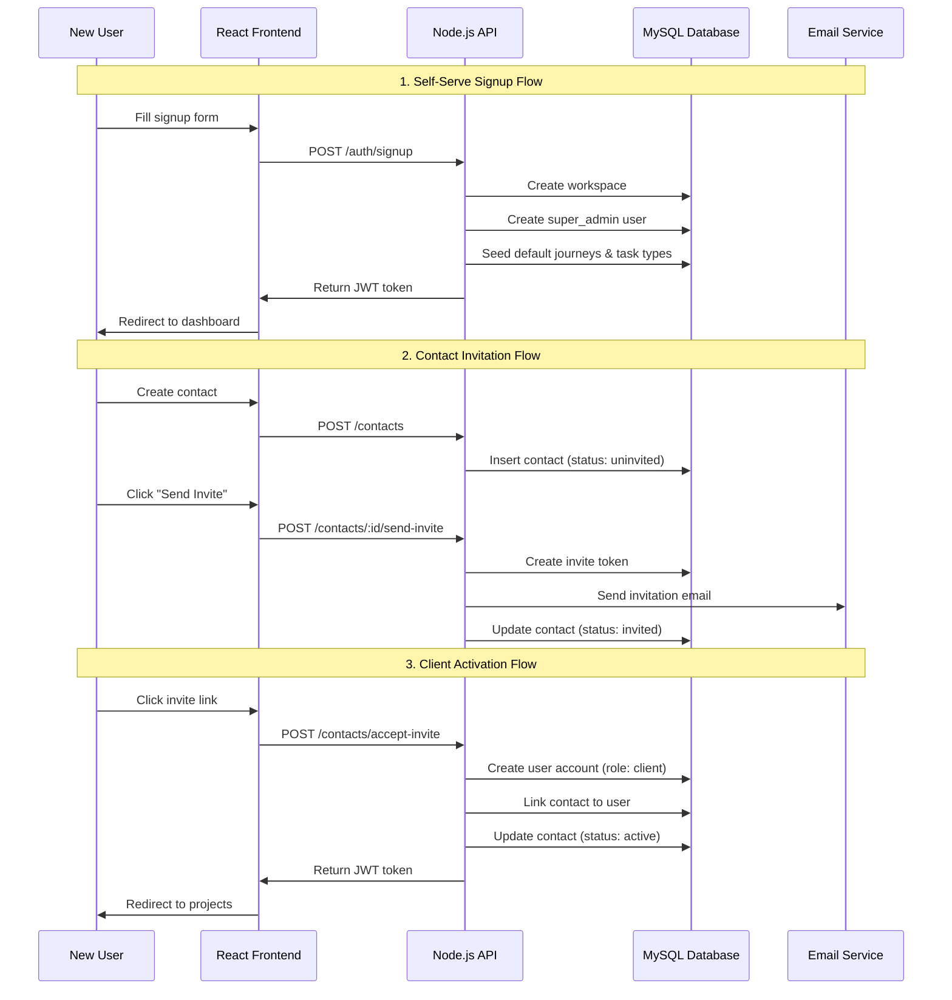
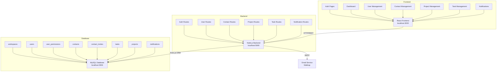
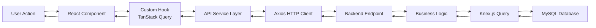

# Design Document: Pylot Platform Enhancement - Local Implementation

## Overview

This design document covers the comprehensive implementation of platform enhancements for the Pylot project management system. The enhancements include self-serve account creation, role-based permissions, contact lifecycle management, task management improvements, project creation simplification, user deactivation, and notification system. This implementation is designed for local testing with MySQL database before production deployment.

The system follows a full-stack architecture with React 19 + TypeScript frontend and Node.js + TypeScript backend using Knex.js for database operations. All features are designed to work incrementally, allowing for phased implementation and testing.

## Main Algorithm/Workflow



## Architecture

### System Architecture



### Data Flow Architecture




## Components and Interfaces

### Component 1: Authentication Service

**Purpose**: Handle user authentication, signup, and session management

**Interface**:
```typescript
interface AuthService {
  signup(data: SignupRequest): Promise<SignupResponse>
  login(credentials: LoginRequest): Promise<LoginResponse>
  logout(): Promise<void>
  refreshToken(): Promise<TokenResponse>
  verifyEmail(token: string): Promise<VerificationResponse>
}

interface SignupRequest {
  email: string
  password: string
  name: string
  workspace_name: string
}

interface SignupResponse {
  user: {
    id: string
    email: string
    role: 'super_admin'
    is_primary_admin: boolean
  }
  workspace: {
    id: string
    name: string
  }
  token: string
}

interface LoginRequest {
  email: string
  password: string
}

interface LoginResponse {
  user: UserDetails
  token: string
}
```

**Responsibilities**:
- Validate user credentials
- Create workspace and super admin user
- Generate JWT tokens
- Manage session cookies
- Handle password reset flows

### Component 2: Permission System

**Purpose**: Manage role-based access control and granular permissions

**Interface**:
```typescript
interface PermissionService {
  checkPermission(userId: string, permission: PermissionKey): Promise<boolean>
  grantPermission(userId: string, permission: PermissionKey, grantedBy: string): Promise<void>
  revokePermission(userId: string, permission: PermissionKey): Promise<void>
  getUserPermissions(userId: string): Promise<PermissionKey[]>
  canPerformAction(userId: string, action: Action, resource: Resource): Promise<boolean>
}

type PermissionKey = 
  | 'invite_admin'
  | 'invite_consultant'
  | 'invite_client'
  | 'approve_client_invites'
  | 'manage_journeys'
  | 'deactivate_users'
  | 'manage_projects'
  | 'view_all_projects'
  | 'manage_finances'

type Role = 'super_admin' | 'admin' | 'consultant' | 'client'

interface PermissionMatrix {
  [role: string]: {
    [permission: string]: boolean
  }
}
```

**Responsibilities**:
- Enforce role-based access control
- Check granular permissions
- Prevent unauthorized actions (e.g., deleting super admin)
- Audit permission changes


### Component 3: Contact Management Service

**Purpose**: Handle contact lifecycle from creation to client activation

**Interface**:
```typescript
interface ContactService {
  createContact(data: CreateContactRequest): Promise<Contact>
  sendInvite(contactId: string, invitedBy: string, message?: string): Promise<InviteResponse>
  requestInvite(contactId: string, requestedBy: string): Promise<InviteRequest>
  approveInvite(inviteId: string, approvedBy: string): Promise<void>
  rejectInvite(inviteId: string, reason: string): Promise<void>
  acceptInvite(token: string, password: string): Promise<AcceptInviteResponse>
  getContactStatus(contactId: string): Promise<ContactStatus>
}

interface CreateContactRequest {
  name: string
  email: string
  phone: string
  organization?: string
  address?: string
  send_invite_immediately?: boolean  // Optional: Send invite right after creation
  invite_message?: string  // Optional: Custom message for immediate invite
}

interface Contact {
  id: string
  name: string
  email: string
  phone: string
  status: 'uninvited' | 'invited' | 'active'
  user_id?: string
  invited_at?: string
  invited_by?: string
  created_at: string
  updated_at: string
}

interface InviteResponse {
  success: boolean
  invite_sent_at: string
  status: 'invited' | 'pending_approval'
  requires_approval: boolean
}

interface AcceptInviteResponse {
  user: {
    id: string
    email: string
    role: 'client'
  }
  contact: {
    id: string
    status: 'active'
  }
  token: string
}
```

**Responsibilities**:
- Create and manage contacts
- Handle invite workflow with approval
- Link contacts to user accounts
- Track contact status transitions
- Send invitation emails
- Support immediate invite sending during contact creation (optional)

### Component 4: Task Management Service

**Purpose**: Manage tasks with enhanced visibility and document upload features

**Interface**:
```typescript
interface TaskService {
  createTask(data: CreateTaskRequest): Promise<Task>
  updateTask(taskId: string, data: UpdateTaskRequest): Promise<Task>
  deleteTask(taskId: string): Promise<void>
  getTasksByProject(projectId: string, filters?: TaskFilters): Promise<Task[]>
  uploadDocument(taskId: string, file: File): Promise<DocumentUpload>
}

interface CreateTaskRequest {
  project_id: string
  task_type_id: string
  name: string
  description?: string  // Optional
  assignees: string[]
  due_date: string  // Renamed from end_date
  visibility: 'inhouse' | 'client_facing'
  document_url?: string  // For document upload task type
}

interface Task {
  id: string
  project_id: string
  company_id: string
  author_id: string
  task_type_id: string
  name: string
  description?: string
  status: 'pending' | 'completed'  // Removed 'in_progress'
  due_date: string  // Renamed from end_date
  visibility: 'inhouse' | 'client_facing'
  document_url?: string
  assignees: User[]
  created_at: string
  updated_at: string
}

interface TaskFilters {
  status?: 'pending' | 'completed'
  visibility?: 'inhouse' | 'client_facing'
  assignee_id?: string
  task_type_id?: string
}
```

**Responsibilities**:
- Create and update tasks with new structure
- Handle document uploads for specific task types
- Filter tasks by visibility
- Manage task assignments
- Trigger notifications on assignment


### Component 5: Project Management Service

**Purpose**: Simplified project creation with automatic contact linking

**Interface**:
```typescript
interface ProjectService {
  createProject(data: CreateProjectRequest): Promise<CreateProjectResponse>
  updateProject(projectId: string, data: UpdateProjectRequest): Promise<Project>
  getProjectDetails(projectId: string): Promise<Project>
  linkContactToProject(projectId: string, contactId: string): Promise<void>
}

interface CreateProjectRequest {
  // Required fields
  name: string
  project_type_id: string  // Journey
  start_date: string
  client_email: string
  client_phone: string
  
  // Optional fields
  client_name?: string
  project_value?: number
  nationality?: string
  notes?: string
  send_client_invite?: boolean  // Optional: Send invite to client after project creation
  invite_message?: string  // Optional: Custom message for client invite
}

interface CreateProjectResponse {
  project: {
    id: string
    name: string
    client_contact_id: string
    project_type_id: string
    start_date: string
  }
  contact: {
    id: string
    email: string
    status: 'uninvited' | 'invited' | 'active'
    is_new: boolean  // True if contact was created
  }
  invite?: {  // Present if send_client_invite was true
    success: boolean
    status: 'invited' | 'pending_approval'
    requires_approval: boolean
  }
}

interface Project {
  id: string
  name: string
  status: ProjectStatus
  client_contact_id: string
  company_id: string
  consultant_id?: string
  milestone_id?: string
  project_type_id: string
  start_date: string
  project_value?: number
  nationality?: string
  notes?: string
  created_at: string
  updated_at: string
}
```

**Responsibilities**:
- Create projects with simplified form
- Auto-create or link contacts by email
- Remove deprecated fields
- Validate required contact information
- Link projects to contacts
- Support optional client invite sending during project creation

### Component 6: Notification Service

**Purpose**: Handle task assignment notifications and unread tracking

**Interface**:
```typescript
interface NotificationService {
  createNotification(data: CreateNotificationRequest): Promise<Notification>
  getUserNotifications(userId: string, limit?: number): Promise<NotificationResponse>
  markAsRead(notificationId: string): Promise<void>
  markAllAsRead(userId: string): Promise<void>
  getUnreadCount(userId: string): Promise<number>
}

interface CreateNotificationRequest {
  user_id: string
  type: NotificationType
  title: string
  message: string
  link?: string
}

type NotificationType = 
  | 'task_assigned'
  | 'task_completed'
  | 'project_updated'
  | 'invite_received'
  | 'invite_approved'

interface Notification {
  id: string
  user_id: string
  type: NotificationType
  title: string
  message: string
  link?: string
  read_at?: string
  created_at: string
}

interface NotificationResponse {
  notifications: Notification[]
  unread_count: number
}
```

**Responsibilities**:
- Create notifications for task assignments
- Track read/unread status
- Provide unread count for badge
- Support notification types
- Link notifications to relevant resources


### Component 7: User Management Service

**Purpose**: Handle user deactivation and reactivation

**Interface**:
```typescript
interface UserService {
  deactivateUser(userId: string, deactivatedBy: string, reason?: string): Promise<void>
  reactivateUser(userId: string): Promise<void>
  getUserStatus(userId: string): Promise<UserStatus>
  canDeactivateUser(targetUserId: string, requestingUserId: string): Promise<boolean>
}

interface UserStatus {
  id: string
  status: 'active' | 'deactivated' | 'invited'
  is_primary_admin: boolean
  deactivated_at?: string
  deactivated_by?: string
}
```

**Responsibilities**:
- Deactivate users (prevent login)
- Reactivate users (require password reset)
- Prevent deactivation of super admin
- Invalidate sessions on deactivation
- Audit deactivation actions

## Data Models

### Model 1: Workspace

```typescript
interface Workspace {
  id: string
  name: string
  status: 'active' | 'inactive'
  created_at: string
  updated_at: string
}
```

**Validation Rules**:
- name: Required, 1-255 characters
- status: Must be 'active' or 'inactive'
- Each workspace must have at least one super admin

### Model 2: User (Enhanced)

```typescript
interface User {
  id: string
  email: string
  password: string  // Hashed
  name?: string
  pfp?: string
  role: 'super_admin' | 'admin' | 'consultant' | 'client'
  workspace_id: string
  company_id?: string
  is_primary_admin: boolean
  status: 'active' | 'deactivated' | 'invited'
  is_blocked: number
  is_verified: number
  is_active: number
  deactivated_at?: string
  deactivated_by?: string
  timezone?: string
  language: string
  currency: string
  last_login?: string
  login_count: number
  created_at: string
  updated_at: string
}
```

**Validation Rules**:
- email: Required, unique, valid email format
- password: Required, minimum 8 characters, hashed with bcrypt
- role: Required, one of the enum values
- workspace_id: Required, must reference existing workspace
- is_primary_admin: Only one per workspace
- status: Cannot deactivate if is_primary_admin is true

### Model 3: UserPermission

```typescript
interface UserPermission {
  id: string
  user_id: string
  permission_key: PermissionKey
  granted_by: string
  created_at: string
}
```

**Validation Rules**:
- user_id + permission_key: Unique constraint
- permission_key: Must be valid permission
- granted_by: Must be super admin or admin with permission

### Model 4: Contact (Enhanced)

```typescript
interface Contact {
  id: string
  name: string
  email: string
  phone: string
  organization?: string
  address?: string
  status: 'uninvited' | 'invited' | 'active'
  user_id?: string
  invited_at?: string
  invited_by?: string
  active_projects: number
  total_projects: number
  closed_projects: number
  created_at: string
  updated_at: string
}
```

**Validation Rules**:
- email: Required, unique, valid email format
- phone: Required, valid phone format
- status: Required, one of enum values
- user_id: Nullable, set when contact accepts invite
- Status transitions: uninvited → invited → active (one-way)


### Model 5: ContactInvite

```typescript
interface ContactInvite {
  id: string
  contact_id: string
  token: string  // Unique, secure random token
  invited_by: string
  status: 'pending' | 'approved' | 'rejected' | 'sent'
  approved_by?: string
  approved_at?: string
  expires_at: string
  accepted_at?: string
  created_at: string
}
```

**Validation Rules**:
- token: Required, unique, 64-character random string
- expires_at: Required, typically 7 days from creation
- status: Required, one of enum values
- Status flow: pending → approved → sent (for consultant invites)
- Status flow: sent (direct for admin invites)

### Model 6: Task (Enhanced)

```typescript
interface Task {
  id: string
  project_id: string
  company_id: string
  author_id: string
  task_type_id: string
  name: string
  description?: string  // Now optional
  status: 'pending' | 'completed'  // Removed 'in_progress'
  due_date: string  // Renamed from end_date
  visibility: 'inhouse' | 'client_facing'
  document_url?: string
  is_visible_to_client: number  // Deprecated, use visibility
  created_at: string
  updated_at: string
}
```

**Validation Rules**:
- name: Required, 1-255 characters
- description: Optional
- status: Must be 'pending' or 'completed'
- due_date: Required, valid date format
- visibility: Required, 'inhouse' or 'client_facing'
- document_url: Optional, valid URL format

### Model 7: Project (Simplified)

```typescript
interface Project {
  id: string
  name: string
  status: ProjectStatus
  client_contact_id: string  // Links to contacts table
  company_id: string
  consultant_id?: string
  milestone_id?: string
  project_type_id: string
  start_date: string
  project_value?: number  // Now optional
  nationality?: string  // Now optional
  notes?: string  // Replaces description
  form_data: Record<string, any>
  created_at: string
  updated_at: string
}
```

**Removed Fields**:
- description (use notes instead)
- client_organization
- resident_country
- postcode
- end_date

**Validation Rules**:
- name: Required, 1-255 characters
- client_contact_id: Required, must reference existing contact
- project_type_id: Required, must reference existing journey
- start_date: Required, valid date format
- project_value: Optional, positive number
- nationality: Optional, 2-letter country code

### Model 8: Notification

```typescript
interface Notification {
  id: string
  user_id: string
  type: NotificationType
  title: string
  message: string
  link?: string
  read_at?: string
  created_at: string
}
```

**Validation Rules**:
- user_id: Required, must reference existing user
- type: Required, one of NotificationType enum
- title: Required, 1-255 characters
- message: Required, 1-1000 characters
- link: Optional, valid URL format
- read_at: Nullable, set when user marks as read


## Algorithmic Pseudocode

### Main Processing Algorithm

```typescript
ALGORITHM processUserSignup(signupData)
INPUT: signupData of type SignupRequest
OUTPUT: result of type SignupResponse

BEGIN
  ASSERT validateEmail(signupData.email) = true
  ASSERT validatePassword(signupData.password) = true
  ASSERT signupData.workspace_name IS NOT EMPTY
  
  // Step 1: Check email uniqueness
  existingUser ← database.query("SELECT * FROM users WHERE email = ?", [signupData.email])
  IF existingUser IS NOT NULL THEN
    THROW Error("Email already exists")
  END IF
  
  // Step 2: Begin transaction
  transaction ← database.beginTransaction()
  
  TRY
    // Step 3: Create workspace
    workspace ← database.insert("workspaces", {
      name: signupData.workspace_name,
      status: 'active'
    })
    
    // Step 4: Hash password
    hashedPassword ← bcrypt.hash(signupData.password, 10)
    
    // Step 5: Create super admin user
    user ← database.insert("users", {
      email: signupData.email,
      password: hashedPassword,
      name: signupData.name,
      role: 'super_admin',
      workspace_id: workspace.id,
      is_primary_admin: true,
      status: 'active'
    })
    
    // Step 6: Seed default journeys
    defaultJourneys ← [
      { name: 'Business Setup', workspace_id: workspace.id },
      { name: 'Relocation', workspace_id: workspace.id },
      { name: 'Compliance', workspace_id: workspace.id }
    ]
    FOR EACH journey IN defaultJourneys DO
      database.insert("project_types", journey)
    END FOR
    
    // Step 7: Seed default task types
    defaultTaskTypes ← [
      { name: 'Document Upload', has_upload_field: true, workspace_id: workspace.id },
      { name: 'Review', has_upload_field: false, workspace_id: workspace.id },
      { name: 'Approval', has_upload_field: false, workspace_id: workspace.id },
      { name: 'Meeting', has_upload_field: false, workspace_id: workspace.id },
      { name: 'Follow-up', has_upload_field: false, workspace_id: workspace.id }
    ]
    FOR EACH taskType IN defaultTaskTypes DO
      database.insert("task_types", taskType)
    END FOR
    
    // Step 8: Generate JWT token
    token ← jwt.sign({ userId: user.id, role: user.role }, SECRET_KEY, { expiresIn: '7d' })
    
    // Step 9: Commit transaction
    transaction.commit()
    
    // Step 10: Return response
    RETURN {
      user: { id: user.id, email: user.email, role: user.role, is_primary_admin: true },
      workspace: { id: workspace.id, name: workspace.name },
      token: token
    }
    
  CATCH error
    transaction.rollback()
    THROW error
  END TRY
END
```

**Preconditions**:
- signupData.email is valid email format
- signupData.password meets minimum requirements (8+ characters)
- signupData.workspace_name is non-empty string
- Database connection is available

**Postconditions**:
- Workspace is created with status 'active'
- User is created with role 'super_admin' and is_primary_admin = true
- Default journeys and task types are seeded
- JWT token is generated and returned
- All database operations succeed or all rollback

**Loop Invariants**:
- All seeded journeys belong to the created workspace
- All seeded task types belong to the created workspace


### Contact Creation with Optional Immediate Invite Algorithm

```typescript
ALGORITHM processContactCreation(contactData, createdBy)
INPUT: contactData of type CreateContactRequest, createdBy (string)
OUTPUT: result of type { contact: Contact, invite?: InviteResponse }

BEGIN
  ASSERT validateEmail(contactData.email) = true
  ASSERT validatePhone(contactData.phone) = true
  ASSERT contactData.name IS NOT EMPTY
  ASSERT createdBy IS NOT NULL
  
  // Step 1: Check if contact with email already exists
  existingContact ← database.query("SELECT * FROM contacts WHERE email = ?", [contactData.email])
  IF existingContact IS NOT NULL THEN
    THROW Error("Contact with this email already exists")
  END IF
  
  // Step 2: Fetch creating user
  creatingUser ← database.query("SELECT * FROM users WHERE id = ?", [createdBy])
  IF creatingUser IS NULL THEN
    THROW Error("Creating user not found")
  END IF
  
  // Step 3: Begin transaction
  transaction ← database.beginTransaction()
  
  TRY
    // Step 4: Create contact
    contact ← database.insert("contacts", {
      name: contactData.name,
      email: contactData.email,
      phone: contactData.phone,
      organization: contactData.organization,
      address: contactData.address,
      status: 'uninvited',
      created_at: NOW(),
      updated_at: NOW()
    })
    
    // Step 5: Check if immediate invite is requested
    IF contactData.send_invite_immediately = true THEN
      // Determine if approval is required
      requiresApproval ← (creatingUser.role = 'consultant')
      
      IF requiresApproval = true THEN
        // Consultant creating contact - invite requires approval
        inviteStatus ← 'pending'
        
        // Create invite request
        invite ← database.insert("contact_invites", {
          contact_id: contact.id,
          token: generateSecureToken(),
          invited_by: createdBy,
          status: inviteStatus,
          expires_at: addDays(NOW(), 7)
        })
        
        // Notify admins for approval
        admins ← database.query("SELECT * FROM users WHERE role IN ('super_admin', 'admin') AND workspace_id = ?", [creatingUser.workspace_id])
        FOR EACH admin IN admins DO
          createNotification({
            user_id: admin.id,
            type: 'invite_approval_required',
            title: 'Client Invite Pending Approval',
            message: creatingUser.name + ' wants to invite ' + contact.name,
            link: '/admin/invites/' + invite.id
          })
        END FOR
        
        inviteResponse ← {
          success: true,
          status: 'pending_approval',
          requires_approval: true
        }
        
      ELSE
        // Admin/Super Admin creating contact - send invite immediately
        inviteStatus ← 'sent'
        
        // Create invite
        invite ← database.insert("contact_invites", {
          contact_id: contact.id,
          token: generateSecureToken(),
          invited_by: createdBy,
          status: inviteStatus,
          expires_at: addDays(NOW(), 7)
        })
        
        // Update contact status to invited
        database.update("contacts", {
          status: 'invited',
          invited_at: NOW(),
          invited_by: createdBy
        }, "WHERE id = ?", [contact.id])
        
        // Update contact object for return
        contact.status ← 'invited'
        contact.invited_at ← NOW()
        contact.invited_by ← createdBy
        
        // Send invitation email
        sendEmail({
          to: contact.email,
          subject: 'You are invited to join ' + creatingUser.workspace_name,
          template: 'client-invitation',
          data: {
            contact_name: contact.name,
            inviter_name: creatingUser.name,
            invite_link: FRONTEND_URL + '/accept-invite?token=' + invite.token,
            custom_message: contactData.invite_message
          }
        })
        
        inviteResponse ← {
          success: true,
          invite_sent_at: NOW(),
          status: 'invited',
          requires_approval: false
        }
      END IF
      
      // Step 6: Commit transaction
      transaction.commit()
      
      // Step 7: Return contact with invite response
      RETURN {
        contact: contact,
        invite: inviteResponse
      }
      
    ELSE
      // No immediate invite requested
      // Step 6: Commit transaction
      transaction.commit()
      
      // Step 7: Return contact only
      RETURN {
        contact: contact
      }
    END IF
    
  CATCH error
    transaction.rollback()
    THROW error
  END TRY
END
```

**Preconditions**:
- contactData.email is valid email format and unique
- contactData.phone is valid phone format
- contactData.name is non-empty string
- createdBy references existing user with permission to create contacts
- If send_invite_immediately is true, user must have permission to invite clients

**Postconditions**:
- Contact is created with status 'uninvited' (or 'invited' if immediate invite sent by admin)
- If send_invite_immediately is true and user is admin: invite sent, contact status updated to 'invited', email sent
- If send_invite_immediately is true and user is consultant: invite request created with status 'pending', admins notified
- If send_invite_immediately is false: only contact created, no invite actions
- All database operations succeed or all rollback

**Loop Invariants**:
- All notified admins have appropriate role and workspace


### Contact Invitation Algorithm

```typescript
ALGORITHM processContactInvitation(contactId, invitedBy, requiresApproval)
INPUT: contactId (string), invitedBy (string), requiresApproval (boolean)
OUTPUT: result of type InviteResponse

BEGIN
  ASSERT contactId IS NOT NULL
  ASSERT invitedBy IS NOT NULL
  
  // Step 1: Fetch contact
  contact ← database.query("SELECT * FROM contacts WHERE id = ?", [contactId])
  IF contact IS NULL THEN
    THROW Error("Contact not found")
  END IF
  
  // Step 2: Check contact status
  IF contact.status = 'active' THEN
    THROW Error("Contact is already active")
  END IF
  
  // Step 3: Fetch inviting user
  invitingUser ← database.query("SELECT * FROM users WHERE id = ?", [invitedBy])
  IF invitingUser IS NULL THEN
    THROW Error("Inviting user not found")
  END IF
  
  // Step 4: Check if approval is required (consultant inviting)
  IF requiresApproval = true THEN
    // Consultant sending invite - requires admin approval
    inviteStatus ← 'pending'
    
    // Create invite request
    invite ← database.insert("contact_invites", {
      contact_id: contactId,
      token: generateSecureToken(),
      invited_by: invitedBy,
      status: inviteStatus,
      expires_at: addDays(NOW(), 7)
    })
    
    // Notify admins for approval
    admins ← database.query("SELECT * FROM users WHERE role IN ('super_admin', 'admin') AND workspace_id = ?", [invitingUser.workspace_id])
    FOR EACH admin IN admins DO
      createNotification({
        user_id: admin.id,
        type: 'invite_approval_required',
        title: 'Client Invite Pending Approval',
        message: invitingUser.name + ' wants to invite ' + contact.name,
        link: '/admin/invites/' + invite.id
      })
    END FOR
    
    RETURN {
      success: true,
      status: 'pending_approval',
      requires_approval: true
    }
    
  ELSE
    // Admin/Super Admin sending invite - no approval needed
    inviteStatus ← 'sent'
    
    // Create invite
    invite ← database.insert("contact_invites", {
      contact_id: contactId,
      token: generateSecureToken(),
      invited_by: invitedBy,
      status: inviteStatus,
      expires_at: addDays(NOW(), 7)
    })
    
    // Update contact status
    database.update("contacts", {
      status: 'invited',
      invited_at: NOW(),
      invited_by: invitedBy
    }, "WHERE id = ?", [contactId])
    
    // Send invitation email
    sendEmail({
      to: contact.email,
      subject: 'You are invited to join ' + invitingUser.workspace_name,
      template: 'client-invitation',
      data: {
        contact_name: contact.name,
        inviter_name: invitingUser.name,
        invite_link: FRONTEND_URL + '/accept-invite?token=' + invite.token
      }
    })
    
    RETURN {
      success: true,
      invite_sent_at: NOW(),
      status: 'invited',
      requires_approval: false
    }
  END IF
END
```

**Preconditions**:
- contactId references existing contact
- invitedBy references existing user
- Contact status is 'uninvited' or 'invited'
- Inviting user has permission to invite clients

**Postconditions**:
- If requiresApproval: invite created with status 'pending', admins notified
- If not requiresApproval: invite created with status 'sent', contact status updated to 'invited', email sent
- Invite token is unique and secure
- Invite expires in 7 days

**Loop Invariants**:
- All notified admins have appropriate role and workspace


### Client Activation Algorithm

```typescript
ALGORITHM processClientActivation(inviteToken, password)
INPUT: inviteToken (string), password (string)
OUTPUT: result of type AcceptInviteResponse

BEGIN
  ASSERT inviteToken IS NOT NULL
  ASSERT validatePassword(password) = true
  
  // Step 1: Fetch invite
  invite ← database.query("SELECT * FROM contact_invites WHERE token = ?", [inviteToken])
  IF invite IS NULL THEN
    THROW Error("Invalid invite token")
  END IF
  
  // Step 2: Check invite expiration
  IF invite.expires_at < NOW() THEN
    THROW Error("Invite has expired")
  END IF
  
  // Step 3: Check invite status
  IF invite.status ≠ 'sent' AND invite.status ≠ 'approved' THEN
    THROW Error("Invite is not ready for acceptance")
  END IF
  
  // Step 4: Check if already accepted
  IF invite.accepted_at IS NOT NULL THEN
    THROW Error("Invite has already been accepted")
  END IF
  
  // Step 5: Fetch contact
  contact ← database.query("SELECT * FROM contacts WHERE id = ?", [invite.contact_id])
  IF contact IS NULL THEN
    THROW Error("Contact not found")
  END IF
  
  // Step 6: Check if contact already has user account
  IF contact.user_id IS NOT NULL THEN
    THROW Error("Contact already has an active account")
  END IF
  
  // Step 7: Begin transaction
  transaction ← database.beginTransaction()
  
  TRY
    // Step 8: Hash password
    hashedPassword ← bcrypt.hash(password, 10)
    
    // Step 9: Get workspace from inviting user
    invitingUser ← database.query("SELECT workspace_id FROM users WHERE id = ?", [invite.invited_by])
    
    // Step 10: Create client user account
    user ← database.insert("users", {
      email: contact.email,
      password: hashedPassword,
      name: contact.name,
      role: 'client',
      workspace_id: invitingUser.workspace_id,
      is_primary_admin: false,
      status: 'active'
    })
    
    // Step 11: Link contact to user
    database.update("contacts", {
      user_id: user.id,
      status: 'active'
    }, "WHERE id = ?", [contact.id])
    
    // Step 12: Mark invite as accepted
    database.update("contact_invites", {
      accepted_at: NOW()
    }, "WHERE id = ?", [invite.id])
    
    // Step 13: Generate JWT token
    token ← jwt.sign({ userId: user.id, role: user.role }, SECRET_KEY, { expiresIn: '7d' })
    
    // Step 14: Commit transaction
    transaction.commit()
    
    // Step 15: Notify inviting user
    createNotification({
      user_id: invite.invited_by,
      type: 'invite_accepted',
      title: 'Client Accepted Invitation',
      message: contact.name + ' has joined the platform',
      link: '/contacts/' + contact.id
    })
    
    // Step 16: Return response
    RETURN {
      user: { id: user.id, email: user.email, role: 'client' },
      contact: { id: contact.id, status: 'active' },
      token: token
    }
    
  CATCH error
    transaction.rollback()
    THROW error
  END TRY
END
```

**Preconditions**:
- inviteToken is valid and not expired
- password meets minimum requirements
- Invite status is 'sent' or 'approved'
- Contact does not already have user account
- Invite has not been previously accepted

**Postconditions**:
- User account created with role 'client'
- Contact linked to user account
- Contact status updated to 'active'
- Invite marked as accepted
- JWT token generated and returned
- Inviting user notified
- All database operations succeed or all rollback

**Loop Invariants**: N/A (no loops in this algorithm)


### Project Creation with Contact Linking Algorithm

```typescript
ALGORITHM processProjectCreation(projectData, createdBy)
INPUT: projectData of type CreateProjectRequest, createdBy (string)
OUTPUT: result of type CreateProjectResponse

BEGIN
  ASSERT projectData.name IS NOT EMPTY
  ASSERT projectData.project_type_id IS NOT NULL
  ASSERT validateEmail(projectData.client_email) = true
  ASSERT validatePhone(projectData.client_phone) = true
  ASSERT createdBy IS NOT NULL
  
  // Step 1: Get current user
  currentUser ← database.query("SELECT * FROM users WHERE id = ?", [createdBy])
  IF currentUser IS NULL THEN
    THROW Error("User not found")
  END IF
  
  // Step 2: Begin transaction
  transaction ← database.beginTransaction()
  
  TRY
    // Step 3: Search for existing contact by email
    existingContact ← database.query("SELECT * FROM contacts WHERE email = ?", [projectData.client_email])
    
    isNewContact ← false
    
    // Step 4: Create or use existing contact
    IF existingContact IS NULL THEN
      // Create new contact
      contact ← database.insert("contacts", {
        name: projectData.client_name OR extractNameFromEmail(projectData.client_email),
        email: projectData.client_email,
        phone: projectData.client_phone,
        status: 'uninvited'
      })
      isNewContact ← true
    ELSE
      // Use existing contact
      contact ← existingContact
      
      // Update phone if provided and different
      IF projectData.client_phone ≠ contact.phone THEN
        database.update("contacts", {
          phone: projectData.client_phone
        }, "WHERE id = ?", [contact.id])
        contact.phone ← projectData.client_phone
      END IF
    END IF
    
    // Step 5: Create project
    project ← database.insert("projects", {
      name: projectData.name,
      project_type_id: projectData.project_type_id,
      start_date: projectData.start_date,
      client_contact_id: contact.id,
      company_id: currentUser.company_id,
      consultant_id: currentUser.id,
      project_value: projectData.project_value,
      nationality: projectData.nationality,
      notes: projectData.notes,
      status: 'not_started'
    })
    
    // Step 6: Update contact project counts
    database.execute("UPDATE contacts SET active_projects = active_projects + 1, total_projects = total_projects + 1 WHERE id = ?", [contact.id])
    
    // Step 7: Check if client invite should be sent
    inviteResponse ← NULL
    
    IF projectData.send_client_invite = true AND contact.status = 'uninvited' THEN
      // Determine if approval is required
      requiresApproval ← (currentUser.role = 'consultant')
      
      IF requiresApproval = true THEN
        // Consultant - invite requires approval
        inviteStatus ← 'pending'
        
        // Create invite request
        invite ← database.insert("contact_invites", {
          contact_id: contact.id,
          token: generateSecureToken(),
          invited_by: createdBy,
          status: inviteStatus,
          expires_at: addDays(NOW(), 7)
        })
        
        // Notify admins for approval
        admins ← database.query("SELECT * FROM users WHERE role IN ('super_admin', 'admin') AND workspace_id = ?", [currentUser.workspace_id])
        FOR EACH admin IN admins DO
          createNotification({
            user_id: admin.id,
            type: 'invite_approval_required',
            title: 'Client Invite Pending Approval',
            message: currentUser.name + ' wants to invite ' + contact.name + ' for project: ' + project.name,
            link: '/admin/invites/' + invite.id
          })
        END FOR
        
        inviteResponse ← {
          success: true,
          status: 'pending_approval',
          requires_approval: true
        }
        
      ELSE
        // Admin/Super Admin - send invite immediately
        inviteStatus ← 'sent'
        
        // Create invite
        invite ← database.insert("contact_invites", {
          contact_id: contact.id,
          token: generateSecureToken(),
          invited_by: createdBy,
          status: inviteStatus,
          expires_at: addDays(NOW(), 7)
        })
        
        // Update contact status to invited
        database.update("contacts", {
          status: 'invited',
          invited_at: NOW(),
          invited_by: createdBy
        }, "WHERE id = ?", [contact.id])
        
        // Update contact object for return
        contact.status ← 'invited'
        contact.invited_at ← NOW()
        contact.invited_by ← createdBy
        
        // Send invitation email
        sendEmail({
          to: contact.email,
          subject: 'You have been assigned to project: ' + project.name,
          template: 'project-client-invitation',
          data: {
            contact_name: contact.name,
            project_name: project.name,
            inviter_name: currentUser.name,
            workspace_name: currentUser.workspace_name,
            invite_link: FRONTEND_URL + '/accept-invite?token=' + invite.token,
            custom_message: projectData.invite_message
          }
        })
        
        inviteResponse ← {
          success: true,
          status: 'invited',
          requires_approval: false
        }
      END IF
    END IF
    
    // Step 8: Commit transaction
    transaction.commit()
    
    // Step 9: Return response
    response ← {
      project: {
        id: project.id,
        name: project.name,
        client_contact_id: contact.id,
        project_type_id: project.project_type_id,
        start_date: project.start_date
      },
      contact: {
        id: contact.id,
        email: contact.email,
        status: contact.status,
        is_new: isNewContact
      }
    }
    
    IF inviteResponse IS NOT NULL THEN
      response.invite ← inviteResponse
    END IF
    
    RETURN response
    
  CATCH error
    transaction.rollback()
    THROW error
  END TRY
END
```

**Preconditions**:
- projectData.name is non-empty string
- projectData.project_type_id references existing journey
- projectData.client_email is valid email format
- projectData.client_phone is valid phone format
- projectData.start_date is valid date format
- createdBy references existing user with permission to create projects
- If send_client_invite is true and contact is uninvited, user must have permission to invite clients

**Postconditions**:
- If contact doesn't exist: new contact created with status 'uninvited' (or 'invited' if invite sent by admin)
- If contact exists: existing contact used, phone updated if different
- Project created and linked to contact
- Contact project counts updated
- If send_client_invite is true and contact is uninvited:
  - Admin: invite sent, contact status updated to 'invited', email sent
  - Consultant: invite request created with status 'pending', admins notified
- If send_client_invite is false or contact already invited/active: no invite actions
- Response includes project, contact, and optional invite information
- All database operations succeed or all rollback

**Loop Invariants**:
- All notified admins have appropriate role and workspace


### Task Assignment Notification Algorithm

```typescript
ALGORITHM processTaskAssignment(taskId, assigneeIds)
INPUT: taskId (string), assigneeIds (array of strings)
OUTPUT: notifications created

BEGIN
  ASSERT taskId IS NOT NULL
  ASSERT assigneeIds IS NOT EMPTY
  
  // Step 1: Fetch task details
  task ← database.query("SELECT * FROM tasks WHERE id = ?", [taskId])
  IF task IS NULL THEN
    THROW Error("Task not found")
  END IF
  
  // Step 2: Fetch project details
  project ← database.query("SELECT * FROM projects WHERE id = ?", [task.project_id])
  
  // Step 3: Fetch task author
  author ← database.query("SELECT name FROM users WHERE id = ?", [task.author_id])
  
  // Step 4: Create notifications for each assignee
  FOR EACH assigneeId IN assigneeIds DO
    ASSERT assigneeId IS NOT NULL
    
    // Skip if assignee is the author
    IF assigneeId = task.author_id THEN
      CONTINUE
    END IF
    
    // Check if assignee exists
    assignee ← database.query("SELECT * FROM users WHERE id = ?", [assigneeId])
    IF assignee IS NULL THEN
      CONTINUE  // Skip invalid assignee
    END IF
    
    // Create notification
    notification ← database.insert("notifications", {
      user_id: assigneeId,
      type: 'task_assigned',
      title: 'New Task Assigned',
      message: author.name + ' assigned you to task: ' + task.name,
      link: '/projects/' + project.id + '/tasks/' + task.id,
      read_at: NULL
    })
    
    // Optional: Send email notification
    IF assignee.email_notifications_enabled = true THEN
      sendEmail({
        to: assignee.email,
        subject: 'New Task Assigned: ' + task.name,
        template: 'task-assignment',
        data: {
          assignee_name: assignee.name,
          task_name: task.name,
          project_name: project.name,
          author_name: author.name,
          due_date: task.due_date,
          task_link: FRONTEND_URL + '/projects/' + project.id + '/tasks/' + task.id
        }
      })
    END IF
  END FOR
  
  RETURN { success: true, notifications_created: assigneeIds.length }
END
```

**Preconditions**:
- taskId references existing task
- assigneeIds is non-empty array
- All assigneeIds reference existing users
- Task has valid project_id and author_id

**Postconditions**:
- Notification created for each assignee (except author)
- Each notification has read_at = NULL (unread)
- Email sent to assignees with email notifications enabled
- Invalid assignees are skipped without error

**Loop Invariants**:
- All processed assignees are valid users
- All created notifications reference valid task and user
- Notification count matches number of valid assignees (excluding author)


### User Deactivation Algorithm

```typescript
ALGORITHM processUserDeactivation(targetUserId, requestingUserId, reason)
INPUT: targetUserId (string), requestingUserId (string), reason (string, optional)
OUTPUT: result of type DeactivationResponse

BEGIN
  ASSERT targetUserId IS NOT NULL
  ASSERT requestingUserId IS NOT NULL
  
  // Step 1: Fetch target user
  targetUser ← database.query("SELECT * FROM users WHERE id = ?", [targetUserId])
  IF targetUser IS NULL THEN
    THROW Error("Target user not found")
  END IF
  
  // Step 2: Fetch requesting user
  requestingUser ← database.query("SELECT * FROM users WHERE id = ?", [requestingUserId])
  IF requestingUser IS NULL THEN
    THROW Error("Requesting user not found")
  END IF
  
  // Step 3: Check if requesting user is super admin
  IF requestingUser.role ≠ 'super_admin' THEN
    THROW Error("Only super admin can deactivate users")
  END IF
  
  // Step 4: Prevent deactivation of primary admin
  IF targetUser.is_primary_admin = true THEN
    THROW Error("Cannot deactivate primary admin")
  END IF
  
  // Step 5: Check if user is already deactivated
  IF targetUser.status = 'deactivated' THEN
    THROW Error("User is already deactivated")
  END IF
  
  // Step 6: Begin transaction
  transaction ← database.beginTransaction()
  
  TRY
    // Step 7: Update user status
    database.update("users", {
      status: 'deactivated',
      deactivated_at: NOW(),
      deactivated_by: requestingUserId
    }, "WHERE id = ?", [targetUserId])
    
    // Step 8: Invalidate all active sessions
    database.execute("DELETE FROM user_sessions WHERE user_id = ?", [targetUserId])
    
    // Step 9: Log deactivation action
    database.insert("audit_logs", {
      user_id: requestingUserId,
      action: 'user_deactivated',
      target_user_id: targetUserId,
      reason: reason,
      timestamp: NOW()
    })
    
    // Step 10: Commit transaction
    transaction.commit()
    
    // Step 11: Return response
    RETURN {
      success: true,
      user_id: targetUserId,
      status: 'deactivated',
      deactivated_at: NOW(),
      deactivated_by: requestingUserId
    }
    
  CATCH error
    transaction.rollback()
    THROW error
  END TRY
END
```

**Preconditions**:
- targetUserId references existing user
- requestingUserId references existing super admin
- Target user is not primary admin
- Target user status is 'active'

**Postconditions**:
- Target user status updated to 'deactivated'
- deactivated_at and deactivated_by fields set
- All active sessions invalidated
- Deactivation action logged in audit trail
- All database operations succeed or all rollback

**Loop Invariants**: N/A (no loops in this algorithm)


## Key Functions with Formal Specifications

### Function 1: validatePermission()

```typescript
function validatePermission(userId: string, permission: PermissionKey): Promise<boolean>
```

**Preconditions:**
- userId is non-null and references existing user
- permission is valid PermissionKey enum value

**Postconditions:**
- Returns true if user has permission (either through role or explicit grant)
- Returns false if user does not have permission
- No side effects on database

**Implementation Logic:**
```typescript
async function validatePermission(userId: string, permission: PermissionKey): Promise<boolean> {
  // Fetch user
  const user = await db('users').where({ id: userId }).first()
  if (!user) return false
  
  // Super admin has all permissions
  if (user.role === 'super_admin') return true
  
  // Check role-based permissions
  const rolePermissions = PERMISSION_MATRIX[user.role] || {}
  if (rolePermissions[permission]) return true
  
  // Check explicit permissions
  const explicitPermission = await db('user_permissions')
    .where({ user_id: userId, permission_key: permission })
    .first()
  
  return !!explicitPermission
}
```

### Function 2: generateSecureToken()

```typescript
function generateSecureToken(): string
```

**Preconditions:**
- Crypto library is available

**Postconditions:**
- Returns 64-character hexadecimal string
- Token is cryptographically secure random
- Token is unique (probability of collision negligible)

**Implementation Logic:**
```typescript
function generateSecureToken(): string {
  return crypto.randomBytes(32).toString('hex')
}
```

### Function 3: sendInvitationEmail()

```typescript
function sendInvitationEmail(contact: Contact, invite: ContactInvite, inviter: User): Promise<void>
```

**Preconditions:**
- contact.email is valid email address
- invite.token is non-null
- inviter.name is non-null
- Email service is configured

**Postconditions:**
- Email sent to contact.email
- Email contains invitation link with token
- No database changes
- Throws error if email sending fails

**Implementation Logic:**
```typescript
async function sendInvitationEmail(
  contact: Contact, 
  invite: ContactInvite, 
  inviter: User
): Promise<void> {
  const inviteLink = `${process.env.FRONTEND_URL}/accept-invite?token=${invite.token}`
  
  await emailService.send({
    to: contact.email,
    subject: `You're invited to join ${inviter.workspace_name}`,
    template: 'client-invitation',
    data: {
      contact_name: contact.name,
      inviter_name: inviter.name,
      workspace_name: inviter.workspace_name,
      invite_link: inviteLink,
      expires_at: invite.expires_at
    }
  })
}
```

### Function 4: validateTaskData()

```typescript
function validateTaskData(taskData: CreateTaskRequest): ValidationResult
```

**Preconditions:**
- taskData is non-null object

**Postconditions:**
- Returns { valid: true } if all validations pass
- Returns { valid: false, errors: [...] } if validations fail
- No side effects

**Implementation Logic:**
```typescript
function validateTaskData(taskData: CreateTaskRequest): ValidationResult {
  const errors: string[] = []
  
  // Name is required
  if (!taskData.name || taskData.name.trim().length === 0) {
    errors.push('Task name is required')
  }
  
  // Name length check
  if (taskData.name && taskData.name.length > 255) {
    errors.push('Task name must be 255 characters or less')
  }
  
  // Description is optional, but if provided, check length
  if (taskData.description && taskData.description.length > 5000) {
    errors.push('Task description must be 5000 characters or less')
  }
  
  // Due date is required and must be valid date
  if (!taskData.due_date) {
    errors.push('Due date is required')
  } else if (!isValidDate(taskData.due_date)) {
    errors.push('Due date must be valid date format')
  }
  
  // Visibility is required
  if (!taskData.visibility || !['inhouse', 'client_facing'].includes(taskData.visibility)) {
    errors.push('Visibility must be either "inhouse" or "client_facing"')
  }
  
  // Assignees must be non-empty array
  if (!Array.isArray(taskData.assignees) || taskData.assignees.length === 0) {
    errors.push('At least one assignee is required')
  }
  
  return {
    valid: errors.length === 0,
    errors: errors
  }
}
```


### Function 5: checkContactStatusTransition()

```typescript
function checkContactStatusTransition(currentStatus: ContactStatus, newStatus: ContactStatus): boolean
```

**Preconditions:**
- currentStatus is valid ContactStatus enum value
- newStatus is valid ContactStatus enum value

**Postconditions:**
- Returns true if transition is allowed
- Returns false if transition is not allowed
- No side effects

**Implementation Logic:**
```typescript
function checkContactStatusTransition(
  currentStatus: ContactStatus, 
  newStatus: ContactStatus
): boolean {
  // Valid transitions: uninvited → invited → active
  const validTransitions: Record<ContactStatus, ContactStatus[]> = {
    'uninvited': ['invited'],
    'invited': ['active'],
    'active': []  // No transitions from active
  }
  
  return validTransitions[currentStatus]?.includes(newStatus) || false
}
```

### Function 6: calculateUnreadNotificationCount()

```typescript
function calculateUnreadNotificationCount(userId: string): Promise<number>
```

**Preconditions:**
- userId is non-null and references existing user

**Postconditions:**
- Returns count of notifications where read_at IS NULL
- Returns 0 if no unread notifications
- No side effects on database

**Implementation Logic:**
```typescript
async function calculateUnreadNotificationCount(userId: string): Promise<number> {
  const result = await db('notifications')
    .where({ user_id: userId })
    .whereNull('read_at')
    .count('id as count')
    .first()
  
  return result?.count || 0
}
```

## Error Handling Strategy

### Backend Error Response Format

All backend endpoints should return consistent error responses with user-friendly messages:

```typescript
// Standard error response format
interface ErrorResponse {
  message: string        // User-friendly message
  code?: string         // Optional error code for debugging
  field?: string        // Optional field name for validation errors
  details?: any         // Optional additional details
}

// Example backend error responses
res.status(404).json({ 
  message: 'Contact not found. Please check the contact ID and try again.',
  code: 'CONTACT_NOT_FOUND'
})

res.status(400).json({ 
  message: 'Email already exists. Please use a different email address.',
  code: 'EMAIL_EXISTS'
})

res.status(403).json({ 
  message: 'You do not have permission to perform this action.',
  code: 'INSUFFICIENT_PERMISSIONS'
})

res.status(409).json({ 
  message: 'This contact has already been invited. You cannot send another invitation.',
  code: 'CONTACT_ALREADY_INVITED'
})
```

### Frontend Error Formatter Utility

Create a utility to format error messages based on HTTP status codes and error types:

```typescript
// utils/errorFormatter.ts
export const formatErrorMessage = (error: any): string => {
  // If backend provides a message, use it
  if (error.response?.data?.message) {
    return error.response.data.message
  }
  
  // Otherwise, provide user-friendly messages based on status code
  const status = error.response?.status
  
  switch (status) {
    case 400:
      return 'Invalid request. Please check your input and try again.'
    case 401:
      return 'Your session has expired. Please log in again.'
    case 403:
      return 'You do not have permission to perform this action.'
    case 404:
      return 'The requested resource was not found.'
    case 409:
      return 'This action conflicts with existing data. Please review and try again.'
    case 422:
      return 'Validation failed. Please check your input.'
    case 429:
      return 'Too many requests. Please wait a moment and try again.'
    case 500:
      return 'An unexpected error occurred. Please try again later.'
    case 503:
      return 'Service temporarily unavailable. Please try again later.'
    default:
      return 'An error occurred. Please try again.'
  }
}

// Enhanced error formatter with field-specific messages
export const formatValidationError = (error: any): string => {
  const errors = error.response?.data?.errors
  
  if (errors && Array.isArray(errors)) {
    // Format multiple validation errors
    return errors.map((err: any) => `${err.field}: ${err.message}`).join(', ')
  }
  
  return formatErrorMessage(error)
}
```

### Backend Error Messages by Scenario

```typescript
// Authentication errors
'Invalid email or password. Please try again.'
'Your account has been deactivated. Please contact support.'
'Email already exists. Please use a different email or log in.'

// Contact errors
'Contact not found. Please check the contact ID.'
'Contact with this email already exists.'
'This contact has already been invited.'
'This contact is already active and cannot be invited again.'
'Invite token has expired. Please request a new invitation.'
'Invalid invite token. Please check the link and try again.'

// Project errors
'Project not found. It may have been deleted.'
'You do not have access to this project.'
'Client email is required to create a project.'
'Invalid journey selected. Please choose a valid project type.'

// Task errors
'Task not found. It may have been deleted.'
'You must assign at least one person to this task.'
'Task name is required and cannot be empty.'
'Due date must be in the future.'
'You do not have permission to view this task.'

// Permission errors
'Only super admins can perform this action.'
'You do not have permission to invite clients.'
'You cannot deactivate the primary admin.'
'You cannot delete your own account.'

// Invite approval errors
'This invite request has already been processed.'
'Only admins can approve invite requests.'
'Invite has expired. Please send a new invitation.'
```

## Example Usage

### Example 1: Complete Signup Flow

```typescript
// Frontend: SignUp.tsx
import { useState } from 'react'
import { useNavigate } from 'react-router-dom'
import axios from 'axios'
import Toast from '@/components/Toast'
import { formatErrorMessage } from '@/utils/errorFormatter'

export default function SignUp() {
  const [formData, setFormData] = useState({
    email: '',
    password: '',
    name: '',
    workspace_name: ''
  })
  const navigate = useNavigate()

  const handleSubmit = async (e: React.FormEvent) => {
    e.preventDefault()
    
    try {
      const response = await axios.post('/api/v1/auth/signup', formData)
      
      // Save token to cookie
      document.cookie = `user_session_token=${response.data.token}; path=/; max-age=604800`
      
      // Save user data
      localStorage.setItem('user', JSON.stringify(response.data.user))
      
      // Show success message
      Toast.success(`Welcome ${response.data.user.name}! Your workspace has been created.`)
      
      // Redirect to dashboard
      navigate('/home')
    } catch (error) {
      console.error('Signup failed:', error)
      Toast.error(formatErrorMessage(error))
    }
  }

  return (
    <form onSubmit={handleSubmit}>
      <input
        type="text"
        placeholder="Your Name"
        value={formData.name}
        onChange={(e) => setFormData({...formData, name: e.target.value})}
        required
      />
      <input
        type="email"
        placeholder="Email"
        value={formData.email}
        onChange={(e) => setFormData({...formData, email: e.target.value})}
        required
      />
      <input
        type="password"
        placeholder="Password"
        value={formData.password}
        onChange={(e) => setFormData({...formData, password: e.target.value})}
        required
      />
      <input
        type="text"
        placeholder="Workspace Name"
        value={formData.workspace_name}
        onChange={(e) => setFormData({...formData, workspace_name: e.target.value})}
        required
      />
      <button type="submit">Create Workspace</button>
    </form>
  )
}

// Backend: auth.routes.ts
router.post('/signup', async (req, res) => {
  try {
    const { email, password, name, workspace_name } = req.body
    
    // Check if email exists
    const existingUser = await db('users').where({ email }).first()
    if (existingUser) {
      return res.status(400).json({ message: 'Email already exists' })
    }
    
    // Begin transaction
    const result = await db.transaction(async (trx) => {
      // Create workspace
      const [workspace] = await trx('workspaces')
        .insert({ name: workspace_name, status: 'active' })
        .returning('*')
      
      // Hash password
      const hashedPassword = await bcrypt.hash(password, 10)
      
      // Create user
      const [user] = await trx('users')
        .insert({
          email,
          password: hashedPassword,
          name,
          role: 'super_admin',
          workspace_id: workspace.id,
          is_primary_admin: true,
          status: 'active'
        })
        .returning('*')
      
      // Seed default journeys
      await seedDefaultJourneys(trx, workspace.id)
      
      // Seed default task types
      await seedDefaultTaskTypes(trx, workspace.id)
      
      return { user, workspace }
    })
    
    // Generate JWT
    const token = jwt.sign(
      { userId: result.user.id, role: result.user.role },
      process.env.JWT_SECRET,
      { expiresIn: '7d' }
    )
    
    res.json({
      user: {
        id: result.user.id,
        email: result.user.email,
        role: result.user.role,
        is_primary_admin: true
      },
      workspace: {
        id: result.workspace.id,
        name: result.workspace.name
      },
      token
    })
  } catch (error) {
    console.error('Signup error:', error)
    res.status(500).json({ message: 'Signup failed' })
  }
})
```


### Example 2: Contact Creation with Optional Immediate Invite

```typescript
// Frontend: CreateContactForm.tsx
import { useForm } from 'react-hook-form'
import { useCreateContact } from '@/hooks/contacts/use-create-contact'
import Toast from '@/components/Toast'
import { formatErrorMessage } from '@/utils/errorFormatter'

interface ContactFormData {
  name: string
  email: string
  phone: string
  organization?: string
  address?: string
  send_invite_immediately?: boolean
  invite_message?: string
}

export default function CreateContactForm() {
  const { register, handleSubmit, watch, formState: { errors } } = useForm<ContactFormData>()
  const createContact = useCreateContact()
  
  const sendInviteImmediately = watch('send_invite_immediately')
  
  const onSubmit = async (data: ContactFormData) => {
    try {
      const result = await createContact.mutateAsync(data)
      
      if (result.invite) {
        if (result.invite.requires_approval) {
          Toast.info(`Contact created! Invite request sent to admin for approval.`)
        } else {
          Toast.success(`Contact created and invitation sent to ${result.contact.email}!`)
        }
      } else {
        Toast.success(`Contact created successfully. You can send an invite later.`)
      }
    } catch (error) {
      Toast.error(formatErrorMessage(error))
    }
  }
  
  return (
    <form onSubmit={handleSubmit(onSubmit)} className="space-y-4">
      <h2 className="text-xl font-bold">Add New Contact</h2>
      
      <input
        {...register('name', { required: 'Name is required' })}
        placeholder="Contact Name"
        className="w-full border p-2 rounded"
      />
      {errors.name && <span className="text-red-500">{errors.name.message}</span>}
      
      <input
        type="email"
        {...register('email', { required: 'Email is required' })}
        placeholder="Email"
        className="w-full border p-2 rounded"
      />
      {errors.email && <span className="text-red-500">{errors.email.message}</span>}
      
      <input
        {...register('phone', { required: 'Phone is required' })}
        placeholder="Phone"
        className="w-full border p-2 rounded"
      />
      {errors.phone && <span className="text-red-500">{errors.phone.message}</span>}
      
      <input
        {...register('organization')}
        placeholder="Organization (optional)"
        className="w-full border p-2 rounded"
      />
      
      <textarea
        {...register('address')}
        placeholder="Address (optional)"
        className="w-full border p-2 rounded"
        rows={3}
      />
      
      {/* Optional: Send invite immediately checkbox */}
      <div className="flex items-center space-x-2">
        <input
          type="checkbox"
          {...register('send_invite_immediately')}
          id="send_invite_immediately"
          className="w-4 h-4"
        />
        <label htmlFor="send_invite_immediately" className="text-sm">
          Send invitation immediately after creating contact
        </label>
      </div>
      
      {/* Show custom message field if checkbox is checked */}
      {sendInviteImmediately && (
        <textarea
          {...register('invite_message')}
          placeholder="Custom invitation message (optional)"
          className="w-full border p-2 rounded"
          rows={3}
        />
      )}
      
      <button 
        type="submit" 
        className="w-full bg-blue-600 text-white py-2 rounded hover:bg-blue-700"
      >
        Create Contact
      </button>
    </form>
  )
}

// Backend: contacts.routes.ts
router.post('/contacts', authenticate, async (req, res) => {
  try {
    const {
      name,
      email,
      phone,
      organization,
      address,
      send_invite_immediately,
      invite_message
    } = req.body
    
    // Validate required fields
    if (!name || !email || !phone) {
      return res.status(400).json({ message: 'Missing required fields' })
    }
    
    // Check if contact already exists
    const existingContact = await db('contacts').where({ email }).first()
    if (existingContact) {
      return res.status(400).json({ message: 'Contact with this email already exists' })
    }
    
    const result = await db.transaction(async (trx) => {
      // Create contact
      const [contact] = await trx('contacts')
        .insert({
          name,
          email,
          phone,
          organization,
          address,
          status: 'uninvited'
        })
        .returning('*')
      
      // Check if immediate invite is requested
      if (send_invite_immediately) {
        const user = await trx('users').where({ id: req.user.id }).first()
        const requiresApproval = user.role === 'consultant'
        
        if (requiresApproval) {
          // Consultant - create pending invite
          const [invite] = await trx('contact_invites')
            .insert({
              contact_id: contact.id,
              token: generateSecureToken(),
              invited_by: req.user.id,
              status: 'pending',
              expires_at: addDays(new Date(), 7)
            })
            .returning('*')
          
          // Notify admins
          const admins = await trx('users')
            .where({ workspace_id: user.workspace_id })
            .whereIn('role', ['super_admin', 'admin'])
          
          for (const admin of admins) {
            await trx('notifications').insert({
              user_id: admin.id,
              type: 'invite_approval_required',
              title: 'Client Invite Pending Approval',
              message: `${user.name} wants to invite ${contact.name}`,
              link: `/admin/invites/${invite.id}`
            })
          }
          
          return {
            contact,
            invite: {
              success: true,
              status: 'pending_approval',
              requires_approval: true
            }
          }
        } else {
          // Admin/Super Admin - send invite immediately
          const [invite] = await trx('contact_invites')
            .insert({
              contact_id: contact.id,
              token: generateSecureToken(),
              invited_by: req.user.id,
              status: 'sent',
              expires_at: addDays(new Date(), 7)
            })
            .returning('*')
          
          // Update contact status
          await trx('contacts')
            .where({ id: contact.id })
            .update({
              status: 'invited',
              invited_at: new Date(),
              invited_by: req.user.id
            })
          
          // Update contact object for response
          contact.status = 'invited'
          contact.invited_at = new Date()
          contact.invited_by = req.user.id
          
          // Send email (outside transaction to avoid blocking)
          setImmediate(() => {
            sendInvitationEmail(contact, invite, user, invite_message)
          })
          
          return {
            contact,
            invite: {
              success: true,
              invite_sent_at: new Date(),
              status: 'invited',
              requires_approval: false
            }
          }
        }
      }
      
      // No immediate invite - return contact only
      return { contact }
    })
    
    res.json(result)
  } catch (error) {
    console.error('Create contact error:', error)
    res.status(500).json({ message: 'Failed to create contact' })
  }
})
```


### Example 3: Contact Invitation with Approval Flow

```typescript
// Frontend: ContactTable.tsx
import { useSendContactInvite } from '@/hooks/contacts/use-send-contact-invite'
import Toast from '@/components/Toast'

function ContactRow({ contact }: { contact: Contact }) {
  const sendInvite = useSendContactInvite()
  
  const handleSendInvite = async () => {
    try {
      const result = await sendInvite.mutateAsync({
        contactId: contact.id,
        message: 'Welcome to our platform!'
      })
      
      if (result.requires_approval) {
        Toast.info('Invite request sent to admin for approval')
      } else {
        Toast.success('Invitation sent successfully')
      }
    } catch (error) {
      const errorMessage = error.response?.data?.message || 'Failed to send invite'
      Toast.error(errorMessage)
    }
  }
  
  return (
    <tr>
      <td>{contact.name}</td>
      <td>{contact.email}</td>
      <td>
        <span className={`badge ${contact.status}`}>
          {contact.status}
        </span>
      </td>
      <td>
        {contact.status === 'uninvited' && (
          <button onClick={handleSendInvite}>
            Send Invite
          </button>
        )}
      </td>
    </tr>
  )
}

// Backend: contacts.routes.ts
router.post('/contacts/:id/send-invite', authenticate, async (req, res) => {
  try {
    const { id: contactId } = req.params
    const { message } = req.body
    const invitedBy = req.user.id
    
    // Fetch contact
    const contact = await db('contacts').where({ id: contactId }).first()
    if (!contact) {
      return res.status(404).json({ message: 'Contact not found' })
    }
    
    // Check if already invited or active
    if (contact.status !== 'uninvited') {
      return res.status(400).json({ message: 'Contact already invited or active' })
    }
    
    // Check if user is consultant (requires approval)
    const user = await db('users').where({ id: invitedBy }).first()
    const requiresApproval = user.role === 'consultant'
    
    if (requiresApproval) {
      // Create pending invite
      const [invite] = await db('contact_invites')
        .insert({
          contact_id: contactId,
          token: generateSecureToken(),
          invited_by: invitedBy,
          status: 'pending',
          expires_at: addDays(new Date(), 7)
        })
        .returning('*')
      
      // Notify admins
      const admins = await db('users')
        .where({ workspace_id: user.workspace_id })
        .whereIn('role', ['super_admin', 'admin'])
      
      for (const admin of admins) {
        await db('notifications').insert({
          user_id: admin.id,
          type: 'invite_approval_required',
          title: 'Client Invite Pending Approval',
          message: `${user.name} wants to invite ${contact.name}`,
          link: `/admin/invites/${invite.id}`
        })
      }
      
      res.json({
        success: true,
        status: 'pending_approval',
        requires_approval: true
      })
    } else {
      // Admin/Super Admin - send directly
      const [invite] = await db('contact_invites')
        .insert({
          contact_id: contactId,
          token: generateSecureToken(),
          invited_by: invitedBy,
          status: 'sent',
          expires_at: addDays(new Date(), 7)
        })
        .returning('*')
      
      // Update contact status
      await db('contacts')
        .where({ id: contactId })
        .update({
          status: 'invited',
          invited_at: new Date(),
          invited_by: invitedBy
        })
      
      // Send email
      await sendInvitationEmail(contact, invite, user)
      
      res.json({
        success: true,
        invite_sent_at: new Date(),
        status: 'invited',
        requires_approval: false
      })
    }
  } catch (error) {
    console.error('Send invite error:', error)
    res.status(500).json({ message: 'Failed to send invite' })
  }
})
```


### Example 4: Simplified Project Creation with Optional Client Invite

```typescript
// Frontend: CreateProjectForm.tsx
import { useForm } from 'react-hook-form'
import { useCreateProject } from '@/hooks/projects/use-create-project'
import Toast from '@/components/Toast'

interface ProjectFormData {
  name: string
  project_type_id: string
  start_date: string
  client_email: string
  client_phone: string
  client_name?: string
  project_value?: number
  nationality?: string
  notes?: string
  send_client_invite?: boolean
  invite_message?: string
}

export default function CreateProjectForm() {
  const { register, handleSubmit, watch, formState: { errors } } = useForm<ProjectFormData>()
  const createProject = useCreateProject()
  
  const sendClientInvite = watch('send_client_invite')
  
  const onSubmit = async (data: ProjectFormData) => {
    try {
      const result = await createProject.mutateAsync(data)
      
      let message = ''
      
      if (result.contact.is_new) {
        message = `Project created! New contact ${result.contact.email} added.`
      } else {
        message = `Project created! Linked to existing contact ${result.contact.email}.`
      }
      
      if (result.invite) {
        if (result.invite.requires_approval) {
          message += ' Invite request sent to admin for approval.'
          Toast.info(message)
        } else {
          message += ` Invitation sent to ${result.contact.email}!`
          Toast.success(message)
        }
      } else {
        Toast.success(message)
      }
    } catch (error) {
      const errorMessage = error.response?.data?.message || 'Failed to create project'
      Toast.error(errorMessage)
    }
  }
  
  return (
    <form onSubmit={handleSubmit(onSubmit)} className="space-y-4">
      <h2 className="text-xl font-bold">Create New Project</h2>
      
      <input
        {...register('name', { required: 'Project name is required' })}
        placeholder="Project Name"
        className="w-full border p-2 rounded"
      />
      {errors.name && <span className="text-red-500">{errors.name.message}</span>}
      
      <select 
        {...register('project_type_id', { required: true })}
        className="w-full border p-2 rounded"
      >
        <option value="">Select Journey</option>
        {/* Journey options */}
      </select>
      
      <input
        type="date"
        {...register('start_date', { required: 'Start date is required' })}
        className="w-full border p-2 rounded"
      />
      
      <input
        type="email"
        {...register('client_email', { required: 'Client email is required' })}
        placeholder="Client Email"
        className="w-full border p-2 rounded"
      />
      
      <input
        {...register('client_phone', { required: 'Client phone is required' })}
        placeholder="Client Phone"
        className="w-full border p-2 rounded"
      />
      
      <input
        {...register('client_name')}
        placeholder="Client Name (optional)"
        className="w-full border p-2 rounded"
      />
      
      <input
        type="number"
        {...register('project_value')}
        placeholder="Project Value (optional)"
        className="w-full border p-2 rounded"
      />
      
      <input
        {...register('nationality')}
        placeholder="Nationality (optional)"
        className="w-full border p-2 rounded"
      />
      
      <textarea
        {...register('notes')}
        placeholder="Notes (optional)"
        className="w-full border p-2 rounded"
        rows={3}
      />
      
      {/* Optional: Send client invite checkbox */}
      <div className="flex items-center space-x-2">
        <input
          type="checkbox"
          {...register('send_client_invite')}
          id="send_client_invite"
          className="w-4 h-4"
        />
        <label htmlFor="send_client_invite" className="text-sm">
          Send invitation to client after creating project
        </label>
      </div>
      
      {/* Show custom message field if checkbox is checked */}
      {sendClientInvite && (
        <textarea
          {...register('invite_message')}
          placeholder="Custom invitation message (optional)"
          className="w-full border p-2 rounded"
          rows={3}
        />
      )}
      
      <button 
        type="submit" 
        className="w-full bg-blue-600 text-white py-2 rounded hover:bg-blue-700"
      >
        Create Project
      </button>
    </form>
  )
}

// Backend: projects.routes.ts
router.post('/projects', authenticate, async (req, res) => {
  try {
    const {
      name,
      project_type_id,
      start_date,
      client_email,
      client_phone,
      client_name,
      project_value,
      nationality,
      notes,
      send_client_invite,
      invite_message
    } = req.body
    
    // Validate required fields
    if (!name || !project_type_id || !start_date || !client_email || !client_phone) {
      return res.status(400).json({ message: 'Missing required fields' })
    }
    
    const result = await db.transaction(async (trx) => {
      // Search for existing contact
      let contact = await trx('contacts')
        .where({ email: client_email })
        .first()
      
      let isNewContact = false
      
      if (!contact) {
        // Create new contact
        [contact] = await trx('contacts')
          .insert({
            name: client_name || client_email.split('@')[0],
            email: client_email,
            phone: client_phone,
            status: 'uninvited'
          })
          .returning('*')
        
        isNewContact = true
      } else {
        // Update phone if different
        if (contact.phone !== client_phone) {
          await trx('contacts')
            .where({ id: contact.id })
            .update({ phone: client_phone })
          contact.phone = client_phone
        }
      }
      
      // Create project
      const [project] = await trx('projects')
        .insert({
          name,
          project_type_id,
          start_date,
          client_contact_id: contact.id,
          company_id: req.user.company_id,
          consultant_id: req.user.id,
          project_value,
          nationality,
          notes,
          status: 'not_started'
        })
        .returning('*')
      
      // Update contact project counts
      await trx('contacts')
        .where({ id: contact.id })
        .increment('active_projects', 1)
        .increment('total_projects', 1)
      
      // Check if client invite should be sent
      let inviteResponse = null
      
      if (send_client_invite && contact.status === 'uninvited') {
        const user = await trx('users').where({ id: req.user.id }).first()
        const requiresApproval = user.role === 'consultant'
        
        if (requiresApproval) {
          // Consultant - create pending invite
          const [invite] = await trx('contact_invites')
            .insert({
              contact_id: contact.id,
              token: generateSecureToken(),
              invited_by: req.user.id,
              status: 'pending',
              expires_at: addDays(new Date(), 7)
            })
            .returning('*')
          
          // Notify admins
          const admins = await trx('users')
            .where({ workspace_id: user.workspace_id })
            .whereIn('role', ['super_admin', 'admin'])
          
          for (const admin of admins) {
            await trx('notifications').insert({
              user_id: admin.id,
              type: 'invite_approval_required',
              title: 'Client Invite Pending Approval',
              message: `${user.name} wants to invite ${contact.name} for project: ${project.name}`,
              link: `/admin/invites/${invite.id}`
            })
          }
          
          inviteResponse = {
            success: true,
            status: 'pending_approval',
            requires_approval: true
          }
        } else {
          // Admin/Super Admin - send invite immediately
          const [invite] = await trx('contact_invites')
            .insert({
              contact_id: contact.id,
              token: generateSecureToken(),
              invited_by: req.user.id,
              status: 'sent',
              expires_at: addDays(new Date(), 7)
            })
            .returning('*')
          
          // Update contact status
          await trx('contacts')
            .where({ id: contact.id })
            .update({
              status: 'invited',
              invited_at: new Date(),
              invited_by: req.user.id
            })
          
          contact.status = 'invited'
          contact.invited_at = new Date()
          contact.invited_by = req.user.id
          
          // Send email (outside transaction to avoid blocking)
          setImmediate(() => {
            sendProjectInvitationEmail(contact, project, invite, user, invite_message)
          })
          
          inviteResponse = {
            success: true,
            status: 'invited',
            requires_approval: false
          }
        }
      }
      
      return {
        project: {
          id: project.id,
          name: project.name,
          client_contact_id: contact.id,
          project_type_id: project.project_type_id,
          start_date: project.start_date
        },
        contact: {
          id: contact.id,
          email: contact.email,
          status: contact.status,
          is_new: isNewContact
        },
        invite: inviteResponse
      }
    })
    
    res.json(result)
  } catch (error) {
    console.error('Create project error:', error)
    res.status(500).json({ message: 'Failed to create project' })
  }
})
```        placeholder="Nationality (optional)"
      />
      
      <textarea
        {...register('notes')}
        placeholder="Notes (optional)"
      />
      
      <button type="submit">Create Project</button>
    </form>
  )
}

// Backend: projects.routes.ts
router.post('/projects', authenticate, async (req, res) => {
  try {
    const {
      name,
      project_type_id,
      start_date,
      client_email,
      client_phone,
      client_name,
      project_value,
      nationality,
      notes
    } = req.body
    
    // Validate required fields
    if (!name || !project_type_id || !start_date || !client_email || !client_phone) {
      return res.status(400).json({ message: 'Missing required fields' })
    }
    
    const result = await db.transaction(async (trx) => {
      // Search for existing contact
      let contact = await trx('contacts')
        .where({ email: client_email })
        .first()
      
      let isNewContact = false
      
      if (!contact) {
        // Create new contact
        [contact] = await trx('contacts')
          .insert({
            name: client_name || client_email.split('@')[0],
            email: client_email,
            phone: client_phone,
            status: 'uninvited'
          })
          .returning('*')
        
        isNewContact = true
      } else {
        // Update phone if different
        if (contact.phone !== client_phone) {
          await trx('contacts')
            .where({ id: contact.id })
            .update({ phone: client_phone })
        }
      }
      
      // Create project
      const [project] = await trx('projects')
        .insert({
          name,
          project_type_id,
          start_date,
          client_contact_id: contact.id,
          company_id: req.user.company_id,
          consultant_id: req.user.id,
          project_value,
          nationality,
          notes,
          status: 'not_started'
        })
        .returning('*')
      
      // Update contact project counts
      await trx('contacts')
        .where({ id: contact.id })
        .increment('active_projects', 1)
        .increment('total_projects', 1)
      
      return { project, contact, isNewContact }
    })
    
    res.json({
      project: {
        id: result.project.id,
        name: result.project.name,
        client_contact_id: result.contact.id,
        project_type_id: result.project.project_type_id,
        start_date: result.project.start_date
      },
      contact: {
        id: result.contact.id,
        email: result.contact.email,
        status: result.contact.status,
        is_new: result.isNewContact
      }
    })
  } catch (error) {
    console.error('Create project error:', error)
    res.status(500).json({ message: 'Failed to create project' })
  }
})
```


### Example 5: Task Creation with Notifications

```typescript
// Frontend: CreateTaskForm.tsx
import { useCreateTask } from '@/hooks/tasks/use-create-task'
import Toast from '@/components/Toast'

export default function CreateTaskForm({ projectId }: { projectId: string }) {
  const createTask = useCreateTask()
  
  const handleSubmit = async (data: CreateTaskRequest) => {
    try {
      const task = await createTask.mutateAsync({
        ...data,
        project_id: projectId
      })
      
      Toast.success(`Task created! ${task.assignees.length} assignees notified.`)
    } catch (error) {
      const errorMessage = error.response?.data?.message || 'Failed to create task'
      Toast.error(errorMessage)
    }
  }
  
  return (
    <form onSubmit={handleSubmit}>
      <input name="name" placeholder="Task Name" required />
      
      {/* Description is now optional */}
      <textarea name="description" placeholder="Description (optional)" />
      
      <select name="visibility" required>
        <option value="inhouse">In-house</option>
        <option value="client_facing">Client Facing</option>
      </select>
      
      <input type="date" name="due_date" required />
      
      <select name="assignees" multiple required>
        {/* User options */}
      </select>
      
      <button type="submit">Create Task</button>
    </form>
  )
}

// Backend: tasks.routes.ts
router.post('/tasks', authenticate, async (req, res) => {
  try {
    const {
      project_id,
      task_type_id,
      name,
      description,
      assignees,
      due_date,
      visibility,
      document_url
    } = req.body
    
    // Validate required fields
    if (!name || !due_date || !visibility || !assignees?.length) {
      return res.status(400).json({ message: 'Missing required fields' })
    }
    
    const result = await db.transaction(async (trx) => {
      // Create task
      const [task] = await trx('tasks')
        .insert({
          project_id,
          company_id: req.user.company_id,
          author_id: req.user.id,
          task_type_id,
          name,
          description,  // Can be null
          status: 'pending',
          due_date,
          visibility,
          document_url
        })
        .returning('*')
      
      // Insert task assignees
      const assigneeRecords = assignees.map((userId: string) => ({
        task_id: task.id,
        user_id: userId
      }))
      await trx('task_assignees').insert(assigneeRecords)
      
      // Create notifications for assignees
      const project = await trx('projects').where({ id: project_id }).first()
      const author = await trx('users').where({ id: req.user.id }).first()
      
      for (const assigneeId of assignees) {
        // Skip if assignee is the author
        if (assigneeId === req.user.id) continue
        
        await trx('notifications').insert({
          user_id: assigneeId,
          type: 'task_assigned',
          title: 'New Task Assigned',
          message: `${author.name} assigned you to task: ${name}`,
          link: `/projects/${project_id}/tasks/${task.id}`
        })
      }
      
      return task
    })
    
    res.json(result)
  } catch (error) {
    console.error('Create task error:', error)
    res.status(500).json({ message: 'Failed to create task' })
  }
})
```

## Correctness Properties

### Universal Quantification Statements

1. **Workspace Integrity**
   - ∀ workspace ∈ Workspaces: ∃! user ∈ Users where user.workspace_id = workspace.id AND user.is_primary_admin = true
   - Every workspace has exactly one primary admin

2. **User Authentication**
   - ∀ user ∈ Users where user.status = 'deactivated': ¬canLogin(user)
   - No deactivated user can successfully authenticate

3. **Permission Enforcement**
   - ∀ user ∈ Users where user.role = 'super_admin': ∀ permission ∈ Permissions: hasPermission(user, permission) = true
   - Super admins have all permissions

4. **Contact Status Transitions**
   - ∀ contact ∈ Contacts: contact.status ∈ {'uninvited', 'invited', 'active'}
   - ∀ contact ∈ Contacts: (contact.status = 'invited') ⟹ (contact.invited_at ≠ null AND contact.invited_by ≠ null)
   - Contact status follows valid state machine

5. **Primary Admin Protection**
   - ∀ user ∈ Users where user.is_primary_admin = true: user.status ≠ 'deactivated'
   - Primary admins cannot be deactivated

6. **Task Visibility**
   - ∀ task ∈ Tasks where task.visibility = 'inhouse': ∀ client ∈ Users where client.role = 'client': ¬canView(client, task)
   - In-house tasks are never visible to clients

7. **Notification Uniqueness**
   - ∀ task ∈ Tasks: ∀ assignee ∈ task.assignees where assignee ≠ task.author: ∃! notification ∈ Notifications where notification.user_id = assignee AND notification.type = 'task_assigned' AND notification.link contains task.id
   - Each task assignment creates exactly one notification per assignee (excluding author)

8. **Contact-User Linking**
   - ∀ contact ∈ Contacts where contact.status = 'active': contact.user_id ≠ null
   - ∀ contact ∈ Contacts where contact.user_id ≠ null: ∃ user ∈ Users where user.id = contact.user_id AND user.role = 'client'
   - Active contacts are linked to client user accounts

9. **Project-Contact Association**
   - ∀ project ∈ Projects: ∃ contact ∈ Contacts where contact.id = project.client_contact_id
   - Every project is associated with a valid contact

10. **Invite Token Uniqueness**
    - ∀ invite1, invite2 ∈ ContactInvites where invite1 ≠ invite2: invite1.token ≠ invite2.token
    - All invite tokens are unique

11. **Task Status Validity**
    - ∀ task ∈ Tasks: task.status ∈ {'pending', 'completed'}
    - Tasks only have valid status values (no 'in_progress')

12. **Permission Granting Authority**
    - ∀ permission ∈ UserPermissions: ∃ granter ∈ Users where granter.id = permission.granted_by AND (granter.role = 'super_admin' OR hasPermission(granter, 'manage_permissions'))
    - Only authorized users can grant permissions


## Error Handling

### Error Scenario 1: Duplicate Email Signup

**Condition**: User attempts to sign up with email that already exists in the system

**Response**: 
- HTTP 400 Bad Request
- Error message: "Email already exists"
- No database changes made

**Recovery**: 
- User redirected to login page
- Option to reset password if they forgot credentials

### Error Scenario 2: Expired Invite Token

**Condition**: Client attempts to accept invite with expired token (> 7 days old)

**Response**:
- HTTP 400 Bad Request
- Error message: "Invite has expired"
- No user account created

**Recovery**:
- Admin/consultant can resend invite
- New token generated with fresh expiration
- Contact status remains 'invited'

### Error Scenario 3: Deactivating Primary Admin

**Condition**: Super admin attempts to deactivate user who is primary admin

**Response**:
- HTTP 403 Forbidden
- Error message: "Cannot deactivate primary admin"
- No status change

**Recovery**:
- Transfer primary admin role to another admin first
- Then deactivation becomes possible

### Error Scenario 4: Unauthorized Permission Grant

**Condition**: Non-super-admin user attempts to grant permissions

**Response**:
- HTTP 403 Forbidden
- Error message: "Insufficient permissions to grant access"
- No permission record created

**Recovery**:
- Request super admin to grant permission
- Super admin reviews and approves/denies

### Error Scenario 5: Invalid Contact Status Transition

**Condition**: Attempt to change contact status from 'active' to 'uninvited'

**Response**:
- HTTP 400 Bad Request
- Error message: "Invalid status transition"
- No status change

**Recovery**:
- Contact status cannot be reversed
- To remove access, deactivate the linked user account instead

### Error Scenario 6: Missing Required Project Fields

**Condition**: Project creation without client_email or client_phone

**Response**:
- HTTP 400 Bad Request
- Error message: "Missing required fields: client_email, client_phone"
- No project or contact created

**Recovery**:
- User fills in missing fields
- Form validation prevents submission until complete

### Error Scenario 7: Task Assignment to Deactivated User

**Condition**: Attempt to assign task to user with status 'deactivated'

**Response**:
- HTTP 400 Bad Request
- Error message: "Cannot assign task to deactivated user"
- Task not created

**Recovery**:
- Remove deactivated user from assignee list
- Reactivate user if needed
- Assign to active users only

### Error Scenario 8: Database Transaction Failure

**Condition**: Any database error during multi-step operation (signup, project creation, etc.)

**Response**:
- HTTP 500 Internal Server Error
- Error message: "Operation failed, please try again"
- All changes rolled back

**Recovery**:
- Transaction rollback ensures data consistency
- User can retry operation
- Log error for debugging

### Error Scenario 9: Email Service Unavailable

**Condition**: Email service fails when sending invitation

**Response**:
- HTTP 500 Internal Server Error
- Error message: "Failed to send invitation email"
- Invite record created but email not sent

**Recovery**:
- Retry email sending via background job
- Admin can manually resend invite
- Contact status updated to 'invited' regardless

### Error Scenario 10: Concurrent Primary Admin Creation

**Condition**: Two signup requests for same workspace attempt to create primary admin simultaneously

**Response**:
- Second request fails with HTTP 409 Conflict
- Error message: "Workspace already has primary admin"
- Only first request succeeds

**Recovery**:
- Second user can be invited as admin or consultant
- Database unique constraint prevents duplicate primary admins


## Testing Strategy

### Unit Testing Approach

Unit tests focus on individual functions and business logic in isolation. Each test should be fast, independent, and test a single concern.

**Key Test Cases:**

1. **Authentication Functions**
   - `validateEmail()` - valid/invalid email formats
   - `validatePassword()` - minimum length, complexity requirements
   - `hashPassword()` - bcrypt hashing works correctly
   - `generateJWT()` - token contains correct payload
   - `verifyJWT()` - token verification and expiration

2. **Permission System**
   - `validatePermission()` - super admin has all permissions
   - `validatePermission()` - role-based permissions work
   - `validatePermission()` - explicit permissions override defaults
   - `canDeactivateUser()` - prevents deactivating primary admin
   - `checkPermissionMatrix()` - permission matrix is consistent

3. **Contact Management**
   - `checkContactStatusTransition()` - valid transitions allowed
   - `checkContactStatusTransition()` - invalid transitions blocked
   - `generateSecureToken()` - tokens are unique and secure
   - `validateContactData()` - email and phone validation

4. **Task Validation**
   - `validateTaskData()` - required fields enforced
   - `validateTaskData()` - optional description allowed
   - `validateTaskData()` - visibility enum validated
   - `validateTaskData()` - due_date format validated

5. **Project Validation**
   - `validateProjectData()` - required fields enforced
   - `validateProjectData()` - optional fields allowed
   - `extractNameFromEmail()` - fallback name generation

**Example Unit Test:**

```typescript
describe('validatePermission', () => {
  it('should return true for super admin with any permission', async () => {
    const userId = 'super-admin-id'
    const permission = 'invite_client'
    
    // Mock database response
    mockDb.mockResolvedValue({ role: 'super_admin' })
    
    const result = await validatePermission(userId, permission)
    
    expect(result).toBe(true)
  })
  
  it('should return false for consultant without explicit permission', async () => {
    const userId = 'consultant-id'
    const permission = 'deactivate_users'
    
    mockDb.mockResolvedValue({ role: 'consultant' })
    
    const result = await validatePermission(userId, permission)
    
    expect(result).toBe(false)
  })
  
  it('should return true for user with explicit permission grant', async () => {
    const userId = 'admin-id'
    const permission = 'manage_journeys'
    
    mockDb.mockResolvedValueOnce({ role: 'admin' })
    mockDb.mockResolvedValueOnce({ permission_key: 'manage_journeys' })
    
    const result = await validatePermission(userId, permission)
    
    expect(result).toBe(true)
  })
})
```

### Property-Based Testing Approach

Property-based tests generate random inputs to verify invariants and properties hold across many scenarios.

**Property Test Library**: fast-check (for TypeScript/JavaScript)

**Key Properties to Test:**

1. **Signup Workflow**
   - Property: Every successful signup creates exactly one workspace and one super admin
   - Property: Workspace always has at least one primary admin
   - Property: Generated JWT tokens are always valid and decodable

2. **Contact Status Transitions**
   - Property: Contact status only moves forward (uninvited → invited → active)
   - Property: Active contacts always have user_id set
   - Property: Invited contacts always have invited_at and invited_by set

3. **Permission System**
   - Property: Super admin always has permission for any action
   - Property: Primary admin can never be deactivated
   - Property: Permission grants are always auditable (granted_by is set)

4. **Task Assignments**
   - Property: Every task assignment creates notification for assignee (except author)
   - Property: Notification count equals assignee count minus author
   - Property: In-house tasks never visible to clients

5. **Invite Tokens**
   - Property: All generated tokens are unique
   - Property: Tokens are always 64 characters hexadecimal
   - Property: Expired tokens cannot be accepted

**Example Property-Based Test:**

```typescript
import fc from 'fast-check'

describe('Contact Status Transitions (Property-Based)', () => {
  it('should only allow forward status transitions', () => {
    fc.assert(
      fc.property(
        fc.constantFrom('uninvited', 'invited', 'active'),
        fc.constantFrom('uninvited', 'invited', 'active'),
        (currentStatus, newStatus) => {
          const isValid = checkContactStatusTransition(currentStatus, newStatus)
          
          // Property: Can only transition forward
          if (currentStatus === 'uninvited' && newStatus === 'invited') {
            expect(isValid).toBe(true)
          } else if (currentStatus === 'invited' && newStatus === 'active') {
            expect(isValid).toBe(true)
          } else if (currentStatus === newStatus) {
            expect(isValid).toBe(false)  // No self-transitions
          } else {
            expect(isValid).toBe(false)  // No backward transitions
          }
        }
      )
    )
  })
  
  it('should generate unique tokens', () => {
    fc.assert(
      fc.property(
        fc.integer({ min: 1, max: 1000 }),
        (count) => {
          const tokens = new Set()
          
          for (let i = 0; i < count; i++) {
            tokens.add(generateSecureToken())
          }
          
          // Property: All tokens are unique
          expect(tokens.size).toBe(count)
        }
      )
    )
  })
})
```

### Integration Testing Approach

Integration tests verify that multiple components work together correctly, including database interactions and API endpoints.

**Key Integration Tests:**

1. **Complete Signup Flow**
   - POST /auth/signup → creates workspace, user, seeds defaults
   - Verify workspace exists in database
   - Verify user exists with correct role
   - Verify default journeys and task types created
   - Verify JWT token works for authenticated requests

2. **Contact Invitation Flow**
   - POST /contacts → create contact
   - POST /contacts/:id/send-invite → send invite
   - Verify invite record created
   - Verify email sent (mock email service)
   - POST /contacts/accept-invite → accept invite
   - Verify user account created
   - Verify contact status updated to 'active'

3. **Project Creation with Contact Linking**
   - POST /projects with new email → creates contact and project
   - Verify contact created with 'uninvited' status
   - Verify project linked to contact
   - POST /projects with existing email → links to existing contact
   - Verify no duplicate contact created
   - Verify project counts updated

4. **Task Assignment with Notifications**
   - POST /tasks with assignees → creates task and notifications
   - Verify task created with correct visibility
   - Verify notifications created for each assignee
   - Verify author does not receive notification
   - GET /notifications → verify unread count

5. **User Deactivation Flow**
   - POST /users/:id/deactivate → deactivate user
   - Verify user status updated
   - Verify sessions invalidated
   - POST /auth/login with deactivated user → fails
   - POST /users/:id/reactivate → reactivate user
   - Verify password reset required

**Example Integration Test:**

```typescript
describe('Contact Invitation Flow (Integration)', () => {
  let testWorkspace: Workspace
  let testAdmin: User
  let testContact: Contact
  
  beforeEach(async () => {
    // Setup test data
    testWorkspace = await createTestWorkspace()
    testAdmin = await createTestUser({ role: 'super_admin', workspace_id: testWorkspace.id })
    testContact = await createTestContact({ email: 'client@test.com', status: 'uninvited' })
  })
  
  afterEach(async () => {
    // Cleanup test data
    await cleanupTestData()
  })
  
  it('should complete full invitation flow', async () => {
    // Step 1: Send invite
    const inviteResponse = await request(app)
      .post(`/api/v1/contacts/${testContact.id}/send-invite`)
      .set('Authorization', `Bearer ${testAdmin.token}`)
      .send({ message: 'Welcome!' })
      .expect(200)
    
    expect(inviteResponse.body.status).toBe('invited')
    expect(inviteResponse.body.requires_approval).toBe(false)
    
    // Step 2: Verify contact status updated
    const contact = await db('contacts').where({ id: testContact.id }).first()
    expect(contact.status).toBe('invited')
    expect(contact.invited_by).toBe(testAdmin.id)
    
    // Step 3: Verify invite record created
    const invite = await db('contact_invites')
      .where({ contact_id: testContact.id })
      .first()
    expect(invite).toBeDefined()
    expect(invite.status).toBe('sent')
    
    // Step 4: Accept invite
    const acceptResponse = await request(app)
      .post('/api/v1/contacts/accept-invite')
      .send({
        token: invite.token,
        password: 'SecurePass123!'
      })
      .expect(200)
    
    expect(acceptResponse.body.user.role).toBe('client')
    expect(acceptResponse.body.contact.status).toBe('active')
    
    // Step 5: Verify user account created
    const user = await db('users').where({ email: testContact.email }).first()
    expect(user).toBeDefined()
    expect(user.role).toBe('client')
    
    // Step 6: Verify contact linked to user
    const updatedContact = await db('contacts').where({ id: testContact.id }).first()
    expect(updatedContact.user_id).toBe(user.id)
    expect(updatedContact.status).toBe('active')
  })
})
```


## Performance Considerations

### Database Indexing Strategy

**Critical Indexes for Performance:**

```sql
-- Users table
CREATE INDEX idx_users_email ON users(email);
CREATE INDEX idx_users_workspace_id ON users(workspace_id);
CREATE INDEX idx_users_role ON users(role);
CREATE INDEX idx_users_status ON users(status);

-- Contacts table
CREATE INDEX idx_contacts_email ON contacts(email);
CREATE INDEX idx_contacts_status ON contacts(status);
CREATE INDEX idx_contacts_user_id ON contacts(user_id);

-- Contact invites table
CREATE INDEX idx_contact_invites_token ON contact_invites(token);
CREATE INDEX idx_contact_invites_contact_id ON contact_invites(contact_id);
CREATE INDEX idx_contact_invites_status ON contact_invites(status);
CREATE INDEX idx_contact_invites_expires_at ON contact_invites(expires_at);

-- Tasks table
CREATE INDEX idx_tasks_project_id ON tasks(project_id);
CREATE INDEX idx_tasks_status ON tasks(status);
CREATE INDEX idx_tasks_visibility ON tasks(visibility);
CREATE INDEX idx_tasks_due_date ON tasks(due_date);

-- Notifications table
CREATE INDEX idx_notifications_user_id ON notifications(user_id);
CREATE INDEX idx_notifications_read_at ON notifications(read_at);
CREATE INDEX idx_notifications_user_unread ON notifications(user_id, read_at) WHERE read_at IS NULL;

-- User permissions table
CREATE INDEX idx_user_permissions_user_id ON user_permissions(user_id);
CREATE UNIQUE INDEX idx_user_permissions_unique ON user_permissions(user_id, permission_key);

-- Projects table
CREATE INDEX idx_projects_client_contact_id ON projects(client_contact_id);
CREATE INDEX idx_projects_status ON projects(status);
CREATE INDEX idx_projects_company_id ON projects(company_id);
```

**Rationale:**
- Email lookups are frequent for authentication and contact searches
- Status filters are common in UI queries
- Foreign key indexes improve join performance
- Composite index on notifications optimizes unread count queries

### Query Optimization

**1. Batch Notification Creation**

Instead of creating notifications one-by-one:

```typescript
// Inefficient
for (const assigneeId of assignees) {
  await db('notifications').insert({ user_id: assigneeId, ... })
}

// Efficient
const notificationRecords = assignees.map(assigneeId => ({
  user_id: assigneeId,
  type: 'task_assigned',
  title: 'New Task Assigned',
  message: `${author.name} assigned you to task: ${taskName}`,
  link: `/projects/${projectId}/tasks/${taskId}`
}))
await db('notifications').insert(notificationRecords)
```

**2. Eager Loading with Joins**

Avoid N+1 queries by using joins:

```typescript
// Inefficient
const tasks = await db('tasks').where({ project_id: projectId })
for (const task of tasks) {
  task.assignees = await db('users')
    .join('task_assignees', 'users.id', 'task_assignees.user_id')
    .where('task_assignees.task_id', task.id)
}

// Efficient
const tasks = await db('tasks')
  .where('tasks.project_id', projectId)
  .leftJoin('task_assignees', 'tasks.id', 'task_assignees.task_id')
  .leftJoin('users', 'task_assignees.user_id', 'users.id')
  .select('tasks.*', 'users.id as assignee_id', 'users.name as assignee_name')
```

**3. Pagination for Large Result Sets**

Always paginate lists:

```typescript
const page = parseInt(req.query.page) || 1
const limit = parseInt(req.query.limit) || 20
const offset = (page - 1) * limit

const notifications = await db('notifications')
  .where({ user_id: userId })
  .orderBy('created_at', 'desc')
  .limit(limit)
  .offset(offset)

const total = await db('notifications')
  .where({ user_id: userId })
  .count('id as count')
  .first()

res.json({
  notifications,
  pagination: {
    page,
    limit,
    total: total.count,
    pages: Math.ceil(total.count / limit)
  }
})
```

### Caching Strategy

**1. Permission Caching**

Cache permission checks to avoid repeated database queries:

```typescript
const permissionCache = new Map<string, boolean>()

async function validatePermissionCached(userId: string, permission: PermissionKey): Promise<boolean> {
  const cacheKey = `${userId}:${permission}`
  
  if (permissionCache.has(cacheKey)) {
    return permissionCache.get(cacheKey)!
  }
  
  const hasPermission = await validatePermission(userId, permission)
  permissionCache.set(cacheKey, hasPermission)
  
  // Cache for 5 minutes
  setTimeout(() => permissionCache.delete(cacheKey), 5 * 60 * 1000)
  
  return hasPermission
}
```

**2. User Session Caching**

Cache user data in Redis or memory:

```typescript
// On login
await redis.set(`user:${userId}`, JSON.stringify(user), 'EX', 3600)

// On authenticated request
const cachedUser = await redis.get(`user:${userId}`)
if (cachedUser) {
  req.user = JSON.parse(cachedUser)
} else {
  req.user = await db('users').where({ id: userId }).first()
  await redis.set(`user:${userId}`, JSON.stringify(req.user), 'EX', 3600)
}
```

**3. Unread Notification Count**

Cache unread count to avoid repeated queries:

```typescript
// Update count on notification creation
await redis.incr(`unread_count:${userId}`)

// Update count on mark as read
await redis.decr(`unread_count:${userId}`)

// Get count
const unreadCount = await redis.get(`unread_count:${userId}`) || 0
```

### Response Time Targets

- Authentication endpoints: < 200ms
- List endpoints (paginated): < 300ms
- Create/Update endpoints: < 500ms
- Complex queries with joins: < 1s
- Notification badge count: < 100ms

### Scalability Considerations

**1. Database Connection Pooling**

```typescript
const knex = require('knex')({
  client: 'mysql2',
  connection: {
    host: process.env.DB_HOST,
    user: process.env.DB_USER,
    password: process.env.DB_PASSWORD,
    database: process.env.DB_NAME
  },
  pool: {
    min: 2,
    max: 10,
    acquireTimeoutMillis: 30000,
    idleTimeoutMillis: 30000
  }
})
```

**2. Background Job Processing**

Move non-critical tasks to background jobs:

```typescript
// Email sending
queue.add('send-invitation-email', {
  contactId: contact.id,
  inviteId: invite.id
})

// Notification creation for large assignee lists
queue.add('create-task-notifications', {
  taskId: task.id,
  assigneeIds: assignees
})
```

**3. Rate Limiting**

Protect endpoints from abuse:

```typescript
const rateLimit = require('express-rate-limit')

const signupLimiter = rateLimit({
  windowMs: 15 * 60 * 1000, // 15 minutes
  max: 5, // 5 requests per window
  message: 'Too many signup attempts, please try again later'
})

app.post('/auth/signup', signupLimiter, signupHandler)
```


## Security Considerations

### Authentication Security

**1. Password Security**

```typescript
// Password hashing with bcrypt (cost factor 10)
const hashedPassword = await bcrypt.hash(password, 10)

// Password validation
const isValid = await bcrypt.compare(plainPassword, hashedPassword)

// Password requirements
const passwordSchema = yup.string()
  .min(8, 'Password must be at least 8 characters')
  .matches(/[a-z]/, 'Password must contain lowercase letter')
  .matches(/[A-Z]/, 'Password must contain uppercase letter')
  .matches(/[0-9]/, 'Password must contain number')
  .matches(/[^a-zA-Z0-9]/, 'Password must contain special character')
```

**2. JWT Token Security**

```typescript
// Token generation with expiration
const token = jwt.sign(
  { userId: user.id, role: user.role },
  process.env.JWT_SECRET,
  { expiresIn: '7d', algorithm: 'HS256' }
)

// Token verification
const decoded = jwt.verify(token, process.env.JWT_SECRET)

// Secure cookie settings
res.cookie('user_session_token', token, {
  httpOnly: true,  // Prevent XSS
  secure: process.env.NODE_ENV === 'production',  // HTTPS only in production
  sameSite: 'strict',  // CSRF protection
  maxAge: 7 * 24 * 60 * 60 * 1000  // 7 days
})
```

**3. Session Invalidation**

```typescript
// On user deactivation
await db('user_sessions').where({ user_id: userId }).delete()

// On logout
await db('user_sessions').where({ token: req.token }).delete()
res.clearCookie('user_session_token')
```

### Authorization Security

**1. Role-Based Access Control**

```typescript
// Middleware to check role
function requireRole(...allowedRoles: Role[]) {
  return async (req: Request, res: Response, next: NextFunction) => {
    if (!req.user) {
      return res.status(401).json({ message: 'Unauthorized' })
    }
    
    if (!allowedRoles.includes(req.user.role)) {
      return res.status(403).json({ message: 'Forbidden' })
    }
    
    next()
  }
}

// Usage
router.post('/users/:id/deactivate', requireRole('super_admin'), deactivateUserHandler)
```

**2. Resource Ownership Validation**

```typescript
// Ensure user can only access their own resources
async function validateResourceOwnership(req: Request, res: Response, next: NextFunction) {
  const resourceId = req.params.id
  const resource = await db('resources').where({ id: resourceId }).first()
  
  if (!resource) {
    return res.status(404).json({ message: 'Resource not found' })
  }
  
  // Super admin can access all
  if (req.user.role === 'super_admin') {
    return next()
  }
  
  // Check workspace match
  if (resource.workspace_id !== req.user.workspace_id) {
    return res.status(403).json({ message: 'Access denied' })
  }
  
  next()
}
```

**3. Permission Validation**

```typescript
// Middleware to check specific permission
function requirePermission(permission: PermissionKey) {
  return async (req: Request, res: Response, next: NextFunction) => {
    const hasPermission = await validatePermission(req.user.id, permission)
    
    if (!hasPermission) {
      return res.status(403).json({ message: 'Insufficient permissions' })
    }
    
    next()
  }
}

// Usage
router.post('/contacts/:id/send-invite', requirePermission('invite_client'), sendInviteHandler)
```

### Input Validation & Sanitization

**1. Request Validation**

```typescript
import { body, param, validationResult } from 'express-validator'

// Validation middleware
const validateSignup = [
  body('email').isEmail().normalizeEmail(),
  body('password').isLength({ min: 8 }),
  body('name').trim().isLength({ min: 1, max: 255 }),
  body('workspace_name').trim().isLength({ min: 1, max: 255 }),
  (req: Request, res: Response, next: NextFunction) => {
    const errors = validationResult(req)
    if (!errors.isEmpty()) {
      return res.status(400).json({ errors: errors.array() })
    }
    next()
  }
]

router.post('/auth/signup', validateSignup, signupHandler)
```

**2. SQL Injection Prevention**

```typescript
// Always use parameterized queries with Knex
// GOOD
const user = await db('users').where({ email: userEmail }).first()

// BAD - Never do this
const user = await db.raw(`SELECT * FROM users WHERE email = '${userEmail}'`)

// For dynamic queries, use Knex query builder
const query = db('tasks').where({ project_id: projectId })

if (status) {
  query.where({ status })
}

if (visibility) {
  query.where({ visibility })
}

const tasks = await query
```

**3. XSS Prevention**

```typescript
// Sanitize HTML input
import DOMPurify from 'isomorphic-dompurify'

function sanitizeHtml(html: string): string {
  return DOMPurify.sanitize(html, {
    ALLOWED_TAGS: ['b', 'i', 'em', 'strong', 'a', 'p', 'br'],
    ALLOWED_ATTR: ['href']
  })
}

// Usage
const sanitizedDescription = sanitizeHtml(req.body.description)
```

### Data Privacy & Protection

**1. Sensitive Data Handling**

```typescript
// Never log sensitive data
console.log('User login:', { email: user.email })  // OK
console.log('User login:', { password: password })  // NEVER

// Remove sensitive fields from responses
function sanitizeUser(user: User) {
  const { password, ...safeUser } = user
  return safeUser
}

res.json({ user: sanitizeUser(user) })
```

**2. Client Data Visibility**

```typescript
// Ensure clients only see their own data
async function getClientProjects(clientId: string) {
  const client = await db('users').where({ id: clientId }).first()
  
  if (client.role !== 'client') {
    throw new Error('Not a client user')
  }
  
  // Only return projects where client is linked via contact
  const projects = await db('projects')
    .join('contacts', 'projects.client_contact_id', 'contacts.id')
    .where('contacts.user_id', clientId)
    .select('projects.*')
  
  return projects
}
```

**3. Task Visibility Enforcement**

```typescript
// Filter tasks based on visibility and user role
async function getVisibleTasks(projectId: string, userId: string) {
  const user = await db('users').where({ id: userId }).first()
  
  const query = db('tasks').where({ project_id: projectId })
  
  // Clients can only see client-facing tasks
  if (user.role === 'client') {
    query.where({ visibility: 'client_facing' })
  }
  
  // Admins and consultants see all tasks
  return await query
}
```

### Audit Trail & Logging

**1. Security Event Logging**

```typescript
async function logSecurityEvent(event: SecurityEvent) {
  await db('security_logs').insert({
    event_type: event.type,
    user_id: event.userId,
    ip_address: event.ipAddress,
    user_agent: event.userAgent,
    details: JSON.stringify(event.details),
    timestamp: new Date()
  })
}

// Log failed login attempts
logSecurityEvent({
  type: 'login_failed',
  userId: null,
  ipAddress: req.ip,
  userAgent: req.headers['user-agent'],
  details: { email: req.body.email, reason: 'invalid_password' }
})

// Log permission changes
logSecurityEvent({
  type: 'permission_granted',
  userId: req.user.id,
  ipAddress: req.ip,
  userAgent: req.headers['user-agent'],
  details: { targetUserId: targetUser.id, permission: permission }
})
```

**2. Action Audit Trail**

```typescript
async function logAuditTrail(action: AuditAction) {
  await db('audit_logs').insert({
    user_id: action.userId,
    action: action.type,
    resource_type: action.resourceType,
    resource_id: action.resourceId,
    changes: JSON.stringify(action.changes),
    timestamp: new Date()
  })
}

// Log user deactivation
logAuditTrail({
  userId: req.user.id,
  type: 'user_deactivated',
  resourceType: 'user',
  resourceId: targetUserId,
  changes: { status: 'deactivated', reason: reason }
})
```

### Rate Limiting & DDoS Protection

**1. Endpoint-Specific Rate Limits**

```typescript
// Strict limit for authentication endpoints
const authLimiter = rateLimit({
  windowMs: 15 * 60 * 1000,  // 15 minutes
  max: 5,  // 5 attempts
  message: 'Too many attempts, please try again later'
})

// Moderate limit for API endpoints
const apiLimiter = rateLimit({
  windowMs: 1 * 60 * 1000,  // 1 minute
  max: 100,  // 100 requests
  message: 'Rate limit exceeded'
})

app.use('/auth', authLimiter)
app.use('/api', apiLimiter)
```

**2. IP-Based Blocking**

```typescript
// Block suspicious IPs
const blockedIPs = new Set<string>()

function checkBlockedIP(req: Request, res: Response, next: NextFunction) {
  if (blockedIPs.has(req.ip)) {
    return res.status(403).json({ message: 'Access denied' })
  }
  next()
}

// Auto-block after multiple failed attempts
async function trackFailedAttempts(ip: string) {
  const key = `failed_attempts:${ip}`
  const attempts = await redis.incr(key)
  await redis.expire(key, 3600)  // 1 hour
  
  if (attempts > 10) {
    blockedIPs.add(ip)
    logSecurityEvent({
      type: 'ip_blocked',
      ipAddress: ip,
      details: { reason: 'excessive_failed_attempts', count: attempts }
    })
  }
}
```


## Dependencies

### Backend Dependencies

**Core Framework & Runtime:**
- Node.js (v18-20) - JavaScript runtime
- TypeScript (^5.0.0) - Type-safe development
- Express (^4.18.0) - Web framework

**Database & ORM:**
- Knex.js (^3.0.0) - SQL query builder
- mysql2 (^3.6.0) - MySQL driver for Node.js
- pg (^8.11.0) - PostgreSQL driver (for future migration)

**Authentication & Security:**
- bcrypt (^5.1.0) - Password hashing
- jsonwebtoken (^9.0.0) - JWT token generation/verification
- express-validator (^7.0.0) - Request validation
- helmet (^7.0.0) - Security headers
- cors (^2.8.5) - CORS middleware
- express-rate-limit (^7.0.0) - Rate limiting

**Email Service:**
- nodemailer (^6.9.0) - Email sending
- handlebars (^4.7.0) - Email templates

**Utilities:**
- dotenv (^16.3.0) - Environment variables
- crypto (built-in) - Secure token generation
- date-fns (^3.0.0) - Date manipulation

**Development:**
- nodemon (^3.0.0) - Auto-restart on changes
- ts-node (^10.9.0) - TypeScript execution
- @types/node (^20.0.0) - Node.js type definitions
- @types/express (^4.17.0) - Express type definitions
- @types/bcrypt (^5.0.0) - Bcrypt type definitions
- @types/jsonwebtoken (^9.0.0) - JWT type definitions

**Testing:**
- jest (^29.7.0) - Testing framework
- supertest (^6.3.0) - HTTP testing
- @types/jest (^29.5.0) - Jest type definitions
- @types/supertest (^6.0.0) - Supertest type definitions

### Frontend Dependencies

**Core Framework:**
- React (19.0.0) - UI library
- TypeScript (5.7.2) - Type-safe development
- Vite (6.1.0) - Build tool

**State Management & Data Fetching:**
- @tanstack/react-query (5.72.0) - Server state management
- axios (1.8.4) - HTTP client
- cookies-next (5.1.0) - Cookie management

**Routing:**
- react-router-dom (7.3.0) - Client-side routing

**UI Components:**
- @radix-ui/react-* (various) - Headless UI components
- lucide-react (0.487.0) - Icons
- framer-motion (12.6.5) - Animations

**Form Management:**
- react-hook-form (7.55.0) - Form handling
- @hookform/resolvers (4.1.3) - Schema validation
- yup (1.6.1) - Schema validation
- zod (3.24.2) - TypeScript-first validation

**Styling:**
- tailwindcss (3.4.17) - Utility-first CSS
- tailwindcss-animate (1.0.7) - Animation utilities
- class-variance-authority (0.7.1) - Variant management
- clsx (2.1.1) - Conditional classes
- tailwind-merge (3.2.0) - Merge Tailwind classes

**Additional Libraries:**
- date-fns (3.0.0) - Date manipulation
- react-toastify (11.0.5) - Toast notifications
- react-phone-number-input (3.4.12) - Phone input

**Development:**
- eslint (9.19.0) - Linting
- prettier (3.3.2) - Code formatting
- husky (9.1.7) - Git hooks
- lint-staged - Pre-commit linting

### External Services

**Email Service (Development):**
- Mailtrap - Email testing service
- SMTP configuration for local testing

**Email Service (Production):**
- SendGrid, AWS SES, or similar
- Production SMTP credentials

**Database:**
- MySQL 8.0+ - Primary database
- Local MySQL instance for development
- Managed MySQL service for production (AWS RDS, DigitalOcean, etc.)

**Optional Services:**
- Redis - Caching and session storage
- AWS S3 - Document storage
- CloudWatch - Logging and monitoring

### Development Tools

**Required:**
- Node.js (v18-20)
- npm or yarn
- MySQL 8.0+
- Git

**Recommended:**
- VS Code or similar IDE
- MySQL Workbench or TablePlus
- Postman or Thunder Client
- Docker (optional, for containerized development)

### Environment Variables

**Backend (.env):**
```bash
# Server
NODE_ENV=development
PORT=5000

# Database
DB_HOST=localhost
DB_PORT=3306
DB_USER=pylot_user
DB_PASSWORD=your_password
DB_NAME=pylot_local

# JWT
JWT_SECRET=your-secret-key-change-this
JWT_EXPIRES_IN=7d

# Email (Mailtrap for development)
SMTP_HOST=smtp.mailtrap.io
SMTP_PORT=2525
SMTP_USER=your_mailtrap_user
SMTP_PASS=your_mailtrap_pass
SMTP_FROM=noreply@pylot.local

# Frontend URL
FRONTEND_URL=http://localhost:3000

# Optional: Redis
REDIS_URL=redis://localhost:6379
```

**Frontend (.env):**
```bash
# API
VITE_API_BASE_URL=http://localhost:5000/api/v1/

# Environment
VITE_ENV=development
```

## Implementation Roadmap

### Phase 1: Database Setup (Week 1)

**Tasks:**
- [ ] Create MySQL database locally
- [ ] Set up Knex.js configuration
- [ ] Create migration files for all new tables
- [ ] Create migration files for table modifications
- [ ] Run migrations on local database
- [ ] Create seed files for default data
- [ ] Test database schema

**Deliverables:**
- Working local MySQL database
- All tables created with correct schema
- Migrations tested and verified

### Phase 2: Authentication & Workspaces (Week 2)

**Backend Tasks:**
- [ ] Implement signup endpoint
- [ ] Implement workspace creation logic
- [ ] Implement default seeding (journeys, task types)
- [ ] Add JWT token generation
- [ ] Test signup flow end-to-end

**Frontend Tasks:**
- [ ] Create SignUp page component
- [ ] Create signup form with validation
- [ ] Implement signup API call
- [ ] Handle success/error states
- [ ] Add route for /signup

**Testing:**
- [ ] Unit tests for signup logic
- [ ] Integration test for complete flow
- [ ] Manual testing in browser

### Phase 3: Permission System (Week 3)

**Backend Tasks:**
- [ ] Implement permission validation functions
- [ ] Create permission middleware
- [ ] Add permission check to existing endpoints
- [ ] Implement grant/revoke permission endpoints
- [ ] Test permission enforcement

**Frontend Tasks:**
- [ ] Update user management UI
- [ ] Add permission checkboxes for admins
- [ ] Implement permission grant/revoke
- [ ] Show permission badges

**Testing:**
- [ ] Unit tests for permission logic
- [ ] Integration tests for permission checks
- [ ] Test role-based access control

### Phase 4: Contact Management (Week 4-5)

**Backend Tasks:**
- [ ] Implement contact creation endpoint
- [ ] Implement send invite endpoint
- [ ] Implement approval workflow endpoints
- [ ] Implement accept invite endpoint
- [ ] Set up email service integration
- [ ] Create email templates

**Frontend Tasks:**
- [ ] Update contact creation form
- [ ] Add status badges to contact table
- [ ] Add "Send Invite" button
- [ ] Create invite approval UI (for admins)
- [ ] Create accept invite page
- [ ] Test complete invitation flow

**Testing:**
- [ ] Unit tests for invite logic
- [ ] Integration tests for full flow
- [ ] Test email sending (Mailtrap)
- [ ] Test approval workflow

### Phase 5: Task Management Updates (Week 6)

**Backend Tasks:**
- [ ] Update task creation endpoint
- [ ] Remove start_date field
- [ ] Rename end_date to due_date
- [ ] Add visibility field
- [ ] Make description optional
- [ ] Update task status enum
- [ ] Add document_url field

**Frontend Tasks:**
- [ ] Update task creation form
- [ ] Remove start date field
- [ ] Add visibility dropdown
- [ ] Make description optional
- [ ] Update status options
- [ ] Add document upload for specific task types
- [ ] Update task table columns

**Testing:**
- [ ] Unit tests for task validation
- [ ] Integration tests for task CRUD
- [ ] Test visibility filtering

### Phase 6: Project Creation Simplification (Week 7)

**Backend Tasks:**
- [ ] Update project creation endpoint
- [ ] Implement contact auto-create/link logic
- [ ] Remove deprecated fields
- [ ] Make fields optional as specified
- [ ] Test contact linking

**Frontend Tasks:**
- [ ] Update project creation form
- [ ] Remove deprecated fields
- [ ] Add client email/phone fields
- [ ] Make fields optional
- [ ] Show contact creation feedback
- [ ] Test form validation

**Testing:**
- [ ] Unit tests for project creation
- [ ] Integration tests for contact linking
- [ ] Test with new and existing contacts

### Phase 7: Notification System (Week 8)

**Backend Tasks:**
- [ ] Implement notification creation
- [ ] Add notification triggers (task assignment)
- [ ] Implement get notifications endpoint
- [ ] Implement mark as read endpoint
- [ ] Implement unread count endpoint

**Frontend Tasks:**
- [ ] Create notification bell component
- [ ] Add unread count badge
- [ ] Create notification dropdown
- [ ] Implement mark as read
- [ ] Add notification center page

**Testing:**
- [ ] Unit tests for notification logic
- [ ] Integration tests for notification flow
- [ ] Test real-time updates

### Phase 8: User Deactivation (Week 9)

**Backend Tasks:**
- [ ] Implement deactivate user endpoint
- [ ] Implement reactivate user endpoint
- [ ] Add session invalidation
- [ ] Prevent primary admin deactivation
- [ ] Test deactivation flow

**Frontend Tasks:**
- [ ] Add deactivate button to user table
- [ ] Add confirmation dialog
- [ ] Show deactivated status
- [ ] Add reactivate button
- [ ] Test UI flow

**Testing:**
- [ ] Unit tests for deactivation logic
- [ ] Integration tests for full flow
- [ ] Test login prevention

### Phase 9: Integration & Testing (Week 10-11)

**Tasks:**
- [ ] End-to-end testing of all features
- [ ] Performance testing
- [ ] Security testing
- [ ] Bug fixes
- [ ] Documentation updates
- [ ] Code review

### Phase 10: Deployment Preparation (Week 12)

**Tasks:**
- [ ] Production environment setup
- [ ] Database migration strategy
- [ ] Backup and rollback plan
- [ ] Monitoring setup
- [ ] Final testing in staging
- [ ] Deployment to production

## Success Metrics

**Functional Metrics:**
- [ ] 100% of new features implemented and working
- [ ] All existing features continue to work
- [ ] Zero critical bugs in production

**Performance Metrics:**
- [ ] Authentication endpoints < 200ms
- [ ] List endpoints < 300ms
- [ ] Create/Update endpoints < 500ms
- [ ] Page load time < 2s

**Security Metrics:**
- [ ] All passwords hashed with bcrypt
- [ ] All endpoints protected with authentication
- [ ] All permissions enforced correctly
- [ ] No SQL injection vulnerabilities
- [ ] No XSS vulnerabilities

**User Experience Metrics:**
- [ ] Signup flow completion rate > 90%
- [ ] Invitation acceptance rate > 80%
- [ ] User satisfaction score > 4/5
- [ ] Support tickets < 5% of users

## Conclusion

This design document provides a comprehensive blueprint for implementing the Pylot platform enhancements locally. The architecture follows best practices for full-stack development with React and Node.js, emphasizing security, performance, and maintainability.

The phased implementation approach allows for incremental development and testing, reducing risk and enabling early feedback. Each phase builds on the previous one, ensuring a solid foundation before adding complexity.

Key success factors:
- Thorough testing at each phase
- Clear separation of concerns
- Comprehensive error handling
- Strong security measures
- Performance optimization from the start

The estimated timeline of 12 weeks assumes 2-3 engineers working full-time. Adjust based on team size and availability.
