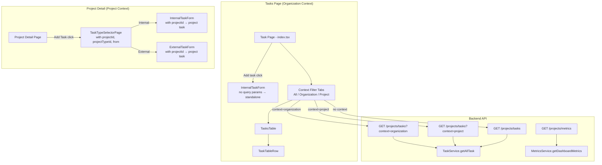
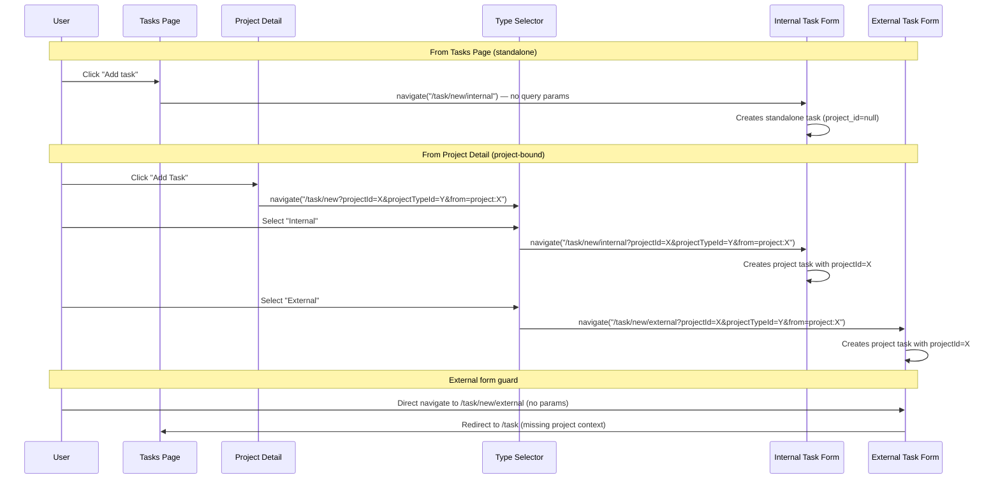

# Design Document: Task Context Separation

## Overview

This design separates task creation and display into two distinct contexts: organization-level (standalone) tasks and project-bound tasks. The current system already supports standalone tasks (`project_id = null`) from the task-page-overhaul spec, but forms still expose pipeline/project selectors, external tasks can be created without project context, and the task list shows all tasks in a flat list without context filtering.

The changes span both frontend and backend:
- **Frontend**: Remove pipeline/project selectors from both task forms, add redirect guard on external task form, add context filter tabs to the Tasks page, conditionally show a Category column for project tasks, and update the "Add Task" navigation flow.
- **Backend**: Add a `context` query parameter to the `GET /projects/tasks` endpoint for filtering by standalone vs project-bound, and extend the metrics endpoint to return context-separated task counts.

### Key Design Decisions

1. **Context inherited from navigation, not form selectors**: Pipeline/Project fields are removed from both forms. When navigating from a project detail page, `projectId` and `projectTypeId` are passed as URL query parameters and silently applied to the payload. When navigating from the Tasks page, no query params means standalone task.
2. **External tasks require project context**: The external task form validates that `projectId` and `projectTypeId` query params exist on mount. If missing, it redirects to `/task`. This enforces that external tasks always have a project and client context.
3. **Tasks page goes directly to internal form**: The "Add task" button on the Tasks page navigates to `/task/new/internal` (no query params), creating a standalone task. The type selector is only reachable from project detail.
4. **Context filter is additive to existing filters**: A new "context" filter (All / Organization / Project) is added to the Tasks page. It works alongside the existing status and type filters. The backend `context` query param is passed through to the API.
5. **Metrics endpoint extended, not replaced**: The existing `getTaskStatusCounts` repository method is extended to return separate counts for standalone and project tasks, with project tasks further broken down by internal/external category.

## Architecture



### Navigation Flow



## Components and Interfaces

### 1. InternalTaskForm — Remove Pipeline/Project Selectors

**File**: `Pylott-Web-App/src/pages/Home/Task/internal-task-form.tsx`

**Changes**:
- Remove the `project_type_id` (Pipeline) `<FormField>` and its `<Select>` component
- Remove the `project_id` (Project) `<FormField>` and its `<Select>` component
- Remove imports: `useGetAllProjectTypes`, `useGetAllProjects`
- Keep reading `projectId` and `projectTypeId` from `useSearchParams()` (already done)
- Keep the existing logic that auto-assigns these values to the payload when present
- The form schema already has `project_type_id` and `project_id` as optional — no schema change needed
- The existing standalone vs project-bound submission logic remains unchanged

**Resulting field order**:
1. Task name (optional)
2. Task category type (optional)
3. Due date (required)
4. Status (required)
5. Assignees (required)

### 2. ExternalTaskForm — Remove Selectors + Add Redirect Guard

**File**: `Pylott-Web-App/src/pages/Home/Task/external-task-form.tsx`

**Changes**:
- The form already reads `projectId` and `projectTypeId` from query params and uses them
- The form already has no visible Pipeline/Project selector fields (it uses `initialProjectId` directly)
- Add a redirect guard: on mount, if `initialProjectId` or `initialProjectTypeId` is empty, call `navigate("/task", { replace: true })` and return null
- Remove `project_type_id` and `project_id` from the yup schema's `required()` validators since they come from query params, not form input — instead, set them directly in the payload from query params
- The form already auto-pulls clients using `useAvailableAssignees(selectedProjectId, "external")`

**Redirect guard implementation**:
```typescript
useEffect(() => {
  if (!initialProjectId || !initialProjectTypeId) {
    navigate("/task", { replace: true });
  }
}, [initialProjectId, initialProjectTypeId, navigate]);

if (!initialProjectId || !initialProjectTypeId) return null;
```

### 3. Tasks Page — Context Filter Tabs

**File**: `Pylott-Web-App/src/pages/Home/Task/index.tsx`

**Changes**:
- Add a `contextFilter` state: `useState<"all" | "organization" | "project">("all")`
- Add a segmented button group / tab bar above the existing filters with three options: "All Tasks", "Organization Tasks", "Project Tasks"
- Default to `"all"` on initial load (Requirement 5.5)
- Pass `contextFilter` to `<TasksTable>` as a new prop
- The "Add task" button already navigates to `/task/new/internal` — no change needed

**Context filter UI**: Three pill-style buttons in a row, similar to the existing status/type filter selects but as toggle buttons for visual distinction.

### 4. TasksTable — Context Filtering + Conditional Category Column

**File**: `Pylott-Web-App/src/pages/Home/Task/task-table.tsx`

**Changes**:
- Accept new prop `contextFilter?: "all" | "organization" | "project"`
- Update `useGetAllTasks` call to pass the `context` query parameter to the API when not `"all"`
- When `contextFilter === "project"`, add a "Category" column header between "Task Name" and "Due Date"
- Adjust column count for skeleton loaders and empty states accordingly

**Updated `useGetAllTasks` hook**: Extend to accept an optional `context` parameter that gets appended to the endpoint URL.

### 5. TaskTableRow — Conditional Category Cell

**File**: `Pylott-Web-App/src/pages/Home/Task/task-table-row.tsx`

**Changes**:
- Accept new prop `showCategory?: boolean`
- When `showCategory` is true, render an additional `<TableCell>` after Task Name showing the task category: "Internal" or "External" based on `task.task_category`
- Use a simple text label or badge for the category

### 6. useGetAllTasks Hook — Context Parameter

**File**: `Pylott-Web-App/src/hooks/project-modules/tasks/use-get-all-tasks.tsx`

**Changes**:
- Add optional `context` parameter: `useGetAllTasks(search?: string, context?: string)`
- Update the endpoint URL construction to append `&context={context}` when provided
- Include `context` in the query key for proper cache separation

**Updated endpoint constant**: Modify `ENDPOINTS.GET_ALL_TASKS` to accept an optional context:
```typescript
GET_ALL_TASKS: (search?: string, context?: string) =>
  `projects/tasks${search ? `?search=${search}` : ""}${context ? `${search ? "&" : "?"}context=${context}` : ""}`,
```

### 7. Backend — Task Query Context Filter

**File**: `Pylott-Backend/src/modules/projects/services/task.service.ts`

**Changes to `getAllTask` method**:
- Read `context` from the `query` object
- When `context === "organization"`: add a WHERE clause `project_id IS NULL`
- When `context === "project"`: add a WHERE clause `project_id IS NOT NULL`
- When `context` is absent or any other value: no additional filter (return all)
- Pass the context filter down to the repository's `getAllTasks` method

**File**: `Pylott-Backend/src/modules/projects/projects.controller.ts`

**Changes to `getAllTasks` method**:
- Extract `context` from `req.query` and pass it through to `TaskService.getAllTask`

### 8. Backend — Metrics Context Separation

**File**: `Pylott-Backend/src/modules/projects/services/metrics.service.ts`

**Changes to `getDashboardMetrics`**:
- Replace the single `taskReport` with a structured object containing:
  - `standalone_tasks`: status counts for tasks where `project_id IS NULL`
  - `project_tasks`: status counts for tasks where `project_id IS NOT NULL`, further broken down by `task_category` (internal/external)
  - `project_tasks_by_project`: status counts grouped by `project_id`

**Repository changes**: Add new methods to `ProjectTaskRepository`:
- `getTaskStatusCountsByContext(company_id, context)`: Returns status counts filtered by standalone or project
- `getProjectTaskCountsByCategory(company_id)`: Returns project task counts grouped by internal/external
- `getProjectTaskCountsByProject(company_id)`: Returns task counts grouped by project_id

### 9. Route Configuration — No Changes Needed

**File**: `Pylott-Web-App/src/routes/app.tsx`

The current route configuration already has:
- `/task/new` → `TaskTypeSelectorPage` (used by project detail "Add Task")
- `/task/new/internal` → `InternalTaskForm`
- `/task/new/external` → `ExternalTaskForm`

No route changes are needed. The project detail page already navigates to `/task/new?projectId=...&projectTypeId=...&from=project:...` which hits the type selector. The Tasks page already navigates to `/task/new/internal` directly.

## Data Models

### Context Filter Query Parameter

```typescript
// Added to GET /projects/tasks endpoint
interface TaskQueryParams {
  search?: string;
  status?: string;
  task_category_type?: string;
  include_archived?: string;
  context?: "organization" | "project";  // NEW
}
```

### Metrics Response — Extended Structure

```typescript
// Current structure
interface TaskReport {
  draft: number;
  sent: number;
  in_progress: number;
  completed: number;
  archived: number;
}

// New structure
interface ContextualTaskReport {
  all: TaskReport;                    // Total counts (backward compatible)
  standalone: TaskReport;             // project_id IS NULL
  project: TaskReport;                // project_id IS NOT NULL
  project_by_category: {
    internal: TaskReport;             // project tasks with task_category = 'internal'
    external: TaskReport;             // project tasks with task_category = 'external'
  };
  project_by_project: Array<{
    project_id: string;
    project_name: string;
    counts: TaskReport;
  }>;
}
```

### Context Filter State (Frontend)

```typescript
type TaskContextFilter = "all" | "organization" | "project";
```

### TasksTable Props — Extended

```typescript
interface TasksTableProps {
  search: string;
  statusFilter?: string;
  typeFilter?: string;
  showArchived?: boolean;
  contextFilter?: TaskContextFilter;  // NEW
  onTaskClick?: (task: Task) => void;
}
```

### TaskTableRow Props — Extended

```typescript
interface TaskTableRowProps {
  task: Task;
  showCategory?: boolean;  // NEW — show Internal/External column
  onTaskClick?: (task: Task) => void;
}
```


## Correctness Properties

*A property is a characteristic or behavior that should hold true across all valid executions of a system — essentially, a formal statement about what the system should do. Properties serve as the bridge between human-readable specifications and machine-verifiable correctness guarantees.*

### Property 1: Query parameters auto-assigned to task payload

*For any* valid UUID pair (projectId, projectTypeId) passed as URL query parameters to either the Internal_Task_Form or External_Task_Form, the resulting submission payload SHALL contain those exact values as `project_id` and `project_type_id`, and the form SHALL NOT render Pipeline or Project selector fields.

**Validates: Requirements 1.2, 1.5**

### Property 2: Context filter returns correct task subset

*For any* set of tasks (mix of standalone and project-bound) and any context filter value ("organization", "project", or absent), the Task_API SHALL return exactly the tasks matching that context: "organization" returns only tasks where `project_id IS NULL`, "project" returns only tasks where `project_id IS NOT NULL`, and absent returns all tasks. This filter SHALL compose correctly with any combination of status, category_type, and search filters — the result is always the intersection of all active filters.

**Validates: Requirements 5.2, 5.3, 5.6, 6.1, 6.2, 6.3, 6.4**

### Property 3: Type selector forwards query parameters to target form

*For any* projectId and projectTypeId string pair and any task type selection (Internal or External), the Type_Selector SHALL produce a navigation URL that contains both `projectId` and `projectTypeId` as query parameters, targeting the correct form path (`/task/new/internal` or `/task/new/external`).

**Validates: Requirements 4.1, 4.2, 4.3**

### Property 4: Metrics counts are consistent with task data

*For any* set of tasks belonging to a company, the Metrics_API response SHALL satisfy: (a) standalone count + project count = total count for each status, (b) internal project count + external project count = total project count for each status, and (c) the sum of all per-project counts = total project count for each status.

**Validates: Requirements 7.1, 7.2, 7.3, 7.4**

### Property 5: External form redirects without project context

*For any* combination of missing query parameters (no projectId, no projectTypeId, or neither), the External_Task_Form SHALL redirect to `/task` without rendering the form.

**Validates: Requirements 2.2**

### Property 6: External form auto-pulls clients from projectId

*For any* valid projectId passed as a query parameter to the External_Task_Form, the form SHALL fetch available assignees using that projectId with category "external", and the resulting client options SHALL be derived from that API response.

**Validates: Requirements 2.3**

## Error Handling

### Frontend

| Scenario | Handling |
|----------|----------|
| External form opened without projectId/projectTypeId | Redirect to `/task` via `navigate("/task", { replace: true })` |
| Context filter API call fails | Toast error; table shows "Something went wrong" empty state |
| Task creation fails (API error) | Toast notification with error message; form remains open for retry |
| Task row click with null project_id | TaskDetailPanel already handles null projectId — uses standalone comment endpoints |
| No tasks match current filter combination | Table shows "No tasks found" empty state |

### Backend

| Scenario | HTTP Status | Response |
|----------|-------------|----------|
| `context=organization` with valid auth | 200 | Tasks where `project_id IS NULL` |
| `context=project` with valid auth | 200 | Tasks where `project_id IS NOT NULL` |
| Invalid `context` value (e.g., `context=foo`) | 200 | Treated as no filter — returns all tasks |
| Metrics endpoint with no tasks | 200 | All counts are 0 in each category |
| Unauthorized request | 401 | `{ status: false, message: "Unauthorized" }` |

## Testing Strategy

### Unit Tests

Unit tests cover specific examples, edge cases, and UI rendering:

- **Internal form field removal**: Render `InternalTaskForm` and assert Pipeline and Project selector fields are absent
- **External form field removal**: Render `ExternalTaskForm` with valid query params and assert Pipeline and Project selector fields are absent
- **External form redirect**: Render `ExternalTaskForm` without query params and assert navigation to `/task`
- **Tasks page "Add task" navigation**: Click the "Add task" button and assert navigation to `/task/new/internal` with no query params
- **Tasks page context filter rendering**: Render the Tasks page and assert the context filter UI shows "All Tasks", "Organization Tasks", "Project Tasks"
- **Tasks page default filter**: On initial render, assert the context filter defaults to "all" (showing all tasks)
- **Category column visibility**: When context filter is "project", assert the "Category" column header appears; when "all" or "organization", assert it does not
- **Standalone task creation payload**: Submit the internal form without query params and assert payload has `project_id: null`
- **Project task creation payload**: Submit the internal form with projectId query param and assert payload has `project_id` set
- **Metrics response structure**: Assert the metrics response contains `standalone`, `project`, `project_by_category`, and `project_by_project` keys

### Property-Based Tests

Property-based tests use `fast-check` with a minimum of 100 iterations per test.

Each property test references its design document property:

1. **Feature: task-context-separation, Property 1: Query parameters auto-assigned to task payload**
   - Generate arbitrary UUID pairs for projectId and projectTypeId
   - For each pair, simulate opening the form with those query params and assert the submission payload contains those exact values
   - Assert no Pipeline/Project selector elements are rendered

2. **Feature: task-context-separation, Property 2: Context filter returns correct task subset**
   - Generate arbitrary arrays of task objects with random `project_id` values (some null, some set)
   - For each context filter value ("organization", "project", absent), apply the filter logic and assert the result contains exactly the matching tasks
   - Generate arbitrary combinations of context + status + category_type filters and assert the result is the intersection

3. **Feature: task-context-separation, Property 3: Type selector forwards query parameters to target form**
   - Generate arbitrary UUID pairs and task type selections (Internal/External)
   - Assert the constructed navigation URL contains both UUIDs as query params and targets the correct form path

4. **Feature: task-context-separation, Property 4: Metrics counts are consistent with task data**
   - Generate arbitrary arrays of task objects with random project_id (null or set) and task_category (internal/external)
   - Compute the expected metrics breakdown and assert standalone + project = total, internal + external = project total, sum of per-project = project total

5. **Feature: task-context-separation, Property 5: External form redirects without project context**
   - Generate arbitrary combinations of present/absent projectId and projectTypeId query params where at least one is missing
   - Assert the form triggers a redirect to `/task`

6. **Feature: task-context-separation, Property 6: External form auto-pulls clients from projectId**
   - Generate arbitrary valid projectId UUIDs
   - Assert the form calls the assignees endpoint with that projectId and category "external"

### Test Configuration

- Library: `fast-check` for property-based testing, `vitest` for unit tests
- Minimum iterations: 100 per property test
- Each property test tagged with: `Feature: task-context-separation, Property {N}: {title}`
