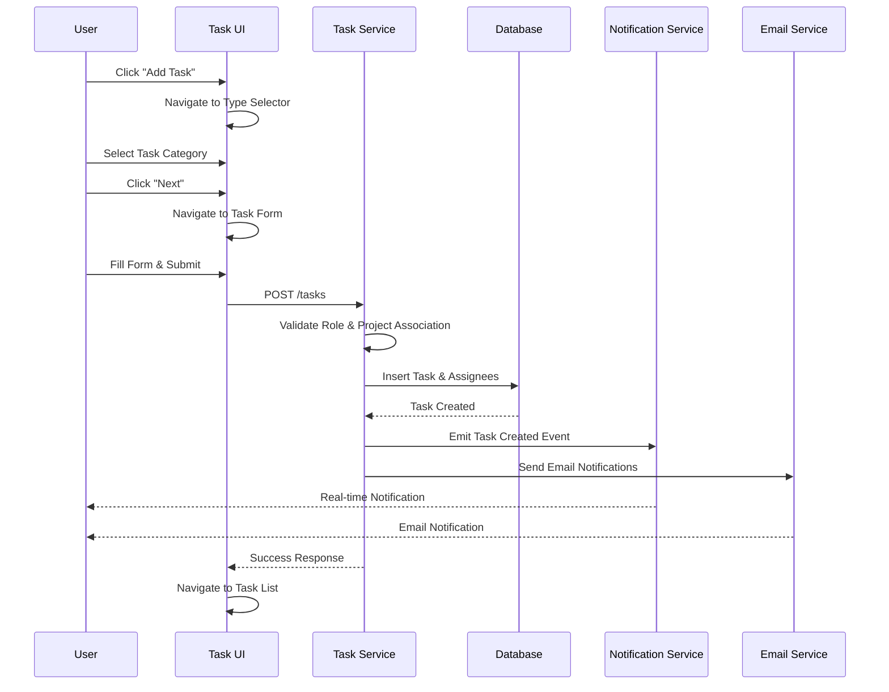
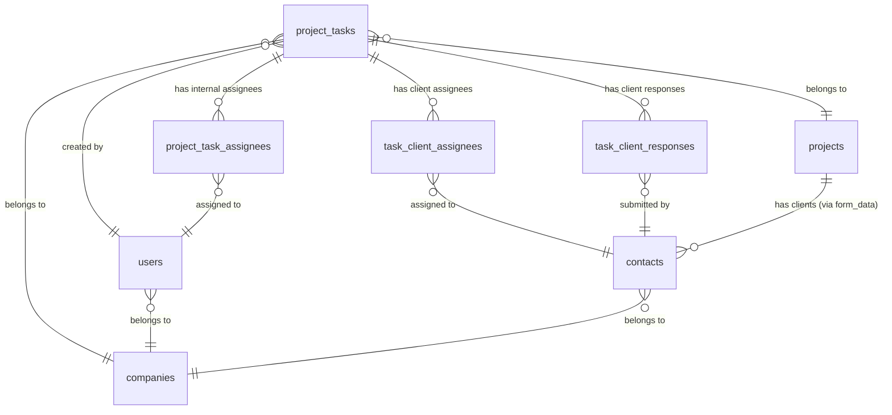
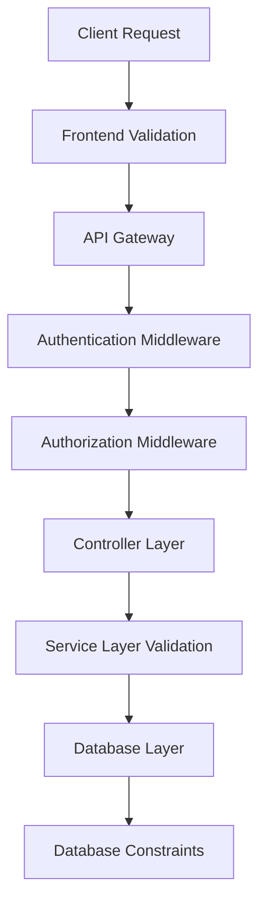

# Design Document: Task Improvement Feature

## Overview

The Task Improvement feature introduces a comprehensive task categorization system that distinguishes between internal team tasks and external client-facing tasks. This enhancement transforms the current modal-based task creation flow into a multi-step wizard that guides users through task type selection and appropriate form fields based on the selected category.

The system implements role-based access control, ensuring internal tasks are assigned only to admin/consultant users while external tasks are assigned to project-associated clients. This design maintains backward compatibility with the existing task system while introducing new capabilities for client collaboration and flexible information gathering.

## Architecture

### System Components Overview

```mermaid
graph TD
    A[Task Creation Entry Point] --> B[Task Type Selector Page]
    B --> C{Task Category}
    C -->|Internal| D[Internal Task Form]
    C -->|External| E[External Task Form]
    D --> F[Task Service Layer]
    E --> F
    F --> G[Database Layer]
    F --> H[Notification Service]
    F --> I[Email Service]
    G --> J[(MySQL Database)]
    H --> K[Real-time Notifications]
    I --> L[SendGrid Email]
```



### Main Workflow Sequence




## Components and Interfaces

### Frontend Components

#### 1. TaskTypeSelectorPage

**Purpose**: First step in task creation wizard - allows user to select internal or external task category

**Interface**:
```typescript
interface TaskTypeSelectorPageProps {
  projectId: string;
  onCancel: () => void;
  onNext: (taskCategory: TaskCategory) => void;
}

enum TaskCategory {
  INTERNAL = 'internal',
  EXTERNAL = 'external'
}

interface TaskTypeSelectorState {
  selectedCategory: TaskCategory | null;
  isLoading: boolean;
}
```

**Responsibilities**:
- Display two task category options with descriptions
- Validate selection before allowing navigation
- Handle navigation to appropriate task form
- Provide cancel action to return to previous page

#### 2. InternalTaskForm

**Purpose**: Form for creating internal tasks assigned to admin/consultant users

**Interface**:
```typescript
interface InternalTaskFormProps {
  projectId: string;
  onCancel: () => void;
  onSubmit: (data: InternalTaskFormData) => Promise<void>;
}

interface InternalTaskFormData {
  name?: string;
  assigneeIds: string[];
  additionalInfo: string[];
  dueDate: Date;
  description?: string;
  attachments?: File[];
}

interface InternalTaskFormState {
  formData: InternalTaskFormData;
  availableAssignees: UserOption[];
  isSubmitting: boolean;
  errors: FormErrors;
}

interface UserOption {
  id: string;
  name: string;
  email: string;
  role: UserRoles;
}
```

**Responsibilities**:
- Fetch and display admin/consultant users for assignment
- Manage flexible additional information list
- Handle file attachments via Cloudinary
- Validate form data before submission
- Submit task creation request to backend


#### 3. ExternalTaskForm

**Purpose**: Form for creating external tasks assigned to project clients

**Interface**:
```typescript
interface ExternalTaskFormProps {
  projectId: string;
  onCancel: () => void;
  onSubmit: (data: ExternalTaskFormData) => Promise<void>;
}

interface ExternalTaskFormData {
  name: string;
  clientIds: string[];
  requiredInformation: string[];
  dueDate: Date;
  description?: string;
}

interface ExternalTaskFormState {
  formData: ExternalTaskFormData;
  availableClients: ClientOption[];
  isSubmitting: boolean;
  errors: FormErrors;
}

interface ClientOption {
  id: string;
  name: string;
  email: string;
  organization?: string;
}
```

**Responsibilities**:
- Fetch and display project-associated clients only
- Manage required information list (free-text input with add/remove)
- Validate required fields (name, clients, due date)
- Submit external task creation request to backend

#### 4. ClientTaskView

**Purpose**: Client-facing view for external tasks with file upload and checklist

**Interface**:
```typescript
interface ClientTaskViewProps {
  taskId: string;
  onUpdate: (data: ClientTaskUpdateData) => Promise<void>;
}

interface ClientTaskUpdateData {
  completedItems: Record<string, boolean>;
  uploadedFiles: Record<string, File>;
  comment?: string;
}

interface ClientTaskViewState {
  task: ExternalTaskDetails;
  completedItems: Record<string, boolean>;
  uploadedFiles: Record<string, string>; // item -> cloudinary URL
  comment: string;
  isSubmitting: boolean;
}

interface ExternalTaskDetails {
  id: string;
  name: string;
  description?: string;
  requiredInformation: string[];
  dueDate: Date;
  status: TaskStatus;
  createdBy: string;
}
```

**Responsibilities**:
- Display task details and required information checklist
- Handle file uploads for each required item
- Track completion status of checklist items
- Allow client to add comments/notes
- Submit updates to backend


### Backend Components

#### 1. TaskController

**Purpose**: Handle HTTP requests for task operations

**Interface**:
```typescript
class TaskController {
  createTask(req: Request, res: Response): Promise<Response>;
  getTasksByProject(req: Request, res: Response): Promise<Response>;
  getTaskDetails(req: Request, res: Response): Promise<Response>;
  updateTask(req: Request, res: Response): Promise<Response>;
  updateClientTaskProgress(req: Request, res: Response): Promise<Response>;
  deleteTask(req: Request, res: Response): Promise<Response>;
}

interface CreateTaskRequest {
  projectId: string;
  taskCategory: TaskCategory;
  name?: string;
  description?: string;
  dueDate: Date;
  assigneeIds: string[];
  requiredInformation?: string[];
  additionalInfo?: string[];
  attachments?: string[];
}

interface CreateTaskResponse {
  success: boolean;
  data: TaskDetails;
  message: string;
}
```

**Responsibilities**:
- Validate request data and user permissions
- Delegate business logic to TaskService
- Handle error responses
- Return standardized API responses

#### 2. TaskService

**Purpose**: Core business logic for task operations

**Interface**:
```typescript
class TaskService {
  createInternalTask(data: InternalTaskData, userId: string): Promise<Task>;
  createExternalTask(data: ExternalTaskData, userId: string): Promise<Task>;
  validateInternalAssignees(assigneeIds: string[]): Promise<boolean>;
  validateClientAssignees(clientIds: string[], projectId: string): Promise<boolean>;
  getProjectClients(projectId: string): Promise<Contact[]>;
  getTasksByProject(projectId: string, userId: string): Promise<Task[]>;
  updateTaskStatus(taskId: string, status: TaskStatus): Promise<Task>;
}

interface InternalTaskData {
  projectId: string;
  companyId: string;
  name?: string;
  description?: string;
  dueDate: Date;
  assigneeIds: string[];
  additionalInfo: string[];
  attachments: string[];
}

interface ExternalTaskData {
  projectId: string;
  companyId: string;
  name: string;
  description?: string;
  dueDate: Date;
  clientIds: string[];
  requiredInformation: string[];
}
```

**Responsibilities**:
- Implement task creation logic for both categories
- Validate role-based assignee restrictions
- Validate project-client associations
- Coordinate with database models
- Trigger notifications and emails


#### 3. TaskValidationService

**Purpose**: Centralized validation logic for task operations

**Interface**:
```typescript
class TaskValidationService {
  validateTaskCategory(category: string): boolean;
  validateInternalAssignees(assigneeIds: string[]): Promise<ValidationResult>;
  validateExternalAssignees(clientIds: string[], projectId: string): Promise<ValidationResult>;
  validateRequiredInformation(items: string[]): ValidationResult;
  validateDueDate(dueDate: Date): ValidationResult;
}

interface ValidationResult {
  isValid: boolean;
  errors: string[];
}
```

**Responsibilities**:
- Validate task category enum values
- Check user roles for internal task assignees
- Verify client-project associations for external tasks
- Validate required information format
- Validate due date constraints

#### 4. NotificationService (Extended)

**Purpose**: Handle real-time notifications for task events

**Interface**:
```typescript
class NotificationService {
  notifyTaskAssigned(task: Task, assignees: User[]): Promise<void>;
  notifyExternalTaskAssigned(task: Task, clients: Contact[]): Promise<void>;
  notifyTaskCompleted(task: Task): Promise<void>;
  notifyTaskDueSoon(task: Task): Promise<void>;
}
```

**Responsibilities**:
- Emit real-time events for task assignments
- Create notification records in database
- Handle different notification types for internal vs external tasks

#### 5. EmailService (Extended)

**Purpose**: Send email notifications via SendGrid

**Interface**:
```typescript
class EmailService {
  sendInternalTaskAssignmentEmail(task: Task, assignees: User[]): Promise<void>;
  sendExternalTaskAssignmentEmail(task: Task, clients: Contact[]): Promise<void>;
  sendTaskCompletionEmail(task: Task): Promise<void>;
  sendTaskReminderEmail(task: Task, recipients: User[] | Contact[]): Promise<void>;
}

interface EmailTemplate {
  subject: string;
  htmlContent: string;
  textContent: string;
}
```

**Responsibilities**:
- Generate email templates for different task events
- Send emails via SendGrid API
- Handle email delivery errors
- Track email delivery status


## Data Models

### Database Schema Changes

#### 1. project_tasks Table (Modified)

```typescript
interface ProjectTaskSchema {
  id: string; // Primary key
  project_id: string; // Foreign key to projects
  company_id: string; // Foreign key to companies
  author_id: string; // Foreign key to users (creator)
  task_type_id: string; // Foreign key to metadata (existing)
  task_category: TaskCategory; // NEW: ENUM('internal', 'external')
  name: string; // Optional for internal, required for external
  description: string | null;
  status: TaskStatus; // ENUM('pending', 'completed')
  visibility: TaskVisibility; // Existing: ENUM('inhouse', 'client_facing')
  document_url: string | null; // Existing
  due_date: Date; // Required (renamed from end_date)
  required_information: string[] | null; // NEW: JSON array for external tasks
  additional_info: string[] | null; // NEW: JSON array for internal tasks
  created_at: Date;
  updated_at: Date;
  deleted_at: Date | null;
}

enum TaskCategory {
  INTERNAL = 'internal',
  EXTERNAL = 'external'
}

enum TaskStatus {
  PENDING = 'pending',
  COMPLETED = 'completed'
}

enum TaskVisibility {
  INHOUSE = 'inhouse',
  CLIENT_FACING = 'client_facing'
}
```

**Migration Strategy**:
- Add `task_category` column with default 'internal' for existing tasks
- Add `required_information` JSON column (nullable)
- Add `additional_info` JSON column (nullable)
- Add index on `task_category` for filtering
- Maintain backward compatibility with existing tasks

#### 2. project_task_assignees Table (Existing - For Internal Tasks)

```typescript
interface ProjectTaskAssigneesSchema {
  id: string; // Primary key
  task_id: string; // Foreign key to project_tasks
  assignee_id: string; // Foreign key to users (ADMIN/CONSULTANT only)
  project_id: string; // Foreign key to projects
  company_id: string; // Foreign key to companies
  created_at: Date;
  updated_at: Date;
  deleted_at: Date | null;
}
```

**Usage**: Stores internal task assignments to admin/consultant users

**Constraints**:
- Assignee must have role IN ('ADMIN', 'CONSULTANT', 'SUPER_ADMIN')
- Validated at application layer


#### 3. task_client_assignees Table (NEW - For External Tasks)

```typescript
interface TaskClientAssigneesSchema {
  id: string; // Primary key (UUID)
  task_id: string; // Foreign key to project_tasks
  client_id: string; // Foreign key to contacts
  project_id: string; // Foreign key to projects
  company_id: string; // Foreign key to companies
  created_at: Date;
  updated_at: Date;
  deleted_at: Date | null;
}
```

**Purpose**: Stores external task assignments to project clients

**Constraints**:
- Client must exist in `contacts` table
- Client ID must be in `projects.form_data.project_client` array
- Validated at application layer and database trigger (optional)

**Indexes**:
- Primary key on `id`
- Index on `task_id` for task lookups
- Index on `client_id` for client task queries
- Composite index on `(project_id, client_id)` for validation queries

#### 4. task_client_responses Table (NEW - For Client Submissions)

```typescript
interface TaskClientResponsesSchema {
  id: string; // Primary key (UUID)
  task_id: string; // Foreign key to project_tasks
  client_id: string; // Foreign key to contacts
  required_item: string; // The specific required information item
  file_url: string | null; // Cloudinary URL for uploaded file
  is_completed: boolean; // Whether this item is marked complete
  comment: string | null; // Optional client comment
  created_at: Date;
  updated_at: Date;
  deleted_at: Date | null;
}
```

**Purpose**: Tracks client responses to external task requirements

**Usage**:
- One record per required information item per client
- Stores file uploads and completion status
- Allows clients to add comments per item

**Indexes**:
- Primary key on `id`
- Index on `task_id` for task response queries
- Composite index on `(task_id, client_id)` for client-specific responses
- Index on `is_completed` for progress tracking


### Data Model Relationships



### Validation Rules

#### Internal Task Validation

```typescript
interface InternalTaskValidationRules {
  taskCategory: 'internal';
  name: {
    required: false;
    maxLength: 255;
  };
  assigneeIds: {
    required: true;
    minLength: 1;
    validation: 'Must be users with role ADMIN, CONSULTANT, or SUPER_ADMIN';
  };
  additionalInfo: {
    required: false;
    itemMaxLength: 500;
  };
  dueDate: {
    required: true;
    validation: 'Must be future date';
  };
  description: {
    required: false;
    maxLength: 2000;
  };
}
```

#### External Task Validation

```typescript
interface ExternalTaskValidationRules {
  taskCategory: 'external';
  name: {
    required: true;
    minLength: 3;
    maxLength: 255;
  };
  clientIds: {
    required: true;
    minLength: 1;
    validation: 'Must be contacts associated with project via form_data.project_client';
  };
  requiredInformation: {
    required: true;
    minLength: 1;
    itemMaxLength: 500;
  };
  dueDate: {
    required: true;
    validation: 'Must be future date';
  };
  description: {
    required: false;
    maxLength: 2000;
  };
}
```


## API Endpoints

### Task Management Endpoints

#### 1. Create Task

```typescript
POST /api/v1/projects/:projectId/tasks

// Request Body
interface CreateTaskRequestBody {
  taskCategory: 'internal' | 'external';
  name?: string; // Optional for internal, required for external
  description?: string;
  dueDate: string; // ISO 8601 format
  assigneeIds: string[]; // User IDs for internal, Contact IDs for external
  requiredInformation?: string[]; // For external tasks only
  additionalInfo?: string[]; // For internal tasks only
  attachments?: string[]; // Cloudinary URLs
}

// Response
interface CreateTaskResponse {
  success: boolean;
  data: {
    id: string;
    projectId: string;
    taskCategory: TaskCategory;
    name: string;
    description: string | null;
    dueDate: string;
    status: TaskStatus;
    assignees: AssigneeDetails[];
    requiredInformation: string[] | null;
    additionalInfo: string[] | null;
    createdAt: string;
  };
  message: string;
}

// Error Response
interface ErrorResponse {
  success: false;
  error: string;
  details?: ValidationError[];
}
```

**Validation**:
- Verify user has permission to create tasks in project
- Validate task category enum
- For internal: Validate assignees are ADMIN/CONSULTANT/SUPER_ADMIN
- For external: Validate clients are in project.form_data.project_client
- Validate due date is in future
- Validate required fields based on task category

#### 2. Get Project Tasks

```typescript
GET /api/v1/projects/:projectId/tasks?category=internal|external&assigneeId=xxx

// Query Parameters
interface GetTasksQueryParams {
  category?: 'internal' | 'external';
  assigneeId?: string;
  status?: 'pending' | 'completed';
}

// Response
interface GetTasksResponse {
  success: boolean;
  data: TaskListItem[];
  pagination: {
    total: number;
    page: number;
    limit: number;
  };
}

interface TaskListItem {
  id: string;
  name: string;
  taskCategory: TaskCategory;
  status: TaskStatus;
  dueDate: string;
  assignees: AssigneeDetails[];
  isOverdue: boolean;
  completionPercentage?: number; // For external tasks with responses
}
```

**Authorization**:
- Admin/Consultant: Can see all tasks
- Client: Can only see external tasks assigned to them


#### 3. Get Task Details

```typescript
GET /api/v1/tasks/:taskId

// Response
interface GetTaskDetailsResponse {
  success: boolean;
  data: {
    id: string;
    projectId: string;
    taskCategory: TaskCategory;
    name: string;
    description: string | null;
    status: TaskStatus;
    dueDate: string;
    assignees: AssigneeDetails[];
    requiredInformation: string[] | null;
    additionalInfo: string[] | null;
    attachments: AttachmentDetails[];
    clientResponses?: ClientResponseDetails[]; // For external tasks
    createdBy: UserDetails;
    createdAt: string;
    updatedAt: string;
  };
}

interface ClientResponseDetails {
  clientId: string;
  clientName: string;
  responses: {
    requiredItem: string;
    fileUrl: string | null;
    isCompleted: boolean;
    comment: string | null;
  }[];
}
```

**Authorization**:
- Admin/Consultant: Can view all task details
- Client: Can only view external tasks assigned to them

#### 4. Update Client Task Progress

```typescript
POST /api/v1/tasks/:taskId/client-response

// Request Body
interface UpdateClientResponseBody {
  responses: {
    requiredItem: string;
    fileUrl?: string; // Cloudinary URL
    isCompleted: boolean;
    comment?: string;
  }[];
}

// Response
interface UpdateClientResponseResponse {
  success: boolean;
  data: {
    taskId: string;
    completionPercentage: number;
    updatedResponses: ClientResponseDetails;
  };
  message: string;
}
```

**Authorization**:
- Only clients assigned to the task can update responses
- Validates client is in task_client_assignees

#### 5. Update Task Status

```typescript
PATCH /api/v1/tasks/:taskId/status

// Request Body
interface UpdateTaskStatusBody {
  status: 'pending' | 'completed';
}

// Response
interface UpdateTaskStatusResponse {
  success: boolean;
  data: {
    id: string;
    status: TaskStatus;
    completedAt: string | null;
  };
  message: string;
}
```

**Authorization**:
- Admin/Consultant: Can update any task status
- Client: Cannot update task status (auto-updated when all responses complete)


#### 6. Get Available Assignees

```typescript
GET /api/v1/projects/:projectId/available-assignees?category=internal|external

// Query Parameters
interface GetAssigneesQueryParams {
  category: 'internal' | 'external';
}

// Response for Internal
interface GetInternalAssigneesResponse {
  success: boolean;
  data: {
    id: string;
    name: string;
    email: string;
    role: 'ADMIN' | 'CONSULTANT' | 'SUPER_ADMIN';
  }[];
}

// Response for External
interface GetExternalAssigneesResponse {
  success: boolean;
  data: {
    id: string;
    name: string;
    email: string;
    organization: string | null;
    phone: string;
  }[];
}
```

**Logic**:
- Internal: Returns users with role IN ('ADMIN', 'CONSULTANT', 'SUPER_ADMIN') in the company
- External: Returns contacts where contact.id IN project.form_data.project_client array

## Key Functions with Formal Specifications

### Function 1: validateInternalAssignees()

```typescript
async function validateInternalAssignees(
  assigneeIds: string[],
  companyId: string
): Promise<ValidationResult>
```

**Preconditions:**
- `assigneeIds` is a non-empty array of valid UUID strings
- `companyId` is a valid UUID string
- Database connection is available

**Postconditions:**
- Returns `ValidationResult` with `isValid: true` if all assignees are users with role IN ('ADMIN', 'CONSULTANT', 'SUPER_ADMIN')
- Returns `ValidationResult` with `isValid: false` and error details if any assignee fails validation
- No side effects on database state

**Algorithm:**
```typescript
ALGORITHM validateInternalAssignees(assigneeIds, companyId)
INPUT: assigneeIds (array of strings), companyId (string)
OUTPUT: ValidationResult

BEGIN
  ASSERT assigneeIds.length > 0
  ASSERT isValidUUID(companyId)
  
  // Fetch users from database
  users ← database.query(
    SELECT id, role FROM users 
    WHERE id IN assigneeIds 
    AND company_id = companyId
    AND deleted_at IS NULL
  )
  
  // Check if all assignees were found
  IF users.length ≠ assigneeIds.length THEN
    missingIds ← assigneeIds.filter(id => !users.find(u => u.id === id))
    RETURN {
      isValid: false,
      errors: [`Users not found: ${missingIds.join(', ')}`]
    }
  END IF
  
  // Validate roles
  invalidUsers ← []
  FOR each user IN users DO
    IF user.role NOT IN ['ADMIN', 'CONSULTANT', 'SUPER_ADMIN'] THEN
      invalidUsers.push(user.id)
    END IF
  END FOR
  
  IF invalidUsers.length > 0 THEN
    RETURN {
      isValid: false,
      errors: [`Invalid roles for users: ${invalidUsers.join(', ')}`]
    }
  END IF
  
  RETURN { isValid: true, errors: [] }
END
```


### Function 2: validateExternalAssignees()

```typescript
async function validateExternalAssignees(
  clientIds: string[],
  projectId: string
): Promise<ValidationResult>
```

**Preconditions:**
- `clientIds` is a non-empty array of valid UUID strings
- `projectId` is a valid UUID string
- Database connection is available

**Postconditions:**
- Returns `ValidationResult` with `isValid: true` if all clients exist and are associated with the project
- Returns `ValidationResult` with `isValid: false` and error details if any client fails validation
- No side effects on database state

**Algorithm:**
```typescript
ALGORITHM validateExternalAssignees(clientIds, projectId)
INPUT: clientIds (array of strings), projectId (string)
OUTPUT: ValidationResult

BEGIN
  ASSERT clientIds.length > 0
  ASSERT isValidUUID(projectId)
  
  // Fetch project with form_data
  project ← database.query(
    SELECT form_data FROM projects 
    WHERE id = projectId 
    AND deleted_at IS NULL
  )
  
  IF project IS NULL THEN
    RETURN {
      isValid: false,
      errors: ['Project not found']
    }
  END IF
  
  // Extract project clients from form_data
  projectClients ← project.form_data.project_client || []
  
  IF projectClients.length = 0 THEN
    RETURN {
      isValid: false,
      errors: ['Project has no associated clients']
    }
  END IF
  
  // Validate each client is in project clients
  invalidClients ← []
  FOR each clientId IN clientIds DO
    IF clientId NOT IN projectClients THEN
      invalidClients.push(clientId)
    END IF
  END FOR
  
  IF invalidClients.length > 0 THEN
    RETURN {
      isValid: false,
      errors: [`Clients not associated with project: ${invalidClients.join(', ')}`]
    }
  END IF
  
  // Verify clients exist in contacts table
  contacts ← database.query(
    SELECT id FROM contacts 
    WHERE id IN clientIds 
    AND deleted_at IS NULL
  )
  
  IF contacts.length ≠ clientIds.length THEN
    missingIds ← clientIds.filter(id => !contacts.find(c => c.id === id))
    RETURN {
      isValid: false,
      errors: [`Contacts not found: ${missingIds.join(', ')}`]
    }
  END IF
  
  RETURN { isValid: true, errors: [] }
END
```


### Function 3: createInternalTask()

```typescript
async function createInternalTask(
  data: InternalTaskData,
  userId: string
): Promise<Task>
```

**Preconditions:**
- `data` contains valid internal task data
- `data.assigneeIds` has been validated via `validateInternalAssignees()`
- `data.dueDate` is a future date
- `userId` is a valid user ID with permission to create tasks
- Database transaction is available

**Postconditions:**
- Returns created `Task` object with all relationships loaded
- Task record inserted into `project_tasks` table with `task_category = 'internal'`
- Assignee records inserted into `project_task_assignees` table
- Notifications emitted for all assignees
- Emails sent to all assignees
- Audit log entry created

**Algorithm:**
```typescript
ALGORITHM createInternalTask(data, userId)
INPUT: data (InternalTaskData), userId (string)
OUTPUT: Task

BEGIN
  ASSERT validateInternalAssignees(data.assigneeIds, data.companyId).isValid
  ASSERT data.dueDate > currentDate()
  
  // Start database transaction
  transaction ← database.beginTransaction()
  
  TRY
    // Create task record
    taskId ← generateUUID()
    task ← transaction.insert('project_tasks', {
      id: taskId,
      project_id: data.projectId,
      company_id: data.companyId,
      author_id: userId,
      task_category: 'internal',
      name: data.name || null,
      description: data.description || null,
      due_date: data.dueDate,
      status: 'pending',
      visibility: 'inhouse',
      additional_info: JSON.stringify(data.additionalInfo),
      created_at: now(),
      updated_at: now()
    })
    
    // Create assignee records
    FOR each assigneeId IN data.assigneeIds DO
      transaction.insert('project_task_assignees', {
        id: generateUUID(),
        task_id: taskId,
        assignee_id: assigneeId,
        project_id: data.projectId,
        company_id: data.companyId,
        created_at: now(),
        updated_at: now()
      })
    END FOR
    
    // Handle attachments if provided
    IF data.attachments.length > 0 THEN
      FOR each attachmentUrl IN data.attachments DO
        transaction.insert('documents', {
          id: generateUUID(),
          task_id: taskId,
          project_id: data.projectId,
          company_id: data.companyId,
          url: attachmentUrl,
          created_at: now()
        })
      END FOR
    END IF
    
    // Commit transaction
    transaction.commit()
    
    // Load complete task with relationships
    completeTask ← loadTaskWithRelations(taskId)
    
    // Emit notifications (async, non-blocking)
    notificationService.notifyTaskAssigned(completeTask, completeTask.assignees)
    
    // Send emails (async, non-blocking)
    emailService.sendInternalTaskAssignmentEmail(completeTask, completeTask.assignees)
    
    // Create audit log
    auditService.logTaskCreated(completeTask, userId)
    
    RETURN completeTask
    
  CATCH error
    transaction.rollback()
    THROW error
  END TRY
END
```


### Function 4: createExternalTask()

```typescript
async function createExternalTask(
  data: ExternalTaskData,
  userId: string
): Promise<Task>
```

**Preconditions:**
- `data` contains valid external task data
- `data.name` is non-empty string
- `data.clientIds` has been validated via `validateExternalAssignees()`
- `data.requiredInformation` is non-empty array
- `data.dueDate` is a future date
- `userId` is a valid user ID with permission to create tasks
- Database transaction is available

**Postconditions:**
- Returns created `Task` object with all relationships loaded
- Task record inserted into `project_tasks` table with `task_category = 'external'`
- Client assignee records inserted into `task_client_assignees` table
- Response placeholder records created in `task_client_responses` table
- Notifications emitted for all assigned clients
- Emails sent to all assigned clients
- Audit log entry created

**Algorithm:**
```typescript
ALGORITHM createExternalTask(data, userId)
INPUT: data (ExternalTaskData), userId (string)
OUTPUT: Task

BEGIN
  ASSERT data.name.length > 0
  ASSERT validateExternalAssignees(data.clientIds, data.projectId).isValid
  ASSERT data.requiredInformation.length > 0
  ASSERT data.dueDate > currentDate()
  
  // Start database transaction
  transaction ← database.beginTransaction()
  
  TRY
    // Create task record
    taskId ← generateUUID()
    task ← transaction.insert('project_tasks', {
      id: taskId,
      project_id: data.projectId,
      company_id: data.companyId,
      author_id: userId,
      task_category: 'external',
      name: data.name,
      description: data.description || null,
      due_date: data.dueDate,
      status: 'pending',
      visibility: 'client_facing',
      required_information: JSON.stringify(data.requiredInformation),
      created_at: now(),
      updated_at: now()
    })
    
    // Create client assignee records
    FOR each clientId IN data.clientIds DO
      transaction.insert('task_client_assignees', {
        id: generateUUID(),
        task_id: taskId,
        client_id: clientId,
        project_id: data.projectId,
        company_id: data.companyId,
        created_at: now(),
        updated_at: now()
      })
      
      // Create response placeholders for each required item
      FOR each requiredItem IN data.requiredInformation DO
        transaction.insert('task_client_responses', {
          id: generateUUID(),
          task_id: taskId,
          client_id: clientId,
          required_item: requiredItem,
          file_url: null,
          is_completed: false,
          comment: null,
          created_at: now(),
          updated_at: now()
        })
      END FOR
    END FOR
    
    // Commit transaction
    transaction.commit()
    
    // Load complete task with relationships
    completeTask ← loadTaskWithRelations(taskId)
    
    // Fetch client details
    clients ← fetchContactsByIds(data.clientIds)
    
    // Emit notifications (async, non-blocking)
    notificationService.notifyExternalTaskAssigned(completeTask, clients)
    
    // Send emails (async, non-blocking)
    emailService.sendExternalTaskAssignmentEmail(completeTask, clients)
    
    // Create audit log
    auditService.logTaskCreated(completeTask, userId)
    
    RETURN completeTask
    
  CATCH error
    transaction.rollback()
    THROW error
  END TRY
END
```


## Security Considerations

### Multi-Layer Security Architecture



### 1. Authentication & Authorization

**Authentication**:
- All API endpoints require valid JWT token
- Token must contain user ID, role, and company ID
- Token expiration enforced at middleware level

**Authorization Rules**:

```typescript
interface AuthorizationRules {
  createTask: {
    internal: ['ADMIN', 'CONSULTANT', 'SUPER_ADMIN'];
    external: ['ADMIN', 'SUPER_ADMIN'];
  };
  viewTask: {
    internal: ['ADMIN', 'CONSULTANT', 'SUPER_ADMIN'];
    external: ['ADMIN', 'CONSULTANT', 'SUPER_ADMIN', 'CLIENT'];
  };
  updateTask: {
    internal: ['ADMIN', 'CONSULTANT', 'SUPER_ADMIN'];
    external: ['ADMIN', 'SUPER_ADMIN'];
  };
  updateClientResponse: {
    external: ['CLIENT']; // Only assigned clients
  };
}
```

**Implementation**:
```typescript
async function authorizeTaskAccess(
  userId: string,
  userRole: UserRoles,
  taskId: string,
  action: 'view' | 'update' | 'delete'
): Promise<boolean> {
  // Fetch task with assignees
  const task = await getTaskWithAssignees(taskId);
  
  // Admin/Super Admin can access all tasks
  if (userRole === 'ADMIN' || userRole === 'SUPER_ADMIN') {
    return true;
  }
  
  // Consultant can access internal tasks
  if (userRole === 'CONSULTANT' && task.taskCategory === 'internal') {
    return true;
  }
  
  // Client can only view external tasks assigned to them
  if (userRole === 'CLIENT' && task.taskCategory === 'external' && action === 'view') {
    const isAssigned = task.clientAssignees.some(a => a.clientId === userId);
    return isAssigned;
  }
  
  return false;
}
```


### 2. Role-Based Assignee Validation

**Frontend Validation**:
```typescript
// Internal Task Form - Filter users by role
const fetchInternalAssignees = async (companyId: string) => {
  const users = await api.get(`/users?company_id=${companyId}`);
  return users.filter(u => 
    ['ADMIN', 'CONSULTANT', 'SUPER_ADMIN'].includes(u.role)
  );
};

// External Task Form - Filter clients by project association
const fetchExternalAssignees = async (projectId: string) => {
  const project = await api.get(`/projects/${projectId}`);
  const projectClientIds = project.form_data?.project_client || [];
  
  const contacts = await api.get(`/contacts?company_id=${project.company_id}`);
  return contacts.filter(c => projectClientIds.includes(c.id));
};
```

**Backend Validation**:
```typescript
// Service layer validation before task creation
async function validateTaskAssignees(
  taskCategory: TaskCategory,
  assigneeIds: string[],
  projectId: string,
  companyId: string
): Promise<void> {
  if (taskCategory === 'internal') {
    // Validate users have correct roles
    const users = await User.query()
      .whereIn('id', assigneeIds)
      .where('company_id', companyId)
      .whereNull('deleted_at');
    
    const invalidUsers = users.filter(u => 
      !['ADMIN', 'CONSULTANT', 'SUPER_ADMIN'].includes(u.role)
    );
    
    if (invalidUsers.length > 0) {
      throw new ValidationError(
        `Invalid assignees: ${invalidUsers.map(u => u.name).join(', ')} do not have required roles`
      );
    }
  } else {
    // Validate clients are associated with project
    const project = await Project.query()
      .findById(projectId)
      .whereNull('deleted_at');
    
    if (!project) {
      throw new NotFoundError('Project not found');
    }
    
    const projectClientIds = project.form_data?.project_client || [];
    const invalidClients = assigneeIds.filter(id => !projectClientIds.includes(id));
    
    if (invalidClients.length > 0) {
      throw new ValidationError(
        `Clients ${invalidClients.join(', ')} are not associated with this project`
      );
    }
    
    // Verify clients exist
    const contacts = await Contact.query()
      .whereIn('id', assigneeIds)
      .whereNull('deleted_at');
    
    if (contacts.length !== assigneeIds.length) {
      throw new ValidationError('Some client IDs are invalid');
    }
  }
}
```

### 3. Project-Client Association Security

**Database-Level Validation** (Optional Trigger):
```sql
-- MySQL trigger to validate client-project association
DELIMITER $$

CREATE TRIGGER validate_task_client_assignee
BEFORE INSERT ON task_client_assignees
FOR EACH ROW
BEGIN
  DECLARE project_clients JSON;
  DECLARE is_valid INT;
  
  -- Get project clients from form_data
  SELECT form_data->'$.project_client' INTO project_clients
  FROM projects
  WHERE id = NEW.project_id AND deleted_at IS NULL;
  
  -- Check if client_id exists in project_clients array
  SET is_valid = JSON_CONTAINS(project_clients, CONCAT('"', NEW.client_id, '"'));
  
  IF is_valid = 0 THEN
    SIGNAL SQLSTATE '45000'
    SET MESSAGE_TEXT = 'Client is not associated with this project';
  END IF;
END$$

DELIMITER ;
```

**Application-Level Validation**:
```typescript
async function validateClientProjectAssociation(
  clientId: string,
  projectId: string
): Promise<boolean> {
  const project = await Project.query()
    .findById(projectId)
    .whereNull('deleted_at');
  
  if (!project) {
    return false;
  }
  
  const projectClients = project.form_data?.project_client || [];
  return projectClients.includes(clientId);
}
```


### 4. Data Access Control

**Query-Level Security**:
```typescript
// Ensure users can only access tasks from their company
class TaskService {
  async getTasksByProject(
    projectId: string,
    userId: string,
    userRole: UserRoles
  ): Promise<Task[]> {
    const baseQuery = ProjectTask.query()
      .where('project_id', projectId)
      .whereNull('deleted_at');
    
    // Admin/Super Admin see all tasks
    if (userRole === 'ADMIN' || userRole === 'SUPER_ADMIN') {
      return baseQuery;
    }
    
    // Consultant sees internal tasks
    if (userRole === 'CONSULTANT') {
      return baseQuery.where('task_category', 'internal');
    }
    
    // Client sees only external tasks assigned to them
    if (userRole === 'CLIENT') {
      return baseQuery
        .where('task_category', 'external')
        .whereExists(
          TaskClientAssignees.query()
            .where('task_id', ProjectTask.ref('id'))
            .where('client_id', userId)
        );
    }
    
    return [];
  }
}
```

### 5. Input Sanitization

**Sanitization Rules**:
```typescript
interface SanitizationRules {
  taskName: {
    maxLength: 255;
    stripHtml: true;
    trimWhitespace: true;
  };
  description: {
    maxLength: 2000;
    allowedHtml: ['p', 'br', 'strong', 'em', 'ul', 'ol', 'li'];
    trimWhitespace: true;
  };
  requiredInformation: {
    itemMaxLength: 500;
    stripHtml: true;
    trimWhitespace: true;
  };
  additionalInfo: {
    itemMaxLength: 500;
    stripHtml: true;
    trimWhitespace: true;
  };
}

function sanitizeTaskInput(input: CreateTaskRequestBody): CreateTaskRequestBody {
  return {
    ...input,
    name: input.name ? sanitizeString(input.name, 255) : undefined,
    description: input.description ? sanitizeHtml(input.description, 2000) : undefined,
    requiredInformation: input.requiredInformation?.map(item => 
      sanitizeString(item, 500)
    ),
    additionalInfo: input.additionalInfo?.map(item => 
      sanitizeString(item, 500)
    ),
  };
}
```

### 6. Rate Limiting

**API Rate Limits**:
```typescript
const rateLimits = {
  createTask: {
    windowMs: 60000, // 1 minute
    max: 10, // 10 tasks per minute
  },
  updateTask: {
    windowMs: 60000,
    max: 30,
  },
  uploadFile: {
    windowMs: 60000,
    max: 20,
  },
};
```

### 7. File Upload Security

**Cloudinary Upload Validation**:
```typescript
interface FileUploadSecurity {
  maxFileSize: 10 * 1024 * 1024; // 10MB
  allowedMimeTypes: [
    'application/pdf',
    'image/jpeg',
    'image/png',
    'image/gif',
    'application/msword',
    'application/vnd.openxmlformats-officedocument.wordprocessingml.document',
    'application/vnd.ms-excel',
    'application/vnd.openxmlformats-officedocument.spreadsheetml.sheet',
  ];
  virusScan: true; // If available via Cloudinary add-on
  generateSecureUrl: true;
}

async function validateAndUploadFile(file: File): Promise<string> {
  // Validate file size
  if (file.size > 10 * 1024 * 1024) {
    throw new ValidationError('File size exceeds 10MB limit');
  }
  
  // Validate MIME type
  if (!allowedMimeTypes.includes(file.type)) {
    throw new ValidationError('File type not allowed');
  }
  
  // Upload to Cloudinary with security options
  const result = await cloudinary.uploader.upload(file.path, {
    folder: 'task-attachments',
    resource_type: 'auto',
    access_mode: 'authenticated', // Require authentication to access
  });
  
  return result.secure_url;
}
```


## Email Notification Templates

### 1. Internal Task Assignment Email

**Template**: `internal-task-assigned.html`

```typescript
interface InternalTaskEmailData {
  assigneeName: string;
  taskName: string;
  projectName: string;
  dueDate: string;
  createdBy: string;
  additionalInfo: string[];
  taskUrl: string;
}

const internalTaskEmailTemplate = `
<!DOCTYPE html>
<html>
<head>
  <meta charset="UTF-8">
  <title>New Task Assigned</title>
</head>
<body style="font-family: Arial, sans-serif; line-height: 1.6; color: #333;">
  <div style="max-width: 600px; margin: 0 auto; padding: 20px;">
    <h2 style="color: #2563eb;">New Task Assigned</h2>
    
    <p>Hi {{assigneeName}},</p>
    
    <p>You have been assigned a new internal task by {{createdBy}}.</p>
    
    <div style="background-color: #f3f4f6; padding: 15px; border-radius: 5px; margin: 20px 0;">
      <h3 style="margin-top: 0;">Task Details</h3>
      <p><strong>Task Name:</strong> {{taskName}}</p>
      <p><strong>Project:</strong> {{projectName}}</p>
      <p><strong>Due Date:</strong> {{dueDate}}</p>
      
      {{#if additionalInfo}}
      <p><strong>Additional Information:</strong></p>
      <ul>
        {{#each additionalInfo}}
        <li>{{this}}</li>
        {{/each}}
      </ul>
      {{/if}}
    </div>
    
    <p>
      <a href="{{taskUrl}}" 
         style="display: inline-block; padding: 10px 20px; background-color: #2563eb; 
                color: white; text-decoration: none; border-radius: 5px;">
        View Task
      </a>
    </p>
    
    <p style="color: #6b7280; font-size: 14px; margin-top: 30px;">
      This is an automated notification from Pylott. Please do not reply to this email.
    </p>
  </div>
</body>
</html>
`;
```

**SendGrid Implementation**:
```typescript
async function sendInternalTaskAssignmentEmail(
  task: Task,
  assignees: User[]
): Promise<void> {
  const emailPromises = assignees.map(async (assignee) => {
    const emailData: InternalTaskEmailData = {
      assigneeName: assignee.name,
      taskName: task.name || 'Untitled Task',
      projectName: task.project.name,
      dueDate: formatDate(task.due_date),
      createdBy: task.author.name,
      additionalInfo: task.additional_info || [],
      taskUrl: `${process.env.FRONTEND_URL}/projects/${task.project_id}/tasks/${task.id}`,
    };
    
    await sendgrid.send({
      to: assignee.email,
      from: process.env.SENDGRID_FROM_EMAIL,
      subject: `New Task Assigned: ${emailData.taskName}`,
      html: renderTemplate(internalTaskEmailTemplate, emailData),
    });
  });
  
  await Promise.allSettled(emailPromises);
}
```


### 2. External Task Assignment Email (Client)

**Template**: `external-task-assigned.html`

```typescript
interface ExternalTaskEmailData {
  clientName: string;
  taskName: string;
  projectName: string;
  dueDate: string;
  createdBy: string;
  requiredInformation: string[];
  taskUrl: string;
  description?: string;
}

const externalTaskEmailTemplate = `
<!DOCTYPE html>
<html>
<head>
  <meta charset="UTF-8">
  <title>Action Required: New Task</title>
</head>
<body style="font-family: Arial, sans-serif; line-height: 1.6; color: #333;">
  <div style="max-width: 600px; margin: 0 auto; padding: 20px;">
    <h2 style="color: #2563eb;">Action Required: New Task</h2>
    
    <p>Hi {{clientName}},</p>
    
    <p>You have been assigned a new task that requires your attention.</p>
    
    <div style="background-color: #f3f4f6; padding: 15px; border-radius: 5px; margin: 20px 0;">
      <h3 style="margin-top: 0;">{{taskName}}</h3>
      <p><strong>Project:</strong> {{projectName}}</p>
      <p><strong>Due Date:</strong> {{dueDate}}</p>
      
      {{#if description}}
      <p><strong>Description:</strong></p>
      <p>{{description}}</p>
      {{/if}}
      
      <p><strong>Required Information:</strong></p>
      <ul>
        {{#each requiredInformation}}
        <li>{{this}}</li>
        {{/each}}
      </ul>
    </div>
    
    <p>Please provide the requested information by uploading the necessary documents.</p>
    
    <p>
      <a href="{{taskUrl}}" 
         style="display: inline-block; padding: 10px 20px; background-color: #2563eb; 
                color: white; text-decoration: none; border-radius: 5px;">
        Complete Task
      </a>
    </p>
    
    <p style="color: #6b7280; font-size: 14px; margin-top: 30px;">
      If you have any questions, please contact {{createdBy}}.
    </p>
    
    <p style="color: #6b7280; font-size: 14px;">
      This is an automated notification from Pylott. Please do not reply to this email.
    </p>
  </div>
</body>
</html>
`;
```

**SendGrid Implementation**:
```typescript
async function sendExternalTaskAssignmentEmail(
  task: Task,
  clients: Contact[]
): Promise<void> {
  const emailPromises = clients.map(async (client) => {
    const emailData: ExternalTaskEmailData = {
      clientName: client.name,
      taskName: task.name,
      projectName: task.project.name,
      dueDate: formatDate(task.due_date),
      createdBy: task.author.name,
      requiredInformation: task.required_information || [],
      taskUrl: `${process.env.FRONTEND_URL}/projects/${task.project_id}/tasks/${task.id}`,
      description: task.description,
    };
    
    await sendgrid.send({
      to: client.email,
      from: process.env.SENDGRID_FROM_EMAIL,
      subject: `Action Required: ${emailData.taskName}`,
      html: renderTemplate(externalTaskEmailTemplate, emailData),
    });
  });
  
  await Promise.allSettled(emailPromises);
}
```


### 3. Task Completion Email

**Template**: `task-completed.html`

```typescript
interface TaskCompletionEmailData {
  recipientName: string;
  taskName: string;
  projectName: string;
  completedBy: string;
  completedDate: string;
  taskUrl: string;
  taskCategory: 'internal' | 'external';
}

const taskCompletionEmailTemplate = `
<!DOCTYPE html>
<html>
<head>
  <meta charset="UTF-8">
  <title>Task Completed</title>
</head>
<body style="font-family: Arial, sans-serif; line-height: 1.6; color: #333;">
  <div style="max-width: 600px; margin: 0 auto; padding: 20px;">
    <h2 style="color: #10b981;">✓ Task Completed</h2>
    
    <p>Hi {{recipientName}},</p>
    
    <p>A task has been marked as completed.</p>
    
    <div style="background-color: #f3f4f6; padding: 15px; border-radius: 5px; margin: 20px 0;">
      <h3 style="margin-top: 0;">{{taskName}}</h3>
      <p><strong>Project:</strong> {{projectName}}</p>
      <p><strong>Completed By:</strong> {{completedBy}}</p>
      <p><strong>Completed Date:</strong> {{completedDate}}</p>
    </div>
    
    <p>
      <a href="{{taskUrl}}" 
         style="display: inline-block; padding: 10px 20px; background-color: #10b981; 
                color: white; text-decoration: none; border-radius: 5px;">
        View Task Details
      </a>
    </p>
    
    <p style="color: #6b7280; font-size: 14px; margin-top: 30px;">
      This is an automated notification from Pylott. Please do not reply to this email.
    </p>
  </div>
</body>
</html>
`;
```

### 4. Task Reminder Email (Due Soon)

**Template**: `task-reminder.html`

```typescript
interface TaskReminderEmailData {
  recipientName: string;
  taskName: string;
  projectName: string;
  dueDate: string;
  daysRemaining: number;
  taskUrl: string;
  taskCategory: 'internal' | 'external';
}

const taskReminderEmailTemplate = `
<!DOCTYPE html>
<html>
<head>
  <meta charset="UTF-8">
  <title>Task Reminder</title>
</head>
<body style="font-family: Arial, sans-serif; line-height: 1.6; color: #333;">
  <div style="max-width: 600px; margin: 0 auto; padding: 20px;">
    <h2 style="color: #f59e0b;">⏰ Task Reminder</h2>
    
    <p>Hi {{recipientName}},</p>
    
    <p>This is a reminder that you have a task due soon.</p>
    
    <div style="background-color: #fef3c7; padding: 15px; border-radius: 5px; margin: 20px 0; border-left: 4px solid #f59e0b;">
      <h3 style="margin-top: 0;">{{taskName}}</h3>
      <p><strong>Project:</strong> {{projectName}}</p>
      <p><strong>Due Date:</strong> {{dueDate}}</p>
      <p style="color: #f59e0b; font-weight: bold;">
        {{#if (eq daysRemaining 0)}}
        Due Today!
        {{else if (eq daysRemaining 1)}}
        Due Tomorrow
        {{else}}
        Due in {{daysRemaining}} days
        {{/if}}
      </p>
    </div>
    
    <p>
      <a href="{{taskUrl}}" 
         style="display: inline-block; padding: 10px 20px; background-color: #f59e0b; 
                color: white; text-decoration: none; border-radius: 5px;">
        {{#if (eq taskCategory 'external')}}
        Complete Task
        {{else}}
        View Task
        {{/if}}
      </a>
    </p>
    
    <p style="color: #6b7280; font-size: 14px; margin-top: 30px;">
      This is an automated notification from Pylott. Please do not reply to this email.
    </p>
  </div>
</body>
</html>
`;
```


## Client View Specifications

### Client Task Dashboard

**Purpose**: Dedicated view for clients to see and manage their assigned external tasks

**Route**: `/client/tasks` or `/projects/:projectId/client-tasks`

**Interface**:
```typescript
interface ClientTaskDashboardProps {
  clientId: string;
  projectId?: string; // Optional filter by project
}

interface ClientTaskDashboardState {
  tasks: ClientTaskListItem[];
  filters: {
    status: 'all' | 'pending' | 'completed';
    project: string | null;
  };
  isLoading: boolean;
}

interface ClientTaskListItem {
  id: string;
  name: string;
  projectName: string;
  dueDate: Date;
  status: TaskStatus;
  completionPercentage: number;
  isOverdue: boolean;
  requiredItemsCount: number;
  completedItemsCount: number;
}
```

**Features**:
- List all external tasks assigned to the client
- Filter by project, status, due date
- Show completion progress (percentage of required items completed)
- Highlight overdue tasks
- Quick access to task details

### Client Task Detail View

**Purpose**: Detailed view for clients to complete external task requirements

**Route**: `/tasks/:taskId/complete`

**Interface**:
```typescript
interface ClientTaskDetailViewProps {
  taskId: string;
  clientId: string;
}

interface ClientTaskDetailViewState {
  task: ExternalTaskDetails;
  responses: ClientResponseItem[];
  isSubmitting: boolean;
  uploadProgress: Record<string, number>;
}

interface ClientResponseItem {
  requiredItem: string;
  fileUrl: string | null;
  fileName: string | null;
  isCompleted: boolean;
  comment: string;
  isUploading: boolean;
}
```

**Layout**:
```
┌─────────────────────────────────────────────────────┐
│ Task: [Task Name]                                   │
│ Project: [Project Name]                             │
│ Due Date: [Date] (X days remaining)                 │
├─────────────────────────────────────────────────────┤
│ Description:                                        │
│ [Task description text]                             │
├─────────────────────────────────────────────────────┤
│ Required Information:                               │
│                                                     │
│ ☐ 1. Passport File                                 │
│    [Upload File] [View Uploaded: passport.pdf]     │
│    Comment: _____________________________          │
│                                                     │
│ ☑ 2. Business Registration Document                │
│    [View Uploaded: business_reg.pdf]               │
│    Comment: Registered in Delaware                 │
│                                                     │
│ ☐ 3. Tax ID Number                                 │
│    [Upload File]                                   │
│    Comment: _____________________________          │
│                                                     │
├─────────────────────────────────────────────────────┤
│ Progress: 1 of 3 items completed (33%)             │
│                                                     │
│ [Save Progress]  [Mark as Complete]                │
└─────────────────────────────────────────────────────┘
```


**Component Implementation**:
```typescript
const ClientTaskDetailView: React.FC<ClientTaskDetailViewProps> = ({ 
  taskId, 
  clientId 
}) => {
  const [task, setTask] = useState<ExternalTaskDetails | null>(null);
  const [responses, setResponses] = useState<ClientResponseItem[]>([]);
  const [isSubmitting, setIsSubmitting] = useState(false);
  
  // Fetch task details and existing responses
  useEffect(() => {
    const fetchTaskData = async () => {
      const taskData = await api.get(`/tasks/${taskId}`);
      setTask(taskData);
      
      // Initialize responses from required information
      const initialResponses = taskData.requiredInformation.map(item => ({
        requiredItem: item,
        fileUrl: null,
        fileName: null,
        isCompleted: false,
        comment: '',
        isUploading: false,
      }));
      
      // Merge with existing responses
      const existingResponses = taskData.clientResponses?.find(
        r => r.clientId === clientId
      )?.responses || [];
      
      const mergedResponses = initialResponses.map(initial => {
        const existing = existingResponses.find(
          e => e.requiredItem === initial.requiredItem
        );
        return existing ? { ...initial, ...existing } : initial;
      });
      
      setResponses(mergedResponses);
    };
    
    fetchTaskData();
  }, [taskId, clientId]);
  
  // Handle file upload
  const handleFileUpload = async (index: number, file: File) => {
    setResponses(prev => prev.map((r, i) => 
      i === index ? { ...r, isUploading: true } : r
    ));
    
    try {
      // Upload to Cloudinary
      const formData = new FormData();
      formData.append('file', file);
      const uploadResult = await api.post('/upload', formData);
      
      // Update response
      setResponses(prev => prev.map((r, i) => 
        i === index ? {
          ...r,
          fileUrl: uploadResult.url,
          fileName: file.name,
          isUploading: false,
        } : r
      ));
    } catch (error) {
      console.error('Upload failed:', error);
      setResponses(prev => prev.map((r, i) => 
        i === index ? { ...r, isUploading: false } : r
      ));
    }
  };
  
  // Handle save progress
  const handleSaveProgress = async () => {
    setIsSubmitting(true);
    try {
      await api.post(`/tasks/${taskId}/client-response`, {
        responses: responses.map(r => ({
          requiredItem: r.requiredItem,
          fileUrl: r.fileUrl,
          isCompleted: r.isCompleted,
          comment: r.comment,
        })),
      });
      toast.success('Progress saved successfully');
    } catch (error) {
      toast.error('Failed to save progress');
    } finally {
      setIsSubmitting(false);
    }
  };
  
  // Calculate completion percentage
  const completionPercentage = Math.round(
    (responses.filter(r => r.isCompleted).length / responses.length) * 100
  );
  
  return (
    <div className="client-task-detail">
      {/* Task header */}
      <div className="task-header">
        <h1>{task?.name}</h1>
        <p>Project: {task?.project.name}</p>
        <p>Due Date: {formatDate(task?.dueDate)}</p>
      </div>
      
      {/* Task description */}
      {task?.description && (
        <div className="task-description">
          <h3>Description</h3>
          <p>{task.description}</p>
        </div>
      )}
      
      {/* Required information checklist */}
      <div className="required-information">
        <h3>Required Information</h3>
        {responses.map((response, index) => (
          <div key={index} className="response-item">
            <div className="response-header">
              <input
                type="checkbox"
                checked={response.isCompleted}
                onChange={(e) => {
                  setResponses(prev => prev.map((r, i) => 
                    i === index ? { ...r, isCompleted: e.target.checked } : r
                  ));
                }}
              />
              <span>{index + 1}. {response.requiredItem}</span>
            </div>
            
            <div className="response-upload">
              {response.fileUrl ? (
                <a href={response.fileUrl} target="_blank" rel="noopener noreferrer">
                  View Uploaded: {response.fileName}
                </a>
              ) : (
                <input
                  type="file"
                  onChange={(e) => {
                    const file = e.target.files?.[0];
                    if (file) handleFileUpload(index, file);
                  }}
                  disabled={response.isUploading}
                />
              )}
            </div>
            
            <div className="response-comment">
              <input
                type="text"
                placeholder="Add a comment (optional)"
                value={response.comment}
                onChange={(e) => {
                  setResponses(prev => prev.map((r, i) => 
                    i === index ? { ...r, comment: e.target.value } : r
                  ));
                }}
              />
            </div>
          </div>
        ))}
      </div>
      
      {/* Progress and actions */}
      <div className="task-footer">
        <div className="progress">
          Progress: {responses.filter(r => r.isCompleted).length} of {responses.length} items completed ({completionPercentage}%)
        </div>
        <div className="actions">
          <button onClick={handleSaveProgress} disabled={isSubmitting}>
            Save Progress
          </button>
          <button 
            onClick={handleSaveProgress} 
            disabled={isSubmitting || completionPercentage < 100}
          >
            Mark as Complete
          </button>
        </div>
      </div>
    </div>
  );
};
```


## Migration Strategy

### Phase 1: Database Schema Migration

#### Step 1: Create New Tables

**Migration File**: `20250XXX000001_add_task_improvement_tables.ts`

```typescript
import type { Knex } from 'knex';

export async function up(knex: Knex): Promise<void> {
  // 1. Create task_client_assignees table
  await knex.schema.createTable('task_client_assignees', (table) => {
    table.string('id').primary();
    table.string('task_id').notNullable().index();
    table.string('client_id').notNullable().index();
    table.string('project_id').notNullable().index();
    table.string('company_id').notNullable().index();
    table.timestamps(true, true);
    table.timestamp('deleted_at').nullable();
    
    // Foreign keys
    table.foreign('task_id').references('project_tasks.id').onDelete('CASCADE');
    table.foreign('client_id').references('contacts.id').onDelete('CASCADE');
    table.foreign('project_id').references('projects.id').onDelete('CASCADE');
    table.foreign('company_id').references('companies.id').onDelete('CASCADE');
    
    // Composite index for validation queries
    table.index(['project_id', 'client_id']);
  });
  
  // 2. Create task_client_responses table
  await knex.schema.createTable('task_client_responses', (table) => {
    table.string('id').primary();
    table.string('task_id').notNullable().index();
    table.string('client_id').notNullable().index();
    table.string('required_item', 500).notNullable();
    table.string('file_url', 1000).nullable();
    table.boolean('is_completed').defaultTo(false).index();
    table.text('comment').nullable();
    table.timestamps(true, true);
    table.timestamp('deleted_at').nullable();
    
    // Foreign keys
    table.foreign('task_id').references('project_tasks.id').onDelete('CASCADE');
    table.foreign('client_id').references('contacts.id').onDelete('CASCADE');
    
    // Composite index for client-specific responses
    table.index(['task_id', 'client_id']);
  });
}

export async function down(knex: Knex): Promise<void> {
  await knex.schema.dropTableIfExists('task_client_responses');
  await knex.schema.dropTableIfExists('task_client_assignees');
}
```

#### Step 2: Alter project_tasks Table

**Migration File**: `20250XXX000002_alter_project_tasks_for_categories.ts`

```typescript
import type { Knex } from 'knex';

export async function up(knex: Knex): Promise<void> {
  await knex.schema.alterTable('project_tasks', (table) => {
    // Add task_category column with default 'internal' for existing tasks
    table.enum('task_category', ['internal', 'external'])
      .defaultTo('internal')
      .notNullable()
      .after('task_type_id');
    
    // Add required_information JSON column for external tasks
    table.json('required_information')
      .nullable()
      .after('due_date');
    
    // Add additional_info JSON column for internal tasks
    table.json('additional_info')
      .nullable()
      .after('required_information');
    
    // Add index on task_category for filtering
    table.index('task_category');
  });
  
  // Make name nullable (optional for internal tasks)
  await knex.raw(`
    ALTER TABLE project_tasks 
    MODIFY COLUMN name VARCHAR(255) NULL
  `);
}

export async function down(knex: Knex): Promise<void> {
  await knex.schema.alterTable('project_tasks', (table) => {
    table.dropIndex(['task_category']);
    table.dropColumn('task_category');
    table.dropColumn('required_information');
    table.dropColumn('additional_info');
  });
  
  // Revert name to not nullable
  await knex.raw(`
    ALTER TABLE project_tasks 
    MODIFY COLUMN name VARCHAR(255) NOT NULL
  `);
}
```


### Phase 2: Data Migration

#### Step 3: Migrate Existing Tasks

**Migration File**: `20250XXX000003_migrate_existing_tasks_data.ts`

```typescript
import type { Knex } from 'knex';

export async function up(knex: Knex): Promise<void> {
  // All existing tasks are internal by default (already set by default value)
  // Update visibility for consistency
  await knex('project_tasks')
    .where('task_category', 'internal')
    .update({ visibility: 'inhouse' });
  
  // If there are any tasks with is_visible_to_client = true,
  // we need to handle them carefully
  const clientVisibleTasks = await knex('project_tasks')
    .where('is_visible_to_client', true)
    .select('*');
  
  if (clientVisibleTasks.length > 0) {
    console.log(`Found ${clientVisibleTasks.length} client-visible tasks`);
    console.log('These tasks will remain as internal tasks but with client_facing visibility');
    
    // Update visibility to client_facing but keep as internal category
    await knex('project_tasks')
      .where('is_visible_to_client', true)
      .update({ visibility: 'client_facing' });
  }
}

export async function down(knex: Knex): Promise<void> {
  // Revert visibility changes
  await knex('project_tasks')
    .where('task_category', 'internal')
    .update({ visibility: 'inhouse' });
}
```

### Phase 3: Backend Implementation

**Implementation Order**:

1. **Models** (Week 1)
   - Create `TaskClientAssignees` model
   - Create `TaskClientResponses` model
   - Update `ProjectTask` model with new fields and relations

2. **Services** (Week 1-2)
   - Implement `TaskValidationService`
   - Extend `TaskService` with internal/external task methods
   - Update `NotificationService` for new task types
   - Update `EmailService` with new templates

3. **Controllers & Routes** (Week 2)
   - Update `TaskController` with new endpoints
   - Add validation middleware
   - Add authorization middleware

4. **Testing** (Week 2-3)
   - Unit tests for validation logic
   - Integration tests for task creation
   - E2E tests for complete workflows

### Phase 4: Frontend Implementation

**Implementation Order**:

1. **Routing & Navigation** (Week 3)
   - Add task type selector route
   - Update task creation navigation flow
   - Add client task routes

2. **Components** (Week 3-4)
   - Create `TaskTypeSelectorPage`
   - Create `InternalTaskForm`
   - Create `ExternalTaskForm`
   - Create `ClientTaskView`
   - Create `ClientTaskDashboard`

3. **State Management** (Week 4)
   - Add TanStack Query hooks for new endpoints
   - Implement form state management
   - Add optimistic updates

4. **UI/UX Polish** (Week 4-5)
   - Add loading states
   - Add error handling
   - Add success notifications
   - Responsive design

### Phase 5: Testing & Deployment

**Testing Strategy**:

1. **Unit Tests**
   - Validation functions
   - Service methods
   - Component logic

2. **Integration Tests**
   - API endpoint tests
   - Database transaction tests
   - Email sending tests

3. **E2E Tests**
   - Complete task creation flow (internal)
   - Complete task creation flow (external)
   - Client task completion flow
   - Role-based access control

4. **User Acceptance Testing**
   - Admin creates internal task
   - Admin creates external task
   - Client completes external task
   - Notifications and emails received


### Backward Compatibility Strategy

**Ensuring Existing Functionality Continues to Work**:

1. **Existing Tasks**
   - All existing tasks automatically categorized as 'internal'
   - Existing assignees remain in `project_task_assignees` table
   - Existing visibility settings preserved
   - No breaking changes to existing API responses

2. **API Compatibility**
   - Old task creation endpoint still works (defaults to internal)
   - Response format includes new fields but maintains old fields
   - Clients using old API version continue to function

3. **Database Compatibility**
   - New columns have default values
   - Existing queries continue to work
   - Indexes added without affecting existing queries

**Deprecation Plan**:
```typescript
// Old endpoint (deprecated but still functional)
POST /api/v1/projects/:projectId/tasks
// Automatically creates internal task

// New endpoint (recommended)
POST /api/v1/projects/:projectId/tasks
// Requires task_category field
```

### Rollback Plan

**If Issues Arise During Deployment**:

1. **Database Rollback**
   ```bash
   # Run down migrations in reverse order
   npm run knex migrate:down 20250XXX000003_migrate_existing_tasks_data.ts
   npm run knex migrate:down 20250XXX000002_alter_project_tasks_for_categories.ts
   npm run knex migrate:down 20250XXX000001_add_task_improvement_tables.ts
   ```

2. **Code Rollback**
   - Revert to previous Git commit
   - Redeploy previous version
   - Existing tasks and functionality remain intact

3. **Data Preservation**
   - All existing task data preserved in rollback
   - New tables can be dropped without affecting existing data
   - New columns can be removed without data loss

### Deployment Checklist

**Pre-Deployment**:
- [ ] All migrations tested in staging environment
- [ ] Database backup created
- [ ] All tests passing (unit, integration, E2E)
- [ ] Code review completed
- [ ] Documentation updated
- [ ] Email templates configured in SendGrid
- [ ] Cloudinary upload settings verified

**Deployment Steps**:
1. [ ] Deploy database migrations
2. [ ] Verify migrations successful
3. [ ] Deploy backend code
4. [ ] Verify backend health checks
5. [ ] Deploy frontend code
6. [ ] Verify frontend loads correctly
7. [ ] Test critical user flows
8. [ ] Monitor error logs
9. [ ] Monitor email delivery
10. [ ] Monitor notification delivery

**Post-Deployment**:
- [ ] Verify existing tasks still accessible
- [ ] Test internal task creation
- [ ] Test external task creation
- [ ] Test client task completion
- [ ] Verify emails sent correctly
- [ ] Verify notifications working
- [ ] Monitor performance metrics
- [ ] Gather user feedback


## Performance Considerations

### Database Query Optimization

**Indexed Columns**:
```typescript
// project_tasks table
- task_category (for filtering by category)
- project_id (existing, for project queries)
- company_id (existing, for company queries)
- status (existing, for status filtering)
- due_date (for sorting and overdue queries)

// task_client_assignees table
- task_id (for task lookups)
- client_id (for client task queries)
- (project_id, client_id) composite (for validation)

// task_client_responses table
- task_id (for task response queries)
- (task_id, client_id) composite (for client-specific responses)
- is_completed (for progress tracking)
```

**Query Optimization Examples**:

```typescript
// Efficient query for client tasks with completion percentage
async function getClientTasksWithProgress(clientId: string): Promise<TaskWithProgress[]> {
  const tasks = await knex('project_tasks as pt')
    .select(
      'pt.*',
      knex.raw(`
        COUNT(tcr.id) as total_items,
        SUM(CASE WHEN tcr.is_completed = 1 THEN 1 ELSE 0 END) as completed_items
      `)
    )
    .join('task_client_assignees as tca', 'pt.id', 'tca.task_id')
    .leftJoin('task_client_responses as tcr', function() {
      this.on('pt.id', '=', 'tcr.task_id')
          .andOn('tcr.client_id', '=', knex.raw('?', [clientId]));
    })
    .where('tca.client_id', clientId)
    .where('pt.task_category', 'external')
    .whereNull('pt.deleted_at')
    .groupBy('pt.id')
    .orderBy('pt.due_date', 'asc');
  
  return tasks.map(task => ({
    ...task,
    completionPercentage: task.total_items > 0 
      ? Math.round((task.completed_items / task.total_items) * 100)
      : 0
  }));
}
```

### Caching Strategy

**Redis Caching for Frequently Accessed Data**:

```typescript
interface CacheStrategy {
  projectClients: {
    key: `project:${projectId}:clients`;
    ttl: 3600; // 1 hour
    invalidateOn: ['project.update', 'contact.create', 'contact.delete'];
  };
  
  availableAssignees: {
    key: `company:${companyId}:assignees:${category}`;
    ttl: 1800; // 30 minutes
    invalidateOn: ['user.create', 'user.update', 'user.delete'];
  };
  
  taskDetails: {
    key: `task:${taskId}:details`;
    ttl: 300; // 5 minutes
    invalidateOn: ['task.update', 'task.delete', 'response.update'];
  };
}

// Example implementation
async function getProjectClients(projectId: string): Promise<Contact[]> {
  const cacheKey = `project:${projectId}:clients`;
  
  // Try cache first
  const cached = await redis.get(cacheKey);
  if (cached) {
    return JSON.parse(cached);
  }
  
  // Fetch from database
  const project = await Project.query().findById(projectId);
  const clientIds = project.form_data?.project_client || [];
  const clients = await Contact.query().whereIn('id', clientIds);
  
  // Cache for 1 hour
  await redis.setex(cacheKey, 3600, JSON.stringify(clients));
  
  return clients;
}
```

### File Upload Optimization

**Cloudinary Upload Strategy**:

```typescript
interface CloudinaryOptimization {
  // Use eager transformations for common formats
  eagerTransformations: [
    { width: 800, height: 600, crop: 'limit', format: 'jpg', quality: 'auto' },
    { width: 200, height: 200, crop: 'thumb', format: 'jpg' }
  ];
  
  // Enable automatic format selection
  fetchFormat: 'auto';
  
  // Enable automatic quality optimization
  quality: 'auto';
  
  // Use chunked uploads for large files
  chunkSize: 6000000; // 6MB chunks
  
  // Enable upload progress tracking
  progressCallback: (progress: number) => void;
}

async function uploadFileWithProgress(
  file: File,
  onProgress: (progress: number) => void
): Promise<string> {
  const formData = new FormData();
  formData.append('file', file);
  formData.append('upload_preset', process.env.CLOUDINARY_UPLOAD_PRESET);
  
  const xhr = new XMLHttpRequest();
  
  return new Promise((resolve, reject) => {
    xhr.upload.addEventListener('progress', (e) => {
      if (e.lengthComputable) {
        const progress = (e.loaded / e.total) * 100;
        onProgress(progress);
      }
    });
    
    xhr.addEventListener('load', () => {
      if (xhr.status === 200) {
        const response = JSON.parse(xhr.responseText);
        resolve(response.secure_url);
      } else {
        reject(new Error('Upload failed'));
      }
    });
    
    xhr.addEventListener('error', () => reject(new Error('Upload failed')));
    
    xhr.open('POST', `https://api.cloudinary.com/v1_1/${process.env.CLOUDINARY_CLOUD_NAME}/upload`);
    xhr.send(formData);
  });
}
```

### Email Sending Optimization

**Batch Email Sending**:

```typescript
async function sendBatchEmails(
  recipients: Array<{ email: string; data: any }>,
  template: string
): Promise<void> {
  // SendGrid allows up to 1000 recipients per API call
  const batchSize = 1000;
  const batches = chunk(recipients, batchSize);
  
  for (const batch of batches) {
    const personalizations = batch.map(recipient => ({
      to: [{ email: recipient.email }],
      dynamicTemplateData: recipient.data,
    }));
    
    await sendgrid.send({
      personalizations,
      from: process.env.SENDGRID_FROM_EMAIL,
      templateId: template,
    });
    
    // Rate limiting: Wait 100ms between batches
    await sleep(100);
  }
}
```


## Testing Strategy

### Unit Testing

**Backend Unit Tests**:

```typescript
// TaskValidationService.test.ts
describe('TaskValidationService', () => {
  describe('validateInternalAssignees', () => {
    it('should return valid for admin users', async () => {
      const result = await validationService.validateInternalAssignees(
        ['admin-user-id'],
        'company-id'
      );
      expect(result.isValid).toBe(true);
    });
    
    it('should return invalid for client users', async () => {
      const result = await validationService.validateInternalAssignees(
        ['client-user-id'],
        'company-id'
      );
      expect(result.isValid).toBe(false);
      expect(result.errors).toContain('Invalid roles for users');
    });
    
    it('should return invalid for non-existent users', async () => {
      const result = await validationService.validateInternalAssignees(
        ['non-existent-id'],
        'company-id'
      );
      expect(result.isValid).toBe(false);
      expect(result.errors).toContain('Users not found');
    });
  });
  
  describe('validateExternalAssignees', () => {
    it('should return valid for project-associated clients', async () => {
      const result = await validationService.validateExternalAssignees(
        ['client-id'],
        'project-id'
      );
      expect(result.isValid).toBe(true);
    });
    
    it('should return invalid for non-associated clients', async () => {
      const result = await validationService.validateExternalAssignees(
        ['other-client-id'],
        'project-id'
      );
      expect(result.isValid).toBe(false);
      expect(result.errors).toContain('Clients not associated with project');
    });
  });
});

// TaskService.test.ts
describe('TaskService', () => {
  describe('createInternalTask', () => {
    it('should create internal task with assignees', async () => {
      const taskData = {
        projectId: 'project-id',
        companyId: 'company-id',
        name: 'Test Task',
        dueDate: new Date('2025-12-31'),
        assigneeIds: ['admin-id'],
        additionalInfo: ['Info 1', 'Info 2'],
        attachments: [],
      };
      
      const task = await taskService.createInternalTask(taskData, 'author-id');
      
      expect(task.task_category).toBe('internal');
      expect(task.assignees).toHaveLength(1);
      expect(task.additional_info).toEqual(['Info 1', 'Info 2']);
    });
    
    it('should throw error for invalid assignees', async () => {
      const taskData = {
        projectId: 'project-id',
        companyId: 'company-id',
        assigneeIds: ['client-id'], // Invalid role
        dueDate: new Date('2025-12-31'),
        additionalInfo: [],
        attachments: [],
      };
      
      await expect(
        taskService.createInternalTask(taskData, 'author-id')
      ).rejects.toThrow('Invalid assignees');
    });
  });
  
  describe('createExternalTask', () => {
    it('should create external task with client assignees', async () => {
      const taskData = {
        projectId: 'project-id',
        companyId: 'company-id',
        name: 'Client Task',
        dueDate: new Date('2025-12-31'),
        clientIds: ['client-id'],
        requiredInformation: ['Passport', 'Tax ID'],
      };
      
      const task = await taskService.createExternalTask(taskData, 'author-id');
      
      expect(task.task_category).toBe('external');
      expect(task.clientAssignees).toHaveLength(1);
      expect(task.required_information).toEqual(['Passport', 'Tax ID']);
    });
    
    it('should create response placeholders for each client', async () => {
      const taskData = {
        projectId: 'project-id',
        companyId: 'company-id',
        name: 'Client Task',
        dueDate: new Date('2025-12-31'),
        clientIds: ['client-1', 'client-2'],
        requiredInformation: ['Doc 1', 'Doc 2'],
      };
      
      const task = await taskService.createExternalTask(taskData, 'author-id');
      
      const responses = await TaskClientResponses.query()
        .where('task_id', task.id);
      
      // 2 clients × 2 required items = 4 response records
      expect(responses).toHaveLength(4);
    });
  });
});
```


**Frontend Unit Tests**:

```typescript
// TaskTypeSelectorPage.test.tsx
describe('TaskTypeSelectorPage', () => {
  it('should render task category options', () => {
    render(<TaskTypeSelectorPage projectId="project-id" onCancel={jest.fn()} onNext={jest.fn()} />);
    
    expect(screen.getByText('Internal Task')).toBeInTheDocument();
    expect(screen.getByText('External Task')).toBeInTheDocument();
  });
  
  it('should disable Next button when no category selected', () => {
    render(<TaskTypeSelectorPage projectId="project-id" onCancel={jest.fn()} onNext={jest.fn()} />);
    
    const nextButton = screen.getByText('Next');
    expect(nextButton).toBeDisabled();
  });
  
  it('should enable Next button when category selected', () => {
    render(<TaskTypeSelectorPage projectId="project-id" onCancel={jest.fn()} onNext={jest.fn()} />);
    
    fireEvent.click(screen.getByText('Internal Task'));
    
    const nextButton = screen.getByText('Next');
    expect(nextButton).not.toBeDisabled();
  });
  
  it('should call onNext with selected category', () => {
    const onNext = jest.fn();
    render(<TaskTypeSelectorPage projectId="project-id" onCancel={jest.fn()} onNext={onNext} />);
    
    fireEvent.click(screen.getByText('External Task'));
    fireEvent.click(screen.getByText('Next'));
    
    expect(onNext).toHaveBeenCalledWith('external');
  });
});

// InternalTaskForm.test.tsx
describe('InternalTaskForm', () => {
  it('should fetch and display admin/consultant users', async () => {
    const mockUsers = [
      { id: '1', name: 'Admin User', role: 'ADMIN' },
      { id: '2', name: 'Consultant User', role: 'CONSULTANT' },
    ];
    
    jest.spyOn(api, 'get').mockResolvedValue(mockUsers);
    
    render(<InternalTaskForm projectId="project-id" onCancel={jest.fn()} onSubmit={jest.fn()} />);
    
    await waitFor(() => {
      expect(screen.getByText('Admin User')).toBeInTheDocument();
      expect(screen.getByText('Consultant User')).toBeInTheDocument();
    });
  });
  
  it('should validate required fields', async () => {
    render(<InternalTaskForm projectId="project-id" onCancel={jest.fn()} onSubmit={jest.fn()} />);
    
    fireEvent.click(screen.getByText('Create Task'));
    
    await waitFor(() => {
      expect(screen.getByText('At least one assignee is required')).toBeInTheDocument();
      expect(screen.getByText('Due date is required')).toBeInTheDocument();
    });
  });
  
  it('should submit form with valid data', async () => {
    const onSubmit = jest.fn();
    render(<InternalTaskForm projectId="project-id" onCancel={jest.fn()} onSubmit={onSubmit} />);
    
    // Fill form
    fireEvent.change(screen.getByLabelText('Task Name'), { target: { value: 'Test Task' } });
    fireEvent.click(screen.getByText('Admin User')); // Select assignee
    fireEvent.change(screen.getByLabelText('Due Date'), { target: { value: '2025-12-31' } });
    
    fireEvent.click(screen.getByText('Create Task'));
    
    await waitFor(() => {
      expect(onSubmit).toHaveBeenCalledWith(expect.objectContaining({
        name: 'Test Task',
        assigneeIds: expect.arrayContaining(['1']),
        dueDate: expect.any(Date),
      }));
    });
  });
});
```

### Integration Testing

**API Integration Tests**:

```typescript
// task.integration.test.ts
describe('Task API Integration', () => {
  let authToken: string;
  let projectId: string;
  let adminUserId: string;
  let clientId: string;
  
  beforeAll(async () => {
    // Setup test data
    authToken = await getTestAuthToken('ADMIN');
    projectId = await createTestProject();
    adminUserId = await createTestUser('ADMIN');
    clientId = await createTestClient(projectId);
  });
  
  describe('POST /api/v1/projects/:projectId/tasks', () => {
    it('should create internal task', async () => {
      const response = await request(app)
        .post(`/api/v1/projects/${projectId}/tasks`)
        .set('Authorization', `Bearer ${authToken}`)
        .send({
          taskCategory: 'internal',
          name: 'Internal Task',
          assigneeIds: [adminUserId],
          dueDate: '2025-12-31',
          additionalInfo: ['Info 1'],
        });
      
      expect(response.status).toBe(201);
      expect(response.body.data.task_category).toBe('internal');
      expect(response.body.data.assignees).toHaveLength(1);
    });
    
    it('should create external task', async () => {
      const response = await request(app)
        .post(`/api/v1/projects/${projectId}/tasks`)
        .set('Authorization', `Bearer ${authToken}`)
        .send({
          taskCategory: 'external',
          name: 'External Task',
          clientIds: [clientId],
          dueDate: '2025-12-31',
          requiredInformation: ['Passport', 'Tax ID'],
        });
      
      expect(response.status).toBe(201);
      expect(response.body.data.task_category).toBe('external');
      expect(response.body.data.clientAssignees).toHaveLength(1);
    });
    
    it('should reject internal task with client assignee', async () => {
      const response = await request(app)
        .post(`/api/v1/projects/${projectId}/tasks`)
        .set('Authorization', `Bearer ${authToken}`)
        .send({
          taskCategory: 'internal',
          assigneeIds: [clientId], // Invalid: client as internal assignee
          dueDate: '2025-12-31',
        });
      
      expect(response.status).toBe(400);
      expect(response.body.error).toContain('Invalid assignees');
    });
    
    it('should reject external task with non-project client', async () => {
      const otherClientId = await createTestClient(); // Not associated with project
      
      const response = await request(app)
        .post(`/api/v1/projects/${projectId}/tasks`)
        .set('Authorization', `Bearer ${authToken}`)
        .send({
          taskCategory: 'external',
          name: 'External Task',
          clientIds: [otherClientId],
          dueDate: '2025-12-31',
          requiredInformation: ['Doc'],
        });
      
      expect(response.status).toBe(400);
      expect(response.body.error).toContain('not associated with project');
    });
  });
  
  describe('POST /api/v1/tasks/:taskId/client-response', () => {
    it('should allow client to update responses', async () => {
      const clientToken = await getTestAuthToken('CLIENT', clientId);
      const taskId = await createTestExternalTask(projectId, [clientId]);
      
      const response = await request(app)
        .post(`/api/v1/tasks/${taskId}/client-response`)
        .set('Authorization', `Bearer ${clientToken}`)
        .send({
          responses: [
            {
              requiredItem: 'Passport',
              fileUrl: 'https://cloudinary.com/passport.pdf',
              isCompleted: true,
              comment: 'Uploaded',
            },
          ],
        });
      
      expect(response.status).toBe(200);
      expect(response.body.data.completionPercentage).toBeGreaterThan(0);
    });
    
    it('should reject non-assigned client', async () => {
      const otherClientToken = await getTestAuthToken('CLIENT', 'other-client-id');
      const taskId = await createTestExternalTask(projectId, [clientId]);
      
      const response = await request(app)
        .post(`/api/v1/tasks/${taskId}/client-response`)
        .set('Authorization', `Bearer ${otherClientToken}`)
        .send({
          responses: [],
        });
      
      expect(response.status).toBe(403);
    });
  });
});
```


### End-to-End Testing

**E2E Test Scenarios**:

```typescript
// task-creation.e2e.test.ts
describe('Task Creation E2E', () => {
  beforeEach(async () => {
    await page.goto('http://localhost:3000');
    await loginAsAdmin(page);
    await navigateToProject(page, 'test-project-id');
  });
  
  it('should create internal task through complete flow', async () => {
    // Click Add Task button
    await page.click('[data-testid="add-task-button"]');
    
    // Should navigate to task type selector
    await page.waitForSelector('[data-testid="task-type-selector"]');
    
    // Select Internal Task
    await page.click('[data-testid="internal-task-option"]');
    await page.click('[data-testid="next-button"]');
    
    // Should navigate to internal task form
    await page.waitForSelector('[data-testid="internal-task-form"]');
    
    // Fill form
    await page.type('[data-testid="task-name-input"]', 'Test Internal Task');
    await page.click('[data-testid="assignee-select"]');
    await page.click('[data-testid="assignee-option-admin-1"]');
    await page.type('[data-testid="due-date-input"]', '2025-12-31');
    
    // Add additional info
    await page.type('[data-testid="additional-info-input"]', 'Info Item 1');
    await page.click('[data-testid="add-info-button"]');
    
    // Submit form
    await page.click('[data-testid="create-task-button"]');
    
    // Should navigate back to task list
    await page.waitForSelector('[data-testid="task-list"]');
    
    // Verify task appears in list
    const taskName = await page.textContent('[data-testid="task-item-name"]');
    expect(taskName).toBe('Test Internal Task');
  });
  
  it('should create external task and allow client to complete', async () => {
    // Admin creates external task
    await page.click('[data-testid="add-task-button"]');
    await page.waitForSelector('[data-testid="task-type-selector"]');
    await page.click('[data-testid="external-task-option"]');
    await page.click('[data-testid="next-button"]');
    
    await page.waitForSelector('[data-testid="external-task-form"]');
    await page.type('[data-testid="task-name-input"]', 'Client Document Request');
    await page.click('[data-testid="client-select"]');
    await page.click('[data-testid="client-option-1"]');
    await page.type('[data-testid="due-date-input"]', '2025-12-31');
    
    // Add required information
    await page.type('[data-testid="required-info-input"]', 'Passport Copy');
    await page.click('[data-testid="add-required-info-button"]');
    await page.type('[data-testid="required-info-input"]', 'Tax ID Document');
    await page.click('[data-testid="add-required-info-button"]');
    
    await page.click('[data-testid="create-task-button"]');
    await page.waitForSelector('[data-testid="task-list"]');
    
    // Get task ID from URL or element
    const taskId = await page.getAttribute('[data-testid="task-item"]:first-child', 'data-task-id');
    
    // Logout and login as client
    await logout(page);
    await loginAsClient(page);
    
    // Navigate to client tasks
    await page.goto(`http://localhost:3000/tasks/${taskId}/complete`);
    await page.waitForSelector('[data-testid="client-task-view"]');
    
    // Verify required items are displayed
    const requiredItems = await page.$$('[data-testid^="required-item-"]');
    expect(requiredItems).toHaveLength(2);
    
    // Upload file for first item
    const fileInput = await page.$('[data-testid="file-upload-0"]');
    await fileInput.setInputFiles('./test-files/passport.pdf');
    
    // Wait for upload to complete
    await page.waitForSelector('[data-testid="file-uploaded-0"]');
    
    // Mark as completed
    await page.click('[data-testid="checkbox-0"]');
    
    // Add comment
    await page.type('[data-testid="comment-0"]', 'Passport uploaded');
    
    // Save progress
    await page.click('[data-testid="save-progress-button"]');
    
    // Verify success message
    await page.waitForSelector('[data-testid="success-message"]');
    
    // Verify completion percentage updated
    const progress = await page.textContent('[data-testid="completion-percentage"]');
    expect(progress).toContain('50%'); // 1 of 2 items completed
  });
});
```

## Correctness Properties

### Universal Quantification Statements

**Property 1: Role-Based Assignment Integrity**
```typescript
∀ task ∈ InternalTasks, ∀ assignee ∈ task.assignees:
  assignee.role ∈ {ADMIN, CONSULTANT, SUPER_ADMIN}
```
All internal tasks must only have assignees with admin, consultant, or super admin roles.

**Property 2: Project-Client Association Integrity**
```typescript
∀ task ∈ ExternalTasks, ∀ client ∈ task.clientAssignees:
  client.id ∈ task.project.form_data.project_client
```
All external tasks must only have client assignees that are associated with the task's project.

**Property 3: Required Information Completeness**
```typescript
∀ task ∈ ExternalTasks:
  task.required_information.length > 0 ∧
  ∀ client ∈ task.clientAssignees:
    ∃ responses ∈ TaskClientResponses:
      responses.task_id = task.id ∧
      responses.client_id = client.id ∧
      responses.count = task.required_information.length
```
All external tasks must have at least one required information item, and each assigned client must have response records for all required items.

**Property 4: Task Category Consistency**
```typescript
∀ task ∈ Tasks:
  (task.task_category = 'internal' ⟹ 
    task.assignees ⊆ project_task_assignees ∧
    task.clientAssignees = ∅) ∧
  (task.task_category = 'external' ⟹ 
    task.clientAssignees ⊆ task_client_assignees ∧
    task.assignees = ∅)
```
Internal tasks use only internal assignees table, external tasks use only client assignees table.

**Property 5: Authorization Correctness**
```typescript
∀ user ∈ Users, ∀ task ∈ Tasks, ∀ action ∈ {view, update, delete}:
  canPerformAction(user, task, action) ⟹
    (user.role ∈ {ADMIN, SUPER_ADMIN}) ∨
    (user.role = CONSULTANT ∧ task.task_category = 'internal') ∨
    (user.role = CLIENT ∧ task.task_category = 'external' ∧ 
     user.id ∈ task.clientAssignees ∧ action = 'view')
```
Users can only perform actions on tasks they are authorized to access based on their role and assignment.

**Property 6: Data Integrity on Deletion**
```typescript
∀ task ∈ Tasks:
  task.deleted_at ≠ null ⟹
    ∀ assignee ∈ (task.assignees ∪ task.clientAssignees):
      assignee.deleted_at ≠ null ∧
    ∀ response ∈ task.clientResponses:
      response.deleted_at ≠ null
```
When a task is soft-deleted, all related assignee and response records must also be soft-deleted.


## Error Handling

### Error Scenarios and Responses

#### 1. Invalid Task Category

**Condition**: User provides invalid task category value
**Response**: 
```typescript
{
  success: false,
  error: "Invalid task category. Must be 'internal' or 'external'",
  statusCode: 400
}
```
**Recovery**: Frontend validates category before submission

#### 2. Invalid Internal Assignees

**Condition**: Internal task assigned to users without proper roles
**Response**:
```typescript
{
  success: false,
  error: "Invalid assignees: [User Names] do not have required roles (ADMIN, CONSULTANT, or SUPER_ADMIN)",
  statusCode: 400,
  details: {
    invalidUserIds: ['user-id-1', 'user-id-2'],
    requiredRoles: ['ADMIN', 'CONSULTANT', 'SUPER_ADMIN']
  }
}
```
**Recovery**: Frontend filters assignee list to only show valid roles

#### 3. Client Not Associated with Project

**Condition**: External task assigned to client not in project.form_data.project_client
**Response**:
```typescript
{
  success: false,
  error: "Clients not associated with project: [Client Names]",
  statusCode: 400,
  details: {
    invalidClientIds: ['client-id-1'],
    projectId: 'project-id'
  }
}
```
**Recovery**: Frontend filters client list to only show project-associated clients

#### 4. Missing Required Fields

**Condition**: Required fields not provided based on task category
**Response**:
```typescript
{
  success: false,
  error: "Validation failed",
  statusCode: 400,
  details: {
    errors: [
      { field: 'name', message: 'Task name is required for external tasks' },
      { field: 'requiredInformation', message: 'At least one required information item is needed' },
      { field: 'dueDate', message: 'Due date is required' }
    ]
  }
}
```
**Recovery**: Frontend displays field-specific error messages

#### 5. Unauthorized Access

**Condition**: User attempts to access task they don't have permission for
**Response**:
```typescript
{
  success: false,
  error: "Unauthorized: You do not have permission to access this task",
  statusCode: 403
}
```
**Recovery**: Redirect to appropriate page, show error message

#### 6. File Upload Failure

**Condition**: File upload to Cloudinary fails
**Response**:
```typescript
{
  success: false,
  error: "File upload failed",
  statusCode: 500,
  details: {
    reason: "File size exceeds limit" | "Invalid file type" | "Upload service unavailable"
  }
}
```
**Recovery**: Allow user to retry upload, show specific error message

#### 7. Email Delivery Failure

**Condition**: SendGrid email sending fails
**Response**: Task creation succeeds, but email notification logged as failed
**Handling**:
```typescript
try {
  await emailService.sendTaskAssignmentEmail(task, assignees);
} catch (error) {
  // Log error but don't fail task creation
  logger.error('Email delivery failed', {
    taskId: task.id,
    recipients: assignees.map(a => a.email),
    error: error.message
  });
  
  // Queue for retry
  await emailQueue.add('retry-email', {
    taskId: task.id,
    emailType: 'task-assignment',
    recipients: assignees
  }, {
    attempts: 3,
    backoff: { type: 'exponential', delay: 60000 }
  });
}
```
**Recovery**: Retry email delivery via background queue

#### 8. Database Transaction Failure

**Condition**: Database transaction fails during task creation
**Response**:
```typescript
{
  success: false,
  error: "Failed to create task. Please try again.",
  statusCode: 500
}
```
**Handling**:
```typescript
const transaction = await knex.transaction();
try {
  // Create task and related records
  await createTaskInTransaction(transaction, taskData);
  await transaction.commit();
} catch (error) {
  await transaction.rollback();
  logger.error('Task creation transaction failed', { error, taskData });
  throw new DatabaseError('Failed to create task');
}
```
**Recovery**: User can retry task creation, no partial data persisted


## Dependencies

### Backend Dependencies

**Existing Dependencies** (Already in Production):
- `knex` - SQL query builder for database operations
- `objection` - ORM built on Knex
- `express` - Web framework
- `@sendgrid/mail` - Email service integration
- `cloudinary` - File upload and storage
- `jsonwebtoken` - JWT authentication
- `bcrypt` - Password hashing
- `mysql2` - MySQL database driver
- `uuid` - UUID generation

**New Dependencies** (If Needed):
- `joi` or `yup` - Schema validation (if not already present)
- `ioredis` - Redis client for caching (optional, for performance optimization)

### Frontend Dependencies

**Existing Dependencies** (Already in Production):
- `react` v19 - UI framework
- `react-router-dom` - Routing
- `@tanstack/react-query` - Data fetching and caching
- `tailwindcss` - Styling
- `vite` - Build tool
- `typescript` - Type safety

**New Dependencies** (If Needed):
- `react-dropzone` - File upload UI (if not already present)
- `date-fns` or `dayjs` - Date formatting and manipulation
- `react-hook-form` - Form state management (if not already present)
- `zod` - Schema validation for TypeScript (if not already present)

### External Services

**Already Configured**:
- SendGrid (Free Tier) - Email notifications
- Cloudinary - File storage and CDN
- MySQL 9.6.0 - Database

**Configuration Required**:
- SendGrid email templates for new task types
- Cloudinary upload presets for task attachments
- Database indexes for new tables

### Development Dependencies

**Testing**:
- `jest` - Test framework
- `@testing-library/react` - React component testing
- `@testing-library/user-event` - User interaction simulation
- `supertest` - API integration testing
- `playwright` or `cypress` - E2E testing

**Code Quality**:
- `eslint` - Linting
- `prettier` - Code formatting
- `typescript-eslint` - TypeScript linting

## Monitoring and Observability

### Metrics to Track

**Task Creation Metrics**:
```typescript
interface TaskMetrics {
  totalTasksCreated: number;
  internalTasksCreated: number;
  externalTasksCreated: number;
  averageCreationTime: number; // milliseconds
  creationFailureRate: number; // percentage
}
```

**Task Completion Metrics**:
```typescript
interface CompletionMetrics {
  tasksCompleted: number;
  averageCompletionTime: number; // days
  overdueTasksCount: number;
  clientResponseRate: number; // percentage
  averageResponseTime: number; // hours
}
```

**Performance Metrics**:
```typescript
interface PerformanceMetrics {
  apiResponseTime: {
    createTask: number; // milliseconds
    getTaskList: number;
    getTaskDetails: number;
    updateClientResponse: number;
  };
  databaseQueryTime: {
    taskCreation: number;
    taskRetrieval: number;
    responseUpdate: number;
  };
  fileUploadTime: number; // milliseconds
  emailDeliveryTime: number; // milliseconds
}
```

### Logging Strategy

**Log Levels**:
- `ERROR`: Failed operations, exceptions
- `WARN`: Validation failures, retry attempts
- `INFO`: Successful operations, state changes
- `DEBUG`: Detailed execution flow (development only)

**Log Examples**:
```typescript
// Task creation
logger.info('Task created', {
  taskId: task.id,
  taskCategory: task.task_category,
  projectId: task.project_id,
  assigneeCount: assignees.length,
  createdBy: userId,
  timestamp: new Date().toISOString()
});

// Validation failure
logger.warn('Task validation failed', {
  taskCategory: data.taskCategory,
  validationErrors: errors,
  userId: userId,
  timestamp: new Date().toISOString()
});

// Email delivery failure
logger.error('Email delivery failed', {
  taskId: task.id,
  emailType: 'task-assignment',
  recipients: assignees.map(a => a.email),
  error: error.message,
  timestamp: new Date().toISOString()
});
```

### Alerting Rules

**Critical Alerts**:
- Task creation failure rate > 5%
- Database connection failures
- Email delivery failure rate > 10%
- API response time > 5 seconds

**Warning Alerts**:
- Overdue tasks count increasing
- Client response rate < 50%
- File upload failure rate > 5%

## Future Enhancements

### Phase 2 Features (Post-MVP)

1. **Task Templates**
   - Predefined task templates for common workflows
   - Template library for internal and external tasks
   - Custom template creation by admins

2. **Recurring Tasks**
   - Schedule tasks to repeat at intervals
   - Automatic task creation based on schedule
   - Recurring task management interface

3. **Task Dependencies**
   - Define task dependencies (Task B depends on Task A)
   - Automatic status updates based on dependencies
   - Dependency visualization

4. **Advanced Notifications**
   - In-app notification preferences
   - Email digest options (daily, weekly)
   - SMS notifications for urgent tasks

5. **Task Analytics Dashboard**
   - Task completion trends
   - Team performance metrics
   - Client response analytics
   - Overdue task reports

6. **Bulk Operations**
   - Bulk task creation from CSV
   - Bulk task assignment
   - Bulk status updates

7. **Task Comments & Collaboration**
   - Comment threads on tasks
   - @mentions for team members
   - File attachments in comments

8. **Mobile App Support**
   - Native mobile apps for iOS/Android
   - Push notifications
   - Offline task viewing

---

## Summary

This comprehensive design document outlines the complete architecture for the Task Improvement feature, including:

- **High-Level Design**: System architecture, component diagrams, sequence diagrams, and data flow
- **Low-Level Design**: Detailed component specifications, database schema, API endpoints, and formal algorithm specifications
- **Security**: Multi-layer validation, role-based access control, and data protection
- **Email Templates**: Complete email notification system for all task events
- **Client View**: Dedicated client interface for external task completion
- **Migration Strategy**: Phased implementation plan with backward compatibility
- **Testing**: Comprehensive unit, integration, and E2E testing strategies
- **Performance**: Optimization strategies for database queries, caching, and file uploads
- **Error Handling**: Detailed error scenarios and recovery mechanisms

The design maintains backward compatibility with the existing task system while introducing powerful new capabilities for internal team collaboration and external client engagement.
