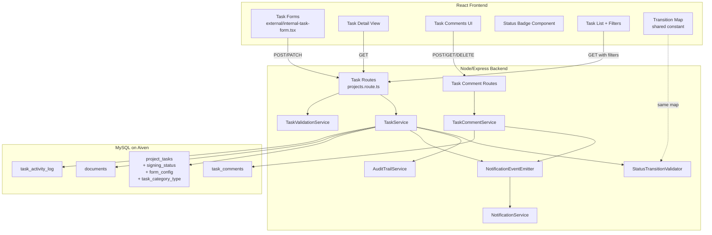
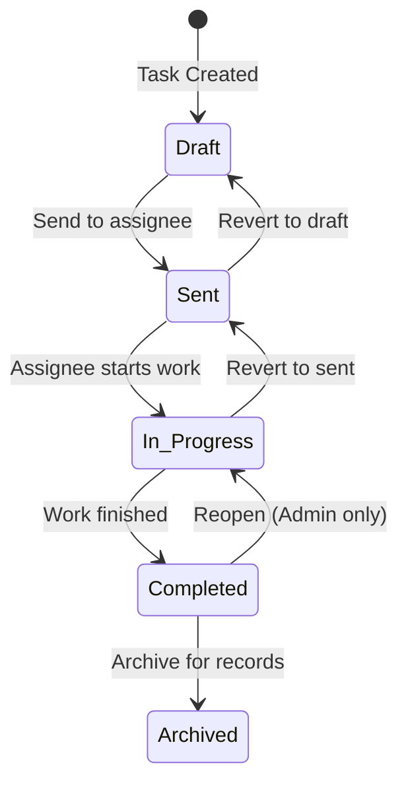
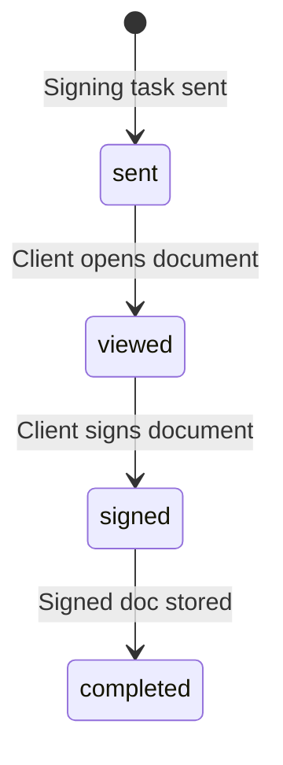

# Design Document: Task Lifecycle Expansion

## Overview

This design expands the Pylott task system from a simple two-status model (pending/completed) into a full lifecycle state machine with five statuses (Draft → Sent → In Progress → Completed → Archived). It promotes Signing, Information Request, and Document Upload to first-class task types with specialized behavior, adds task-level comments, and integrates lifecycle events with the existing notification and audit trail systems.

The design is additive and backward-compatible: existing tasks with `pending` status are mapped to `sent` at the application layer, no data migration is required, and all current API contracts are preserved with new optional fields.

### Key Design Decisions

1. **Application-layer status mapping over data migration**: Existing `pending` values are mapped to `sent` when read, avoiding a risky bulk migration on production data.
2. **Single `project_tasks` table extension over separate type tables**: New columns (`signing_status`, `form_config`, `task_category_type`) are added as nullable columns rather than creating separate tables per task type. This keeps queries simple and avoids JOINs for basic task listing.
3. **Dedicated `task_comments` table over reusing `project_notes`**: Task comments have a different lifecycle (tied to a task, not a project) and different access rules (clients can comment on external tasks). A separate table avoids overloading the notes model.
4. **Dedicated `task_activity_log` table over reusing the general audit trail**: Task activity needs fast, task-scoped queries for the detail view timeline. The general audit trail is project-scoped and has a different schema. A dedicated table with a JSON metadata column provides flexibility.
5. **Transition map as a static constant**: The allowed status transitions are defined as a compile-time constant shared between backend validation and frontend UI, not stored in the database.

## Architecture



### Status Lifecycle State Machine



### Signing Sub-Status Flow



## Components and Interfaces

### Backend Components

#### 1. StatusTransitionValidator (new)

Location: `Pylott-Backend/src/modules/projects/services/status-transition.service.ts`

```typescript
// Shared transition map — also exported for frontend use via types
export const TASK_TRANSITION_MAP: Record<string, string[]> = {
  draft: ['sent'],
  sent: ['in_progress', 'draft'],
  in_progress: ['completed', 'sent'],
  completed: ['archived'],
  archived: ['completed'], // unarchive (admin only)
};

export const SIGNING_SUB_STATUS_TRANSITIONS: Record<string, string[]> = {
  sent: ['viewed'],
  viewed: ['signed'],
  signed: ['completed'],
};
```

Methods:
- `validateTransition(currentStatus: string, targetStatus: string): ServiceType` — checks the transition map, returns error with current/target if invalid
- `getValidNextStatuses(currentStatus: string): string[]` — returns allowed targets for UI dropdown
- `validateSigningTransition(currentSubStatus: string, targetSubStatus: string): ServiceType`

#### 2. TaskService (extended)

Location: `Pylott-Backend/src/modules/projects/services/task.service.ts`

New/modified methods:
- `createTask()` — sets initial status to `draft`, validates type-specific fields (signing docs, form_config)
- `updateTask()` — calls `StatusTransitionValidator` before status changes, logs to `task_activity_log`, emits notifications
- `updateSigningStatus()` — handles signing sub-status transitions, stores signed document on `signed` status
- `archiveTask()` / `unarchiveTask()` — convenience methods wrapping status transitions
- `getTaskById()` — includes activity log and comments in response, maps `pending` → `sent`
- `getAllTask()` — adds filter params for status, task_category_type; excludes archived by default

#### 3. TaskCommentService (new)

Location: `Pylott-Backend/src/modules/projects/services/task-comment.service.ts`

Methods:
- `createComment(userId, taskId, content): Promise<ServiceType>` — creates comment, logs activity, emits notification
- `getComments(taskId, pagination): Promise<ServiceType>` — returns comments in chronological order with author info
- `deleteComment(userId, commentId): Promise<ServiceType>` — soft-delete, validates author or admin role

#### 4. TaskValidationService (extended)

Location: `Pylott-Backend/src/modules/projects/services/task-validation.service.ts`

New methods:
- `validateSigningTaskFields(payload)` — ensures at least one document attachment
- `validateInfoRequestFields(payload)` — validates form mode (native/external), URL format for external
- `validateDocUploadConfig(payload)` — validates allowed file types and max size config

#### 5. New API Routes

Added to `Pylott-Backend/src/modules/projects/projects.route.ts`:

```
// Task Comments
POST   /projects/:project_id/tasks/:task_id/comments
GET    /projects/:project_id/tasks/:task_id/comments
DELETE /projects/:project_id/tasks/:task_id/comments/:comment_id

// Task Activity Log
GET    /projects/:project_id/tasks/:task_id/activity

// Signing status update
PATCH  /projects/:project_id/tasks/:task_id/signing-status

// Task status transition (explicit endpoint)
PATCH  /projects/:project_id/tasks/:task_id/status
```

The existing `PATCH /projects/:project_id/tasks/:task_id` endpoint continues to work for general updates. The new `/status` endpoint provides explicit transition validation and richer activity logging.

### Frontend Components

#### 1. Status Badge Component (new)

Location: `Pylott-Web-App/src/components/ui/task-status-badge.tsx`

Props: `{ status: TaskLifecycleStatus; signingStatus?: SigningSubStatus }`

Renders a colored badge per status:
- Draft → gray
- Sent → blue
- In Progress → amber
- Completed → green
- Archived → slate

When `signingStatus` is provided, renders a secondary badge alongside.

#### 2. Task Type Field Sections (new)

Location: `Pylott-Web-App/src/pages/Home/Task/type-fields/`

- `signing-task-fields.tsx` — document upload, signer selection, signing instructions
- `info-request-fields.tsx` — mode selector (native/external), form/link field, description
- `doc-upload-fields.tsx` — document name, description, accepted types, max size
- `standard-task-fields.tsx` — assignee, description, due date (for Review/Approval)

These are conditionally rendered inside the existing `external-task-form.tsx` and `internal-task-form.tsx` based on the selected `task_category_type`.

#### 3. Task Comments Panel (new)

Location: `Pylott-Web-App/src/pages/Home/Task/task-comments.tsx`

A panel displayed in the task detail view showing chronological comments with author name, timestamp, and content. Includes a text input for adding new comments. Delete button shown for own comments or admin users.

#### 4. Task Activity Timeline (new)

Location: `Pylott-Web-App/src/pages/Home/Task/task-activity-timeline.tsx`

Displays the task activity log as a vertical timeline in the task detail view. Each entry shows the action, user, and timestamp.

#### 5. Task List Filters (extended)

The existing task list views gain:
- Status filter dropdown with all lifecycle statuses
- Task type filter dropdown
- "Show archived" toggle (off by default)

#### 6. Updated Constants

`Pylott-Web-App/src/lib/constants.ts` — `taskStatuses` updated to include all lifecycle statuses.

`Pylott-Web-App/src/types/task.types.ts` — new enums and interfaces for lifecycle statuses, signing sub-status, task category type, and comment types.


## Data Models

### Database Schema Changes

#### 1. Alter `project_tasks` table

Migration: `YYYYMMDD_alter_project_tasks_lifecycle.ts`

```sql
-- Add new columns
ALTER TABLE project_tasks
  ADD COLUMN signing_status ENUM('sent', 'viewed', 'signed', 'completed') NULL AFTER status,
  ADD COLUMN form_config JSON NULL AFTER signing_status,
  ADD COLUMN task_category_type ENUM('signing', 'information_request', 'document_upload', 'review', 'approval', 'meeting', 'follow_up') NULL AFTER task_category;

-- Add index for task_category_type filtering
CREATE INDEX idx_project_tasks_category_type ON project_tasks(task_category_type);

-- Add index for status filtering (existing status column, new values)
CREATE INDEX idx_project_tasks_status ON project_tasks(status);
```

The `status` column remains a VARCHAR (as created in the original migration). New status values (`draft`, `sent`, `in_progress`, `completed`, `archived`) are enforced at the application layer, not via a DB enum, to allow the existing `pending` value to coexist without migration.

Knex migration:

```typescript
export async function up(knex: Knex): Promise<void> {
  await knex.schema.alterTable('project_tasks', (table) => {
    table.enum('signing_status', ['sent', 'viewed', 'signed', 'completed']).nullable().after('status');
    table.json('form_config').nullable().after('signing_status');
    table.enum('task_category_type', [
      'signing', 'information_request', 'document_upload',
      'review', 'approval', 'meeting', 'follow_up'
    ]).nullable().after('task_category');
    table.index('task_category_type', 'idx_project_tasks_category_type');
    table.index('status', 'idx_project_tasks_status');
  });
}
```

#### 2. Create `task_comments` table

Migration: `YYYYMMDD_create_task_comments_table.ts`

```typescript
export async function up(knex: Knex): Promise<void> {
  await knex.schema.createTable('task_comments', (table) => {
    table.string('id').primary();
    table.string('task_id').notNullable().index();
    table.string('author_id').notNullable();
    table.text('content').notNullable();
    table.string('company_id').notNullable().index();
    table.timestamps(true, true);
    table.timestamp('deleted_at').nullable();

    table.foreign('task_id').references('id').inTable('project_tasks').onDelete('CASCADE');
  });
}
```

#### 3. Create `task_activity_log` table

Migration: `YYYYMMDD_create_task_activity_log_table.ts`

```typescript
export async function up(knex: Knex): Promise<void> {
  await knex.schema.createTable('task_activity_log', (table) => {
    table.string('id').primary();
    table.string('task_id').notNullable().index();
    table.string('action').notNullable(); // e.g. 'status_changed', 'comment_added', 'document_uploaded'
    table.string('previous_value').nullable();
    table.string('new_value').nullable();
    table.string('user_id').notNullable();
    table.json('metadata').nullable(); // flexible JSON for action-specific data
    table.string('company_id').notNullable().index();
    table.timestamp('created_at').defaultTo(knex.fn.now());

    table.foreign('task_id').references('id').inTable('project_tasks').onDelete('CASCADE');
  });
}
```

### Updated Enums (Backend)

```typescript
// Pylott-Backend/src/shared/enums/index.ts

export enum ProjectTaskStatus {
  DRAFT = 'draft',
  SENT = 'sent',
  PENDING = 'pending', // kept for backward compat reads
  IN_PROGRESS = 'in_progress',
  COMPLETED = 'completed',
  ARCHIVED = 'archived',
  OVER_DUE = 'over_due', // computed only
}

export enum SigningSubStatus {
  SENT = 'sent',
  VIEWED = 'viewed',
  SIGNED = 'signed',
  COMPLETED = 'completed',
}

export enum TaskCategoryType {
  SIGNING = 'signing',
  INFORMATION_REQUEST = 'information_request',
  DOCUMENT_UPLOAD = 'document_upload',
  REVIEW = 'review',
  APPROVAL = 'approval',
  MEETING = 'meeting',
  FOLLOW_UP = 'follow_up',
}

export enum TaskActivityAction {
  STATUS_CHANGED = 'status_changed',
  SIGNING_STATUS_CHANGED = 'signing_status_changed',
  COMMENT_ADDED = 'comment_added',
  COMMENT_DELETED = 'comment_deleted',
  DOCUMENT_UPLOADED = 'document_uploaded',
  SIGNED_DOCUMENT_STORED = 'signed_document_stored',
  TASK_ARCHIVED = 'task_archived',
  TASK_SENT = 'task_sent',
}

// Add to AUDIT_TRAIL_ACTION enum:
export enum AUDIT_TRAIL_ACTION {
  // ... existing values ...
  TASK_STATUS_CHANGED = 'TASK_STATUS_CHANGED',
  TASK_ARCHIVED = 'TASK_ARCHIVED',
  TASK_SENT = 'TASK_SENT',
}

// Add to EmailSubject enum:
export enum EmailSubject {
  // ... existing values ...
  TASK_STATUS_CHANGED = 'Task Status Updated',
  SIGNING_STATUS_CHANGED = 'Signing Status Updated',
}
```

### Updated TypeScript Interfaces (Frontend)

```typescript
// Pylott-Web-App/src/types/task.types.ts

export enum TaskLifecycleStatus {
  DRAFT = 'draft',
  SENT = 'sent',
  IN_PROGRESS = 'in_progress',
  COMPLETED = 'completed',
  ARCHIVED = 'archived',
}

export enum SigningSubStatus {
  SENT = 'sent',
  VIEWED = 'viewed',
  SIGNED = 'signed',
  COMPLETED = 'completed',
}

export enum TaskCategoryType {
  SIGNING = 'signing',
  INFORMATION_REQUEST = 'information_request',
  DOCUMENT_UPLOAD = 'document_upload',
  REVIEW = 'review',
  APPROVAL = 'approval',
  MEETING = 'meeting',
  FOLLOW_UP = 'follow_up',
}

export interface TaskComment {
  id: string;
  task_id: string;
  author_id: string;
  content: string;
  company_id: string;
  created_at: string;
  updated_at: string;
  deleted_at: string | null;
  author?: { id: string; name: string; email: string };
}

export interface TaskActivityLogEntry {
  id: string;
  task_id: string;
  action: string;
  previous_value: string | null;
  new_value: string | null;
  user_id: string;
  metadata: Record<string, any> | null;
  created_at: string;
  user?: { id: string; name: string };
}

export interface FormConfig {
  mode: 'native' | 'external';
  form_id?: string;
  external_url?: string;
}

// Extended Task interface adds:
export interface Task {
  // ... existing fields ...
  signing_status?: SigningSubStatus;
  task_category_type?: TaskCategoryType;
  form_config?: FormConfig;
  comments?: TaskComment[];
  activity_log?: TaskActivityLogEntry[];
}
```

### Updated Model (Backend)

```typescript
// Pylott-Backend/src/models/project_task.model.ts — new fields
export class ProjectTask extends BaseModel {
  // ... existing fields ...
  signing_status?: string;
  form_config?: string; // JSON string
  task_category_type?: string;

  // New relations
  static get relationMappings() {
    return {
      // ... existing relations ...
      comments: {
        relation: BaseModel.HasManyRelation,
        modelClass: require('./task_comment.model').TaskComment,
        join: { from: 'project_tasks.id', to: 'task_comments.task_id' },
      },
      activity_log: {
        relation: BaseModel.HasManyRelation,
        modelClass: require('./task_activity_log.model').TaskActivityLog,
        join: { from: 'project_tasks.id', to: 'task_activity_log.task_id' },
      },
    };
  }
}
```

### New Models

```typescript
// Pylott-Backend/src/models/task_comment.model.ts
export class TaskComment extends BaseModel {
  static tableName = 'task_comments';
  task_id: string;
  author_id: string;
  content: string;
  company_id: string;

  static relationMappings = () => ({
    author: {
      relation: BaseModel.BelongsToOneRelation,
      modelClass: require('./user.model').User,
      filter: (query) => query.select('id', 'name', 'email'),
      join: { from: 'task_comments.author_id', to: 'users.id' },
    },
  });
}

// Pylott-Backend/src/models/task_activity_log.model.ts
export class TaskActivityLog extends BaseModel {
  static tableName = 'task_activity_log';
  task_id: string;
  action: string;
  previous_value?: string;
  new_value?: string;
  user_id: string;
  metadata?: string; // JSON
  company_id: string;

  static relationMappings = () => ({
    user: {
      relation: BaseModel.BelongsToOneRelation,
      modelClass: require('./user.model').User,
      filter: (query) => query.select('id', 'name'),
      join: { from: 'task_activity_log.user_id', to: 'users.id' },
    },
  });
}
```

### Backward Compatibility: Status Mapping

The `TaskService` applies a read-time mapping layer:

```typescript
function normalizeTaskStatus(dbStatus: string): string {
  if (dbStatus === 'pending') return 'sent';
  return dbStatus;
}
```

This is applied in `getTaskById()` and `getAllTask()` before returning data. The `pending` value is never written by new code — `createTask()` defaults to `draft`. Existing tasks with `pending` are read as `sent` without modifying the database row.


## Correctness Properties

*A property is a characteristic or behavior that should hold true across all valid executions of a system — essentially, a formal statement about what the system should do. Properties serve as the bridge between human-readable specifications and machine-verifiable correctness guarantees.*

### Property 1: Transition map completeness and correctness

*For any* pair of task statuses (currentStatus, targetStatus), the `StatusTransitionValidator.validateTransition()` function should return success if and only if the pair exists in the defined `TASK_TRANSITION_MAP`. Additionally, `getValidNextStatuses(currentStatus)` should return exactly the set of statuses reachable from `currentStatus` in the map.

**Validates: Requirements 2.1, 2.2, 2.4, 12.1**

### Property 2: New tasks default to draft status

*For any* valid task creation payload (regardless of task category or type), the resulting task record should have `status = 'draft'`.

**Validates: Requirements 1.2**

### Property 3: Backward-compatible status normalization

*For any* task read from the database, if the stored status is `'pending'`, the normalized status returned to the caller should be `'sent'`. All other status values should be returned unchanged.

**Validates: Requirements 1.4, 14.1, 14.2**

### Property 4: Activity log entry completeness on status change

*For any* valid task status transition, the resulting `task_activity_log` entry should contain: a non-null `task_id` matching the task, `previous_value` equal to the old status, `new_value` equal to the new status, a non-null `user_id` matching the initiating user, and a `created_at` timestamp.

**Validates: Requirements 3.1, 3.5**

### Property 5: Chronological ordering of task timeline data

*For any* task with multiple activity log entries or multiple comments, the entries should be returned sorted by `created_at` in ascending order.

**Validates: Requirements 3.4, 8.3**

### Property 6: Signing task requires at least one document

*For any* task creation payload where `task_category_type = 'signing'`, if the payload contains zero document attachments, the creation should be rejected. If it contains one or more, creation should succeed (assuming all other fields are valid).

**Validates: Requirements 4.2**

### Property 7: Signing sub-status independence from main status

*For any* signing task, updating the `signing_status` should not change the main `status`, and updating the main `status` should not change the `signing_status`.

**Validates: Requirements 4.3**

### Property 8: Information request mode exclusivity

*For any* task creation payload where `task_category_type = 'information_request'`, the `form_config` must specify exactly one mode (`'native'` or `'external'`). Payloads with neither mode, both modes, or a missing `form_config` should be rejected.

**Validates: Requirements 5.2**

### Property 9: External form URL validation

*For any* string provided as `external_url` in a `form_config` with mode `'external'`, the system should accept well-formed URLs (with http/https scheme) and reject malformed strings.

**Validates: Requirements 5.4**

### Property 10: Form config round trip

*For any* valid `form_config` object (with mode, form_id or external_url), storing it as JSON in the `form_config` column and reading it back should produce an equivalent object.

**Validates: Requirements 5.6**

### Property 11: Type-driven form field mapping

*For any* `TaskCategoryType` value, the function that determines which form fields to display should return a non-empty set of fields, and the returned fields should be a subset of all possible task fields. Different category types should produce different field sets (signing fields ≠ info request fields ≠ doc upload fields).

**Validates: Requirements 6.1**

### Property 12: File type validation

*For any* file and any set of allowed file types, the file upload validator should accept the file if its extension/MIME type is in the allowed set, and reject it otherwise. On rejection, the error message should list the accepted file types.

**Validates: Requirements 7.2, 7.4**

### Property 13: File size validation

*For any* file size and any configured maximum size limit, the file upload validator should accept files with size ≤ limit and reject files with size > limit. On rejection, the error message should state the maximum allowed size.

**Validates: Requirements 7.3, 7.5**

### Property 14: Comment creation stores all required fields

*For any* task and any non-empty comment content string, creating a comment should produce a stored record containing: `task_id` matching the task, `author_id` matching the creating user, `content` matching the input, and a non-null `created_at` timestamp.

**Validates: Requirements 8.1, 8.2**

### Property 15: Comment deletion authorization

*For any* task comment and any user, deletion should succeed if the user is the comment's author OR the user has role `ADMIN` or `SUPER_ADMIN`. Deletion should be rejected for all other users.

**Validates: Requirements 8.6**

### Property 16: External task commenting by both internal and client users

*For any* external task, both users with internal roles (ADMIN, CONSULTANT, SUPER_ADMIN, USER) and client contacts associated with the task's project should be able to create comments successfully.

**Validates: Requirements 8.4**

### Property 17: Status change notifications reach all relevant participants

*For any* task status transition, every assigned user (and the task author for completion transitions) should receive a notification. The notification count should equal the number of distinct relevant participants.

**Validates: Requirements 9.3, 10.1, 10.2**

### Property 18: Signing status change notifies task author

*For any* signing task and any signing sub-status transition, the task author should receive a notification containing the updated signing status.

**Validates: Requirements 10.3**

### Property 19: Comment notification excludes comment author

*For any* task comment creation, all task participants (author + assignees) except the comment author should receive a notification. The comment author should not receive a notification.

**Validates: Requirements 10.5**

### Property 20: Signed document record creation and dual accessibility

*For any* signing task that transitions to `signing_status = 'signed'`, a document record should be created in the `documents` table with both `task_id` and `project_id` set. The document should be retrievable by querying either by `task_id` or by `project_id`.

**Validates: Requirements 11.1, 11.3, 11.5**

### Property 21: Default task list excludes archived tasks

*For any* task list query without an explicit archive filter, no tasks with `status = 'archived'` should appear in the results. When the archive filter is enabled, archived tasks should be included.

**Validates: Requirements 12.2, 12.3, 15.2**

### Property 22: Unarchive restricted to admin roles

*For any* archived task, only users with `ADMIN` or `SUPER_ADMIN` roles should be able to transition it back to `completed`. Non-admin users attempting this transition should receive a rejection.

**Validates: Requirements 12.5**

### Property 23: Null category type follows standard lifecycle

*For any* task with `task_category_type = null`, the task should follow the standard `TASK_TRANSITION_MAP` without any type-specific validation (no signing doc requirement, no form_config requirement).

**Validates: Requirements 14.3**

### Property 24: is_visible_to_client flag preserved across lifecycle

*For any* task, changing the lifecycle status should not alter the `is_visible_to_client` flag value. The flag should remain at whatever value it was set to during creation or last explicit update.

**Validates: Requirements 14.6**

### Property 25: Task category type filter correctness

*For any* `task_category_type` filter value, the task list query should return only tasks whose `task_category_type` matches the filter. Tasks with a different category type or null category type should be excluded.

**Validates: Requirements 15.6**

### Property 26: Signing sub-status transition map enforcement

*For any* pair of signing sub-statuses (current, target), the `validateSigningTransition()` function should return success if and only if the pair exists in `SIGNING_SUB_STATUS_TRANSITIONS`. Invalid transitions should be rejected.

**Validates: Requirements 4.3**


## Error Handling

### Status Transition Errors

- **Invalid transition**: Return `400 Bad Request` with message: `"Cannot transition from '{current}' to '{target}'. Valid transitions from '{current}': {valid_targets}"`
- **Unarchive by non-admin**: Return `403 Forbidden` with message: `"Only ADMIN or SUPER_ADMIN users can unarchive tasks"`
- **Transition on deleted task**: Return `404 Not Found`

### Task Type Validation Errors

- **Signing task without documents**: Return `400 Bad Request` with message: `"Signing tasks require at least one document attachment"`
- **Info request without form_config**: Return `400 Bad Request` with message: `"Information request tasks require a form configuration with mode 'native' or 'external'"`
- **Info request with both modes**: Return `400 Bad Request` with message: `"form_config must specify exactly one mode: 'native' or 'external'"`
- **Invalid external URL**: Return `400 Bad Request` with message: `"External form URL must be a valid URL with http or https scheme"`

### File Upload Errors

- **Invalid file type**: Return `400 Bad Request` with message: `"File type '{type}' is not allowed. Accepted types: {allowed_types}"`
- **File too large**: Return `400 Bad Request` with message: `"File size {size}MB exceeds the maximum allowed size of {max}MB"`

### Comment Errors

- **Empty comment content**: Return `400 Bad Request` with message: `"Comment content cannot be empty"`
- **Delete by unauthorized user**: Return `403 Forbidden` with message: `"You can only delete your own comments"`
- **Comment on non-existent task**: Return `404 Not Found`

### Notification Errors

- Notification failures are non-blocking. If `NotificationEventEmitter` fails, the status transition or comment creation still succeeds. Errors are logged to the console with the trace ID pattern used throughout the codebase.

### Activity Log Errors

- Activity log write failures are non-blocking. The primary operation (status change, comment creation) succeeds even if the log write fails. Errors are logged.

## Testing Strategy

### Property-Based Testing

**Library**: [fast-check](https://github.com/dubzzz/fast-check) for TypeScript

Each correctness property from the design document is implemented as a single property-based test with a minimum of 100 iterations. Tests are tagged with the format:

```
Feature: task-lifecycle-expansion, Property {number}: {property_text}
```

**Property tests focus on:**
- Status transition validation (Properties 1, 26)
- Status normalization/mapping (Property 3)
- Form config round-trip (Property 10)
- Type-driven field mapping (Property 11)
- File validation logic (Properties 12, 13)
- Comment authorization (Property 15)
- Filter correctness (Properties 21, 25)
- Notification recipient calculation (Properties 17, 18, 19)

Property tests should use `fast-check` arbitraries to generate:
- Random status pairs from the full status enum
- Random task payloads with varying category types
- Random file metadata (size, type)
- Random user roles and IDs
- Random comment content strings

### Unit Testing

Unit tests complement property tests by covering:
- Specific examples of each status transition (happy path)
- Edge cases: creating a task with `pending` status (should still work for backward compat)
- Signing sub-status specific transitions (4.4, 4.5)
- Info request with native form attachment (5.3)
- Client response submission logging (5.5)
- Document upload with Cloudinary integration (7.6, 7.7)
- Activity log entry creation on specific events (3.3, 9.5, 11.4, 12.4)
- Notification event type values (10.4)
- Frontend constant updates (15.5)

### Integration Testing

- Full lifecycle flow: create task (draft) → send → in_progress → completed → archived
- Signing task flow: create → send → client views → client signs → signed doc stored
- Comment flow: create comment → verify notification → delete comment
- Backward compatibility: read existing task with `pending` status, verify it shows as `sent`
- API contract: existing endpoints return same shape with new optional fields

### Test File Organization

```
Pylott-Backend/src/__tests__/
  services/
    status-transition.service.test.ts      # Properties 1, 26
    task.service.test.ts                   # Properties 2, 3, 4, 5, 7, 21, 23, 24
    task-comment.service.test.ts           # Properties 14, 15, 16
    task-validation.service.test.ts        # Properties 6, 8, 9, 12, 13
    task-notification.test.ts              # Properties 17, 18, 19
    signed-document.service.test.ts        # Property 20
  properties/
    status-transition.property.test.ts     # fast-check property tests
    task-lifecycle.property.test.ts        # fast-check property tests
    task-validation.property.test.ts       # fast-check property tests
    task-comments.property.test.ts         # fast-check property tests
    task-notifications.property.test.ts    # fast-check property tests
```

Each property test file must:
1. Import `fc` from `fast-check`
2. Configure `fc.assert` with `{ numRuns: 100 }` minimum
3. Include a comment tag: `// Feature: task-lifecycle-expansion, Property N: {title}`
4. Use a single `fc.assert(fc.property(...))` call per design property
