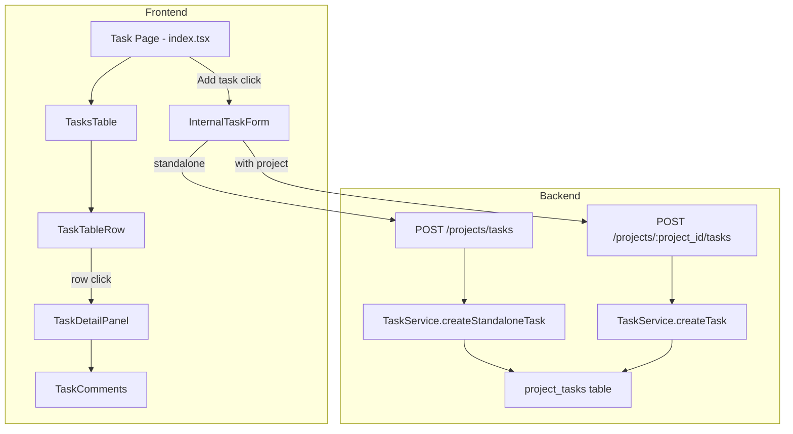
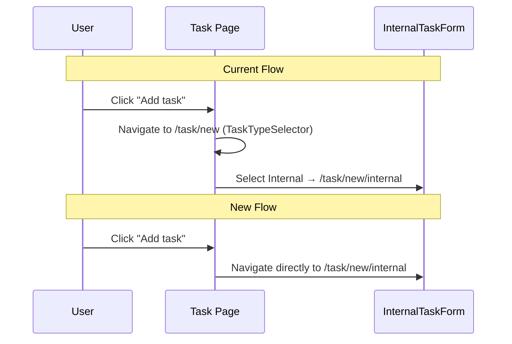

# Design Document: Task Page Overhaul

## Overview

This design covers the overhaul of the Pylott task page across five areas: simplifying the internal task form to essential fields only, removing the task type selector intermediate step, redesigning the task list table with status-based row coloring, adding a task detail view on row click, and making project association optional in the backend.

The current flow requires users to navigate through a `TaskTypeSelectorPage` before reaching the `InternalTaskForm`, which contains many fields (description, start date, additional info, attachments, type-specific fields). The task table shows columns like Type and Assigned that are being replaced. The backend `TaskService.createTask` currently requires a valid `project_id` and `project_type_id`.

### Key Design Decisions

1. **Direct navigation**: The "Add task" button navigates directly to `/task/new/internal`, bypassing the `TaskTypeSelectorPage`. The route `/task/new` is remapped to render `InternalTaskForm` directly.
2. **Category limited to 4 options**: The category selector on the simplified form only shows Review, Approval, Meeting, Follow-up (not Signing, Information Request, Document Upload).
3. **Optional project fields**: Pipeline and Project become optional selectors. When empty, the task is created as a standalone task with `project_id = null` and `project_type_id = null`.
4. **New standalone task API route**: A new `POST /projects/tasks` endpoint (no `:project_id` param) handles standalone task creation. The existing `POST /projects/:project_id/tasks` continues to work for project-bound tasks.
5. **Task detail view reuses existing modal**: The `ViewEditTaskModal` is replaced with a lighter `TaskDetailPanel` that shows category and comments when a row is clicked.

## Architecture



### Navigation Flow Change



## Components and Interfaces

### 1. InternalTaskForm (Simplified)

**File**: `src/pages/Home/Task/internal-task-form.tsx`

**Changes**:
- Remove fields: Description, Start date, Additional info, Attachment, TypeFieldsSection
- Make Pipeline and Project optional (remove `isRequired`, allow null submission)
- Limit Category selector to 4 options: Review, Approval, Meeting, Follow-up
- Add Assignee field that works without a project (fetches company users when no project selected)
- Update form schema to reflect optional `project_id` and `project_type_id`
- Update `backPath` to navigate to `/task` instead of `/task/new`
- When no project is selected, call the standalone task creation endpoint

**Simplified field order**:
1. Assignee
2. Task name
3. Category (Review | Approval | Meeting | Follow-up)
4. Status
5. Due date
6. Pipeline (optional)
7. Project (optional, enabled when Pipeline selected)

### 2. Task Page Navigation (index.tsx)

**File**: `src/pages/Home/Task/index.tsx`

**Changes**:
- Update "Add task" button `onClick` from `navigate("/task/new")` to `navigate("/task/new/internal")`
- No other changes needed to the page itself

### 3. Route Configuration

**File**: `src/routes/app.tsx`

**Changes**:
- Change `/task/new` route to render `InternalTaskForm` instead of `TaskTypeSelectorPage`
- Keep `/task/new/internal` route as-is for backward compatibility
- The `TaskTypeSelectorPage` component is no longer referenced in routes

### 4. TasksTable (Redesigned)

**File**: `src/pages/Home/Task/task-table.tsx`

**Changes**:
- Update column headers to: Date, Task Name, Due Date, Pipeline, Project, Status
- Remove Type and Assigned columns
- Remove the actions column (kebab menu) since row click now opens detail view

### 5. TaskTableRow (Redesigned)

**File**: `src/pages/Home/Task/task-table-row.tsx`

**Changes**:
- Apply status-based background colors:
  - `in_progress` → amber tint (`bg-amber-50`)
  - `completed` → green tint (`bg-green-50`)
  - `archived` → slate tint (`bg-slate-100`)
  - `draft` / `sent` → default (no tint)
- Render columns: `created_at`, `name`, `end_date`, pipeline name, project name (or "—" for standalone), status badge
- Add `onClick` handler on the `<TableRow>` to open `TaskDetailPanel`
- Remove the dropdown menu (View/Edit/Delete actions)
- Handle null `project` gracefully for standalone tasks

### 6. TaskDetailPanel (New Component)

**File**: `src/pages/Home/Task/task-detail-panel.tsx`

**Purpose**: Modal/panel that opens when a task row is clicked, showing category and comments.

**Props**:
```typescript
interface TaskDetailPanelProps {
  isOpen: boolean;
  onClose: () => void;
  task: Task;
}
```

**Renders**:
- Task name as header
- Category badge (Review, Approval, Meeting, Follow-up)
- `TaskComments` component (reused from existing `task-comments.tsx`)
- The `TaskComments` component needs to handle standalone tasks where `project_id` may be null

### 7. TaskComments Update

**File**: `src/pages/Home/Task/task-comments.tsx`

**Changes**:
- Update `TaskCommentsProps` to accept optional `projectId` (for standalone tasks)
- When `projectId` is null/empty, use a standalone comments endpoint or pass a sentinel value

### 7a. Null-Safety: Task TypeScript Interface Update

**File**: `src/types/task.types.ts`

**CRITICAL**: The `Task` interface currently defines `project_id`, `project_type_id`, and `project` as non-nullable. With standalone tasks, these will be null. Without this change, any code accessing `task.project.name` will crash at runtime.

**Changes**:
- `project_id: string` → `project_id: string | null`
- `project_type_id: string` → `project_type_id: string | null`
- `project: { id: string; name: string; ... }` → `project: { id: string; name: string; ... } | null`
- `InternalTaskFormData.project_type_id: string` → `project_type_id?: string`

**Impacted files that access `task.project.name` or `task.project_id` directly**:
- `task-table-row.tsx` — accesses `task.project.name` (will crash)
- `edit-task-modal.tsx` — passes `taskData.project_id` to `TaskComments` and `TaskActivityTimeline`
- `delete-task-modal.tsx` — passes `task.project_id` to `useDeleteTask`

### 7b. Null-Safety: Comment/Activity Endpoints for Standalone Tasks

**Files**: `src/lib/constants.ts`, `src/hooks/project-modules/tasks/use-task-comments.tsx`

**CRITICAL**: Comment endpoints are `projects/${projectId}/tasks/${taskId}/comments`. For standalone tasks, `projectId` is null, producing invalid URLs like `projects/null/tasks/...`.

**Backend solution**: Add standalone comment routes:
- `GET /tasks/:task_id/comments` — get comments for any task (standalone or project-bound)
- `POST /tasks/:task_id/comments` — add comment
- `DELETE /tasks/:task_id/comments/:comment_id` — delete comment

**Frontend solution**: Add new endpoint constants and update hooks:
- `ENDPOINTS.GET_STANDALONE_TASK_COMMENTS(taskId)` → `tasks/${taskId}/comments`
- `ENDPOINTS.ADD_STANDALONE_TASK_COMMENT(taskId)` → `tasks/${taskId}/comments`
- `ENDPOINTS.DELETE_STANDALONE_TASK_COMMENT(taskId, commentId)` → `tasks/${taskId}/comments/${commentId}`
- `TaskComments` component checks if `projectId` is truthy; if not, uses standalone endpoints

### 7c. Null-Safety: Assignee Fetching Without Project

**File**: `src/hooks/project-modules/tasks/use-available-assignees.tsx`

**CRITICAL**: `useAvailableAssignees(selectedProjectId, "internal")` fetches project-specific members. For standalone tasks with no project selected, this returns nothing or errors.

**Solution**: When `selectedProjectId` is empty/null, fall back to fetching all company users via the existing `useGetCompanyUsers` hook (already used in `edit-task-modal.tsx`). The `InternalTaskForm` should conditionally use company users when no project is selected.

### 7d. Null-Safety: Backend Email Notifications for Standalone Tasks

**File**: `Pylott-Backend/src/modules/projects/services/task.service.ts`

**CRITICAL**: The `createTask` method accesses `project.name` in email notifications and constructs `taskLink` as `/projects/${project_id}/tasks/${task_id}`. For standalone tasks, `project` is null.

**Solution in `createStandaloneTask`**: 
- Skip project-specific email content; use "Standalone Task" as project name placeholder
- Construct `taskLink` as `/task` (the main tasks page) instead of a project-specific URL
- Skip document creation entirely (no project context for documents)

### 7e. Null-Safety: Delete Task for Standalone Tasks

**File**: `src/hooks/project-modules/tasks/use-delete-task.tsx`, `src/pages/Home/Task/delete-task-modal.tsx`

**CRITICAL**: `DeleteTaskModal` passes `task.project_id` to `useDeleteTask`. If the delete endpoint is `projects/${projectId}/tasks/${taskId}`, standalone tasks will produce invalid URLs.

**Backend solution**: Add standalone delete route `DELETE /tasks/:task_id` or make the existing route handle null project_id.
**Frontend solution**: Add `useDeleteStandaloneTask` hook or make `useDeleteTask` handle null projectId by switching endpoints.

### 8. Backend: Standalone Task Creation

**File**: `Pylott-Backend/src/modules/projects/services/task.service.ts`

**New method**: `createStandaloneTask(user, payload)`
- Similar to `createTask` but skips project validation
- Sets `project_id = null` and `project_type_id = null` on the task record
- Skips document creation (no project context)
- Skips project-specific email links

**Route**: `POST /projects/tasks` (body contains all task data, no `:project_id` param)

### 9. Backend: Validation Updates

**File**: `Pylott-Backend/src/shared/validations/projects.ts`

**Changes**:
- Create `createStandaloneTaskValidationRules` that makes `project_type_id` optional
- Keep existing `createTaskValidationRules` unchanged for project-bound tasks

### 10. Backend: Database Schema

**File**: New migration

**Changes**:
- Alter `project_tasks` table to make `project_id` nullable
- Alter `project_tasks` table to make `project_type_id` nullable

### 11. Frontend Hook: Standalone Task Creation

**File**: `src/hooks/project-modules/tasks/use-create-standalone-task.tsx`

**New hook**: `useCreateStandaloneTask()`
- Calls `POST /projects/tasks` (the `GET_ALL_TASKS` endpoint path, but with POST method)
- Invalidates `GET_ALL_TASKS` query on success

## Data Models

### Task Record (project_tasks table)

Current schema with changes highlighted:

| Column | Type | Nullable | Change |
|--------|------|----------|--------|
| id | uuid | No | — |
| project_id | uuid | **Yes (was No)** | **Made nullable** |
| company_id | uuid | No | — |
| author_id | uuid | No | — |
| task_type_id | uuid | Yes | — |
| project_type_id | uuid | **Yes (was No)** | **Made nullable** |
| name | varchar(100) | No | — |
| description | text | Yes | — |
| status | enum | No | — |
| due_date | timestamp | No | — |
| is_visible_to_client | boolean | No | — |
| signing_status | varchar | Yes | — |
| form_config | jsonb | Yes | — |
| task_category_type | varchar | Yes | — |
| created_at | timestamp | No | — |
| updated_at | timestamp | No | — |
| deleted_at | timestamp | Yes | — |

### Category Options (Internal Task Form)

```typescript
const INTERNAL_CATEGORY_OPTIONS = [
  { label: "Review", value: "review" },
  { label: "Approval", value: "approval" },
  { label: "Meeting", value: "meeting" },
  { label: "Follow Up", value: "follow_up" },
];
```

### Status-to-Color Mapping

```typescript
const STATUS_ROW_COLORS: Record<string, string> = {
  in_progress: "bg-amber-50",
  completed: "bg-green-50",
  archived: "bg-slate-100",
  // draft and sent use default (no class)
};
```

### Standalone Task Creation Payload

```typescript
interface CreateStandaloneTaskPayload {
  name: string;
  status: string;
  due_date: string;
  task_category_type?: string;
  assignees?: string[];
  is_visible_to_client: boolean;
}
```

### Task Detail Panel Data Flow

```typescript
// Task row click passes the full Task object to the panel
// TaskComments receives projectId (possibly null) and taskId
// For standalone tasks, comments endpoint needs to handle null projectId
```


## Correctness Properties

*A property is a characteristic or behavior that should hold true across all valid executions of a system — essentially, a formal statement about what the system should do. Properties serve as the bridge between human-readable specifications and machine-verifiable correctness guarantees.*

### Property 1: Empty pipeline/project produces null payload fields

*For any* valid form state where the Pipeline and Project selectors are left empty, the resulting submission payload SHALL have `project_id = null` and `project_type_id = null`.

**Validates: Requirements 1.4, 1.5**

### Property 2: Status-to-row-color mapping

*For any* task with a valid status value, the row background CSS class SHALL match the defined mapping: `in_progress` → amber tint, `completed` → green tint, `archived` → slate tint, and `draft` or `sent` → no tint (default background).

**Validates: Requirements 3.2, 3.3, 3.4, 3.5**

### Property 3: Project context parameters forwarded to form

*For any* projectId and projectTypeId string pair, when navigating from a project context to the task form, the resulting URL SHALL contain both parameters as query string values.

**Validates: Requirements 2.3**

### Property 4: Task detail view displays correct category

*For any* task with a `task_category_type` value in {review, approval, meeting, follow_up}, the TaskDetailPanel SHALL render a category badge whose text matches that category value.

**Validates: Requirements 4.2**

### Property 5: API accepts standalone task creation with null project fields

*For any* valid task creation payload where `project_id` is null and `project_type_id` is null, the Task API SHALL return a success response and create the task record.

**Validates: Requirements 5.1, 5.2**

### Property 6: Standalone task round-trip preserves null project association

*For any* standalone task created with `project_id = null`, fetching that task by ID SHALL return a task record where `project_id` is null and `project_type_id` is null.

**Validates: Requirements 5.3**

### Property 7: Invalid project_id returns descriptive error

*For any* task creation payload where `project_id` is a non-null UUID that does not reference an existing project, the Task API SHALL return an error response with a status code indicating not found and a message containing "project" (case-insensitive).

**Validates: Requirements 5.4, 5.5**

## Error Handling

### Frontend

| Scenario | Handling |
|----------|----------|
| Form submission with no assignee | Form validation prevents submission; shows inline error |
| Form submission with no task name | Form validation prevents submission; shows inline error |
| API returns error on task creation | Toast notification with error message; form remains open |
| Task row click with null project_id | TaskDetailPanel handles null projectId gracefully; comments section adapts |
| Pipeline selected but no projects exist | Project selector shows "No projects found for this pipeline" |
| Network error during comment creation | Comment input remains; error toast shown |

### Backend

| Scenario | HTTP Status | Response |
|----------|-------------|----------|
| Standalone task creation with valid payload | 200 | `{ status: true, message: "Task created successfully" }` |
| Task creation with invalid project_id | 404 | `{ status: false, message: "Project not found" }` |
| Task creation with invalid project_type_id (when provided) | 404 | `{ status: false, message: "Invalid project type (pipeline)" }` |
| Task creation with invalid assignee_id | 404 | `{ status: false, message: "Assignee not found" }` |
| Duplicate task name in same project | 404 | `{ status: false, message: "Task name already exists in this project" }` |
| Standalone task with duplicate name (no project scope) | Allowed | Standalone tasks don't enforce unique names since there's no project scope |

## Testing Strategy

### Unit Tests

Unit tests cover specific examples, edge cases, and UI rendering:

- **Form rendering**: Verify the simplified form renders exactly the 5 required fields + 2 optional fields
- **Category options**: Verify the category selector contains exactly Review, Approval, Meeting, Follow-up
- **Removed fields**: Verify Description, Start date, Additional info, Attachment, TypeFieldsSection are not rendered
- **Navigation**: Verify "Add task" button navigates to `/task/new/internal`
- **Route config**: Verify `/task/new` no longer renders TaskTypeSelectorPage
- **Table columns**: Verify table renders Date, Task Name, Due Date, Pipeline, Project, Status columns
- **Removed columns**: Verify Type and Assigned columns are not rendered
- **Row click**: Verify clicking a task row opens the TaskDetailPanel
- **Detail panel**: Verify TaskDetailPanel renders category badge and TaskComments component
- **Comment addition**: Verify the comment input and submit button are functional
- **Standalone task display**: Verify task rows with null project show "—" in the Project column

### Property-Based Tests

Property-based tests use `fast-check` (already available in the React/TypeScript ecosystem) with a minimum of 100 iterations per test.

Each property test references its design document property:

1. **Feature: task-page-overhaul, Property 1: Empty pipeline/project produces null payload fields**
   - Generate arbitrary valid form data with empty pipeline/project
   - Assert the transformed payload has `project_id = null` and `project_type_id = null`

2. **Feature: task-page-overhaul, Property 2: Status-to-row-color mapping**
   - Generate arbitrary task status values from the valid set {draft, sent, in_progress, completed, archived}
   - Assert the `getStatusRowColor(status)` function returns the correct CSS class

3. **Feature: task-page-overhaul, Property 3: Project context parameters forwarded to form**
   - Generate arbitrary UUID pairs for projectId and projectTypeId
   - Assert the constructed navigation URL contains both as query parameters

4. **Feature: task-page-overhaul, Property 4: Task detail view displays correct category**
   - Generate arbitrary task objects with category in {review, approval, meeting, follow_up}
   - Assert the rendered TaskDetailPanel contains the category text

5. **Feature: task-page-overhaul, Property 5: API accepts standalone task creation with null project fields**
   - Generate arbitrary valid standalone task payloads (name, status, due_date with null project fields)
   - Assert the API service method returns success

6. **Feature: task-page-overhaul, Property 6: Standalone task round-trip preserves null project association**
   - Generate arbitrary standalone tasks, create them, then fetch by ID
   - Assert the fetched task has `project_id = null`

7. **Feature: task-page-overhaul, Property 7: Invalid project_id returns descriptive error**
   - Generate arbitrary UUIDs that don't exist in the project table
   - Assert the API returns an error response with status code 404 and message containing "project"

### Test Configuration

- Library: `fast-check` for property-based testing, `vitest` for unit tests
- Minimum iterations: 100 per property test
- Each property test tagged with: `Feature: task-page-overhaul, Property {N}: {title}`
