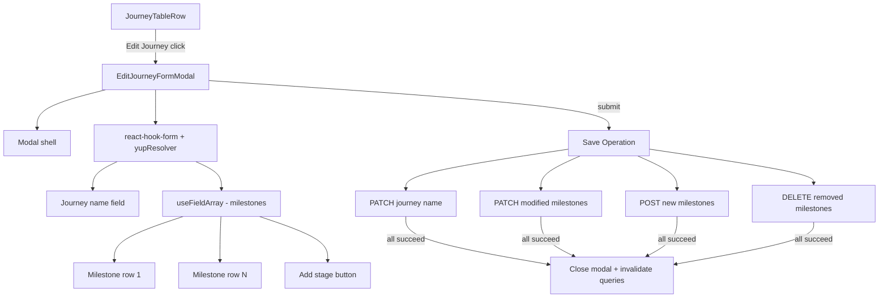

# Design Document: Unified Journey Edit Modal

## Overview

This feature replaces the existing name-only `EditJourneyFormModal` with a unified modal that mirrors the `create-journey-form-modal.tsx` UX pattern. The new modal allows admins to edit the journey name and manage all milestones (add, update, remove) in a single form with one submit action.

The implementation is frontend-only. All backend endpoints already exist. The core challenge is coordinating multiple API calls (PATCH journey, PATCH/POST/DELETE milestones) into a single save operation triggered by one button, while diffing form state against original data to minimize unnecessary requests.

## Architecture

The unified edit modal follows the same component and form patterns already established in the codebase:



The modal receives the `ProjectType` object (which includes the journey id and name) and fetches milestones via `useGetAllProjectTypeMilestones`. On submit, it diffs the current form state against the original snapshot to determine which API calls are needed.

## Components and Interfaces

### Modified Files

1. **`edit-jorney-modal.tsx`** — Complete rewrite. The current modal only has a name field. The new version adds:
   - `useGetAllProjectTypeMilestones` to fetch milestones on open
   - `useFieldArray` for the dynamic milestone list
   - Diff logic to compare form state vs. original snapshot
   - Coordinated save using existing hooks

2. **`journey-table-row.tsx`** — No structural changes needed. It already passes `projectType` to `EditJourneyFormModal` and controls open/close state.

3. **`admin.ts` (validation schema)** — Add a new `editJourneyUnifiedSchema` that validates the journey name + a `milestones` array (each with name: required string, duration: required number >= 1).

### New Types

```typescript
// Form values shape for the unified edit modal
interface EditJourneyFormValues {
  name: string; // journey name
  milestones: {
    id?: string;           // undefined for new milestones
    name: string;
    duration: number;
    is_system?: number;    // carried through to protect system milestones
    _isNew?: boolean;      // flag for newly added rows
  }[];
}

// Snapshot of original milestone data for diffing
interface MilestoneSnapshot {
  id: string;
  name: string;
  duration: number;
  is_system: number;
}
```

### Component Props

The `EditJourneyFormModal` props remain the same as today:

```typescript
interface EditJourneyFormModalProps extends ModalProps {
  projectType: ProjectType;
}
```

### Save Operation Diff Logic

On form submit, the save handler:

1. Compares `form.name` to `projectType.name` — if different, PATCH journey name
2. For each milestone in the form array:
   - If `_isNew === true` → POST create milestone
   - If existing and `name` or `duration` changed from snapshot → PATCH update milestone
   - If `is_system` → skip (no update sent)
3. For each milestone in the original snapshot not present in the form array → DELETE milestone

All API calls are fired with `Promise.allSettled` to ensure partial failures don't block other operations. If any call fails, the modal stays open with an error toast.

## Data Models

### Existing Models (no changes)

**ProjectType** (from `use-get-all-project-types.tsx`):
| Field | Type | Description |
|-------|------|-------------|
| id | string | UUID |
| name | string | Journey name |
| company_id | string | Company UUID |
| is_system | number | 0 or 1 |
| milestones | ProjectTypeMilestone[] | Embedded milestones |

**ProjectTypeMilestone** (from `use-all-get-project-type-milestones.tsx`):
| Field | Type | Description |
|-------|------|-------------|
| id | string | UUID |
| name | string | Milestone name |
| duration | number | Duration in days |
| project_type_id | string | Parent journey UUID |
| company_id | string | Company UUID |
| is_system | number | 0 or 1 |
| projects | string[] | Associated project IDs |

### New Validation Schema

```typescript
export const editJourneyUnifiedSchema = yup.object().shape({
  name: yup.string().required("Journey name is required").trim(),
  milestones: yup.array().of(
    yup.object().shape({
      name: yup.string().required("Name is required").trim(),
      duration: yup
        .number()
        .required("Duration is required")
        .min(1, "Must be at least 1"),
    })
  ).min(1, "At least one milestone is required"),
});
```

### API Endpoints Used (all existing)

| Operation | Method | Endpoint | Hook |
|-----------|--------|----------|------|
| Update journey name | PATCH | `projects/types/:id` | `useUpdateProjectTypeDetails` |
| Update milestone | PATCH | `projects/types/milestones/:id` | `useUpdateMilestone` |
| Create milestone | POST | `projects/types/milestones` | `useCreateMilestone` |
| Delete milestone | DELETE | `projects/types/:projectTypeId/milestones/:milestoneId` | `useDeleteMilestone` |
| Fetch milestones | GET | `projects/types/:id/milestones` | `useGetAllProjectTypeMilestones` |


## Correctness Properties

*A property is a characteristic or behavior that should hold true across all valid executions of a system — essentially, a formal statement about what the system should do. Properties serve as the bridge between human-readable specifications and machine-verifiable correctness guarantees.*

### Property 1: Form initialization preserves milestone data and order

*For any* array of milestones returned by the API, when the edit modal initializes its form state, the resulting field array should contain the same milestones in the same order, with each milestone's name and duration matching the original values.

**Validates: Requirements 1.2, 1.3**

### Property 2: Validation schema rejects invalid form data

*For any* form submission where the journey name is empty/whitespace-only, OR any milestone name is empty/whitespace-only, OR any milestone duration is less than 1 or non-numeric, the validation schema should reject the submission and the form should not proceed to the save operation.

**Validates: Requirements 2.3, 3.3, 3.4, 8.1, 8.2, 8.3**

### Property 3: Diff function produces correct API operation set

*For any* original milestone snapshot and current form state, the diff function should produce:
- A journey name PATCH if and only if the name has changed
- A PATCH for each existing non-system milestone whose name or duration differs from the snapshot
- A POST for each milestone in the form that has no existing ID (new milestones)
- A DELETE for each milestone in the snapshot that is absent from the form
- Zero operations for system milestones regardless of field state
- Zero PATCH operations for milestones whose values are unchanged

**Validates: Requirements 2.2, 3.1, 3.2, 4.3, 5.2, 5.3, 6.3, 7.2**

### Property 4: Append grows milestone list by exactly N

*For any* current milestone list of length L and any number of append operations N, the resulting list should have length L + N, and each appended entry should have empty name and default duration fields.

**Validates: Requirements 4.2, 4.4**

### Property 5: System milestones are protected

*For any* milestone with `is_system` equal to 1, the UI should render its name and duration fields as disabled/read-only, and the remove button should not be rendered for that row.

**Validates: Requirements 6.1, 6.2**

## Error Handling

| Scenario | Behavior |
|----------|----------|
| Milestone fetch fails on modal open | Show error state in modal, allow retry or close |
| Validation fails on submit | Inline error messages next to failing fields, form not submitted |
| Any API call in save operation fails | Modal stays open, error toast displayed, user can retry |
| Partial save failure (some calls succeed, some fail) | `Promise.allSettled` ensures all calls attempt; on any rejection, modal stays open with error indication |
| Network timeout | Handled by existing `useCustomMutation` error handling; loading state clears, error surfaced |

The save operation uses `Promise.allSettled` rather than `Promise.all` so that a single failed call doesn't prevent other operations from completing. The modal remains open on any failure so the user can see what happened and retry.

## Testing Strategy

### Unit Tests

Unit tests should cover specific examples and edge cases:

- Form initializes correctly with a known set of milestones (specific example for Property 1)
- Validation rejects empty journey name, empty milestone name, duration of 0 (specific examples for Property 2)
- Diff function with no changes produces zero operations
- Diff function with only a name change produces exactly one PATCH
- Diff function correctly handles a mix of creates, updates, and deletes
- System milestones are excluded from diff output
- Remove button hidden when only one milestone remains (edge case for Req 5.4)
- System milestone rows render with disabled fields

### Property-Based Tests

Property-based tests verify universal correctness across randomized inputs. Use `fast-check` as the PBT library.

Each property test should:
- Run a minimum of 100 iterations
- Reference its design document property in a comment tag
- Use `fast-check` arbitraries to generate random milestone arrays, journey names, and form states

| Property | Test Description | Tag |
|----------|-----------------|-----|
| Property 1 | Generate random milestone arrays, pass through initialization logic, verify output matches input data and order | Feature: unified-journey-edit, Property 1: Form initialization preserves milestone data and order |
| Property 2 | Generate random form data including invalid values (empty strings, whitespace, zero/negative durations), verify schema rejects all invalid inputs and accepts all valid inputs | Feature: unified-journey-edit, Property 2: Validation schema rejects invalid form data |
| Property 3 | Generate random original snapshots and modified form states, verify diff output contains exactly the correct operations | Feature: unified-journey-edit, Property 3: Diff function produces correct API operation set |
| Property 4 | Generate random initial list lengths and append counts, verify final length equals initial + appends | Feature: unified-journey-edit, Property 4: Append grows milestone list by exactly N |
| Property 5 | Generate random milestone arrays with mixed is_system values, verify system milestones are always marked as protected | Feature: unified-journey-edit, Property 5: System milestones are protected |
