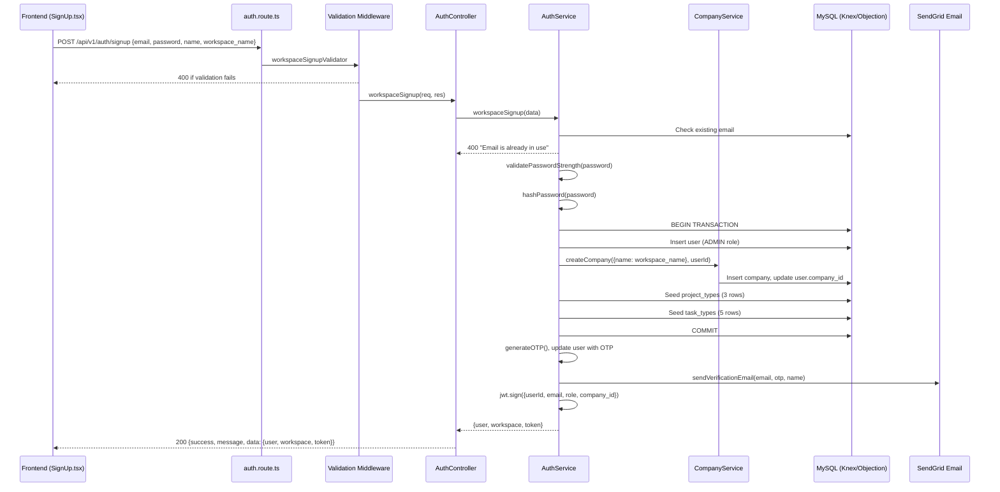

# Design Document: Workspace Signup

## Overview

This feature adds a unified `POST /api/v1/auth/signup` endpoint that atomically creates a user (ADMIN role) and a workspace (company), seeds default project types and task types, generates an OTP for email verification, and returns a JWT with user/workspace data matching the frontend's `WorkspaceSignupResponse` interface.

The implementation follows existing patterns in the codebase: Express route → validation middleware → controller → service → repository. The new code plugs into the existing auth module with minimal changes to other modules.

### Key Design Decisions

1. **Reuse `CompanyService.createCompany`** for workspace creation rather than duplicating logic. This keeps company creation, user `company_id` update, and audit trail logging in one place.
2. **Inline default data seeding** within the service method using Knex directly (same pattern as seed files), wrapped in a try/catch so seeding failures don't block signup.
3. **Use Objection.js `Model.transaction()`** to wrap user + company creation atomically. Seeding runs inside the same transaction for consistency but its failure is caught and logged without rolling back.
4. **OTP is 4 digits** — the existing `generateOTP()` utility produces a 4-digit code. The requirements mention 6-digit, but we'll match the existing codebase behavior for consistency with the verify flow. If 6-digit is required, `generateOTP` should be updated globally.
5. **`workspace_name` validation** uses the same `validateName` helper from `common.ts` to reject names containing numbers.

## Architecture



### Files Modified

| File | Change |
|------|--------|
| `src/modules/auth/auth.route.ts` | Add `POST /signup` route with `workspaceSignupValidator` |
| `src/modules/auth/auth.controller.ts` | Add `workspaceSignup` handler method |
| `src/modules/auth/services/auth.service.ts` | Add `workspaceSignup` method, add `WorkspaceSignupData` interface |
| `src/shared/validations/auth.ts` | Add `workspaceSignupValidator` rules |
| `src/shared/interface/user.ts` | Add `WorkspaceSignupData` interface |
| `src/app.ts` | Add Render staging URLs to `allowedOrigins` |

### Files Unchanged

- `CompanyService.createCompany` — reused as-is
- Frontend code — already expects this endpoint and response format
- Existing auth routes — no modifications to existing endpoints

## Components and Interfaces

### 1. Validation Middleware: `workspaceSignupValidator`

**File:** `src/shared/validations/auth.ts`

```typescript
export const workspaceSignupValidator = [
  validateName('name'),
  body('email', 'Email is required').not().isEmpty(),
  body('email', 'Invalid email').isEmail(),
  body('password', 'Password is required').not().isEmpty(),
  body('password', 'The minimum password length is 8 characters').isLength({ min: 8 }),
  validateName('workspace_name'),
];
```

Follows the same pattern as `signUpCompanyAdminValidator` but adds `email` format validation, enforces 8-char minimum (matching `loginValidationRule`), and validates `workspace_name`.

### 2. Route Registration

**File:** `src/modules/auth/auth.route.ts`

```typescript
server.post(
  `${prefix}/signup`,
  schemaValidator(workspaceSignupValidator),
  (req, res) => getAuthController().workspaceSignup(req, res)
);
```

No `authenticateUser` middleware — this is a public endpoint.

### 3. Controller Method: `workspaceSignup`

**File:** `src/modules/auth/auth.controller.ts`

```typescript
public workspaceSignup = async (req: Request, res: Response) => {
  try {
    const result = await this.authService.workspaceSignup(req.body);
    return successResponse(res, 'Workspace created successfully', result);
  } catch (error: any) {
    return errorResponse(res, error.message, error.message, error.statusCode || StatusCodes.INTERNAL_SERVER_ERROR);
  }
};
```

### 4. Service Method: `workspaceSignup`

**File:** `src/modules/auth/services/auth.service.ts`

**Pre-conditions:**
- `data.email` is a non-empty valid email string
- `data.password` is a non-empty string with ≥ 8 characters
- `data.name` is a non-empty string without numbers
- `data.workspace_name` is a non-empty string without numbers

**Post-conditions:**
- A new user exists in `users` table with role=ADMIN, hashed password, OTP set
- A new company exists in `companies` table with `admin_id` = new user's ID
- User's `company_id` references the new company
- 3 project_types rows exist for the new company (or logged error if seeding failed)
- 5 task_types rows exist for the new company (or logged error if seeding failed)
- A verification email was sent (or error logged)
- Returns `{ user, workspace, token }` matching `WorkspaceSignupResponse`

```typescript
public async workspaceSignup(data: WorkspaceSignupData) {
  // 1. Check duplicate email
  const existingUser = await this.userRepository.findOne({ email: data.email });
  if (existingUser) {
    throw new HttpError('Email is already in use', 400);
  }

  // 2. Validate password strength
  await this.validatePasswordStrength(data.password);

  // 3. Hash password
  const hashedPassword = await this.hashPassword(data.password);

  // 4. Generate OTP
  const otp = generateOTP();
  const otpExpires = Date.now() + 10 * 60 * 1000;

  // 5. Atomic transaction: create user + company + seed data
  const trx = await Model.startTransaction();
  let newUser: any;
  let company: any;

  try {
    newUser = await this.userRepository.create({
      name: data.name,
      email: data.email,
      password: hashedPassword,
      otp,
      otp_expires: otpExpires,
      role: UserRoles.ADMIN,
    }, trx);

    company = await this.companyRepository.create({
      name: data.workspace_name,
      admin_id: newUser.id,
      is_active: true,
    }, trx);

    await this.userRepository.update(
      { id: newUser.id },
      { company_id: company.id },
      trx
    );

    // Seed default data (non-fatal)
    try {
      await this.seedDefaultData(company.id, trx);
    } catch (seedError) {
      console.error('Default data seeding failed:', seedError);
    }

    await trx.commit();
  } catch (error) {
    await trx.rollback();
    throw new HttpError('Signup failed, please try again', 500);
  }

  // 6. Send verification email (non-blocking, outside transaction)
  try {
    await this.sendVerificationEmail(data.email, otp, data.name);
  } catch (emailError) {
    console.error('Verification email failed:', emailError);
  }

  // 7. Generate JWT
  const token = jwt.sign(
    {
      userId: newUser.id,
      email: newUser.email,
      role: UserRoles.ADMIN,
      company_id: company.id,
    },
    JWT_SECRET_KEY,
    { expiresIn: '7d' }
  );

  // 8. Return response matching WorkspaceSignupResponse
  return {
    user: {
      id: newUser.id,
      email: newUser.email,
      name: newUser.name,
      role: UserRoles.ADMIN,
      is_primary_admin: true,
      workspace_id: company.id,
    },
    workspace: {
      id: company.id,
      name: company.name,
      status: 'active',
    },
    token,
  };
}
```

### 5. Default Data Seeder

**File:** `src/modules/auth/services/auth.service.ts` (private method)

```typescript
private async seedDefaultData(companyId: string, trx: Transaction) {
  const knex = Model.knex();

  // Seed project types
  const projectTypes = [
    { name: 'Business Setup', description: 'Complete business setup and registration process' },
    { name: 'Relocation', description: 'International relocation and immigration services' },
    { name: 'Compliance', description: 'Regulatory compliance and legal requirements' },
  ];

  for (const pt of projectTypes) {
    await knex('project_types').transacting(trx).insert({
      id: uuidv4(),
      name: pt.name,
      description: pt.description,
      workspace_id: companyId,
      created_at: knex.fn.now(),
      updated_at: knex.fn.now(),
    });
  }

  // Seed task types
  const taskTypes = [
    { name: 'Document Upload', description: 'Upload required documents', has_upload_field: true },
    { name: 'Review', description: 'Review submitted documents or information', has_upload_field: false },
    { name: 'Approval', description: 'Approve or reject submitted items', has_upload_field: false },
    { name: 'Meeting', description: 'Schedule and conduct meetings', has_upload_field: false },
    { name: 'Follow-up', description: 'Follow up on pending items', has_upload_field: false },
  ];

  for (const tt of taskTypes) {
    await knex('task_types').transacting(trx).insert({
      id: uuidv4(),
      name: tt.name,
      description: tt.description,
      has_upload_field: tt.has_upload_field,
      workspace_id: companyId,
      created_at: knex.fn.now(),
      updated_at: knex.fn.now(),
    });
  }
}
```

### 6. CORS Configuration Update

**File:** `src/app.ts`

Add two Render staging URLs to the `allowedOrigins` array:

```typescript
const allowedOrigins = [
  'https://www.pylott.io',
  'https://pylott.io',
  'https://staging.pylott.io',
  'https://pylot-tkrh.vercel.app',
  'https://pylott-staging-frontend.onrender.com',
  'https://pylott-staging-backend.onrender.com',
];
```

## Data Models

### WorkspaceSignupData (new interface)

**File:** `src/shared/interface/user.ts`

```typescript
export interface WorkspaceSignupData {
  email: string;
  password: string;
  name: string;
  workspace_name: string;
}
```

### Request Body

```json
{
  "email": "user@example.com",
  "password": "SecureP@ss1",
  "name": "John Doe",
  "workspace_name": "Acme Corp"
}
```

### Response Body (200 OK)

```json
{
  "success": true,
  "message": "Workspace created successfully",
  "data": {
    "user": {
      "id": "uuid-string",
      "email": "user@example.com",
      "name": "John Doe",
      "role": "ADMIN",
      "is_primary_admin": true,
      "workspace_id": "uuid-string"
    },
    "workspace": {
      "id": "uuid-string",
      "name": "Acme Corp",
      "status": "active"
    },
    "token": "eyJhbGciOiJIUzI1NiIs..."
  }
}
```

### Error Responses

| Status | Condition | Body |
|--------|-----------|------|
| 400 | Missing/invalid field | `{ success: false, message: "Email is required" }` |
| 400 | Duplicate email | `{ success: false, message: "Email is already in use" }` |
| 400 | Weak password | `{ success: false, message: "Password must contain..." }` |
| 500 | Transaction failure | `{ success: false, message: "Signup failed, please try again" }` |

### Database Records Created

**users table:**

| Column | Value |
|--------|-------|
| id | UUID v4 |
| name | from request |
| email | from request |
| password | bcrypt hash |
| role | "ADMIN" |
| company_id | new company's ID (set after company creation) |
| otp | 4-digit string |
| otp_expires | current time + 10 minutes |
| is_verified | false (default) |

**companies table:**

| Column | Value |
|--------|-------|
| id | UUID v4 |
| name | from `workspace_name` |
| admin_id | new user's ID |
| is_active | true |

**project_types table (3 rows):**

| name | workspace_id |
|------|-------------|
| Business Setup | company.id |
| Relocation | company.id |
| Compliance | company.id |

**task_types table (5 rows):**

| name | has_upload_field | workspace_id |
|------|-----------------|-------------|
| Document Upload | true | company.id |
| Review | false | company.id |
| Approval | false | company.id |
| Meeting | false | company.id |
| Follow-up | false | company.id |


## Correctness Properties

*A property is a characteristic or behavior that should hold true across all valid executions of a system — essentially, a formal statement about what the system should do. Properties serve as the bridge between human-readable specifications and machine-verifiable correctness guarantees.*

### Property 1: Invalid email format rejection

*For any* string that is not a valid email format (missing `@`, missing domain, etc.), submitting it as the `email` field in a signup request should result in a 400 response, and no database records should be created.

**Validates: Requirements 2.5**

### Property 2: Short password rejection

*For any* string with fewer than 8 characters, submitting it as the `password` field in a signup request should result in a 400 response from the validation middleware.

**Validates: Requirements 2.6**

### Property 3: Duplicate email rejection with no side effects

*For any* email that already exists in the users table, submitting a signup request with that email should return a 400 status with "Email is already in use", and the total count of users and companies in the database should remain unchanged.

**Validates: Requirements 3.1, 3.2**

### Property 4: Successful signup creates correct user and company records

*For any* valid signup data (valid email, strong password, valid name, valid workspace_name), after a successful signup: (a) a user record exists with the provided name, email, role=ADMIN, and a bcrypt-hashed password that matches the original, (b) a company record exists with name equal to workspace_name and admin_id equal to the user's ID, and (c) the user's company_id equals the company's ID.

**Validates: Requirements 4.1, 4.2, 4.3, 10.1**

### Property 5: Default data seeding correctness

*For any* successful signup, the new workspace should have exactly 3 project_types rows with names ["Business Setup", "Relocation", "Compliance"] and exactly 5 task_types rows with names ["Document Upload", "Review", "Approval", "Meeting", "Follow-up"], where only "Document Upload" has `has_upload_field = true`.

**Validates: Requirements 5.1, 5.2, 5.3**

### Property 6: OTP generation and storage

*For any* successful signup, the created user record should have a non-null `otp` field containing a numeric string, and an `otp_expires` value that is approximately 10 minutes after the signup time (within a reasonable tolerance).

**Validates: Requirements 6.1**

### Property 7: Response format correctness

*For any* valid signup request, the response should: (a) have status 200 with `success: true`, (b) contain a `user` object with fields `id`, `email`, `name`, `role` (= "ADMIN"), `is_primary_admin` (= true), and `workspace_id`, (c) contain a `workspace` object with fields `id`, `name`, and `status` (= "active"), (d) contain a `token` that decodes to a valid JWT with `userId`, `email`, `role`, and `company_id` claims, and (e) not contain a `password` field anywhere in the response.

**Validates: Requirements 7.1, 7.2, 7.3, 8.1, 8.2, 8.3, 8.4**

### Property 8: Weak password rejection at service level

*For any* password that does not meet the strength requirements (must contain uppercase, lowercase, digit, and special character), the signup service should reject it with an error, even if the password passes the middleware's length check.

**Validates: Requirements 10.2**

## Error Handling

| Error Scenario | Handler | HTTP Status | Message | Side Effects |
|---|---|---|---|---|
| Missing required field | Validation middleware | 400 | Field-specific message (e.g., "Email is required") | None — request never reaches controller |
| Invalid email format | Validation middleware | 400 | "Invalid email" | None |
| Password too short | Validation middleware | 400 | "The minimum password length is 8 characters" | None |
| Duplicate email | AuthService.workspaceSignup | 400 | "Email is already in use" | None — checked before any DB writes |
| Weak password (strength) | AuthService.validatePasswordStrength | 400 | "Password must contain at least one uppercase letter, one lowercase letter, one number, and one special character" | None — checked before any DB writes |
| Transaction failure (user/company creation) | AuthService.workspaceSignup catch block | 500 | "Signup failed, please try again" | Transaction rolled back, no orphaned records |
| Default data seeding failure | Inner try/catch in workspaceSignup | N/A (logged) | Console error logged | Signup still succeeds; workspace exists without default data |
| Email sending failure | try/catch around sendVerificationEmail | N/A (logged) | Console error logged | Signup still succeeds; user can request OTP resend later |

### Error Propagation Strategy

1. Validation errors are caught by the `schemaValidator` middleware and returned as 400 before reaching the controller.
2. Business logic errors (duplicate email, weak password) throw `HttpError` with appropriate status codes, caught by the controller's try/catch.
3. Infrastructure errors (DB failure, transaction error) are caught, transaction is rolled back, and a generic 500 is returned.
4. Non-critical failures (seeding, email) are caught silently with console logging — they don't affect the signup success response.

## Testing Strategy

### Property-Based Testing

Use `fast-check` as the property-based testing library for TypeScript/Node.js.

Each property test must:
- Run a minimum of 100 iterations
- Reference its design document property in a comment tag
- Use `fast-check` arbitraries to generate random valid/invalid inputs

**Property test configuration:**

```typescript
import fc from 'fast-check';

// Example tag format:
// Feature: workspace-signup, Property 1: Invalid email format rejection
```

**Property tests to implement (one test per property):**

1. **Property 1 test**: Generate random non-email strings via `fc.string()` filtered to exclude valid email patterns. Assert validation rejects all of them with 400.
2. **Property 2 test**: Generate random strings of length 0-7 via `fc.string({ maxLength: 7 })`. Assert validation rejects all with 400.
3. **Property 3 test**: Generate random valid signup data, insert a user with that email first, then attempt signup. Assert 400 response and unchanged DB record counts.
4. **Property 4 test**: Generate random valid signup data (valid email, strong password, valid name, valid workspace_name). Call the service method. Assert user record has correct fields, company record has correct fields, and user.company_id = company.id. Verify password is bcrypt-hashed.
5. **Property 5 test**: Generate random valid signup data. After successful signup, query project_types and task_types for the new workspace. Assert exact names and has_upload_field values.
6. **Property 6 test**: Generate random valid signup data. After successful signup, query the user record. Assert otp is a numeric string and otp_expires is within expected range.
7. **Property 7 test**: Generate random valid signup data. Call the endpoint. Assert response structure matches WorkspaceSignupResponse interface exactly, JWT decodes correctly, and no password field exists.
8. **Property 8 test**: Generate passwords that pass length check (≥8 chars) but fail strength (e.g., all lowercase, no special chars) via `fc.string({ minLength: 8 }).filter(p => !strongPassword(p))`. Assert service rejects them.

### Unit Tests

Unit tests complement property tests by covering specific examples and edge cases:

- **Validation edge cases** (Req 2.1-2.4): One test per missing field confirming 400 response with correct message
- **Transaction rollback** (Req 4.4, 4.5): Mock company creation to throw, verify no user record exists and 500 is returned
- **Seeding failure resilience** (Req 5.4): Mock knex insert to throw during seeding, verify signup still returns 200
- **Email failure resilience** (Req 6.2): Mock sendVerificationEmail to throw, verify signup still returns 200
- **CORS configuration** (Req 9.1-9.3): Test that specific origins are accepted/rejected by the CORS middleware
- **Route accessibility** (Req 1.1, 1.3): Test that POST to `/api/v1/auth/signup` returns non-404 without auth headers
